## TYMLEZ Carbon Emissions

### StandardRegistry
1. Setup standard registry (standard-registry.md)
2. Login as StandardRegistry and import CET policy from policy folder(Tymlez-CET.policy)
3. Publish `Tymlez CET` policy from (http://localhost:3000/policy-viewer)
4. Open `Tymlez CET` and add new site information (CET does not require project so leave `ProjectId` as empty)

   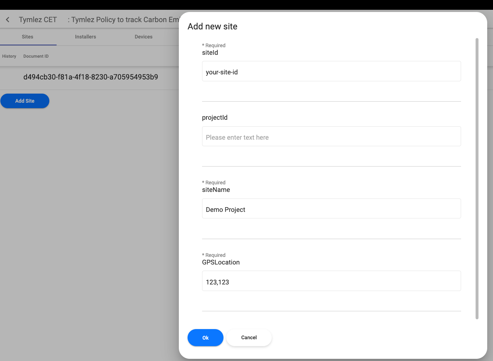


### Project Owner
1. Register for the new user if it doesn't exist yet.
      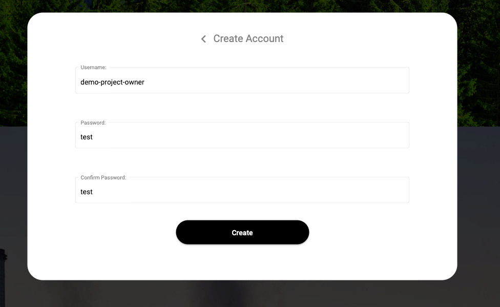
2. Select corresponding standard registry for the new user
3. Login as the new owner user
4. Associate owner with CET (Click on tokens from nav link and click on associate button on the table ,see picture below)
   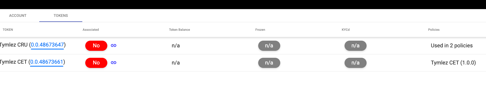
5. Open policy `Tymlez CET` and fill in the owner information when the screen has loaded
    - select role as `TOKEN_OWNER`
    -  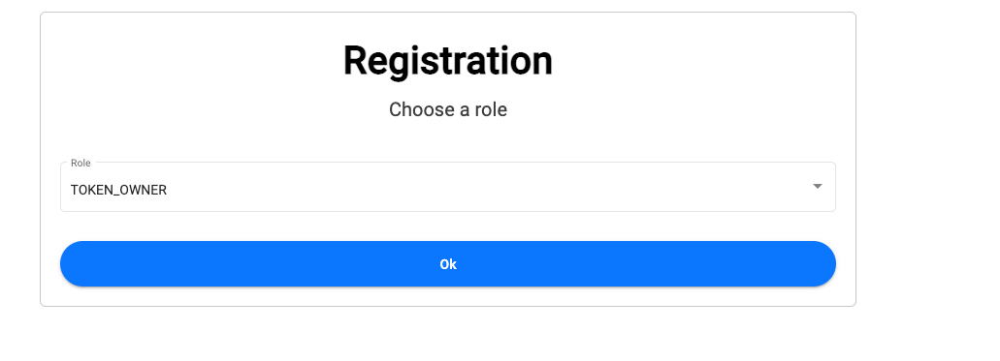
    -  After confirming the roles, enter owner vc information in the dialog
    - 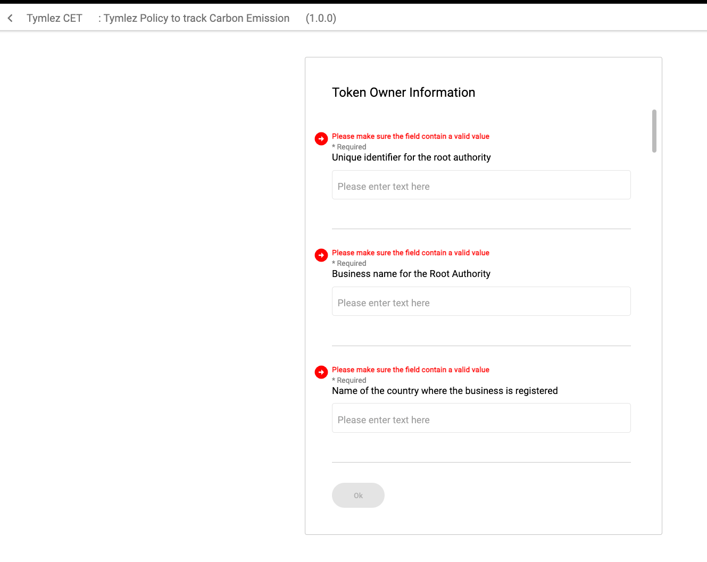

### Installer
1. Register new guardian user and select corresponding standard registry 
2. Login as new installer and finish the setup steps
3. Associate owner with CET (Click on tokens from nav link and click on associate button on the table , see picture below)
   
4. Open policy `Tymlez CET` and fill in the installer information when screen loaded
    - select role as `INSTALLER`
    -  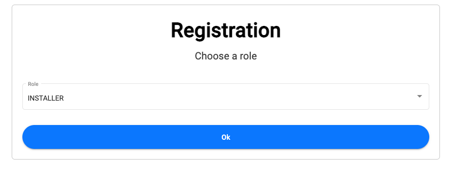
    -  Afert confirming the roles, enter owner vc information in the dialog
    - 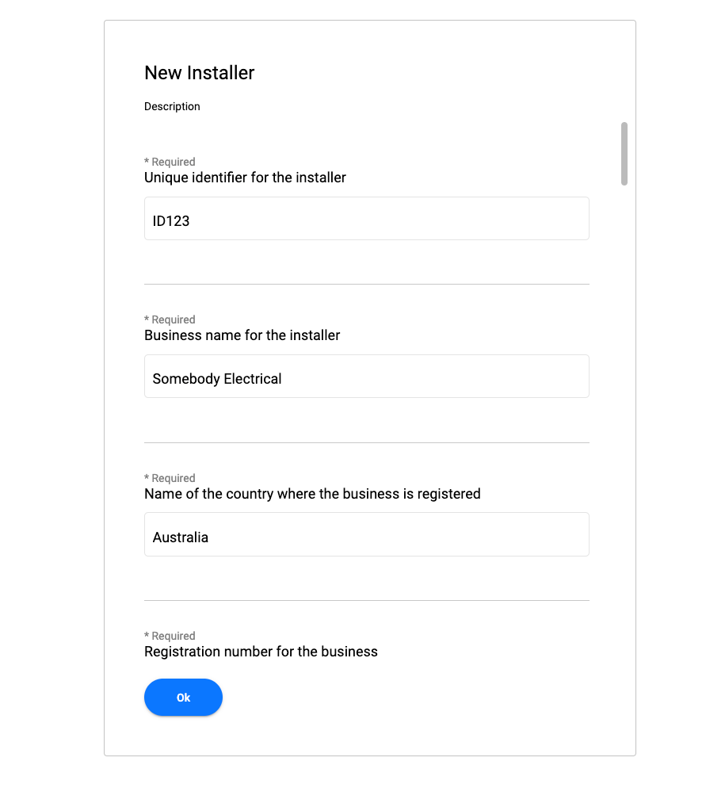
5. Download the device config from the list
6. Installer can add new device(meter, sensor, iot... from devices tabs)
    - 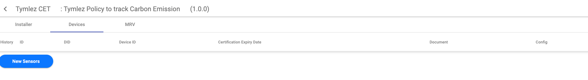
    - Click on `New Sensor` and fill in information for the device. Note that the site-ID is the DID of Site that was created in the step StandardRegistry#4
    - After this step, Login as StandardRegistry and go to Sites tabs, you can associate the Site to other Sites or if it not entered correctly.
    


### Sending MRV
MRV will be injected using external data source API  with below json structure
```json
{
    "owner": "DID of installer or devices",
    "policyTag": "The policy tag",
     "document": {} 
}

```

**document**: is the full VC document, please refer to (https://github.com/hashgraph/guardian/blob/main/mrv-sender/src/index.ts#L89). The final payload will look like the below:

```json
    {
    "owner": "DID",
    "policyTag": "Tag_1666330134735",
    "document": {
        "id": "{{$guid}}",
        "type": [
            "VerifiableCredential"
        ],
        "issuer": "DID",       
         "issuanceDate": "2022-10-22T11:12:43.017Z",
        "@context": [
            "https://www.w3.org/2018/credentials/v1"
        ],
        "credentialSubject": [
            {
                "type": "a305f206-4107-47a6-87fb-571ef7655527&1.0.0",
                "@context": [
                    "https://ipfs.io/ipfs/bafkreiarrpieuodeamv4ix75iv4bxp3d6drzdknqaaagwp3x7g2bm73zmy"
                ],
                "readingId": "{{$guid}}",
                "deviceId": "deviceDID",
                "readingDate": "2022-10-22",
                "intervalStartDateTime": "2022-10-22T11:00:00.000Z",
                "intervalEndDateTime": "2022-10-22T11:05:00.000Z",
                "intervalDuration": 300,
                "intervalDurationUOM": "s",
                "value": 0.5,
                "valueUOM": "litre",
                "greenhouseGasEmissionsScope": "Scope 1",
                "greenhouseGasEmissionsSource": "DIRECT - STATIONARY COMBUSTION",
                "CO2Emissions": 0.5,
                "CO2eqEmissions": 0.1,
                "CO2eqEmissionsTYMLEZ": 0,
                "emissionsUOM": "t",
                "CO2eqFormula": "$value * 2.70972",
                "tokenOwnerId": "0.0.48700521"
            }
        ],
         "proof" : {
            "type" : "Ed25519Signature2018",
            "created" : "2022-10-21T05:40:13Z",
            "verificationMethod" : "did:hedera:testnet:VX3a6nYMtoaKEvcvqamjeknqb2MSYMd7GHP8RB13bCn;hedera:testnet:tid=0.0.48673640#did-root-key",
            "proofPurpose" : "assertionMethod",
            "jws" : "eyJhbGciOiJFZERTQSIsImI2NCI6ZmFsc2UsImNyaXQiOlsiYjY0Il19..0PjYVmLHl_pL5IYd6XnNv5aSvSduVBaNX7VhWbfNpfdkAtSTKuKsjjBs0CuC3i8l1XIMyRHdm3yn3N4jRS3IAQ"
        }
    }
}

```
### Add MRV using guardian UI
The policy designed with the policy block that allow `Token Owner` can manually add MRV from guardian UI, we suggesst using this for testing purpose only, the realtime data need to be injected via API method above
- Login as Token Owner
- Open CET policy
- Open MRV tabs
- Click on `Add MRV` and fill up all the values for your MRV
- 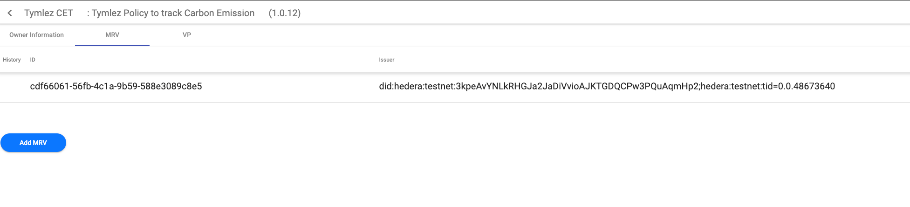
- Submit MRV then the new MRV will display in the list, Aggregation will running in background and respect the token mint rule same with realtime data ingression.
- 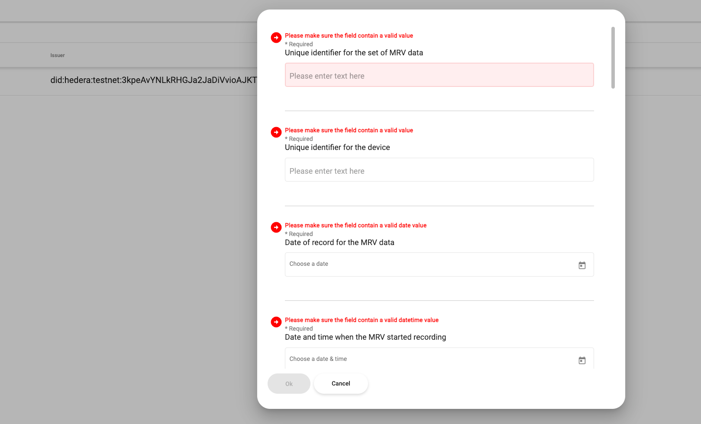

**Note**
- OwnerAccountId: need to set to the Hedera Account ID of TOken Owner user. This value can be copy from profile page
- DeviceID: should be set to Device DID 
### Verification
After sending MRV using above API call you can login as Root Authority  or Token Owner to view the VP in trustchain block.
- VP data
    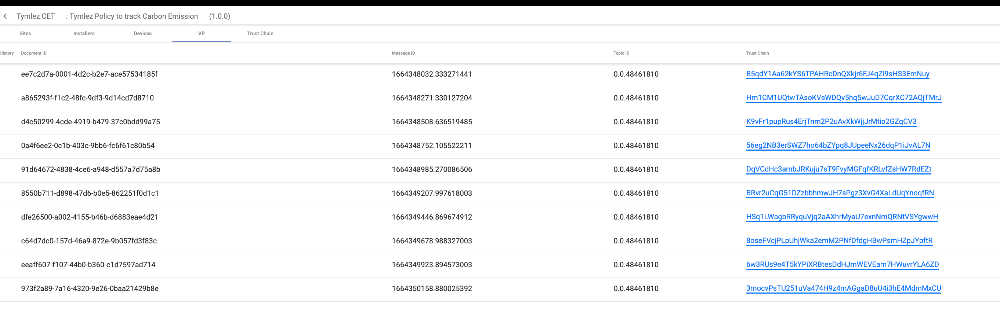

- Trustchain viewer
 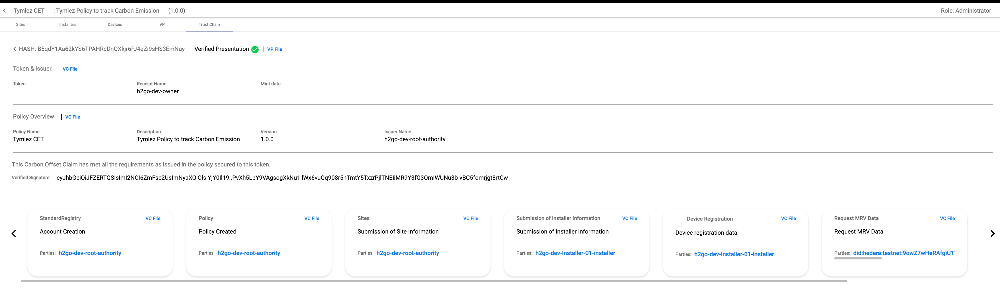