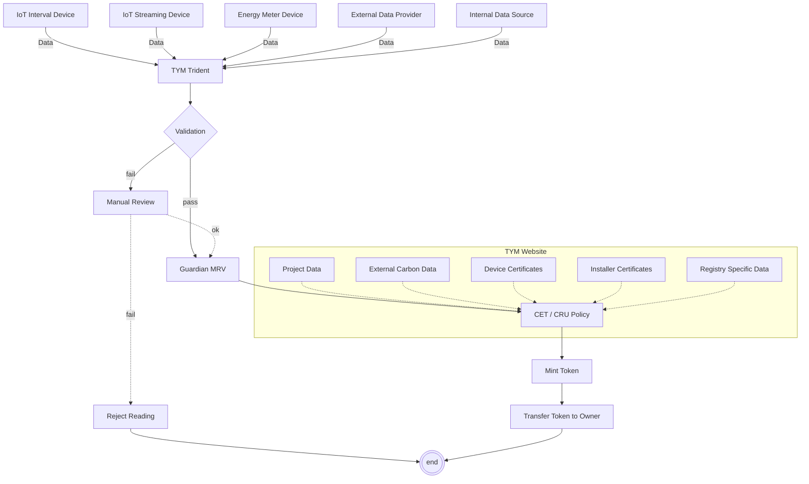

# TYMLEZ Guardian Policies
This repository will hold and be the source of any open-source TYMLEZ CET & CRU Policies for Hedera Guardian.

## Methodologies

TYMLEZ aims to provide the capability to quantify and tokenise carbon. 
To do this, we have designed a universal schema that can be used as the basis for both insetting and 
avoidance claims made against any GHG Protocol compatible project.
Whilst these schemas will not be able to be used verbatim for all carbon registries, 
they form an important base for digital measurement, reporting and verification (dMRV) recording against a particular project.
A core focus at TYMLEZ is the accurate reading of MRV data from source devices. 
As such, this schema is not designed for use in scenarios requiring the manual entry of carbon data – we have however included UI screens
to support manual entry in this public version.

We have included a full schema for the CET & CRU policies [here](methodologies/CET_CRU_TYMLEZ.pdf)
that can be used to record Scope 1 & 2 emissions data

## Scope 3 data

TYMLEZ supports the inclusion of Scope 3 emissions data, however this is not currently included in the provided schema. 
We instead integrate with partners to support the inclusion of Scope 3 data as external carbon data which fits the dMRV model 
more than the usual form-based process.

## IWA Voluntary Ecological Markets (VEM)

https://interwork.org/wp-content/uploads/2021/05/Voluntary_Ecological_Markets_Overview_Revised.pdf

TYMLEZ integrated the tokenisation functionality based on the recommendations of the IWA VEM.
However, we make no claim as to the adherence to this document as indivdual customer requirements 
created in a nascent market often require creative thinking.

## High Level Policy Overview

## Integration Guide

You can read the integration guide [here](guides/integration-guide.md)