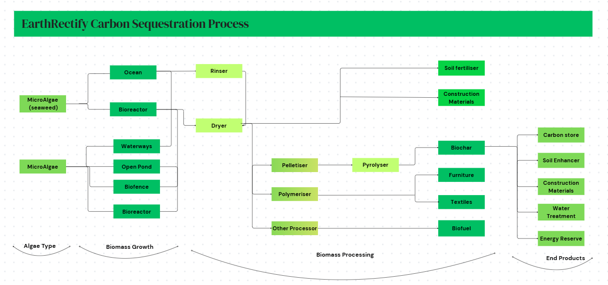
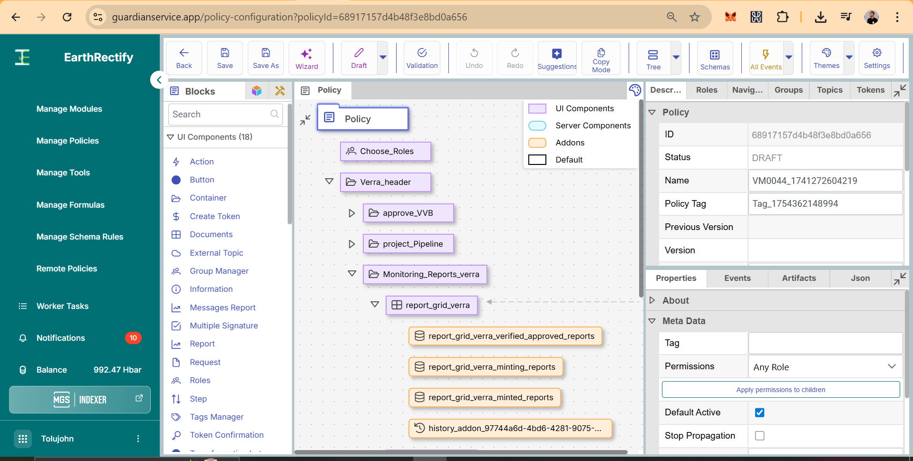
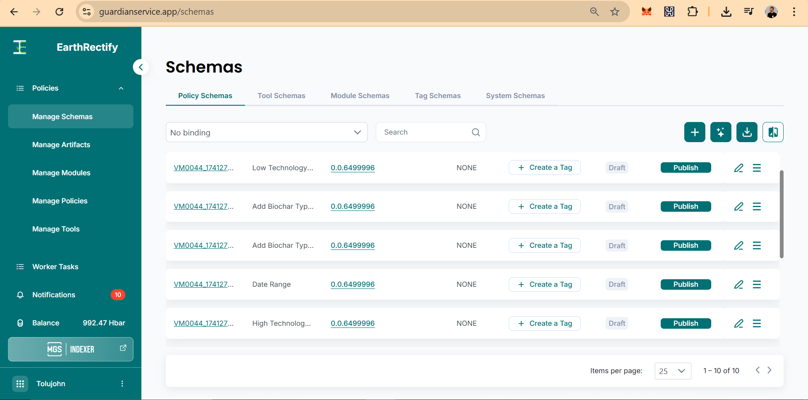
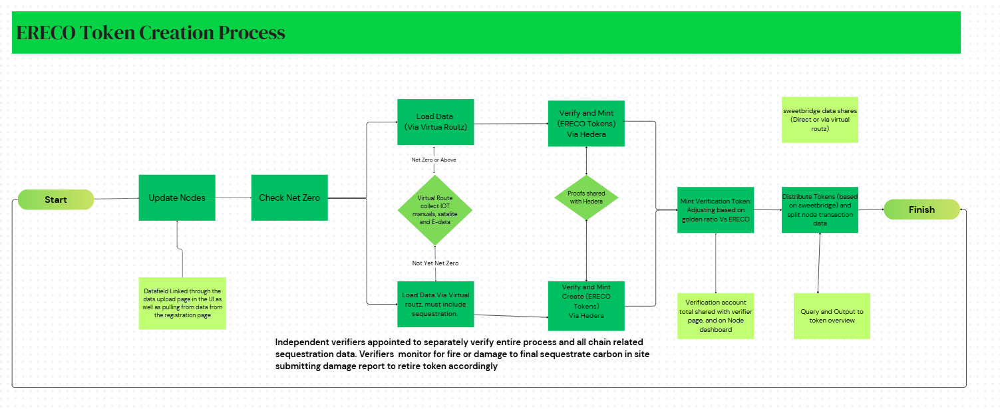
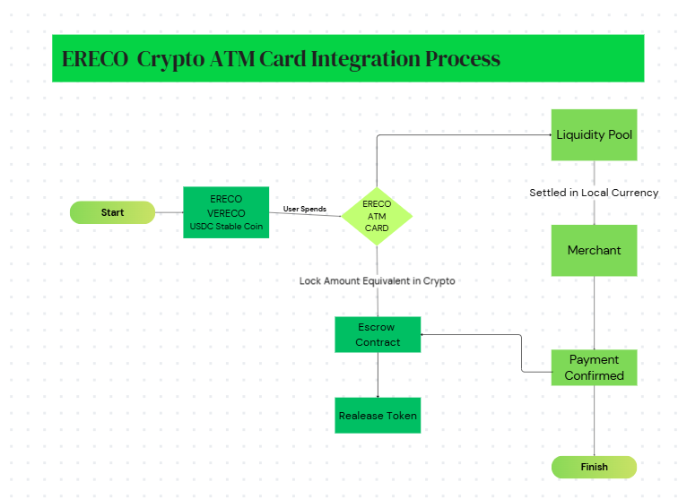
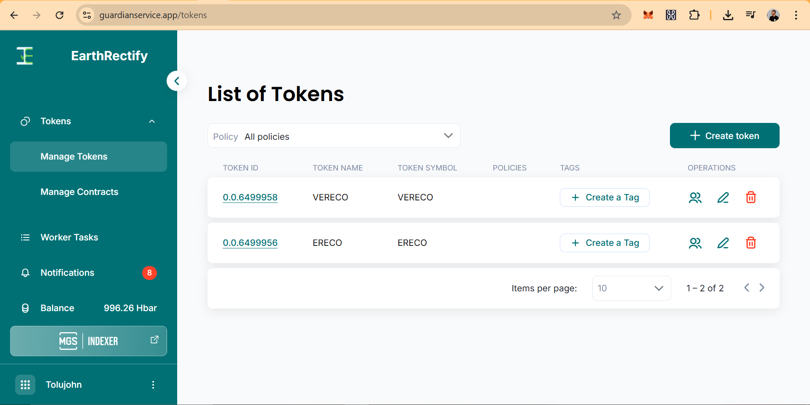

# EarthRectify 

- Solving climate change by enabling large-scale, verifiable carbon capture through nature-based solutions—particularly algae farming and biomass conversion.
Our vision is simple: to make fighting climate change profitable, fair, and accessible for everyone.

- We aim to build a transparent, auditable carbon credit ecosystem on the Hedera blockchain, where small-scale farmers, processors, verifiers, and investors all benefit directly. With our innovative ERECO ATM Card, we make these rewards immediately usable in daily life—closing the gap between climate action and economic inclusion.

- EarthRectify Architecture: https://www.canva.com/design/DAGrqEmkVcs/DYnof75lMppskD8WGS0gcg/edit

## The Problem

- Climate change is driven by rising levels of atmospheric CO₂. The world urgently needs to remove carbon and store it safely.

But the carbon credit industry has big flaws:
- ❌Unverified or fraudulent claims
- ❌Double counting of credits
- ❌Exclusion of small farmers and local businesses
- ❌Difficulty for participants to spend their carbon rewards in daily life
- ❌Lack of trust and transparency

Even worse, even when people earn carbon credits, they often can’t easily use the rewards in their daily lives.

## Our Solution
EarthRectify Carbon Sequestration Limited is building an integrated platform that:

- ✅ Enables scalable algae farming to absorb CO₂
- ✅ Converts biomass into carbon-storing products like biochar
- ✅ Tracks production and sequestration using satellite imagery, IoT sensors, and manual verification
- ✅ Verifies and records this data on Hedera Hashgraph’s Guardian system
- ✅ Issues blockchain-based tokens representing real, verified carbon removal
- ✅ Lets users spend those rewards instantly in real life using the ERECO ATM Card.
- ✅ Verifier incentive token (VERECO)
- ✅ Tokenized carbon credits (ERECO) on Hedera blockchain

## Our methodology: Inspired by Verra VM0047 & VM0044

- Our framework, influenced by the principles of Verra VM0044, enables the issuance of ERECO tokens on the Hedera network by aggregating data across the entire carbon sequestration supply chain. These tokens represent verified sequestered carbon and are proportionally allocated to the contributing nodes based on their financial input toward carbon processing.

- In addition to ERECOs, we also generate VERECO tokens, which serve as incentives for financiers and individuals who validate the supply chain data. These rewards are funded through fees collected from participating nodes within the ecosystem.
As nodes accumulate ERECOs over time, they become eligible for reduced financing costs related to operations, inventory, and infrastructure—benefits made possible through support from ecosystem partners and financial backers. The issuance of VERECOs follows a diminishing schedule, decreasing annually by the golden ratio. This design encourages early participation and reinforces the reliability of verifiers. These verifiers, whether independent or delegated by VERECO holders, play a critical role in upholding the credibility of our carbon sequestration model.
To avoid surpassing net-zero emissions and inadvertently triggering extreme cooling events, our system incorporates algorithms that reward the regulated emission of CO₂ by sectors such as agriculture, biofuel, and bioplastics. This ensures that global CO₂ levels remain balanced post-net-zero, preventing a scenario where excessive cooling becomes incentivized in future centuries.

- Our adaptation of the Verra 47 & 44 methodology also includes tools for damage assessment—such as satellite-based detection of field fires. These mechanisms allow for the investigation and potential retirement of ERECO or VERECO tokens when biochar validation fails. Looking ahead, we aim to enhance traceability by identifying biochar batches through unique chemical markers, further strengthening the integrity of our system.

## How It Works
- ✅ Step 1: Grow Algae: Algae farms absorb CO₂ as they grow in open ponds or reactors.
- ✅ Step 2: Convert Biomass: Harvested algae is processed into biochar—a stable, carbon-storing product that can be used in soil for centuries.
- ✅ Step 3: Track Data: Production data is collected using satellite images, IoT sensors (weight, temperature, CO₂ levels), and manual reporting.
- ✅ Step 4: Verify: Independent verifiers check the data’s integrity and report issues (like fires or leaks).
- ✅ Step 5: Record on Blockchain All verified data is sent to Hedera’s Guardian system, following rigorous methodologies.
- ✅ Step 6: Mint Tokens
ERECO tokens represent certified carbon removal, tradable as carbon credits.
VERECO tokens reward verifiers who ensure integrity.
- ✅ Step 7: Distribute Rewards: Tokens are automatically split among all participants based on their contribution and investment.
- ✅ Step 8: Spend in Real Life with ERECO ATM Card: Participants can use their ERECO rewards for daily purchases on POS & ATM withdrawals—bridging climate action and everyday financial needs.

## What Earthrectify webApp does:

- Earthrectify is a web application designed to help farmers easily register their farms, track their carbon credit yields, and manage all farm-related activities in one place. As a farmer, you can sign up, add your farm details, upload necessary documents, and monitor your farm's carbon credit earnings in real time. The platform allows you to update your farm information when needed, interact with verifiers, and view feedback or reports from other users, all while keeping a detailed record of your farm’s performance and credit balance.

- For verifiers, Earthrectify provides a dedicated space to review and validate farms submitted by farmers. After registering as a verifier, you gain access to a list of unapproved farms where you can inspect farm details, verify their authenticity, and approve or reject them accordingly. Each verification you perform earns you verifier credits, allowing you to track your contributions and rewards on the platform. This system ensures transparency and accountability while encouraging accurate verification of carbon credit-generating farms.

## ERECO ATM Card – A Real-Life Game Changer

Features of the ERECO ATM Card: 

- ✅ Spend ERECO tokens at any POS terminal or ATM
- ✅ Instant, automatic crypto-to-fiat conversion
- ✅ No complicated steps or manual trading
- ✅ User-controlled, non-custodial wallet integration
- ✅ Set spending limits and manage wallet via our app
- ✅ Works locally and globally—just like cash
Benefits
- ✅ Real-world usability for carbon credits
- ✅ Rewards become immediately spendable, even for non-tech users
- ✅ Encourages participation among small farmers and processors
- ✅ Strengthens local economies while fighting global climate change

## The Earthrectify Tokens
- ERECO: Certified, blockchain-backed carbon credit. Tradable and spendable.
- VERECO: Verifier incentive token ensuring system integrity and transparency.
Tokens Contract Address(with help of playground draft):
- ERECO: 0x9f6055862d50E8B8C9bD29D59e3A8B0dE9b018A0
- VERECO: 0x05A5B5f278d8Df7297b128D2C395A372DF7cDAeA
Minted on the Guardian:
- ERECO: https://hashscan.io/testnet/token/0.0.6499956
- VERECO: https://hashscan.io/testnet/token/0.0.6499958

  
Technology Stack
- ✅ Frontend: React
- ✅ Backend: Node.js, Express, Cloudinary
- ✅ Blockchain: Hedera Hashgraph, Guardian System, Hashpack
- ✅ Data Storage: MongoDB
- ✅ IoT / Satellite Integration: sensor APIs
- ✅ Wallet/Payments: Hashpack, Flutterwave Fintech

## Vision

EarthRectify Carbon Sequestration Limited aims to become Africa’s leader in blockchain-verified carbon credits—building an ecosystem where fighting climate change is transparent, fair, profitable, and part of daily life.
We want to empower local farmers, processors, verifiers, and investors to participate in carbon markets easily, while making rewards truly useful with the ERECO ATM Card.

## Key Accomplishments We're Proud Of:

- Launch of a Functional Web Application for Algae Farmers We developed and deployed a live web application that streamlines onboarding and enables algae farmers to monitor their farms and earnings efficiently. The platform enhances transparency and accessibility for users within the carbon farming ecosystem.
Implementation of the Guardian System for Carbon Accounting We established a robust Guardian system tailored to our company’s needs. This system facilitates accurate calculation of carbon credits and emissions, adhering to standards-based methodologies and supporting our commitment to environmental integrity.

- Integration of Wallet for Seamless Onboarding: Our web application now supports HashPack, Metamask, and other hedera supported wallets, allowing users to easily onboard and interact with the Hedera blockchain. This feature improves user experience and accelerates adoption of on-chain functionality.
  
- Token Minting and Deployment on Hedera We successfully minted our native tokens—ERECO and VERECO—on the Hedera blockchain using the Guildian framework. Additionally, we tested deployment via the standard EVM route using the Hedera Portal Playground, which provided a reliable draft code and confirmed compatibility across environments.

## Quick Links
- Demo: https://youtu.be/CtfXJd3VZJk
- WebApp repo: https://github.com/Tolujoh-n/Earthrectify
- Live test: https://earthrectify.vercel.app/

## Conclusion
At EarthRectify Carbon Sequestration Limited, we believe sustainability should be simple, fair, and rewarding.
By harnessing algae farming, blockchain technology, and real-world payment solutions, we’re building a future where saving the planet also means building personal wealth and community resilience.
Because when the environment wins—we all win

Email: tolujohnofficial@gmail.com

