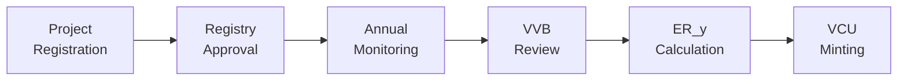

# AMS-III.AV / VMR0015 — Safe Drinking Water Supply with Renewable Energy

**Network:** Hedera Testnet  
**Methodology:** AMS-III.AV (UNFCCC) / VMR0015 (Verra)  
**Project Example:** Bangalore Safe Water Initiative  
**Developer:** Bikram Biswas (@BikramBiswas786)  
**Date:** March 27, 2026

## 1. Overview

This Guardian policy implements **Safe Drinking Water Supply with Renewable Energy (AMS-III.AV / VMR0015)** as a fully DLT-native, IoT‑integrated MRV system on Hedera.

It replaces manual spreadsheet-based reporting with:

- Device‑level DIDs for each water treatment unit  
- Cryptographically signed monitoring data  
- Immutable audit trail on Hedera Consensus Service (HCS)  
- Automated VCU minting on Hedera Token Service (HTS)[cite:14][cite:16][cite:22]

The result is a **production-grade template** that project developers, standard registries, and DLT Earth can reuse for safe drinking water projects globally.

## 2. Files in This Folder

- `AMS-III.AV_VMR0015.policy`  
  Guardian Managed Guardian Service (MGS) policy export for AMS‑III.AV / VMR0015.

- `SCHEMA.json`  
  All 6 data schemas: Project Registration, Public Network Check, Water Quality Survey, Annual Monitoring Report, Emission Reduction Calculation, VVB Verification Report.[cite:14]

- `EVIDENCE.md`  
  Full Hedera testnet evidence: accounts, topics, token, HashScan links, transaction IDs, and workflow traces (policy → project → monitoring → verification → VCU minting).[cite:22]

- `BOUNTY_REQUEST.md`  
  Formal Hedera / DLT Earth bounty request with methodology description, innovation, impact, and evaluation criteria.[cite:21][cite:22]

- `Technical-Whitepaper.md`  
  Detailed technical specification: architecture, security model, and methodology formulas.

## 3. Architecture Summary

This policy uses the same 5‑layer verification architecture as the hydropower MRV system, adapted for safe drinking water:[cite:17][cite:21]

1. **Device Layer**  
   - Each unit has a DID (e.g. `did:hedera:testnet:water-project-001-unit-01`).  
   - IoT controller signs monitoring payloads using Ed25519.

2. **Ingestion & Anomaly Detection Layer**  
   - Signed telemetry is anchored to HCS using the telemetry topic.  
   - Physics‑based checks implement AMS‑III.AV formulas and flag anomalies (e.g. water volume > theoretical max for given energy).[cite:16][cite:22]

3. **MRV Workflow Layer (Guardian Policy)**  
   - 12 blocks implement the full lifecycle: registration, eligibility, water quality, monitoring, calculation, VVB verification, VCU minting, registry submission.[cite:14][cite:22]

4. **Tokenization Layer (HTS)**  
   - Verified emission reductions minted as HTS tokens (VCUs).  
   - 1 VCU = 1 tCO₂e avoided.

5. **Registry / Integration Layer**  
   - Structure is compatible with Verra / VMR0015 and DLT Earth’s methodology bounty programme.  
   - Evidence links can be integrated into Verra registry or future CAD Trust / ecosystem tools.[cite:20][cite:21]

## 4. Hedera Testnet Configuration

MGS / Operator Identity (Testnet):[cite:22]

- MGS Tenant ID: `69c560549e226cf982f4c537`  
- Hedera Account: `0.0.8386569`  
  - HashScan: https://hashscan.io/testnet/account/0.0.8386569  
- MGS User Topic: `0.0.8386573`  
  - HashScan: https://hashscan.io/testnet/topic/0.0.8386573/messages  
- MGS DID:  
  `did:hedera:testnet:528MpTpBEbtCYhW9KUde12XU47xQd39T5qQey87LP3Wm_0.0.8386573`

Core testnet resources used by this policy (summarised; full detail in `EVIDENCE.md`):[cite:22]

- **Policy Topic (HCS audit trail):** `0.0.8389553`  
  - https://hashscan.io/testnet/topic/0.0.8389553  
- **Telemetry Topic (device telemetry):** `0.0.8389553`  
  - Same topic, different message types.  
- **VCU Token (HTS):** `0.0.8386569`  
  - https://hashscan.io/testnet/token/0.0.8386569  
- **Sample Project:** “Bangalore Safe Water Initiative”  
  - 13.6 tCO₂e emission reductions, 13.6 VCU minted.[cite:22]

## 5. Running the Policy (High-Level)

A full beginner flow is in `AMS-III.AV-beginner-guide.md`. This section is the short version.[cite:21]

1. **Import the Policy in MGS**

   - Open your Guardian / MGS instance.  
   - Go to **Policies → Import**.  
   - Upload `AMS-III.AV_VMR0015.policy`.  
   - Confirm roles, schemas, and blocks render correctly.[cite:14][cite:22]

2. **Configure Testnet Environment**

   - Ensure `.env` (or MGS config) points to Hedera testnet.  
   - Set operator / treasury / admin to your chosen testnet accounts (in this package: `0.0.8386569`).[cite:22]

3. **Publish Policy to Testnet**

   - In MGS, click **Publish**.  
   - Confirm policy topic creation and “PUBLISHED” status.  
   - Check policy topic on HashScan using `0.0.8389553`.[cite:22]

4. **Register a Project**

   - As Project Participant, fill the **Project Registration** form (e.g. Bangalore Safe Water Initiative).  
   - Confirm VC issuance and HCS anchoring via `EVIDENCE.md` examples.[cite:22]

5. **Run Eligibility + Water Quality Checks**

   - Complete **Public Network Check** and **Water Quality Survey** tasks.  
   - Ensure WHO thresholds are met and evidence is attached.[cite:16][cite:22]

6. **Submit Monitoring Data**

   - Push signed telemetry from device DID(s) or simulate via Guardian UI.  
   - Confirm HCS messages appear under the telemetry topic.[cite:22]

7. **VVB Verification and VCU Minting**

   - Switch to VVB role, review data, approve the monitoring period.  
   - Run emission reduction calculation and mint VCU tokens via the policy workflow.  
   - Verify HTS mint transaction on HashScan (`0.0.8386569-…`).[cite:22]

## 6. Methodology Logic (AMS-III.AV / VMR0015)

The policy encodes the official AMS‑III.AV / VMR0015 equations:[cite:16]

- Baseline Emissions:  
  \( BE_y = QPW_y × m × X_{boil} × SEC × EF_{fuel} × 10^{-9} \)

- Project Emissions:  
  \( PE_y = energy_{kwh} × EF_{grid} \)

- Emission Reductions:  
  \( ER_y = BE_y - PE_y - LE_y \)

Key compliance checks:

- Public network presence = false (eligibility).  
- WHO drinking water standards met (E. coli, turbidity, pH, free chlorine).  
- Additionality narrative and parameters stored in VC.  
- Leakage for this project type = 0 tCO₂e.[cite:16][cite:22]

## 7. Bounty Context

This implementation is submitted to the **Hedera DLT Earth Methodology Bounty Programme** as an IoT‑integrated, DLT‑native AMS‑III.AV / VMR0015 reference implementation, distinct from the existing ACM0002 hydropower work already merged into `hashgraph/guardian`.[cite:17][cite:18][cite:20]

- Detailed bounty justification: `BOUNTY_REQUEST.md`.  
- Full testnet proof: `EVIDENCE.md`.  
- Hydropower reference work: PR #5687, PR #5715 (ACM0002).[cite:17][cite:18]

## 8. Support / Contact

- Developer: **Bikram Biswas**  
- Email: `bikrambiswas786@gmail.com`  
- GitHub: `@BikramBiswas786`

For new operators or non‑developers, start with:  
**`AMS-III.AV-beginner-guide.md` → “Complete Beginner’s Guidebook: From Policy to Bounty Payment”.**[cite:21]

## Emission Reductions from Safe Drinking Water Supply (AMS-III.AV / VMR0015)

## Introduction
The AMS-III.AV methodology (revised as VMR0015) provides a standardized approach for quantifying and verifying greenhouse gas (GHG) emission reductions from projects that supply low-emission safe drinking water to households previously relying on boiling with non-renewable biomass or fossil fuels. It establishes eligibility criteria, baseline emission factors, monitoring requirements, and water quality verification procedures to ensure accurate carbon credit issuance under the UNFCCC CDM and Verra frameworks.

The methodology is applicable to solar disinfection units, UV purifiers, ceramic filters, biosand filters, and household water treatment devices. By replacing high-emission water boiling practices with clean alternatives, these projects reduce GHG emissions, improve public health outcomes, and support Sustainable Development Goals 3, 6, and 13.

## Need and Use
AMS-III.AV / VMR0015 addresses a critical gap in climate finance: small-scale household water treatment interventions that collectively generate significant emission reductions but historically lacked digital infrastructure to efficiently verify and tokenize their climate impact. This Guardian policy digitizes the full MRV workflow — from project registration through annual monitoring, water quality verification, and verified carbon credit issuance — with real-time transparency on Hedera Hashgraph.

## Models

---

## Ex-Ante and Ex-Post Models in AMS-III.AV

The **AMS-III.AV** methodology is designed to quantify GHG emission reductions from low-emission safe drinking water production systems. In this context, **ex-ante** and **ex-post** models are used to estimate and verify emission reductions across the crediting period.

---

### Ex-Ante Model (Forecast or Projected Estimates)

**Purpose:**
To **predict future GHG emission reductions** from the project based on baseline surveys, technology specifications, and household usage assumptions before implementation or verification.

**Key Characteristics:**
* Used during the **project design and registration phase**.
* Relies on **baseline fuel surveys**, IPCC default emission factors, and projected household counts.
* Estimates **expected emission reductions** over the crediting period.
* Establishes the **baseline scenario** (fraction previously boiling: X_boil) and SEC default values.

---

### Ex-Post Model (Actual or Verified Results)

**Purpose:**
To **quantify the actual GHG emission reductions** that occurred, based on measured monitoring data, water quality test results, and functional appliance counts.

**Key Characteristics:**
* Used during **annual monitoring and third-party verification** events.
* Based on **water volume measurements**, energy consumption records, water quality lab results, and appliance functionality surveys.
* Used to **issue Verified Carbon Units (VCUs)** after VVB validation and registry approval.

---

### Summary Table

| **Aspect** | **Ex-Ante Model** | **Ex-Post Model** |
|---|---|---|
| **Purpose** | Forecast emission reductions | Measure actual emission reductions |
| **Timing** | Project design/registration phase | Annual monitoring and verification |
| **Data Used** | Baseline surveys, defaults, models | Flow meter readings, quality tests, surveys |
| **Output** | Expected VCUs per crediting period | Verified VCUs per monitoring year |
| **Role in AMS-III.AV** | Guides project design and X_boil baseline | Supports annual HTS token issuance |

---

## Policy Guide

### Roles

- **Project Participant** is the individual or organization implementing the safe drinking water project, maintaining monitoring devices, conducting annual water quality tests, and submitting monitoring reports and supporting documentation to the registry.

- **VVB (Validation/Verification Body)** is an independent third-party auditor who reviews submitted monitoring packages, verifies WHO water quality compliance, confirms emission reduction calculations comply with AMS-III.AV / VMR0015, and approves or rejects credit issuance requests.

- **Standard Registry** approves project registrations, reviews VVB-verified credit issuance requests, triggers VCU token minting on the Hedera Token Service, and maintains the immutable record of all project activities on the Hedera Consensus Service.

### Workflow diagram

