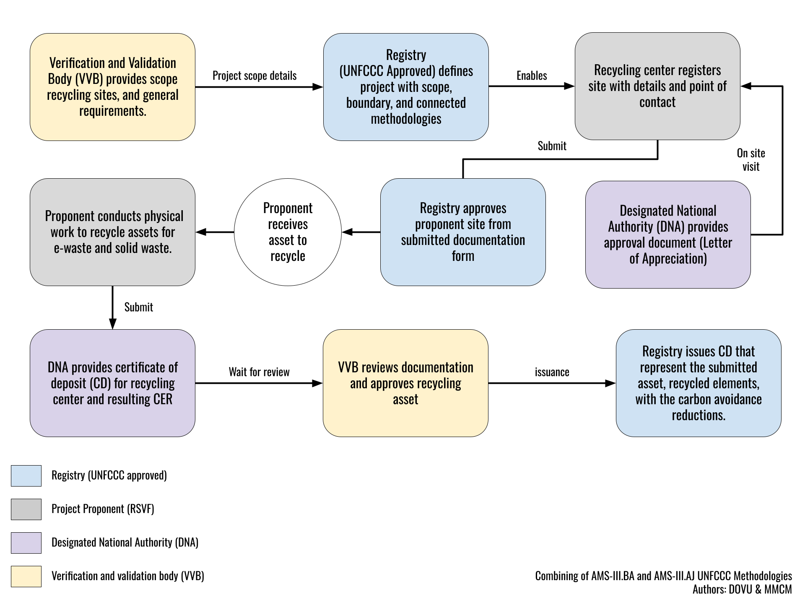

# Sustainable End-of-Life Vehicle Scrapping Program: Government Backed Voluntary Program

## Executive Summary

India, with its position as the world's second most populous country, is facing a significant challenge with the disposal of end-of-life vehicles (ELVs). With the automotive sector booming, the number of vehicles reaching the end of their service life is escalating. However, the recycling of these vehicles is still not fully developed, and the sector is predominantly run by the informal sector, which often disregards environmental and safety regulations.

The informal recycling facilities have been criticized for contributing to environmental pollution and selling potentially unsafe automotive parts. In response, the Indian government is promoting the establishment of Registered Vehicle Scrapping Facilities (RVSFs) that adhere to stringent environmental norms and compliance. These facilities, however, are struggling to compete with the informal sector, which typically offers quicker and cheaper services.

In the context of these challenges, MMCM, an enviro-tech company, is working to bridge the gap for RVSFs by introducing the concept of carbon credits. By ensuring proper waste management of ELVs, these credits provide an additional revenue stream, making it financially viable for RVSFs to operate within environmental compliance. This initiative by MMCM not only supports the formal sector in overcoming economic hurdles but also encourages sustainable practices in vehicle recycling, aligning with global environmental standards.

This methodology and related formula for calculation has been given a technical opinion from IIT Bombay, evidence of this opinion has been uploaded within the folder. 

### Blended Methodology Approach 

The combined methodologies of the End-of-Life Vehicle (ELV) recycling project introduce an innovative approach, by integrating UN AMS-III.BA (Recovery and recycling of materials from E-waste) and AMS-III.AJ (Recovery and recycling of materials from solid wastes) methodologies. This comprehensive process maximizes the environmental benefits, ensures transparency, and paves the way for generating a unique Certificate of Deposit (CD).

A significant potential lies in presenting this combined methodology to the United Nations Framework Convention on Climate Change (UNFCCC)'s Methodologies Panel under the Clean Development Mechanism (CDM). The aim here is to secure an official accreditation for this methodology as a novel, digitized form of the combined AMS-III.BA & AMS-III.AJ methodologies.

### Visualization of Integrated Carbon Credit Methodologies

We have illustrated a schematic representation of the process involved in the amalgamation of the two accredited methodologies - AMS-III.BA and AMS-III.AJ. This schematic diagram aims to abstract away the specific application of End-of-Life Vehicles (ELVs) and instead focus on the broad, integrative processes involved.

By deprioritizing explicit references to ELVs or specific geographical settings, such as India, our objective is to underscore the universal adaptability and applicability of this combined methodology. This approach offers a dual advantage: it retains confidentiality while highlighting the potential versatility of the integrated methodology across various sectors and projects.

The visualization provided is structured to simplify the understanding of our integrative approach while emphasizing the workflow and interdependencies of each stage and entity involved. 

### Generalization of Methodology Integration for Sustainable Practices

The methodologies AMS-III.BA and AMS-III.AJ under the Clean Development Mechanism (CDM) are inherently designed to foster and encourage sustainable practices through the effective promotion of recovery and recycling procedures.

AMS-III.BA specifically zeroes in on electronic waste, colloquially known as E-waste, with a clear aim of stimulating extraction and reuse of valuable materials such as metals, plastics, and glass. The beauty of this approach lies in its transformative power - morphing E-waste from a daunting environmental problem into a viable resource. This methodology is essentially propelling us towards the principles of a circular economy.

Running in parallel, AMS-III.AJ promotes recovery and recycling practices for a broad variety of solid waste types, going beyond the sole focus on electronic waste. This methodology recognizes the substantial contribution of solid waste to global greenhouse gas emissions, and seeks to combat this via advocating efficient waste management and recycling procedures. The ripple effects of this approach are multifold - conservation of natural resources, reduction in landfill waste, and a decrease in emissions emanating from waste processing and the production of new materials.

When these methodologies are applied in tandem, they guide projects that are able to turn waste streams into valuable materials, thereby bolstering sustainable development and significantly contributing to climate change mitigation. By utilizing a joint application of these methodologies, we can further amplify their impacts, birthing more holistic waste management solutions and a wider scope of emission reductions.

## Policy and Schema Breakdown for End-of-Life Vehicles  

The  goal is to align the various stages and streamline the policy flow for the respective roles, which include the Project, Registered Vehicle Scrapping Facility (RVSF) or RC, and Measurement Reporting Verification (MRV). This alignment will enable us to effectively map the End-of-Life Vehicle (ELV) methodology.
Here are some explanations of the different entities:

The project describes the ELV methodology in its entirety, providing outside actors with an understanding of all its properties.

The Recycling Centre (RVSF) is an entity that participates in the project. The role of the RVSF is to scrap ELV vehicles and generate a Certificate of Deposit. We can refer to this as the MRV or claim stage.

The claim or MRV describes the scrapping of an end-of-life vehicle (ELV) that can be used to mint carbon credits. This includes many of the properties inside the Certificate of Deposit, as well as the output from the MMCM document. This can be substantiated by the raw data values that are required to be listed.

It is crucial that we record all RVSFs along with their associated ELV submissions to maintain a track record of provenance

### Usage

While this policy can be used throught the standard UI the usage of the policy is primarily API based with the aim to automate ingestion, utilising the generic dMRV project structure and tools from DOVU:

- [DOVU Middleware API](https://github.com/dovuofficial/guardian-middleware-api/)
- [DOVU PHP SDK](https://github.com/dovuofficial/guardian-php-sdk)
- [Middleware API Documentation](https://middleware.guardian.dovu.market/docs)

These following tools sit on top of the guardian, and come complete, with examples of tests on how to best consume the policy 

### Roles

There are three primary roles:

- The standard registry (like DOVU)
  - This role would consist of policy management through the guardian, It has the ability to approve projects or sites, the policy can also be modified to enable the verifier or VVB entity to approve.
- The Supplier or project implementor (MMCM)
  - This would comprise the agent as a whole, For the issuance of the original project definition, the site, registrations, and the ingestion of all claim data.
- The Verifier (Certificate of deposits)
  - This is evidence that is provided from third parties. In this case, government documentation that proves the benefit, the recycling of the vehicle.

Naturally, over time, these features and elements will be automated, and there will be further signatures where appropriate. But as at April 2024, We have signed Governmental documents for proof of recycling, as well as proof of site registration in addition to methodology and formula sign off from ITT Bombay.

### Data Schemas

These schemas, or data points, have been collaborated upon between DOVU and the MMCM team using the [DOVU generic dMRV structure](https://docs.google.com/document/d/1micqwUz2-dVQ8VbWf55WBOxMzB_xTqMfxlqFUoHFW-8/edit) as an initial template, which comprises document or entity submissions:

3 Document Submissions
- The creation or the definition of a project.
- The creation of a site, that refers to an instance a sensor or a geographical area.
- The submission of a claim with MRV data to be the expected minted value of carbon units (or NFTs) connected to the guardian.

3 Approval steps

- Steps 1 & 2 are an approval from DOVU or a registry/verifier
- The final step is the approval from a reputable verifier who is used to the current MRV, or verified data source.

In the case of MMCM ELV asset generation "Certificate of deposits" That prove the sign off of a vehicle that has been recycled, and then ingested to extract out of data points is used as the verified and indexable data source.

## Project (ELV Scrapping CO2 Emission Avoidance)

For now these are basic properties that help to describe the project and baseline scenario where appropriate.

- Unique reference (UUID)
- Project Name 
  - Sustainable End of Life Vehicle Scrapping Program
- Project Summary
  - This is completed through digitizing of blended UN e-waste methodology (AMS-III.BA) and UN Recovery and recycling of materials from solid wastes (AMS-III.AJ) and applying it to end-of-life vehicles for tracking emission avoidance. Introducing a new unit type for selling credits to enhance market transparency and traceability. These units, termed ELV Credit, represents the environmental impact of processing each End of Life Vehicle (ELV) through Government Authorized Vehicle Scrapping Centers, which are termed Registered Vehicle Scrapping Facility (RVSFs) in India.
- Classification Category
  - CARBON_AVOIDANCE
- Host Country
   - India
- Targeted Benefit Type
   - Technological Emission Avoidance
- Voluntary Standard (UNFCCC Third Party Verified Blended Methodologies: AMS-III.BA.: Recovery and recycling of materials from E-waste (v3.0) &AMS-III.AJ.: Recovery and recycling of materials from solid wastes (v7.0) )
   - For this the recommendation would be UNF, as the methodologies have been published through the Framework convention on climate change.
   - AMS-III.BA.: Recovery and recycling of materials from E-waste (v3.0)
   - AMS-III.AJ.: Recovery and recycling of materials from solid wastes (v7.0)
- Project start date: 1 August 2022 (see link)
- Methodology Resource Link
   - AMS-III.BA: https://cdm.unfccc.int/methodologies/DB/TO0E8JPL9361FDB1IPF0TUPS0WJXV3
   - AMS-III.AJ.: https://cdm.unfccc.int/methodologies/DB/R22750M155F84YR0D4YVYOS0CLSCII

### Registered Vehicle Scrapping Facility (RVSF) 

A recycling center is associated with the project but ingests ELV assets for scrapping for material, allowing for individual ELV scrapped assets to be tracked back to the RC.

- Unique Identifier (UUID)
- RVSF Name
- RVSF Address
- RVSF POC Name
- RVSF POC Contact Number
- Geographic Location (lat, long)

### Claim / MRV (ELV Submission and certificate of deposit)

This stage for Measurement Reporting and Verification (MRV) will be where a given ELV is submitted to a RSVF to be scrapped to generate a certificate of deposit. The goal here is to record as much information as possible relating to the certificate in addition to the generated carbon values with a subset of raw material data.

In addition, we can add a verification payload to ensure that the data that MMCM sends to the DOVU platform has proof of original signed proofs in place, this will later be reinforced from solutions like are offered from demia.

- Unique Identifier (UUID)
- Proof
  - Certificate of Deposit OR
  - Certificate of Vehicle Scrapping
- Proof UID
  - Certificate of Deposit - COD2022109DL5SR8634
  - Certificate of Vehicle Scrapping - CVS20230430GJ07R7461
- Proof Hash (CID - IPFS)
  - (we will use a link for the demo but this can be a hash for privacy reasons)
  - https://cloudflare-ipfs.com/ipfs/bafybeiafql4r5xn6nyuamktltmjnklapiyck5w6mtpx7pragvhtr56iase/COD1161.pdf
- Carbon Emission Reduction (ER) - tCO2e
  - 0.6 tCO2e per 1000kgs of End Of Life Vehicle scrapped
- Vintage
  - Year
- Properties
  - Materials (All in Metric Tons)
    - Ferrous (Tons)
    - Aluminum (Tons)
    - Copper (Tons)
    - Plastics (Tons)
    - Glass (Tons)
    - Tyres (Tons)
    - Precious Metals (Tons)
    - Others (Tons)
    - Fluids (Tons)
  - ELV
    - Vehicle ID Type (Categories: Registration Number, Chassis Number, or Engine Number)
    - Vehicle RC Number (Masked; Actual Regn. No, Chassis No., or Engine No.)
    - Vehicle Type (LMV/Motor Car)
    - Vehicle Unladen Weight (Tons)
    - Maker
    - Fuel Type

The purpose here is to view all the details that I have been created from the original certificate of deposit, and while at the same time, introduce all of the unique fields within the claim object itself to make up the MRV component.

