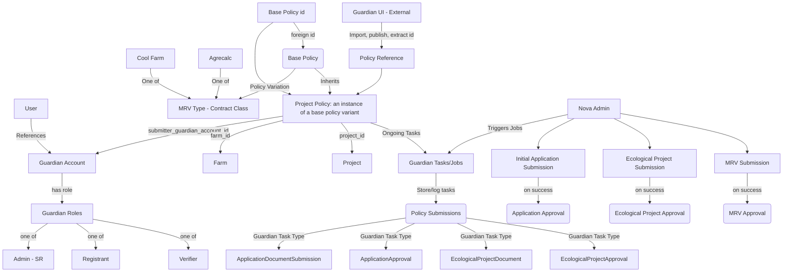
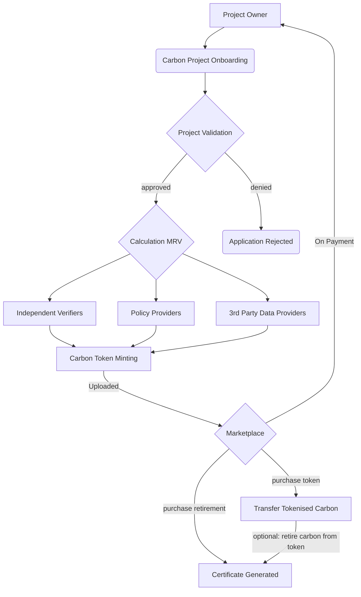
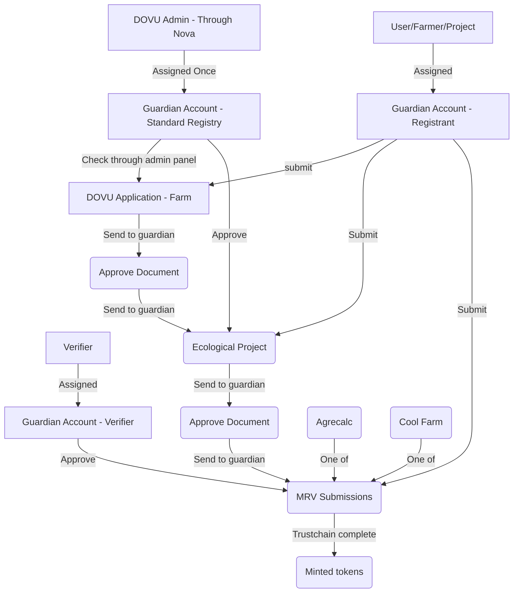

# DOVU Policy Template Methodologies

DOVU has developed an Audit Trail where the Guardian is a core piece of technology to process our custom policies as well as deal with the identity layer between the different actors. To support a wide range of methodologies and MRV's DOVU utilises a template approach to enable the addition of any MRV schema when required. 

Firstly here are some details on how our policies can be consumed through our [Middleware API](https://github.com/dovuofficial/guardian-middleware-api), then extended to provide an accessible layer into Guardian technology for any product team.

## Using the DOVU Guardian Middleware API and SDKs

Please view the policies subdirectory to get an understanding of the policy template structure as well as the initial instances of MRV with Agrecalc and Cool Farm Tool.

Every policy requires three different document submissions with three actors, These are represented through:

- A DOVU application 
- An ecological project submission
- A given MRV, this final document submission can be approved by a third-party verifier if data is manually-attested.

Alternatively for the final verification approval if MRV data is sourced through third party sources like IOT devices or satellite imagery, the MRV measurement provider can add approval.

In order to consume through the DOVU middleware API: 

- A policy needs to be imported through the Guardian UI it's generated policy identifier stored.
- The DOVU application for a project needs to be sent to the Guardian instance 
- The Standard Registry will then approve the application document
- Next an Ecological project document can be sent to the Guardian to represent the project/farm.
- This is currently approved by the Standard Registry
- Finally, A document that encapsulates a given MRV can be submitted, this can be approved from a verifier. 

DOVU will continue to document the process of interacting with the Guardian through the APIs. 

## A demo of DOVU's admin panel to generate Guardian credits 

As an example of how DOVU uses the API and SDKs within their marketplace admin panel, watch this to gain a full understanding of how to fully productise the DOVU toolkit. 

--- 

For more information to understand our rationale below is our usecase submission for V2 of the [IWA Voluntary Ecological Markets document](https://gbbcouncil.org/wp-content/uploads/2022/09/Voluntary-Ecological-Markets-Version-2-InterWork-Alliance.pdf) co-ordinated through the [GBBC](https://gbbcouncil.org/).

## Policy Versioning

DOVU's policies will continue to evolve based off of our ongoing requirements, We will do our best effort to update them within this repository however please reference our primary [guardian policies repository](https://github.com/dovuofficial/guardian-policies/) for all up-to-date versions.

## DOVU IWA Policies

DOVU has leveraged the IWA VEM specification for the carbon token lifecycle by delivering an auditable process, focused on MRV and capturing proofs in the audit trail tied to individual actors that have been validated and verified. These actors have unique keys, which they use to sign every transaction following W3C Decentralized Identifier (DID), Verifiable Credential (VC), and Verifiable Presentation (VP) standards and linking them to a native Token using the Hedera Hashgraph public DLT and Hedera’s Guardian, an open source reference implementation of the IWA’s Voluntary Ecological Markets Standards.

### DOVU IWA Implementation Example

Below is a data architecture of how DOVU's marketplace interacts with the Guardian

## Understanding the DOVU process

The first step towards compliance was building a system to support manual attestations for an MRV. To mitigate the risk of manually attested data, DOVU supports attestation from multiple sources, as well as verification of the manual data by a 3rd party verifier. In addition, in order to reduce the risk of actors carrying the risk of manual data, DOVU is building a collateral mechanism that would be tied to these actors to serve for insurance purposes.

### DOVU Project Example

Below is a simple flow of the DOVU onboarding to minting of carbon credits.

## The different actors within DOVU policies 

- Standard Registry / Root Authority - Dovu.
- MRV supplier - 3rd party policy creator, ex. Cool Farm.
- Originator - Dovu.
- Primary source - The farmer
- Secondary Sources - External verifier.

## A Typical DOVU Engagement

A simplified flow would see a farm owner contact DOVU. As part of the onboarding process, this initial application will get evaluated. At this point, DOVU will create an Ecological project and ask the farm owner to provide data and documents such as proof of land ownership. Next, an MRV will be created and attached to the farm application. Once MRV data has been collected, a 3rd party verifier will evaluate the data and signoff where appropriate. All of these steps are publicly auditable through IPFS, with connecting proofs of schema-based VC data. After the MRV data has been signed off, the CRT tokens are minted using the Guardian.

## Using the Guardian

This diagram expands on the basic flow and incorporates basic Guardian functionality. The Guardian controls data flow related to every stage of an ecological project. These data flows are recorded on the ledger and signed off by verified actors. Ultimately, this data will be fully transparent and available to see once the carbon tokens are minted and listed on our marketplace

## The Architecture:

A given MRV protocol is used in a policy that is set by a standards registry. That standard registry could be anyone from a state actor to a voluntary registry, or a new type of standard being set up. The standard registry also defines what is a CRU, and as part of that lists the different types of measurements that are set up and approved. DOVU utilizes a number of different preset policy templates that end in different resulting MRV methodologies, such as Agrecalc or Cool Farm Tool; this could easily be replaced by Verra, Gold Standard, or other methodology toolsets. MRVs are methodologies which are external to DOVU and are open source. New policy templates can be generated for any additional third-party MRV service per market demands. Once a project starts working with DOVU we assign a specific policy which inherits a given template, all submitted VP data streams through the Guardian, recorded through IPFS and signed off through DIDs resulting in the minting of a tokenized carbon credit.

These credits are minted as CRT, with the aim of transitioning into NFTs with the CRU specification. Our tokens are divisible because we use the CCP specification, as fractional NFT capability is brought to Hedera we will be able to transition to the CRU model. We only mint carbon that is verifiably additional or proves removal instead of avoidance or lesser methods. We are working on implementation of reversibility, revocation, and life time audit capabilities of the system.
