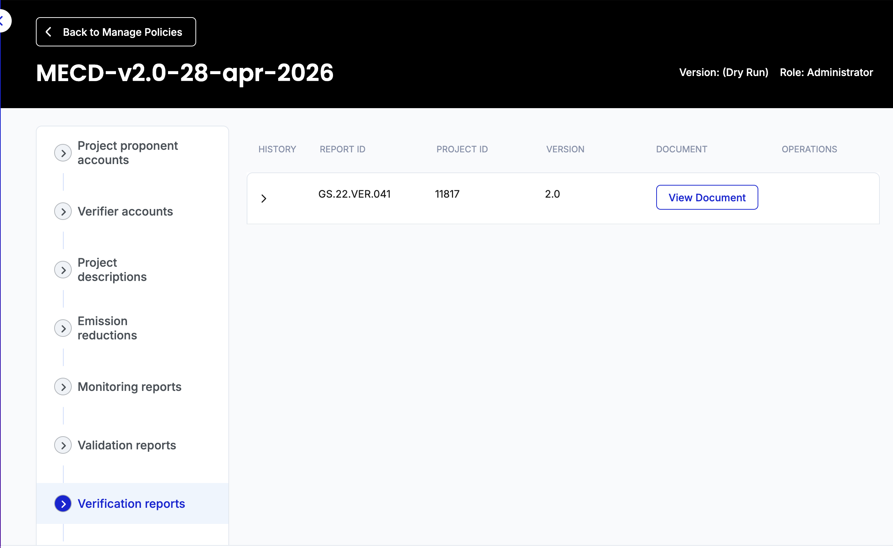
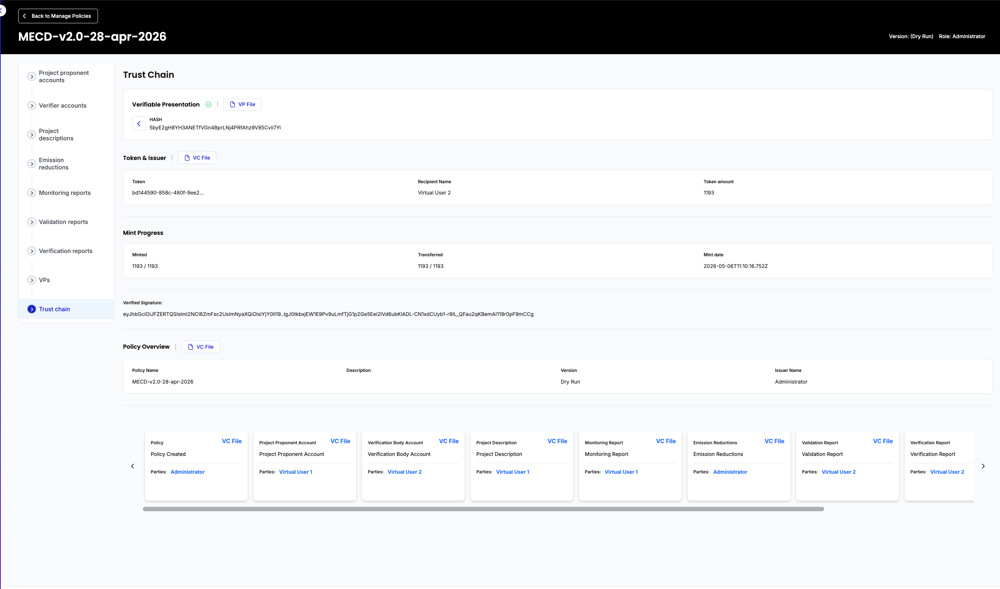
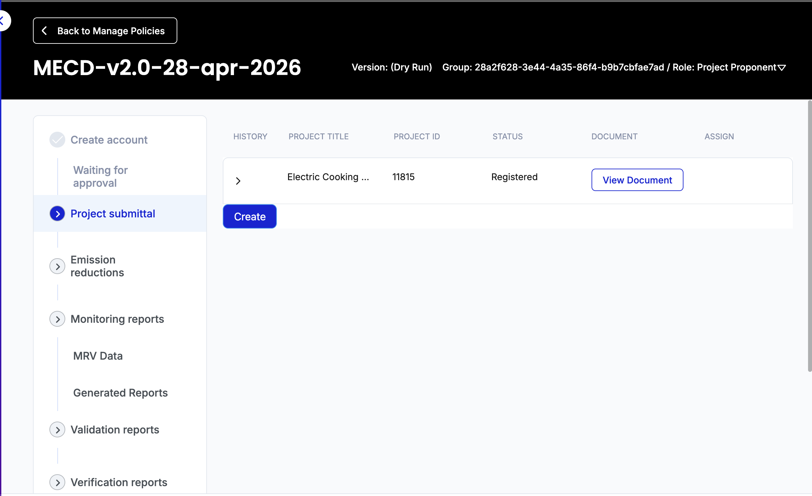
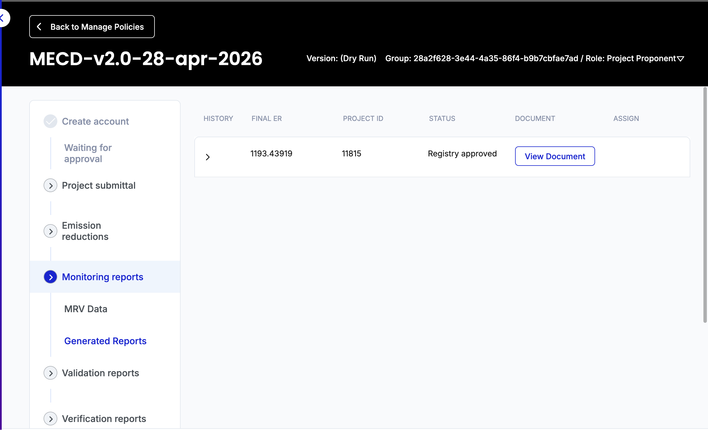
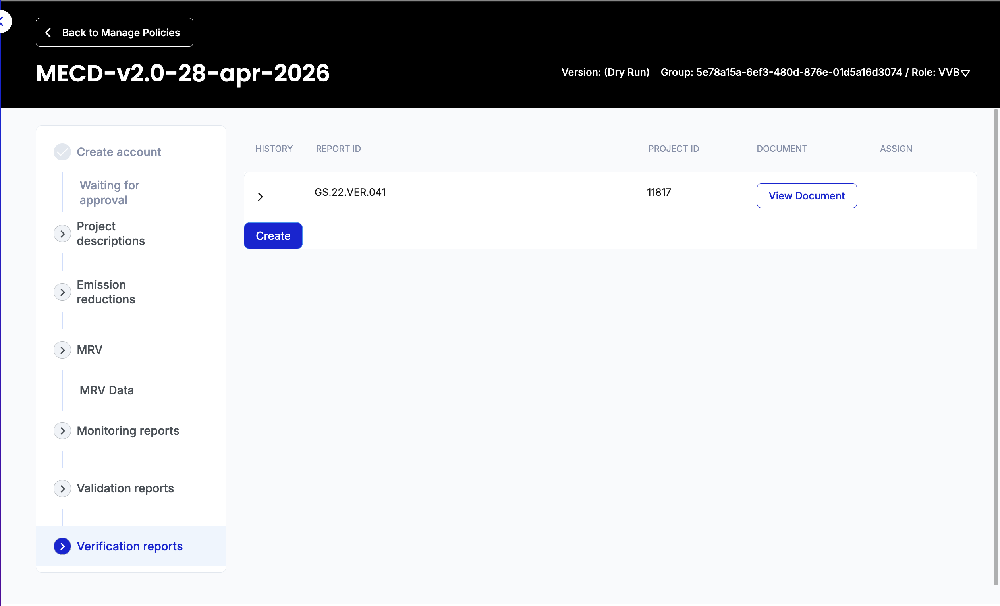

# Metered & Measured Energy Cooking Devices (MECD) — v2.0 (Paris Agreement Aligned)

## Table of contents

<!-- TOC -->

- [What this is](#what-this-is)
- [What's in this folder](#whats-in-this-folder)
- [Cookstove projects in plain English](#cookstove-projects-in-plain-english)
- [Why MECD, and why v2.0](#why-mecd-and-why-v20)
- [Conservativeness stack — the v2.0 difference in one picture](#conservativeness-stack--the-v20-difference-in-one-picture)
- [Roles and what each one does](#roles-and-what-each-one-does)
  - [Gold Standard (Standard Registry)](#gold-standard-standard-registry)
  - [VVB — Validation & Verification Body](#vvb--validation--verification-body)
  - [Project Proponent](#project-proponent)
- [Workflow at a glance](#workflow-at-a-glance)
- [Important schemas](#important-schemas)
- [Token](#token)
- [Importing the policy](#importing-the-policy)
- [Step-by-step](#step-by-step)
- [Differences from MECD v1.2](#differences-from-mecd-v12)
- [Migration notes](#migration-notes)
- [References](#references)

<!-- /TOC -->

## What this is

A Hedera Guardian policy that implements Gold Standard's
**Metered & Measured Energy Cooking Devices methodology, version 2.0** —
the Paris-Agreement-aligned (PAA) revision approved by GS in 2025.

The policy walks a clean cookstove project end-to-end on the Hedera ledger:
project listing → validation → monitoring → verification → token mint, with
every step recorded as a verifiable credential. The output is a Verified
Emission Reduction (VER) token, one per tCO2e.

This v2.0 policy supersedes the existing
[`MECD-v1.2`](../MECD%20v1.2/MECD-v1.2.policy) bundle.
For brand-new projects we recommend v2.0; v1.2 is kept for live projects in
their current crediting period (see [Migration notes](#migration-notes)).

## What's in this folder

```
MECD v2.0/
├── MECD-v2.0.policy                 ← import this into Guardian
├── readme.md                        ← you are here
├── migration-from-v1.2.md           ← short upgrade guide for existing projects
├── test-curls/                      ← sanitised cURL requests for API testing
│   ├── 01-pdd.txt
│   ├── 02-er-method-1-{electricity,fossil,renewable}.txt
│   ├── 02-er-method-2-{electricity,fossil,renewable}.txt
│   ├── 02-er-method-3-fossil.txt
│   └── readme.md
└── test-fixtures/                   ← realistic ER fixtures (positive ER)
    ├── atec-gs11817-m{1,2,3}-electric.json
    ├── parameter-map.md
    ├── run-fixture.js
    └── readme.md
```

## Cookstove projects in plain English

Roughly **2.3 billion people** still cook over open fires or basic biomass
stoves. The smoke causes ~3.2 million premature deaths a year (WHO), most of
the wood comes from non-renewable sources, and the soot is a measurable
short-lived climate forcer.

A "clean cookstove project" deploys a stove that's much more efficient —
electric induction, LPG, advanced biomass, biogas — and earns carbon credits
for the emissions avoided versus what those households would otherwise have
burned. The credits fund the upfront cost (often subsidised to near zero for
the household) and the ongoing operations.

The hard part is proving the avoidance. Three things have to be true:
1. The household actually uses the new stove (not stacked alongside the old one).
2. We know how much fuel the old stove was burning.
3. The new stove's own emissions and supply chain are accounted for.

MECD is the methodology that does this for **metered** stoves — devices that
can directly report their own usage. That direct measurement is what makes
MECD substantially less prone to overcrediting than older methodologies.

## Why MECD, and why v2.0

A 2023 [University of California, Berkeley study](https://assets.researchsquare.com/files/rs-2606020/v1/c2e6a772-b013-49f9-9fc4-8d7d82d4bebc.pdf?c=1678869691)
found cookstove projects across all major standards over-credited by
**~9× on average**. Gold Standard's MECD was the closest to ground-truth
(~1.3× over-credit), because it monitors fuel use directly instead of
extrapolating from sample surveys.

MECD v2.0 went further:
- **Aligns crediting with national NDCs** (Paris-Article-6-style accounting).
- Adds a stack of conservativeness adjustments — uncertainty haircut,
  per-capita consumption cap, downward adjustment factor, business-as-usual
  ceiling, embodied leakage — to keep credit numbers defensible.
- Mandates **continuous device-level monitoring (CTEC)** with a ≥95%
  reporting threshold, biennial retest, and meter-error adjustment.
- Adds **Method 3 (KPT)** as a third quantification path alongside Method 1
  (WBT, useful energy) and Method 2 (CCT, specific energy ratio).

The net effect: 15–35% fewer credits per period than v1.2 on the same
project, plus a one-time embodied-leakage charge in the deployment year.
That's the trade — fewer credits, but each credit is much harder to dispute.

## Conservativeness stack — the v2.0 difference in one picture

The calculator runs the same baseline → project → leakage subtraction as v1.2,
but layers v2.0 conservativeness on top:

```
  raw baseline emissions
         │
         ▼  90/10 uncertainty rule (UB90 if precision not met)
         ▼  upstream emission factors (UEF) on every fuel
         ▼  PCAP cap (clip to per-capita consumption ceiling)
         ▼  DAF (flat downward adjustment factor)
         ▼  BAU ceiling (clip to NDC forecast)
         ▼
  conservative baseline ◄──── this is what's credited
         │
         ▼  − project emissions (with MPE meter-error adjustment)
         ▼  − market leakage (default 2%, or de-minimis with justification)
         ▼  − embodied leakage (deployment year only: 0.017 tCO2e × N_devices)
         ▼
  net ER  ──►  mint VER tokens
```

Each step has a single-line plain-English meaning:

| Step | What it actually does |
|---|---|
| 90/10 rule | If your sample is too small/noisy to be 90% confident in ±10% of the mean, use the upper bound — assumes baseline households were *more* efficient than your sample suggests. |
| UEF | Counts emissions from getting the fuel to the kitchen (logging, refining, transport). v1.2 only counted combustion. |
| PCAP | If your back-calculated baseline implies people were burning implausibly much fuel, clip it down. Stops fictional baselines. |
| DAF | Flat percentage haircut on the baseline. Mandatory safety margin. |
| BAU ceiling | Caps the baseline at what the country's NDC forecasts the sector to emit anyway. Stops projects from claiming credit for emissions the country was already going to avoid. |
| MPE | If your meter is rated noisier than ±2.5%, inflate the project-side emissions accordingly. Penalises cheap meters. |
| Embodied leakage | Books the manufacturing emissions of the stoves themselves, once, in the deployment year. |

## Roles and what each one does

### Gold Standard (Standard Registry)

Owns the policy. Reviews PDDs, approves VVBs, approves projects for listing,
and signs off on verification reports before tokens are minted. In Guardian
terms, the Standard Registry is the role that publishes the policy and holds
the topic key.

### VVB — Validation & Verification Body

Independent third-party auditor. Two distinct jobs:
- **Validation** — at the start of a crediting period, sign off that the
  PDD is methodologically sound (baseline assumptions, eligibility, additionality).
- **Verification** — for each monitoring period, audit the metered data and
  sign off that the calculated ER is correct.

Examples in MECD context: Earthood, TÜV NORD, Verifavia.

### Project Proponent

The organisation deploying the stoves. Responsible for:
- The project itself — distribution, training, maintenance.
- Submitting the PDD and (later) monitoring reports.
- Choosing a VVB for validation and verification.
- Receiving the minted credits.

Example: ATEC International (the deployment that drove this implementation).

## Workflow at a glance

The path from project idea to token mint:

1. **VVB applies and is approved** by Gold Standard.
2. **Project Proponent submits PDD** describing the project, baseline, and methodology choice (M1/M2/M3).
3. **Gold Standard lists the project** on the public registry.
4. **Project Proponent assigns a VVB** to validate the PDD.
5. **VVB validates** — site visit, document review, signs off.
6. **Gold Standard approves validation**.
7. **Project Proponent submits monitoring report** for a period (data flows in automatically from the device meters via CTEC).
8. **Project Proponent assigns a VVB** to verify the monitoring report.
9. **VVB verifies and submits a verification report**.
10. **Gold Standard approves the verification report**, triggering token mint.
11. **VER tokens** land in the Project Proponent's Hedera account, one per tCO2e.

Every step is a verifiable credential signed by the relevant role and
hash-anchored to a Hedera Consensus Service topic. End-to-end, anyone can
trace any minted credit back through every approval that produced it.

## Important schemas

| Schema | What it captures |
|---|---|
| Project Proponent / VVB Account Registration | Onboarding details for each role. |
| GS PDD | Project design — baseline, methodology choice, fuel mix, target population, additionality, SDG contributions. |
| GS Validation Report | VVB sign-off on the PDD. |
| Monitoring Report (Auto) | Aggregated metered data for one monitoring period. |
| Emission Reductions GS | The calculated baseline → project → leakage → ER chain. |
| Leakage Emissions GS | Market and embodied leakage components. |
| GS Verification Report | VVB sign-off on the monitoring report. |
| CTEC Integrity Summary | Whether continuous-tracking coverage met the 95% threshold for the period. |
| Performance Monitoring Summary | Last/next retest dates and stove-degradation status. |
| Baseline Consistency Check | Confirms the original PDD baseline mix still applies. |
| Dynamic fNRB Update | Per-period fraction of non-renewable biomass, capped at the previous-period value. |
| Project Consumption Cap | Per-capita consumption check (PCAP). |
| Data Gap Summary | Which devices had data gaps and how the gaps were handled. |
| Usage and Demographic Monitoring | Population-level usage and household composition. |

The full schema list is in the policy bundle; these are the ones a reviewer
or implementer should be aware of.

## Token

**Verified Emission Reduction (VER)** — fungible, one token = one tCO2e
of avoided emissions. Minted to the Project Proponent's Hedera account on
verification report approval.

## Importing the policy

The policy is published to the Hedera network and can be imported into a
running Guardian instance two ways:

- **From file** — drop `MECD-v2.0.policy` into Guardian's policy import dialog.
- **From IPFS / Hedera topic** — use the version discovered on the Guardian's
  policy registry (topic ID: `0.0.8826363` on testnet).

Once imported, publish the policy as the Standard Registry user. From there,
register a VVB and a Project Proponent and walk the workflow.

## Step-by-step

Screenshots are included only for the methodology-specific moments. Account
creation, role approvals, and "assign VVB" steps work the same way as in
every other Guardian policy.

### Standard Registry flow

1. Log in as the Standard Registry. Open the imported policy.

2. Approve VVB and Project Proponent applications as they come in.

3. Review and approve PDD listings.

4. Approve verification reports — this triggers the mint.

   

5. Inspect the trust chain for any minted credit.

   

### Project Proponent flow

1. Register an account.

2. Submit a PDD. The form covers project details, baseline mix, methodology
   choice (M1/M2/M3), and the target population.

   

3. Once the PDD is listed and validated, submit a monitoring report for the
   crediting period. Most fields are pre-filled from the previous monitoring
   report; the operator updates only the period-specific values (CTEC stats,
   total kWh delivered, performance retest dates).

   

4. Assign a VVB for verification.

5. Once verification is approved, the VER tokens appear in the proponent's
   Hedera account.

### VVB flow

1. Validate a PDD: review the baseline, fuel mix, methodology choice, and
   additionality argument. Sign off or request changes.

2. Verify a monitoring report: spot-check CTEC data, confirm retest cadence,
   confirm the 90/10 precision and the conservativeness stack, sign off.

   

## Differences from MECD v1.2

The methodology itself changed substantially. Headline differences:

| | v1.2 | v2.0 |
|---|---|---|
| Quantification methods | Method 1 (WBT), Method 2 (CCT) | Method 1, Method 2, **Method 3 (KPT)** |
| Upstream emission factor (UEF) | not modelled | mandatory, on every fuel including LPG/NG |
| Sampling rule | not enforced | **90/10 uncertainty rule** — use upper-bound efficiency if precision not met |
| Per-capita consumption cap | not enforced | **PCAP** — back-calculated baseline clipped if implausible |
| Downward adjustment factor | not applied | **DAF** — mandatory flat haircut |
| BAU ceiling | not applied | **MIN(BE, NDC forecast)** |
| Meter accuracy | not adjusted for | **MPE adjustment** if meter rated worse than ±2.5% |
| Performance retest cadence | not enforced | **biennial retest** required, calc fail-fasts on missing dates |
| Baseline drift check | not enforced | **10% materiality check** at every monitoring period |
| Monitoring coverage | sample-based OK | **CTEC ≥95%** continuous device-level reporting required |
| Market leakage | optional 0% (Option 1) | default 2%, de-minimis option requires justification |
| Embodied leakage | not modelled | **0.017 tCO2e × N_devices** in the deployment year |
| NDC alignment | n/a | yes — credits must fit under host-country NDC ceiling |

Net effect on a typical project: 15–35% fewer credits per period than v1.2,
plus the one-time embodied-leakage charge.

For a worked comparison on a real project, see the
[ATEC parameter map](test-fixtures/parameter-map.md).

## Migration notes

For an existing v1.2 project: see [`migration-from-v1.2.md`](migration-from-v1.2.md).

Short version: live v1.2 projects stay on v1.2 for the rest of their current
crediting period. At renewal (or for any new project), use v2.0.

## References

- [Gold Standard MECD methodology page](https://globalgoals.goldstandard.org/news-methodology-for-metered-measured-energy-cooking-devices/)
- [PAA-PC specification (v2.0)](https://globalgoals.goldstandard.org/) — accessible via Gold Standard's standard documents portal
- [Berkeley study on cookstove overcrediting](https://assets.researchsquare.com/files/rs-2606020/v1/c2e6a772-b013-49f9-9fc4-8d7d82d4bebc.pdf?c=1678869691)
- [WHO household air pollution fact sheet](https://www.who.int/news-room/fact-sheets/detail/household-air-pollution-and-health)
- [ATEC GS11817 — first MECD live deployment](https://registry.goldstandard.org/projects/details/2731)
- [Hedera Guardian documentation](https://docs.hedera.com/guardian/)
