# Gold Standard Methodology - Simplified Methodology for Clean and Efficient Cookstoves

Across many regions, households rely on traditional cooking devices such as three-stone fires and other conventional stoves burning wood or charcoal as their primary fuel. This practice drives significant fuel consumption, indoor air pollution, and associated greenhouse gas (GHG) emissions.

The Simplified Methodology for Clean and Efficient Cookstoves (GS4GG PAA M400-07, V4.0) provides the standardized approach for quantifying GHG emission reductions achieved through the introduction of clean and efficient cooking technologies at the household level.

This methodology enables activity developers to introduce efficient cooking technologies such as improved biomass cookstoves, solar cookers, and other decentralized thermal energy devices that reduce or displace emissions from the thermal energy consumption of household cooking. It is a micro-scale methodology (≤10,000 tCO₂e/year) restricted to activities where the baseline is unambiguously a traditional stove (e.g., three-stone fire, or mud/clay stove with no grate or air vent) burning wood or charcoal as ≥90% of thermal energy needs. If baseline evidence shows heterogeneous or already-improved devices, the Reduced Emissions from Cooking and Heating (RECH, formerly TPDDTEC) methodology applies instead.

## Baseline Scenarios

**Historical Consumption (B-KPT)**
Baseline fuel consumption is determined ex-ante via a statistically representative Baseline Kitchen Performance Test, subject to 90/10 statistical adjustment and per-capita capping (wood: 0.75 t/capita/yr threshold, 1.25 t/capita/yr cap; charcoal: 0.20/0.40 t/capita/yr).

**Conservative Default / Minimum Service Level (MSL)**
Baseline consumption is set to fixed per-capita defaults (wood: 0.50 t/yr; charcoal: 0.13 t/yr) multiplied by household size, less a mandatory 5% conservativeness discount — no B-KPT required.

## Applicability

The methodology applies where:

- Activity scale ≤10,000 tCO₂e/crediting year.
- Primary baseline fuel is wood or charcoal (>90% of thermal energy needs), and the baseline stove is a Traditional Stove.
- The activity stove meets minimum rated thermal efficiency thresholds (20–30% depending on technology/fuel), determined via ISO 19867-1 or WBT testing.
- Mechanisms are in place to encourage baseline technology displacement, accounting mathematically for continued "stove-stacking."
- Technical life and replacement provisions are documented; retrofitted/repaired devices require warranty, guarantee, or durability-test evidence to continue claiming reductions.
- Double-counting safeguards are met: unique device tracking, informed consent/carbon-waiver documentation, and exclusion from overlapping mechanisms (SWS, jurisdictional REDD+, other PoAs).
- Indoor air pollution levels are demonstrated not to worsen relative to baseline.

## Policy Guide

### Available Roles

**Activity Developer**
Manages and executes the activity from start to finish: submitting required project documents to the Standard Registry, assigning Validators and Verifiers, ensuring compliance with applicable methodologies and standards, and coordinating with stakeholders including technology manufacturers, retailers, and end-users.

**Validation and Verification Body**
Independent party that checks whether an activity's emission reduction claims are correct: reviewing project documents and emissions data, conducting site visits or KPT/usage-survey audits, and issuing validation or verification reports.

**Authorization Body (Gold Standard)**
The Standard Registry, responsible for maintaining project records, managing registration and tracking of approved activities, and facilitating communication with Verifiers and oversight bodies.

### Important Schemas

- **Project Form** - Key information regarding the activity and activity developer, including activity/baseline scenario identification, technology description, and target population.
- **Project Design Document (PDD)** - Describes the activity's design, baseline scenario, additionality demonstration, and expected emission reductions.
- **Validation Report** - Documents the independent assessment confirming the activity design complies with applicable standards and this methodology.
- **Monitoring Report** - Provides recorded data and evidence of activity implementation and performance during the monitoring period, sequentially reporting unadjusted, uncertainty-adjusted, downward-adjusted, BAU, and final crediting baseline emissions.
- **Verification Report**  Confirms that monitored results and claimed net emission reductions (accounting for activity emissions, leakage, Hawthorne Effect, and DAF) are accurate and meet required standards.

## Policy Workflow

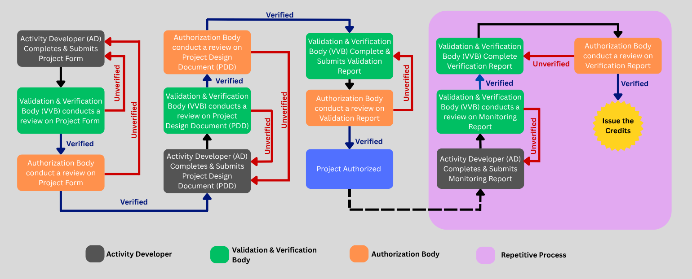

## Step by step approach

### Activity Developer User Onboarding

- Assign 'Activity Developer' role to the selected virtual user.

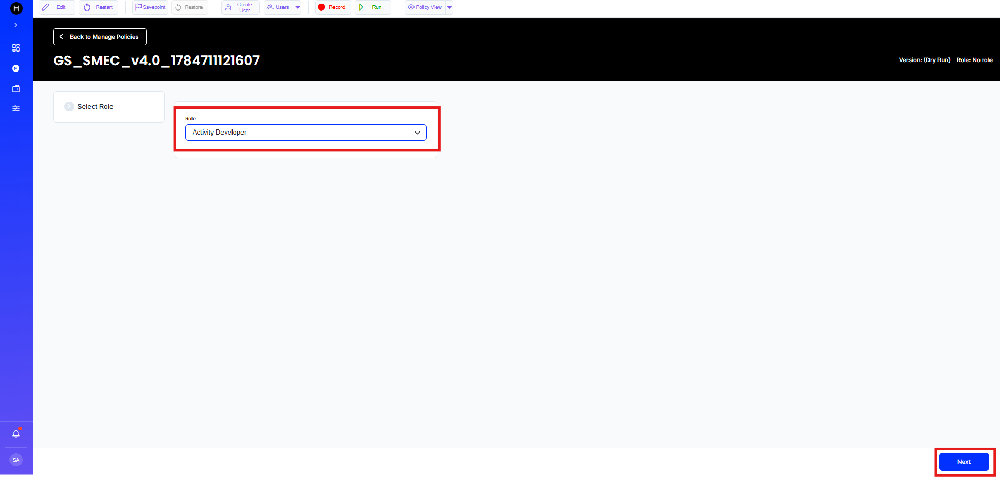

- Fill in the Activity Developer User Onboarding form and submit it.

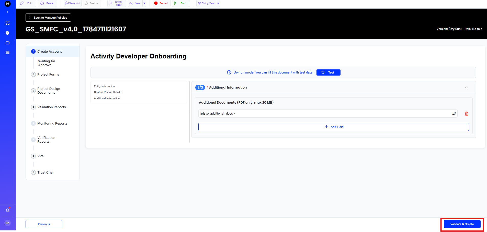

- You will then be directed to the 'Waiting for Approval' page.

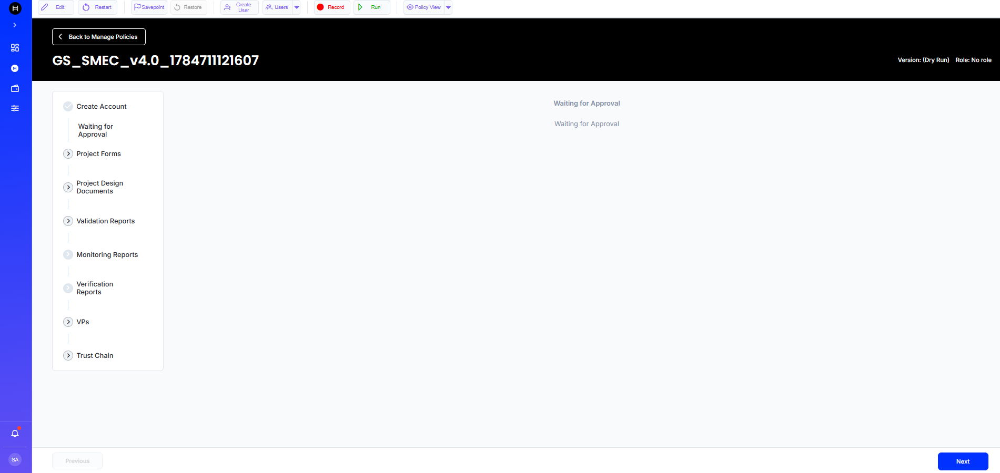

- Login as Administrator and click 'Approve' to approve the Activity Developer user.

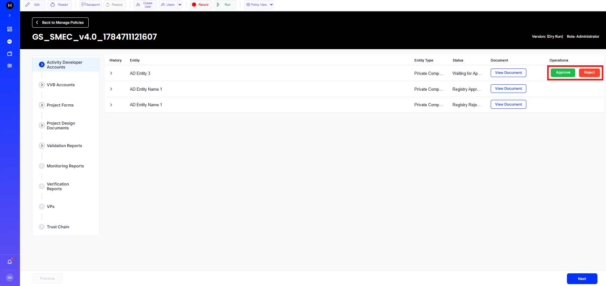

### Validation and Verification Body (VBB) user onboarding

- Assign VVB role to a newly created virtual user.

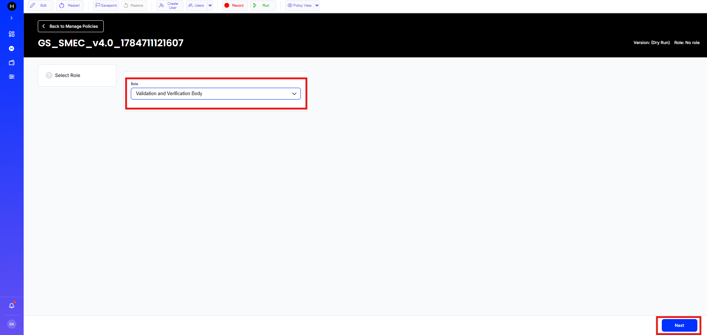

- Fill in the VVB User Onboarding form and submit it.

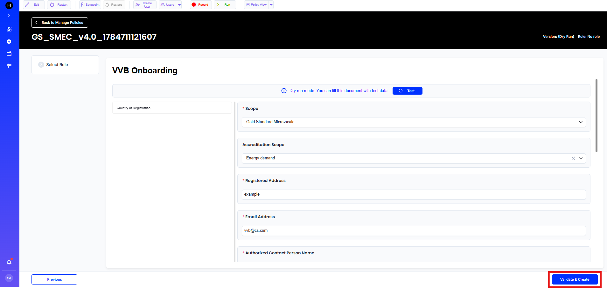

- You will then be directed to the 'Waiting for Approval' page.

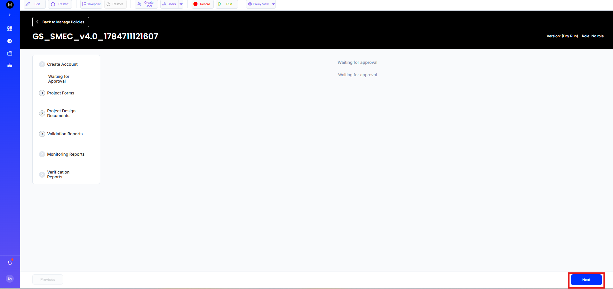

- Login as Administrator and select Verifier Accounts field.

- Click 'Approve' to approve the Validation and Verification Body (VVB).

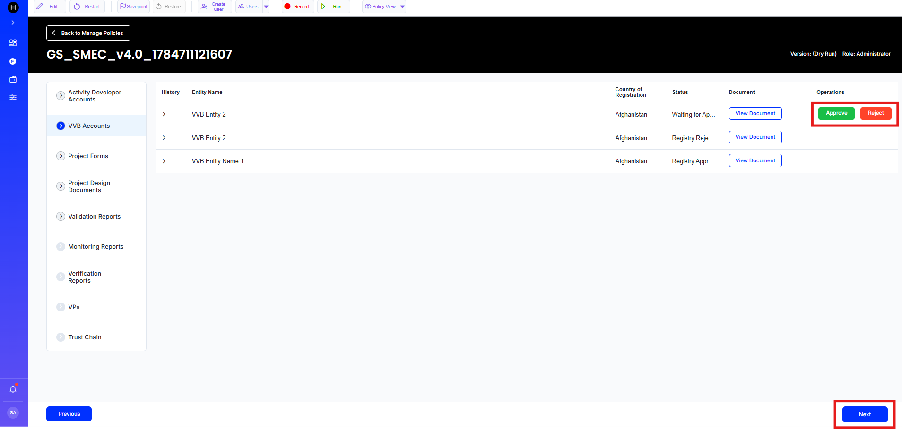

### Project Form Submission and Approval Process

- Login as an 'Activity Developer' and click 'Create' to open a new project form.

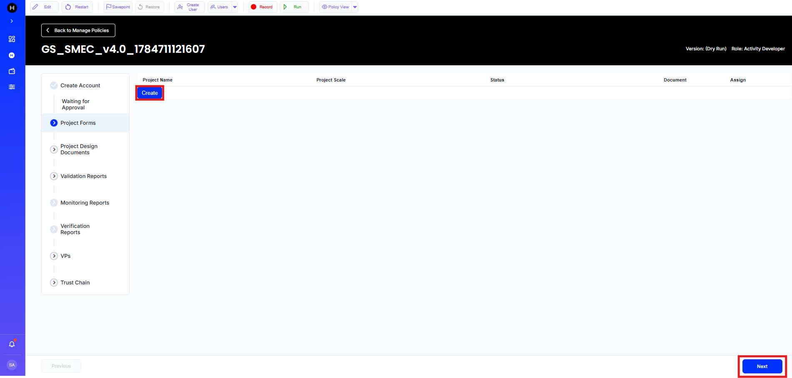

- Fill in the Project Form and click 'Create' to submit it.

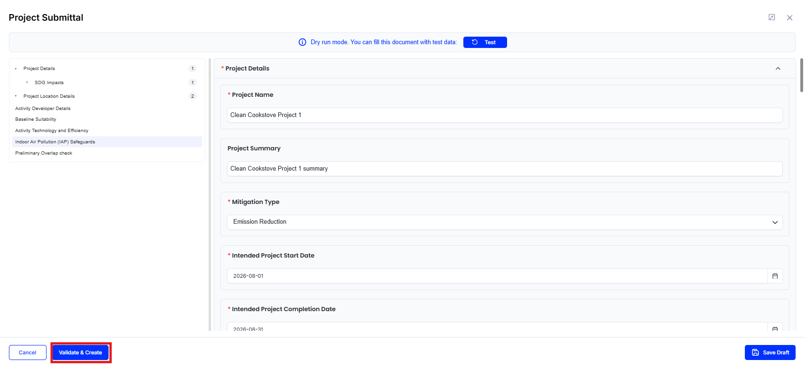

- In the Assign section, select a Validation and Verification Body (VVB) for the project.

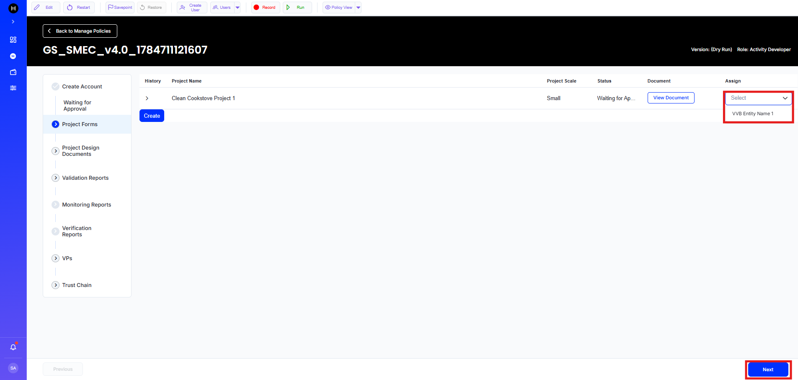

- Login as Validation and Verification Body and click 'Approve' to approve the Project Form from VVB side.

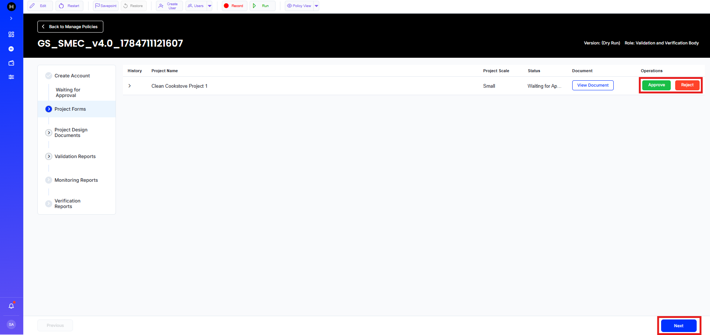

- Login as Administrator and click 'Approve' to give final approval from the administrator side.

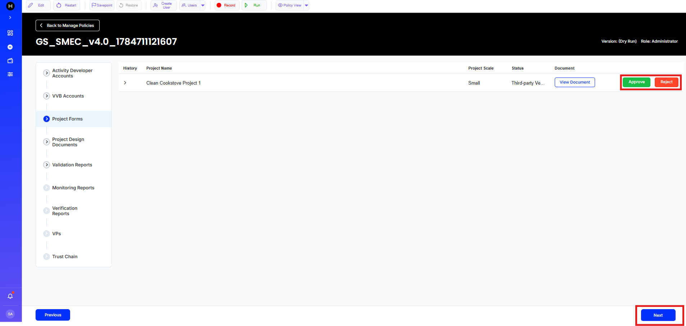

### Project Design Document Submission and Approval Process

- Login as Activity Developer and select 'Project Design Document'. Then click 'Create PDD' to start creating the Project Design Document.

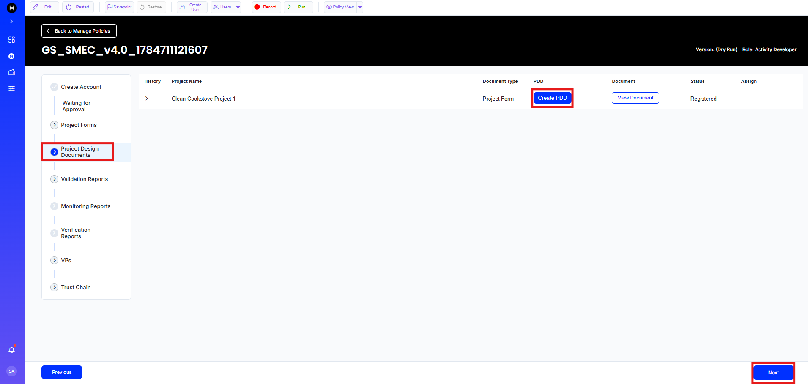

- Fill in the required details and click 'Validate and Create' to submit the Project Design Document.

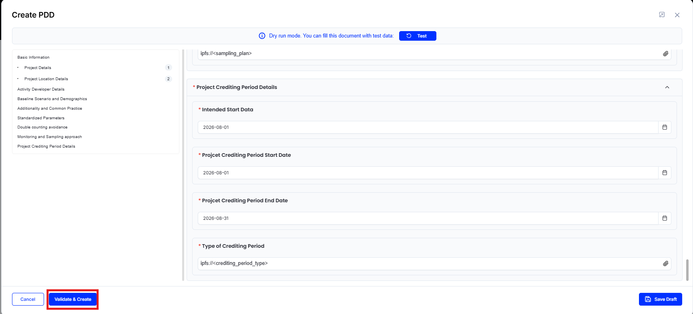

- In the Assign section, select a Validation and Verification Body (VVB).

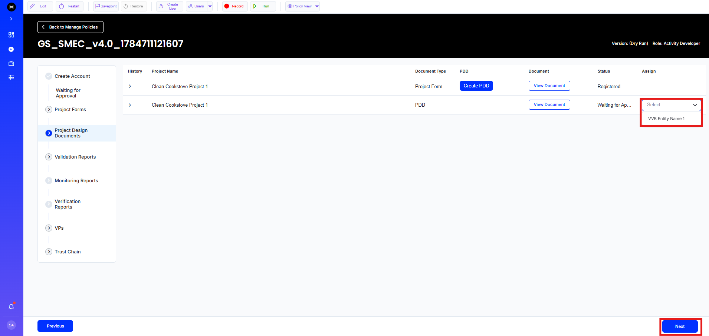

- Login as 'Validation and Verification Body' and click 'Approve' to verify the Project Design Document from Validation and Verification Body (VVB) side.

- Login as Administrator and click 'Approve' to verify the Project Design Document from Registry side.

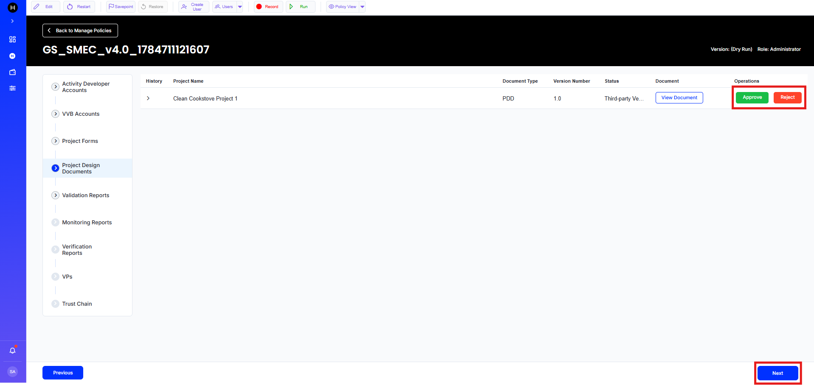

- Submission and Approval Process of 'Project Design Document' is now successfully completed.

### Validation Report Submission and Approval Process

- Login as a Validation and Verification Body and select 'Create Validation Report'.

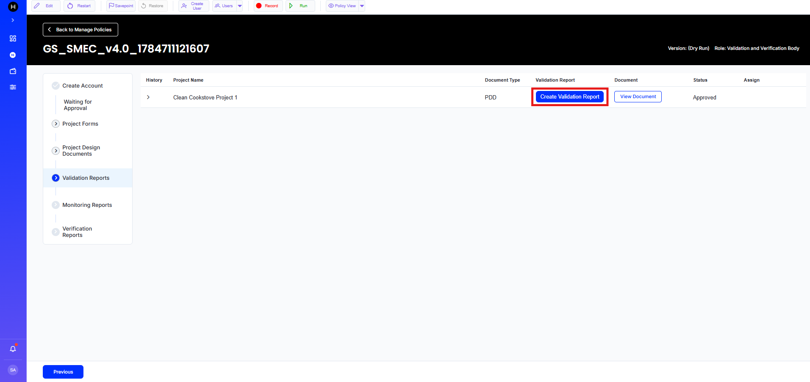

- Complete the 'Validation Report' and click 'Validate and Create' to submit it.

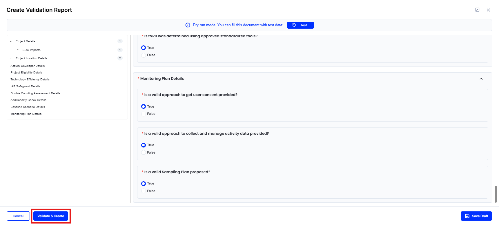

- Assign the read only acccess of the Validation Report to an Activity Developer.

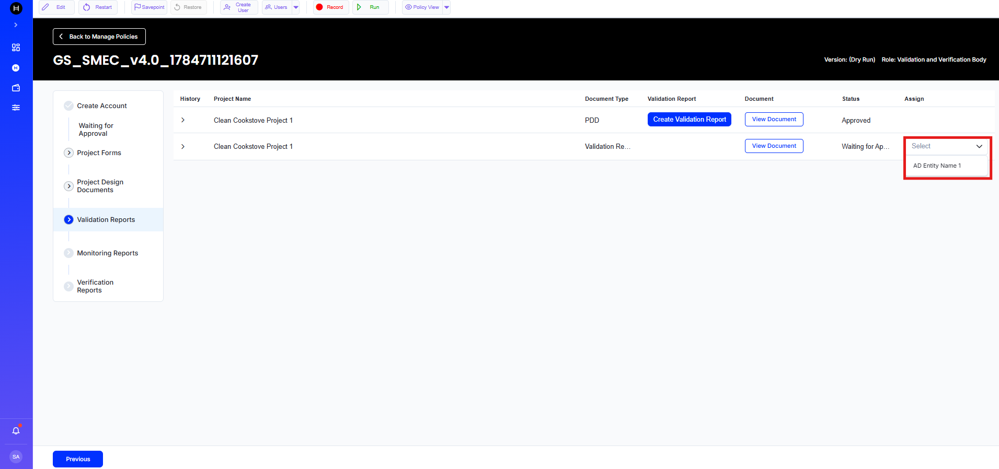

- Login as Administrator to Accept or Reject the validation report.

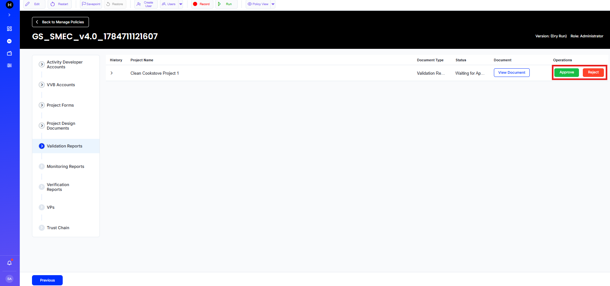

- After the acceptance of the Validation Report, the project is authorized.