# Gold Standard Methodology – Emission Reductions from Safe Drinking Water

In many regions, households and institutions rely on boiling water typically using biomass or fossil fuels to make drinking water safe. This practice leads to significant fuel consumption and associated GHG emissions. 

Gold Standard Methodology – Emission Reductions from Safe Drinking Water provides the standardize approach for quantifying greenhouse gas (GHG) emission reductions achieved through the implementation of safe water supply and water treatment technologies.

This methodology enables project developers to introduce zero emission or low emission water treatment and supply technologies such as Household Water Treatment (HWT), Institutional Water Treatment (IWT), Community Water Treatment (CWT), and Community Water Supply (CWS) systems. 

## Baseline Scenarios

* Actual boiling
Under this baseline condition, users already boil drinking water using biomass or other fuels to make it safe, reflecting existing practices in the absence of the project. Baseline emissions are therefore calculated based on the type of fuel used, stove efficiency, and the volume of water currently boiled by households or institutions.

* Suppressed Demand
Under this baseline condition, users do not boil water despite unsafe sources due to constraints such as lack of fuel, time, or suitable stoves. The methodology assumes that, in the absence of these barriers, users would boil water to meet safe drinking needs, and baseline emissions are therefore calculated as if the required water volume were boiled using locally representative fuels and stoves.

## Applicability 
The methodology is applicable under below conditions: 
* Treatment technologies include bleach/chlorine, water filter (Ceramic, Sand, Composite, Membrane, etc.), UV disinfection, etc.
* For rehabilitation projects, the Project Developer (PD) must provide evidence that the existing technology is non-operational and that no maintenance or repairs were planned or carried out for at least three (3) months after it became non-operational.
* End users include households and commercial or institutional premises, such as shops, schools (day or boarding), prisons, army camps, and refugee camps.
* The project technology performance level must be demonstrated through laboratory test reports or official notifications confirming that the technology either (i) achieves a 3-star or 2-star (“Comprehensive Protection”) rating under the WHO International Scheme to Evaluate HWT Technologies, or (ii) complies with the applicable national standard or guideline for household drinking water treatment technologies. If no national standard or guideline exists, compliance with the WHO International Scheme is required.
* Conduct annual water hygiene education campaigns for end-users. 
* To claim SDGs, include monitoring parameters in the monitoring plan to demonstrate and confirm contributions to SDGS.

## Policy Guide

### Available Roles

* **Project Developer** - The Project Developer is responsible for managing and executing the project from start to finish. This includes submitting required project documents to the Standard Registry, assigning Validators and Verifiers, ensuring compliance with applicable methodologies and standards, and coordinating with relevant stakeholders to support effective project implementation and reporting.

* **Validation and Verification Body** - Verifiers are independent parties who check whether a project’s emission reduction and sequestration claims are correct. They review project documents and emissions data, carry out site visits or audits if needed, and provide validation or verification reports to the Project Proponent and the Standard Registry.

* **Authorization Body (Gold Standard)** - The Standard Registry acts as the authoritative body responsible for maintaining project records. Its role includes managing the registration and tracking of approved projects, ensuring compliance with established protocols and procedures, and facilitating communication with Verifiers and relevant oversight bodies.

### Important Schemas

* **Project Form** - Key Information regarding the project activities and project developers.
* **Project Design Document** - Describes the project in detail, including its design, methodology, baseline, and expected emission reductions.
* **Validation report** - Documents the independent assessment confirming that the project design complies with applicable standards and methodologies.
* **Monitoring Report** - Provides recorded data and evidence of project implementation and performance during the monitoring period.
* **Verification Report** - Confirms that the monitored results and claimed emission reductions are accurate and meet the required standards.

## Policy Workflow

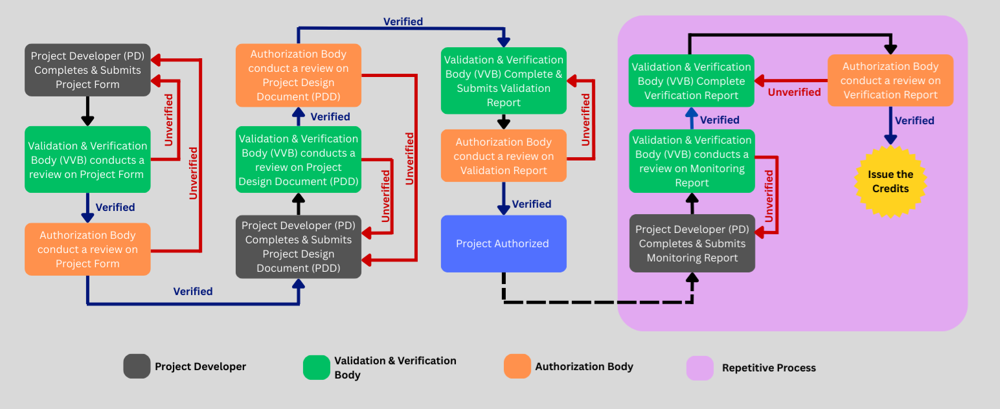

## Step By Step

### Project Developer User Onboarding

* Assign Project Developer role to the selected virtual user. 

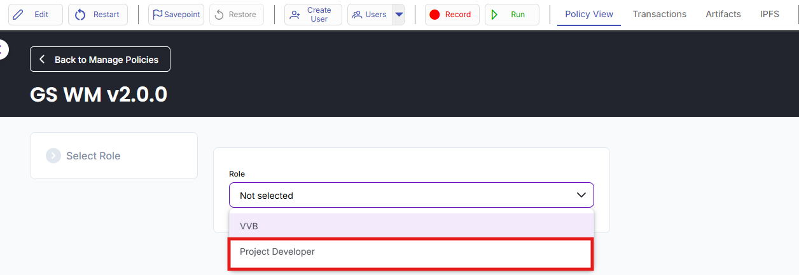

* Fill in the Project Developer User Onboarding form and submit it.

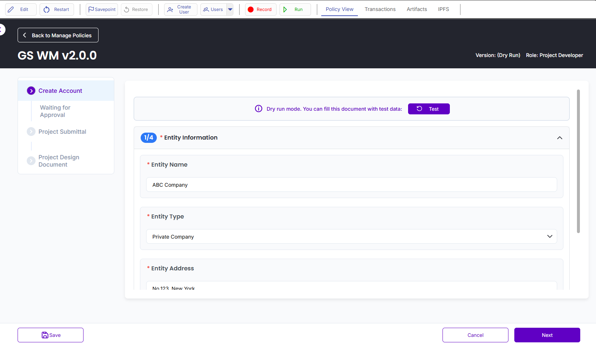
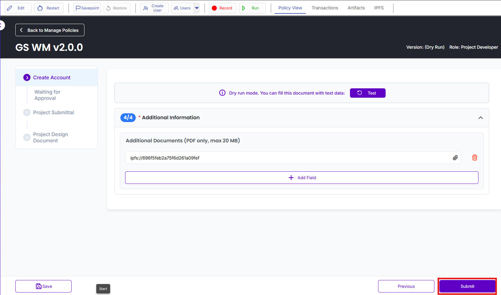

* You will then be directed to the **Waiting for Approval** page.

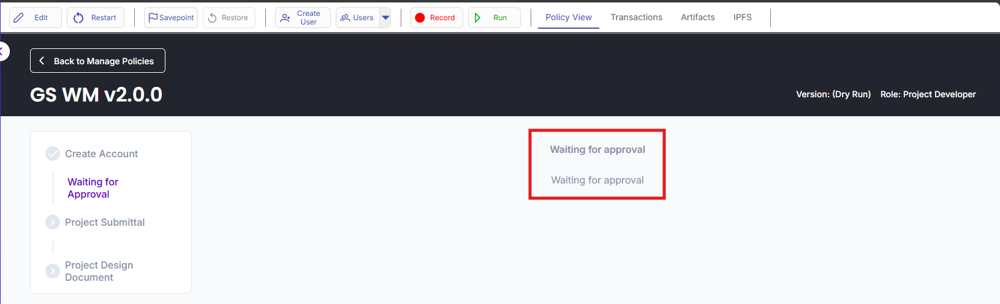

* Login as Administrator and click **Approve** to approve the Project Developer user.

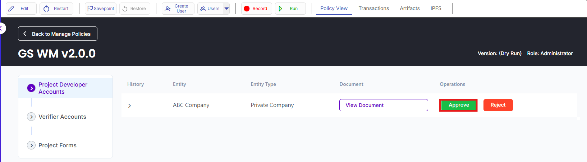

### Validation and Verification Body (VBB) user onboarding 

* Assign **VVB** role to a newly created virtual user. 

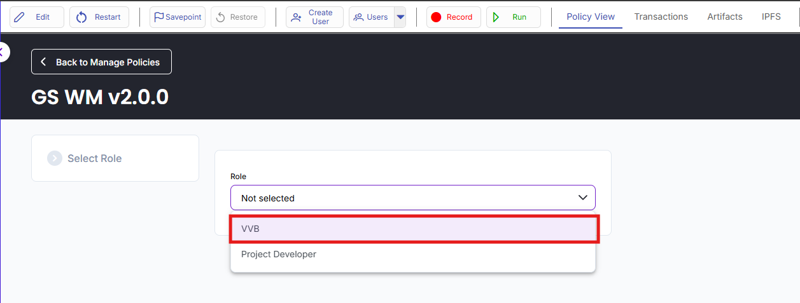

* Fill in the VVB User Onboarding form and submit it.

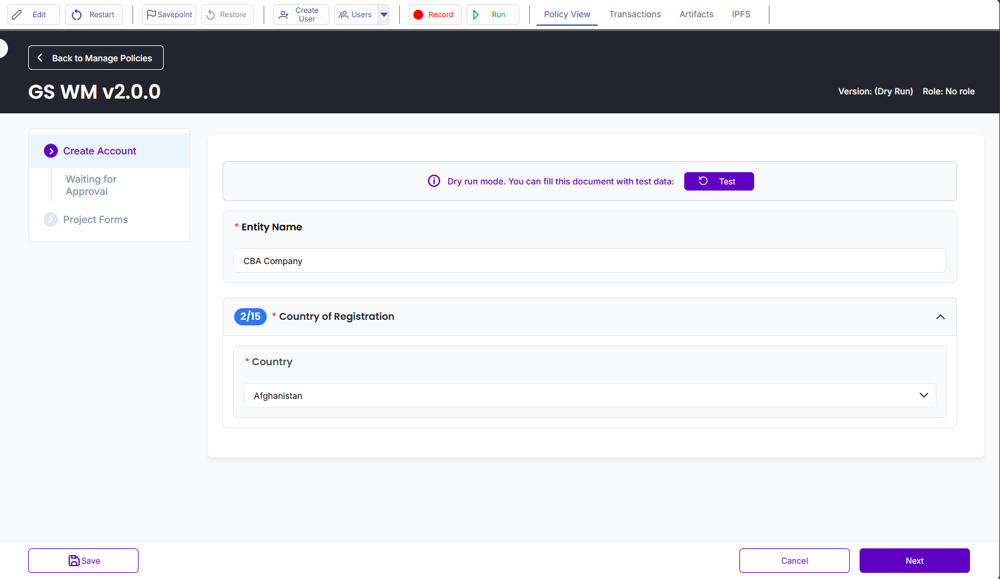

* You will then be directed to the **Waiting for Approval page.**

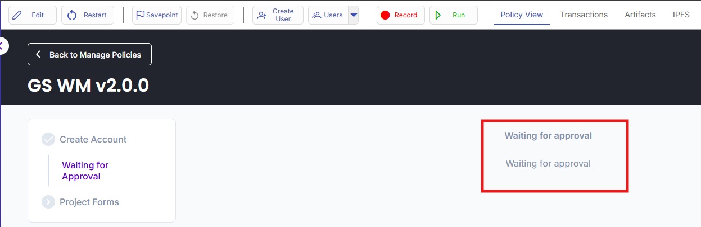

* Login as Administrator and select **Verifier Accounts** field.

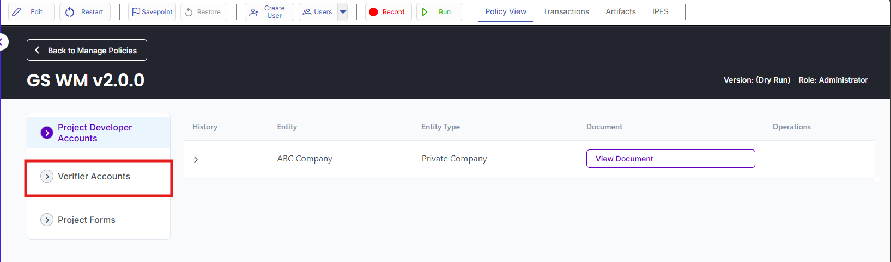

* Click **Approve** to approve the Validation and Verification Body (VVB).

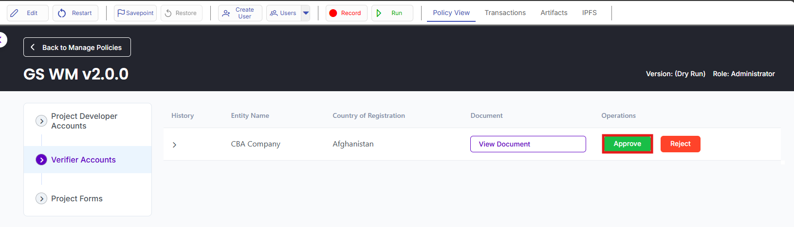

### Project Form Submission and Approval Process

* Login as a Project Developer and click **Create** to open a new project form.

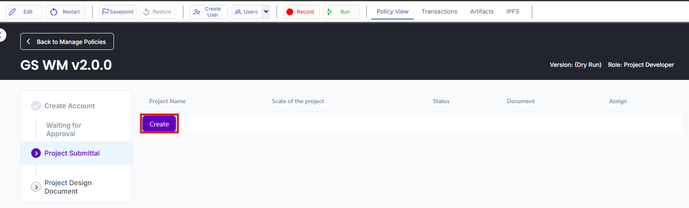

* Fill in the Project Form and click Create to submit it.

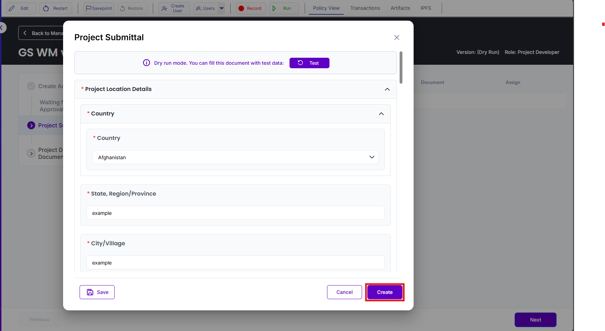

* In the **Assign** section, select a **Validation and Verification Body (VVB)** for the project.

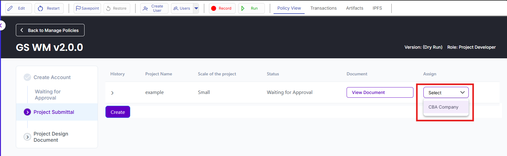

* Login as Validation and Verificatio Body and click **Approve** to approve the Project Form from VVB side.

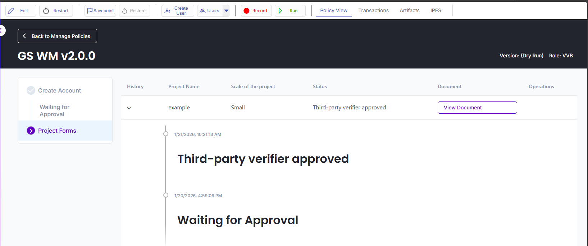

* Login as Administrator and click Approve to give final approval from the administrator side.

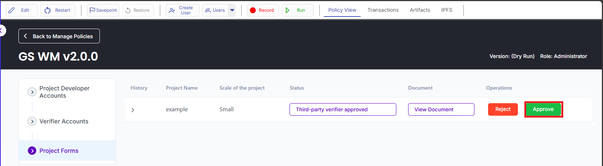

### Project Development Document Submission and Approval Process

* Login as Project Developer and select **Project Design Document**.

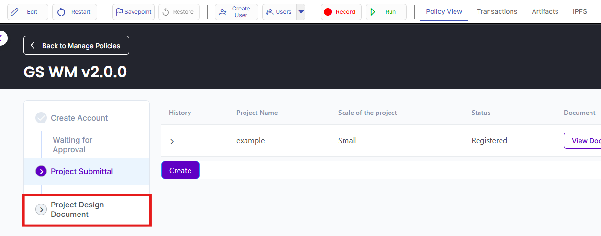

* Click **Create PDD** to start the Project Design Document.

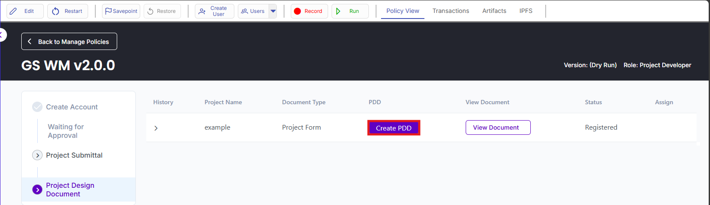

* Fill in the required details, noting that some fields are automatically populated from the Project Form, and click **Create** to submit the Project Design Document.

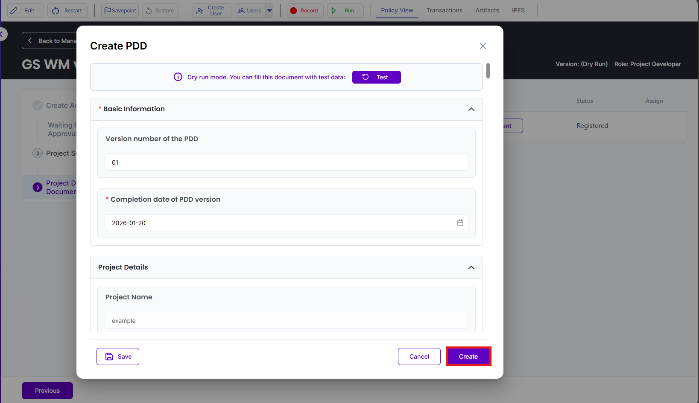

*  In the **Assign** section, select a Validation and Verification Body (VVB). 

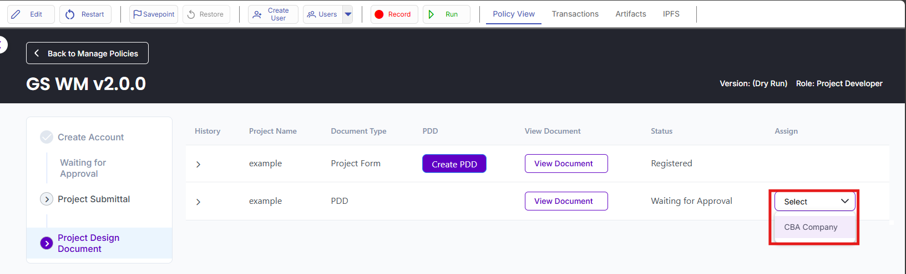

* Login as Validation and Verification and click **Approve** to verify the Project Design Document from Validation and Verification Body (VVB) side.

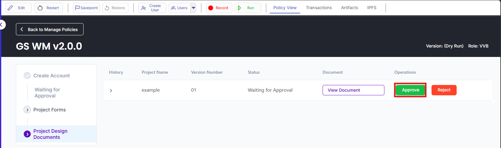

* Login as Administrator and click **Approve** to verify the Project Design Document from Registry side.

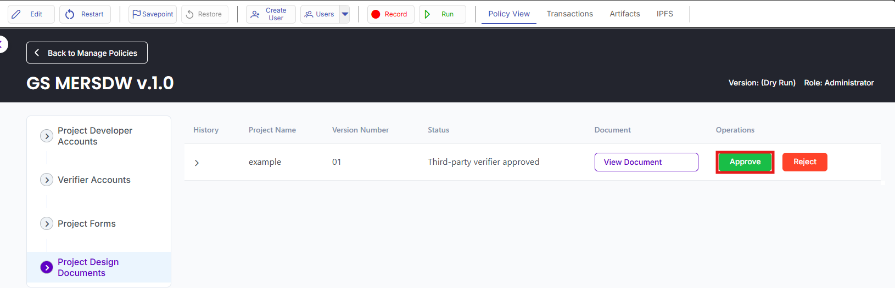

* Submission and Approval Process of Project Design Document is now successfully completed.

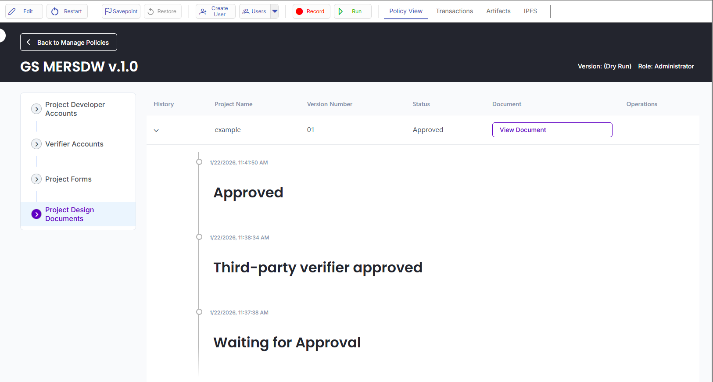

### Validation Report Submission and Approval Process

...