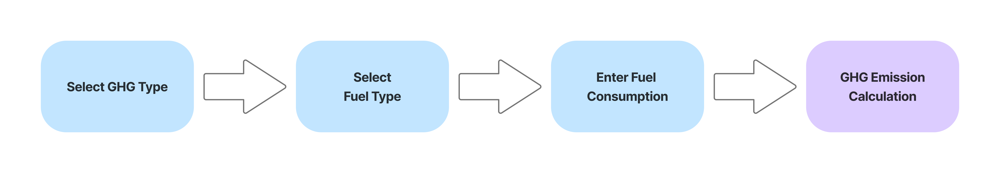
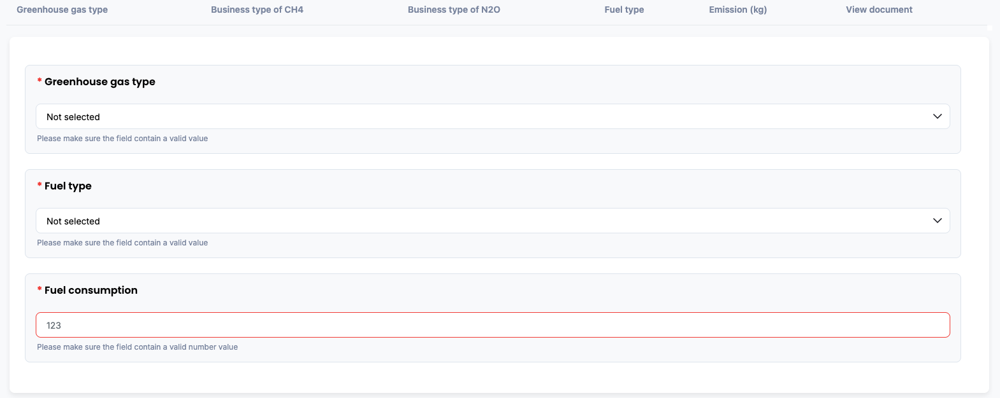
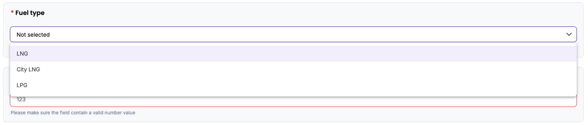
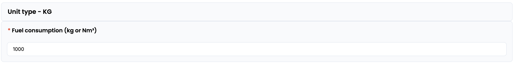
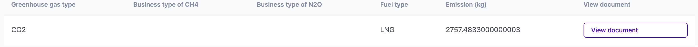
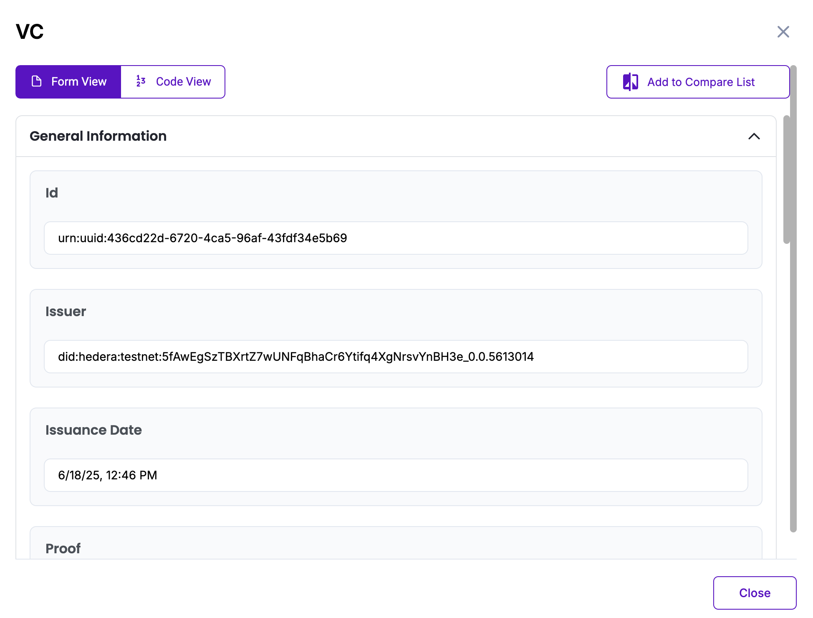

# Fixed Combustion of Gaseous Fuels Emission Methodology in Korea

Policy by WinCL

## Policy Description

This methodology provides a standardized framework for reporting organizations in Korea to quantify, report, and verify direct greenhouse gas (GHG) emissions from the fixed combustion of gaseous fuels. It is applicable to Scope 1 emissions, where fuels are combusted onsite in facilities owned or operated by the organization. The methodology defines key parameters—including net calorific values, emission factors, and oxidation factors—based on national default coefficients. 

## Workflow Description

The emission calculation workflow for direct greenhouse gas (GHG) emissions from fixed combustion of gaseous fuels begins with selecting the greenhouse gas type (CO₂, CH₄, N₂O) and the fuel type (e.g., LNG, City LNG, LPG). These selections determine the appropriate default parameters including calorific value, emission factor, and oxidation factor.

The user then inputs the total amount of gaseous fuel consumed during the reporting year, measured in kilograms (kg) or normal cubic meters (Nm³), depending on the fuel type. Upon data entry, the system automatically applies the selected parameters and calculates emissions using the following formula:

*Emissions (kg) = (kg) = Fuel Consumption × Calorific Value (TJ/unit) × Emission Factor (kg/TJ) × Oxidation Factor

This digital workflow ensures standardization and transparency, in alignment with national guidelines from the Greenhouse Gas Inventory and Research Center of Korea, and is designed to support reporting consistency for verification and compliance purposes.

The diagram below outlines the policy workflow as follows: User-provided input (Blue), Automated calculation (Purple)

## Policy Guide

To begin, navigate to the policy interface where the user will input data related to fixed combustion of gaseous fuels. 

Start by selecting the greenhouse gas type from the dropdown menu. The user can choose between CO2, CH4, or N2O depending on the reporting scope.

Next, select the type of gaseous fuel used at thr facility during the reporting year. Based on the selection, the system automatically applies the appropriate fuel unit (either kilograms or normal cubic meters), calorific value, emission factor, and oxidation coefficient according to national guidelines.

After selecting the fuel, enter the total amount of fuel consumed during the reporting year in the appropriate unit.

Once all fields are completed, the system will calculate the GHG emissions using the predefined coefficients. The result will appear on screen in kilograms (kg) of the selected greenhouse gas.

To securely store or verify this calculation, click the “View document” button. This opens a Verifiable Credential (VC) that includes a unique identifier (UUID), issuer DID, timestamp, input values, and the final calculated result. The document is cryptographically signed and can be viewed in Form View for user-friendly formatting or Code View for full JSON detail. The VC may be used for audit, compliance, or data integrity purposes in alignment with Guardian protocol standards.

