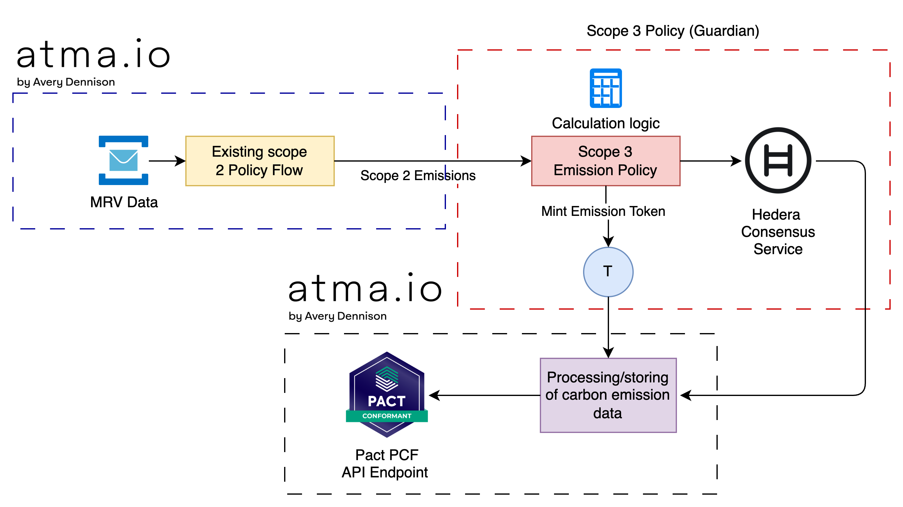

# Atma Scope 3 GHG Policy

The atma.io connected product cloud from Avery Dennison utilizes this policy to calculate scope 3 emissions during the RFID Inlay production processes. The policy is fully integrated into the atma.io platform and is designed for API-driven usage.

MRV data from the production process is received by the policy, which also tracks waiver batches. Once the Scope 2 emissions have been calculated, this subsequent policy should be triggered. The Scope 2 emissions that need to be passed on a UoA (Unit of Analysis) level to this policy can either be retrieved from a dedicated Scope 2 policy or calculated via a different process, depending on the use case.

Currently the following roles exist within the policy: 

- **Organization**: The organization that is tracking carbon emissions during the inlay production process is referred to as the Organization

# Policy Setup

Information about the product and production process must be recorded within the policy before production data can be captured. This is similar to the Scope 2 policy, where production-related information is first added when setting up the scope 2 policies. The current iteration of the policy is limited to tracking the emissions of only one product. If multiple products need to be tracked, additional policy instances must be created.

The following information is required when setting up a policy:

1. Organization Information: Information about the organization and the company's governance structure, such as business entities.
2. Definition of GHG sources: Captures information about the GHG sources, such as Ground transport and Supplier PCF Data.
3. Product information: Information about the product and its production process, such as quantity information and used materials.

# Policy workflow and usage

During the production process, MRV data is sent to the initialized policy on a 'per batch' level. Based on this provided information and emissions from scope 2 (on a per unit of analysis level), a partial scope 3 emission is calculated. Additionally, an emission token is minted, representing the carbon emissions on a per batch level.

The included Postman collection utilizes the Guardian REST API to set up the policy and initialize and populate it with example data. Before the policy can be used, the collection level variables for fields such as guardian instance URL and credentials must be set.



# Policy Output & Data Fields

```json
{
    "dataPeriodStartFrom": "2022-01-01",
    "dataPeriodEndTo": "2023-01-01",
    "functionalUnitWeight": 0.569,
    "productId": "Test Product",
    "itemId": "Batch-134583",
    "materialAcquisitionCalculation": {
        "calculationMethodology": "Activity Data/EEIO Emission Factors",
        "emissionFactors": [
            {
                "material": "Paper",
                "amount": 0.028
            },
            {
                "material": "PET",
                "amount": 3.3
            },
            {
                "material": "Aluminium",
                "amount": 16.1
            },
            {
                "material": "Chip",
                "amount": 5
            },
            {
                "material": "Adhesive",
                "amount": 3
            },
            {
                "material": "Liner",
                "amount": 2.5
            }
        ],
        "cumulativeMaterialEmissions": [
            {
                "material": "Paper",
                "emission": 0.01986892947648,
                "unit": "mt"
            },
            {
                "material": "PET",
                "emission": 0.03959999999999999,
                "unit": "mt"
            },
            {
                "material": "Aluminium",
                "emission": 0.7134676166799999,
                "unit": "mt"
            },
            {
                "material": "Chip",
                "emission": 0.02,
                "unit": "mt"
            },
            {
                "material": "Adhesive",
                "emission": 0.7799999999999999,
                "unit": "mt"
            },
            {
                "material": "Liner",
                "emission": 2.1799687229999996,
                "unit": "mt"
            }
        ],
        "cumulativeMaterialEmissionsTotal": 3.7529052691564795,
        "emissionFactorSources": [],
        "isPrimary": true,
        "productionOutputUnits": "Unit",
        "cumulativeActivityDataQuantity": [
            {
                "material": "Face paper",
                "materialType": "Face paper",
                "amount": 664168.3432
            },
            {
                "material": "PET Strap",
                "materialType": "PET Strap",
                "amount": 12000
            },
            {
                "material": "Paper Strap",
                "materialType": "Paper Strap",
                "amount": 45436.28096
            },
            {
                "material": "Aluminium",
                "materialType": "Aluminium",
                "amount": 44314.758799999996
            },
            {
                "material": "Chip",
                "materialType": "Chip",
                "amount": 4000
            },
            {
                "material": "Adhesive",
                "materialType": "Adhesive",
                "amount": 260000
            },
            {
                "material": "Liner",
                "materialType": "Liner",
                "amount": 871987.4892000001
            }
        ],
        "co2ePerUnitOfAnalysis": 0.9382263172891199,
        "annualGHGEmissions": 93.82263172891197,
        "consumptionPerUnitOfAnalysis": 0.47547671804
    },
    "materialAcquisitionTransportCalculations": [
        {
            "supplierId": "Aluminum_001",
            "serviceId": "Ground transportation_001",
            "productId": "Aluminum input_001",
            "calculationMethodology": "Activity Data/Supplier-specific PCF Data/EEIO Emission Factor",
            "cumulativeWeightOfProductInput": 0.04431475879999999,
            "cumulativeWeightOfCargoLoad": 0.04923862088888888,
            "cumulativeDistanceTraveled": 135.5539233071111,
            "cumulativeTonKm": 6.674488239720362,
            "cumulativeFuelConsumption": 12.531229016222222,
            "wellToWheelEmissionFactor": 11,
            "wellToWheelEmissionSource": "TBD",
            "cumulativeEmissionsFromFuelCombustion": 0.0012080823713893855,
            "cumulativeEmissionsFromWheelToWheel": 0.00013784351917844445,
            "cumulativeEmissionsTotal": 0.00134592589056783,
            "co2ePerUnitOfAnalysis": 0.0003364814726419575,
            "annualGHGEmissions": 0.03364814726419575,
            "measurementUncertainty": {}
        },
        {
            "supplierId": "Paper_002",
            "serviceId": "Ground transportation_002",
            "productId": "Ground transportation_002",
            "calculationMethodology": "Activity Data/Supplier-specific PCF Data/EEIO Emission Factor",
            "cumulativeWeightOfProductInput": 0.7096046241599998,
            "cumulativeWeightOfCargoLoad": 0.7884495823999998,
            "cumulativeDistanceTraveled": 168.17629592591996,
            "cumulativeTonKm": 132.59853029237038,
            "cumulativeFuelConsumption": 14.822852149119997,
            "wellToWheelEmissionFactor": 11,
            "wellToWheelEmissionSource": "TBD",
            "cumulativeEmissionsFromFuelCombustion": 0.014851035392745482,
            "cumulativeEmissionsFromWheelToWheel": 0.00016305137364031999,
            "cumulativeEmissionsTotal": 0.015014086766385801,
            "co2ePerUnitOfAnalysis": 0.0037535216915964504,
            "annualGHGEmissions": 0.37535216915964503,
            "measurementUncertainty": {}
        }
    ],
    "markedBasedGhgInventoryResults": {
        "gco2ePerUoaCradleToGate": 0.9776746204533582,
        "gco2ePerUoaGateToGate": 0.0353583,
        "co2ePercentageMaterialAcquisitionAndPreProcessing": 0.9638342867245506,
        "co2ePercentageProduction": 0.036165713275449436,
        "biogenicCarbonContent": 0,
        "fossilCarbonContent": 0,
        "percentageFromPrimaryData": 1,
        "totalMtCo2eAllProductsProduced": 97.7674620453358
    },
    "co2ePerCumulativeOutput": 3910698.4818134326,
    "cumulativeOutput": 4000000
}
```

The referenced data in this section reflects industry standards and needs to be adopted by policy users to reflect real-world values or changed to matching industry standard values.

The actual out of our policy is the scope 3 emission - Cradle to Gate - for an individual item of the batch, listed in `"gco2ePerUoaCradleToGate"` and represents roughly 0.978 grams CO2-eq.

The output for the full batch of all produced inlays is available in`"co2ePerCumulativeOutput"` and represents roughly **3,910,698 grams CO2-eq.**

Subsequently, we use the output of the carbon emission policy to store PACT Pathfinder [1] compliant records in our system, following the 2.0.1-20230314 specification [2].

One such sample is outlined below and includes the required data points from our policy output.

```json
{
      "id": "b568cea5-099c-4231-a812-4443af3c7d9e",
      "specVersion": "2.0.1-20230314",
      "version": 2,
      "created": "2023-11-24T08:58:35.129000+00:00",
      "status": "Active",
      "companyName": "Sample Corporation",
      "companyIds": [
        "urn:pathfinder:company:customcode:buyer-assigned:SampleCorp",
        "urn:pathfinder:company:customcode:buyer-assigned:SC"
      ],
      "productDescription": "The Sample Inlay from SampleCorp is a high performing inlay suitable for a wide variety applications",
      "productIds": [
        "urn:pathfinder:product:customcode:vendor-assigned:product:0200000000236",
        "urn:pathfinder:product:customcode:vendor-assigned:item:BatchId-1700816119"
      ],
      "productCategoryCpc": "4716",
      "productNameCompany": "SI-7872-BC-13",
      "comment": "Batch consisting of 10 individual items.",
      "pcf": {
        "declaredUnit": "kilogram",
        "unitaryProductAmount": "0.00569",
        "pCfExcludingBiogenic": "0.010402681719213987",
        "fossilGhgEmissions": "0.00000034461634846093226",
        "fossilCarbonContent": "0",
        "biogenicCarbonContent": "0",
        "referencePeriodStart": "2023-01-01T00:00:00+00:00",
        "referencePeriodEnd": "2023-12-31T00:00:00+00:00",
        "boundaryProcessesDescription": "",
        "characterizationFactors": "AR5",
        "crossSectoralStandardsUsed": [
          "GHG Protocol Product standard"
        ],
        "productOrSectorSpecificRules": [],
        "exemptedEmissionsPercent": 0,
        "exemptedEmissionsDescription": "",
        "packagingEmissionsIncluded": false
      }
    }
```

[1]: [https://www.carbon-transparency.com/](https://www.carbon-transparency.com/) 

[2]: [https://wbcsd.github.io/introduction/](https://wbcsd.github.io/introduction/)