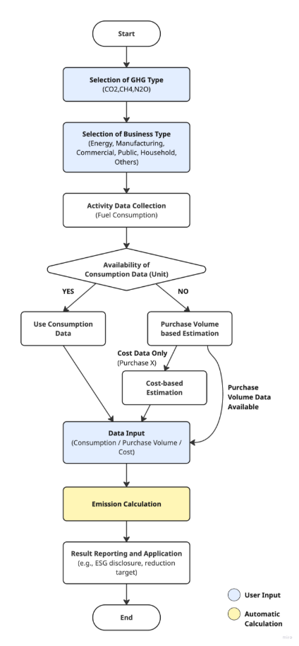

## **Fixed Combustion (Gaseous Fuel) Methodology in Korea**

Policy by WinCL (Verified by the Korean Foundation for Quality, a third-party emission verifier)

**Policy Summary**

This methodology provides guidance on how companies can measure and report greenhouse gas emissions in the fixed combustion (gaseous fuel) category. It explains how to record and collect fuel consumption data.

The methodology applies when a company operates facilities that consume gaseous fuels, resulting in direct greenhouse gas emissions. It is designed to calculate direct emissions from the use of gaseous fuels.

**This methodology is applicable for**

- Scope 1 (Direct emissions): Gaseous fuel consumption
- The emissions may be included under a supplier’s Scope 3, Category 1 or 2. However, when calculating Scope 3 emissions, a separate Scope 3 methodology should be used.

**User Input**

- Gaseous fuel consumption by type:
  - Natural Gas (LNG)
  - City Gas (LNG)
  - City Gas (LPG)
- If usage data is difficult to obtain, annual purchase quantity data may be used as a reference.
- For city gas (LNG), usage information can be obtained from suppliers such as Cowon Energy Service, Yesco, Seoul City Gas, Kiturami Energy, Daeryun E&S, Samchully, etc.

**Applied NCVs and Emission Factors**

- National default calorific values and emission factors must be used to calculate emissions

|     Fuel Type     | NCV (TJ/kg) | 
CO2

(kgCO2/TJ)
 | 
CH4

(kgCH4/TJ)
 | 
N2O

(kgN2O/TJ)
 |     |       |                  |       |
| :---------------: | :------------: | :-----------------------------------------------: | :-----------------------------------------------: | :-----------------------------------------------: | :-- | :---- | :--------------- | :---- |
|                   |                |                                                   |                      Energy                       |                        M&C                        | Com | Other | Energy, M&C, Com | Other |
| Natural Gas (LNG) |   0\.0000494   |                      56,100                       |                         1                         |                         1                         | 5   | 5     | 0\.1             | 0\.1  |
|  City Gas (LNG)   |   0\.0000389   |                      56,100                       |                         1                         |                         1                         | 5   | 5     | 0\.1             | 0\.1  |
|  City Gas (LPG)   |   0\.0000584   |                      64,000                       |                         1                         |                         1                         | 5   | 5     | 0\.1             | 0\.1  |

**Emission Calculation**

| 
<b><i>Ei,j = Qi × ECi × EFi,j × ƒi × 10-6</i></b>

<i>Ei,j</i>: Greenhouse gas (GHG) emissions (tGHG) from the combustion of fuel (i)

<i>Qi</i>: Fuel (i) consumption (measured value, thousand m3-fuel)

_Eci_: Calorific value of fuel (i) (net calorific value, MJ/m³-fuel)

_EFij_: Greenhouse gas (j) emission factor for fuel (i) (kgGHG/TJ-fuel)

_fi_: Oxidation factor of fuel (i) (CH₄, N₂O not applicable)
 |
| :--------------------------------------------------------------------------------------------------------------------------------------------------------------------------------------------------------------------------------------------------------------------------------------------------------------------------------------------------------------------------------------------------------------------------------------------------------------------------------------------------------------------------------------------------------------- |

## Use case: Calculation of Fixed Combustion from Gaseous Fuel for General Companies

Scenario

Company E uses city gas (LNG) and LPG for heating in its manufacturing plants and office buildings. To comply with environmental regulations and ESG disclosure requirements, the company must calculate Scope 1 direct emissions annually.

**1) Data Collection**

Priority 1 — Direct activity data

- Record monthly fuel consumption (1,000 m³) per site, categorized by fuel type (natural gas LNG, city gas LNG, and city gas LPG)

Priority 2 — Cost-based estimation:

- If usage data is unavailable, use annual purchase quantities as a proxy for consumption.
- For city gas (LNG), consumption data can be retrieved directly from suppliers (e.g., Cowon Energy Service, Yesco, Seoul City Gas).

**2) NCV and Emission Factor Application**

- Apply national default NCV(ECi) and emission factor(EFi,j)
- Distinguish by fuel type and GHG type (CO₂, CH₄, N₂O)
- Apply oxidation factor (f) where applicable (not applied for CH₄ and N₂O)

**3) Emission Calculation Procedure**

1. Enter gaseous fuel consumption or purchase quantity/payment data
1. Apply formula: Ei,j = Qi × ECi × EFi,j × ƒi × 10⁻⁶
   1. Qi: Fuel consumption (1,000 m³)
   1. ECi: NCV (TJ/m³)
   1. EFi,j: Emission Factor (kgGHG/TJ)
   1. ƒi: Oxidation Factor

Calculation Example:

- Consumed 2,500 thousand m³ of city gas (LNG)
- ECi = 0.0000389 TJ/kg
- CO₂ Emission Factor = 56,100 kgCO₂/TJ
- ƒi = 1
- Emissions (ECO₂) = 2,500,000 kg × 0.0000389 × 56,100 × 1 × 10⁻⁶ ≈ 5,457.7 tCO₂

**4) Result Application**

- Sustainability reporting / ESG disclosure: Reflect in Scope 1 emissions.
- Compare emissions by site and establish efficiency improvement strategies.
- Set fuel reduction targets and develop transit transition strategies to low-carbon fuels.

