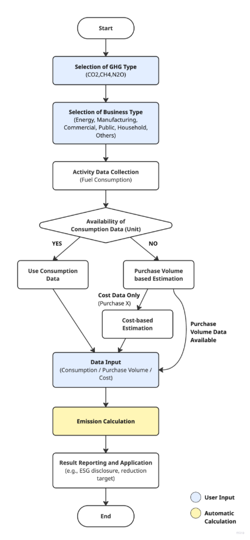

## **Fixed Combustion (Liquid Fuel) Methodology in Korea**

Policy by WinCL (Verified by the Korean Foundation for Quality, a third-party emission verifier)

**Policy Summary**

This methodology provides guidance on how companies can measure and report greenhouse gas emissions in the fixed combustion (liquid fuel) category. It explains how to record and collect fuel consumption data.

The methodology applies when a company operates facilities that consume liquid fuels, resulting in direct greenhouse gas emissions. It is designed to calculate direct emissions from the use of liquid fuels.

**This methodology is applicable for**

- Scope 1 (Direct emissions): Liquid fuel consumption
- The emissions may be included under a supplier’s Scope 3, Category 1 or 2. However, when calculating Scope 3 emissions, a separate Scope 3 methodology should be used.

**User Input**

- Liquid fuel consumption by type

  - Gasoline

  - Diesel
  - Kerosene
  - B-A oil
  - B-B oil
  - B-C oil
  - Naphtha
  - Solvent
  - Jet Fuel
  - Asphalt
  - Lubricants
  - Petroleum coke
  - By-product fuel oil No.1
  - By-product fuel oil No.2

- If consumption data is difficult to obtain, purchase data may be used.
- If both consumption and purchase data are unavailable, for gasoline, diesel, and kerosene, purchase costs can be converted into consumption using average unit prices.

---

### [Cost-Consumption Conversion]

Q=Total Purchase Cost / Average Unit Price

---

 

**Applied NCVs and Emission Factors**

- National default calorific values and emission factors must be used to calculate emissions.

|       **Fuel Type**       | **Unit** | **GCV (kcal)** | **NCV (MJ)** | **Emission Factor (tC/TJ)** |
| :-----------------------: | :------: | :------------: | :----------: | :-------------------------: |
|         Gasoline          |    𝒍     |     7,750      |    30\.1     |           19\.731           |
|          Diesel           |    𝒍     |     9,020      |    35\.3     |           20\.090           |
|           B-A유           |    𝒍     |     9,310      |    36\.5     |           20\.440           |
|           B-B유           |    𝒍     |     9,690      |    38\.1     |           20\.900           |
|           B-C유           |    𝒍     |     9,980      |    39\.3     |           21\.249           |
|          Naphtha          |    𝒍     |     7,700      |    29\.9     |           19\.083           |
|          Solvent          |    𝒍     |     7,830      |    30\.4     |           19\.128           |
|         Jet Fuel          |    𝒍     |     8,720      |    34\.0     |           19\.956           |
|          Asphalt          |    kg    |     9,880      |    39\.0     |           21\.473           |
|        Lubricants         |    𝒍     |     9,450      |    37\.0     |           19\.897           |
|      Petroleum coke       |    kg    |     8,330      |    34\.2     |           26\.192           |
| By-product fuel oil No. 1 |    𝒍     |     8,900      |    34\.8     |           20\.165           |
| By-product fuel oil No. 2 |    𝒍     |     9,530      |    37\.7     |           21\.877           |
|     Kerosene (Indoor)     |    𝒍     |     8,740      |    34\.1     |           19\.926           |
|     Kerosene (Boiler)     |    𝒍     |     8,740      |    34\.1     |           19\.926           |

---

### **Emission Calculation**

 
<b><i>Ei,j = Qi × ECi × EFi,j × ƒi × 10-6</i></b>

Ei,j : Greenhouse gas (GHG) emissions (tGHG) from the combustion of fuel (i)

Qi : Fuel (i) consumption (measured value, KL-fuel)

ECi : Calorific value of fuel (i) (fuel net calorific value, MJ/L-fuel)

EFi,j : Greenhouse gas (j) emission factor for fuel (i) (kgGHG/TJ-fuel)

ƒi : Oxidation factor of fuel (i) (CH₄, N₂O not applicable)

---

## Use case: Calculation of Fixed Combustion from Liquid Fuel for General Companies

Scenario

Company F uses diesel, heavy oil, and kerosene to operate production facilities and logistics vehicles. To comply with environmental regulations and practice ESG management, the company must calculate Scope 1 direct emissions annually.

**1) Data Collection**

Priority 1 — Direct activity data

- Obtain monthly fuel consumption (KL or kg) per site via meters, categorized by type (gasoline, diesel, kerosene, heavy oil, naphtha, etc.).

Priority 2 — Purchase-based Estimation

- If consumption data is unavailable, use annual purchase quantities as a proxy.

Priority 3 — Cost-based Estimation

- If neither consumption nor purchase data are available for gasoline, diesel, and kerosene, estimate consumption using purchase costs and average unit price.
- Q = Total Purchase Cost / Average Unit Price

**2) NCV and Emission Factor Application**

- Apply national default NCV(ECi) and emission factor(EFi,j)
- Distinguish by fuel type and GHG type (CO₂, CH₄, N₂O)
- Apply oxidation factor (f) where applicable (not applied for CH₄ and N₂O)

**3) Emission Calculation Procedure**

1. Enter monthly or annual liquid fuel consumption or cost
1. Apply calculation formula: Ei,j = Qi × ECi × EFi,j × ƒi × 10-6
   1. Qi: Fuel consumption (KL or kg)
   1. ECi: NCV (MJ/L 또는 MJ/kg)
   1. EFi,j: Emission Factor (kgGHG/TJ)
   1. ƒi: Oxidation Factor

Calculation Example:

- Consumed 5,000KL of Diesel
- ECi = 35.3 MJ/L
- CO₂ Emission Factor = 20.090 tC/TJ → Apply after conversion
- ƒi = 1
- Emissions (ECO₂) = 5,000 × 35.3 × (20.090 × 44/12) × 10⁻⁶ ≈ 12,920 tCO₂

**4) Result Application**

- Sustainability reporting / ESG disclosure: Reflect in Scope 1 emissions.
- Compare emissions by site and establish efficiency improvement strategies.
- Use as baseline data for scenario analysis of low-carbon transition.

