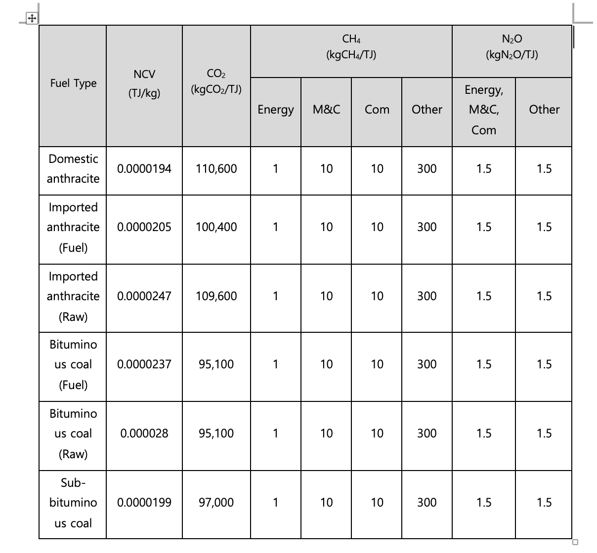
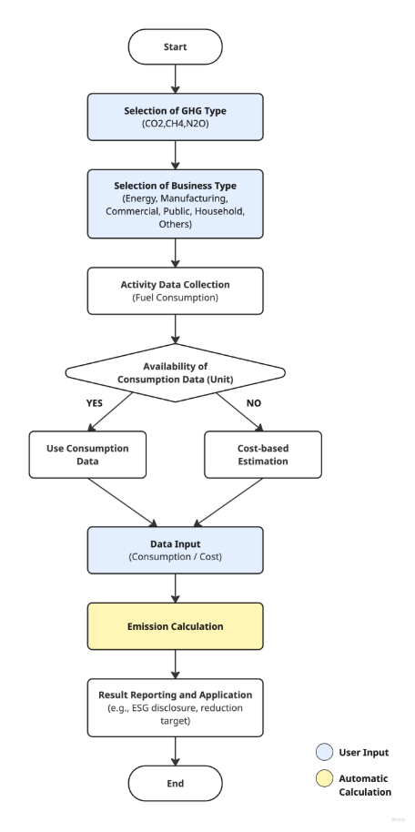

## **Fixed Combustion (Solid Fuel) Methodology in Korea**

Policy by WinCL (Verified by the Korean Foundation for Quality, a third-party emission verifier)

**Policy Summary**

This methodology provides guidance on how companies can measure and report greenhouse gas emissions in the fixed combustion (solid fuel) category. It explains how to record and collect fuel consumption data.

The methodology applies when a company operates facilities that consume solid fuels, resulting in direct greenhouse gas emissions. It is designed to calculate direct emissions from the use of solid fuels.

**This methodology is applicable for**

- Scope 1 (Direct emissions): Solid fuel consumption
- The emissions may be included under a supplier’s Scope 3, Category 1 or 2. However, when calculating Scope 3 emissions, a separate Scope 3 methodology should be used.

**User Input**

- Solid fuel consumption by type:
- Domestic anthracite
- Imported anthracite (fuel/raw material use)
- Bituminous coal (fuel/raw material use)
- Sub-bituminous coal
- If usage data is difficult to obtain, annual purchase quantity data may be used as a reference.

**Applied NCVs and Emission Factors**

- National default calorific values and emission factors must be used to calculate emissions.

**Emission Calculation**

| 
<b><i>Ei,j = Qi × ECi × EFi,j × ƒi × 10-6</i></b>

Ei,j: Greenhouse gas (GHG) emissions (tGHG) from the combustion of fuel (i)

Qi : Fuel (i) consumption (measured value, ton-fuel)

ECi: Calorific value of fuel (i) (fuel net heat value, MJ/kg-fuel)

EFi,j: Greenhouse gas (j) emission factor for fuel (i) (kgGHG/TJ-fuel)

ƒi: Oxidation factor of fuel (i) (CH4, N2O not applicable)
 |
| :---------------------------------------------------------------------------------------------------------------------------------------------------------------------------------------------------------------------------------------------------------------------------------------------------------------------------------------------------------------------------------------------------------------------------------------------------------------------------------------------------- |

## Use case: Calculation of Fixed Combustion from Solid Fuel for General Companies

Scenario

Company D uses domestic anthracite and bituminous coal in its manufacturing processes and heating boilers. To comply with environmental regulations and ESG management, the company must calculate Scope 1 direct emissions annually.

**1) Data Collection**

Priority 1 — Direct activity data

- Record monthly or annual fuel consumption (ton) by fuel type: Domestic anthracite, imported anthracite. bituminous coal, sub-bituminous coal

Priority 2 — Cost-based estimation:

- If measurement data is unavailable, use annual purchase quantities as a proxy for consumption.

**2) NCV and Emission Factor Application**

- Apply national default NCV(ECi) and emission factor(EFi,j)
- Distinguish by fuel type and GHG type (CO₂, CH₄, N₂O)
- Apply oxidation factor (f) where applicable (not applied for CH₄ and N₂O)

**3) Emission Calculation Procedure**

1. Enter monthly or annual solid fuel consumption
1. Apply calculation formula: GHG Emissions = Q × EFj
   1. Qi: Fuel consumption (ton)
   1. ECi: NCV(TJ/kg)
   1. EFi,j: Emission Factor(kgGHG/TJ)
   1. ƒi: Oxidation Factor

Calculation Example:

- Consumed 1,000 tons of domestic anthracite
- ECi = 0.0000194 TJ/kg
- CO₂ Emission Factor = 110,600 kgCO₂/TJ
- ƒi = 1
- Emissions (ECO₂) = 1,000,000 kg × 0.0000194 × 110,600 × 1 × 10⁻⁶ = 2,144.0 tCO₂

**4) Result Application**

- Sustainability reporting / ESG disclosure: Reflect in Scope 1 emissions.
- Compare emissions by site and establish efficiency improvement strategies.
- Use as baseline data for scenario analysis of low-carbon transition.

