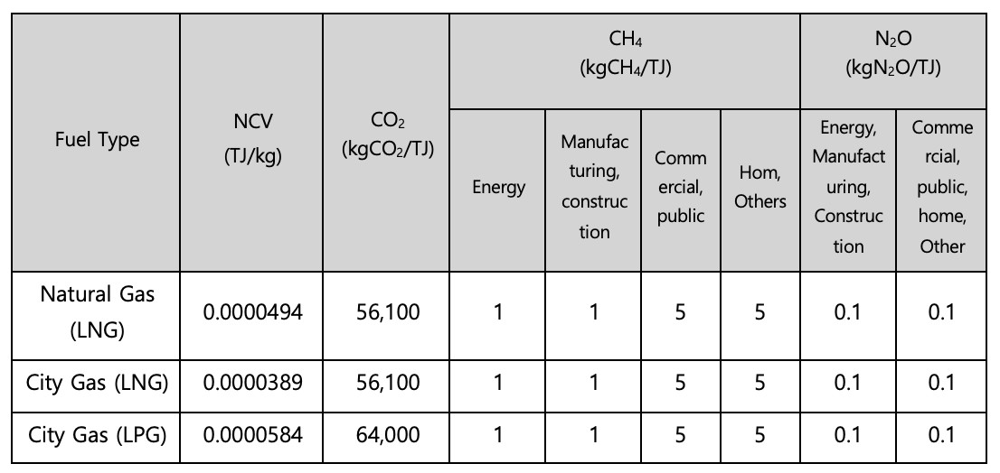
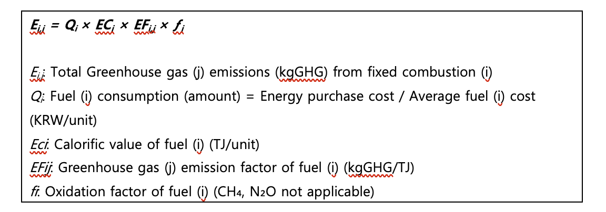
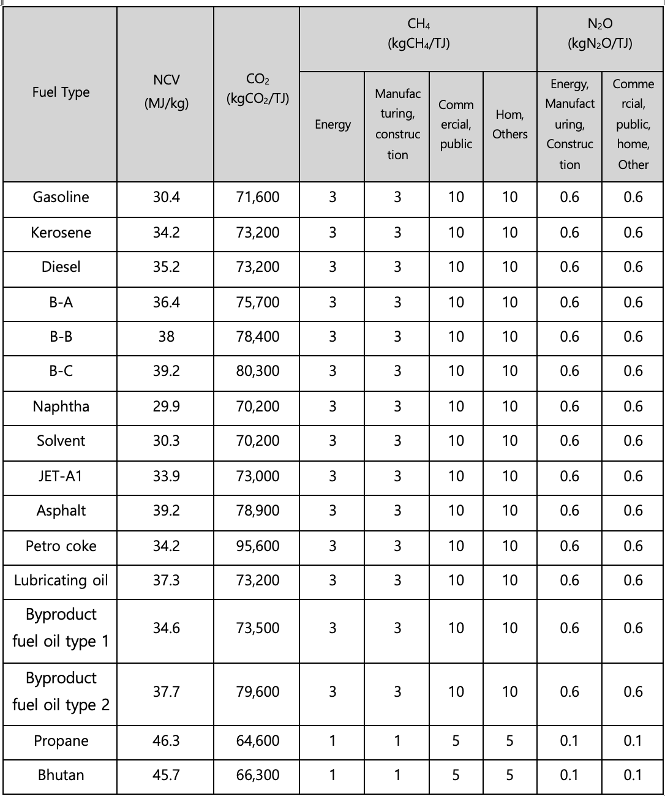
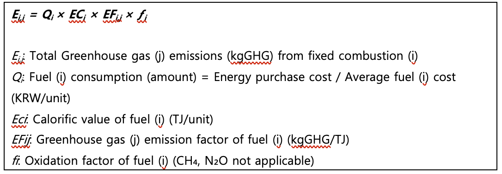
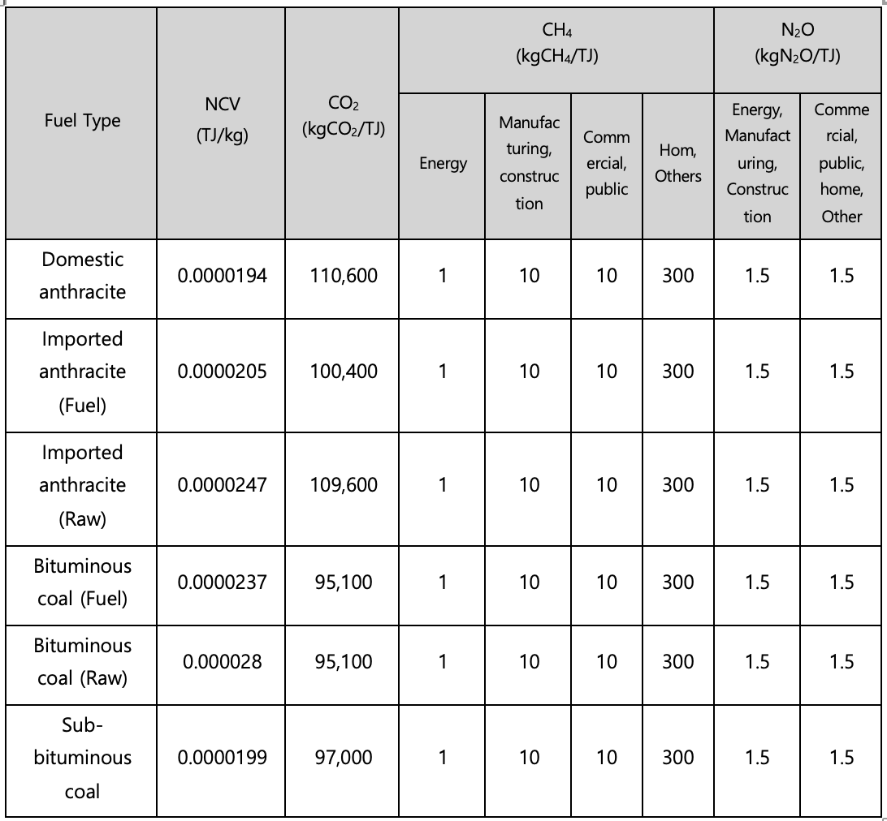
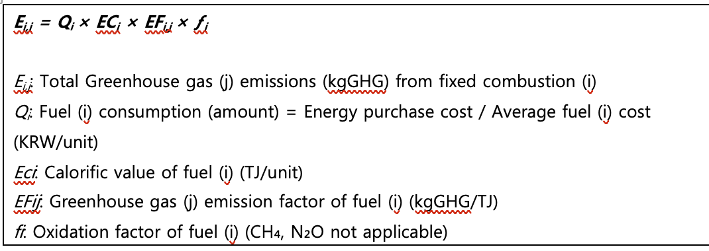

# **Fixed Combustion**

**Policy Summary**

Fixed combustion refers to the industrial burning of fuels in stationary
equipment or facilities to generate heat, steam, or mechanical energy.
This methodology provides guidance on how companies can measure and
report greenhouse gas emissions in the fixed combustion category. It
covers three major fuel types used in fixed combustion: gaseous fuels,
liquid fuels, and solid fuels.

**This methodology is applicable for**

- Scope 1 (Direct emissions): Fixed Combustion

<!-- -->

- The methodology applies when a company operates stationary equipment
  or facilities that consume fuels (gaseous, liquid, or solid),
  resulting in direct emissions.

- The resulting emissions may also be included under a supplier's Scope
  3, Category 1 or 2, depending on the reporting boundary. However, when
  calculating Scope 3 emissions, a separate Scope 3 methodology should
  be applied.

## **Gaseous Fuel**

**User Inputs**

- Business type

\- Energy / Manufacturing / Construction / Commercial / Public / Home

- Calculation method

\- Cost-based / Usage-based

- Applicable reporting year

- Fuel type

\- LNG / City LNG / LPG

- Fuel consumption (amount)

\- If usage data is difficult to obtain, annual purchase quantity data
may be used as a reference.

- Energy purchase cost (KRW)

**Applied NCVs and Emission Factors**

- National default calorific values and emission factors must be used to
  calculate emissions

- National default oxidation factor for gaseous fuels: If not otherwise
  specified, 0.995.

Source: Greenhouse Gas Inventory and Research Center of Korea

### **Emission Calculation**

**Use case: Calculation of Fixed Combustion from Gaseous Fuel for
General Companies**

Scenario

Company E uses city gas (LNG) and LPG for heating in its manufacturing
plants and office buildings. To comply with environmental regulations
and ESG disclosure requirements, the company must calculate Scope 1
direct emissions annually.

1\) Data Collection

Priority 1 --- Direct activity data

- Record monthly fuel consumption (1,000 m³) per site, categorized by
  > fuel type (natural gas LNG, city gas LNG, and city gas LPG)

Priority 2 --- Cost-based estimation:

- If usage data is unavailable, use annual purchase quantities as a
  proxy for consumption.

- For city gas (LNG), consumption data can be retrieved directly from
  suppliers (e.g., Cowon Energy Service, Yesco, Seoul City Gas).

2\) NCV and Emission Factor Application

- Apply national default NCV(ECi) and emission factor(EFi,j)

- Distinguish by fuel type and GHG type (CO₂, CH₄, N₂O)

- Apply oxidation factor (f) where applicable (not applied for CH₄ and
  N₂O)

3\) Emission Calculation Procedure

1.  Enter gaseous fuel consumption or purchase quantity/payment data

2.  Apply formula: Ei,j = Qi × ECi × EFi,j × ƒi

    - Qi: Fuel consumption (1,000 m³)

    - ECi: Calorific value (TJ/m³)

    - EFi,j: Emission Factor (kgGHG/TJ)

    - ƒi: Oxidation Factor

Calculation Example:

- Consumed 2,500,000 nm^3^ of city gas (LNG)

- ECi = 0.0000389 TJ/kg

- CO₂ Emission Factor = 56,100 kgCO₂/TJ

- ƒi = 0.995

- Emissions (ECO₂) = 2,500,000 kg × 0.0000389 × 56,100 × 0.995 ≈
  5,428,446.38 kgCO₂ ≈ 5,428.45 tCO₂

4\) Result Application

- Sustainability reporting / ESG disclosure: Reflect in Scope 1
  emissions.

- Compare emissions by site and establish efficiency improvement
  strategies.

- Set fuel reduction targets and develop transit transition strategies
  to low-carbon fuels.

## **Liquid Fuel**

**User Inputs**

- Business type

\- Energy / Manufacturing / Construction / Commercial / Public / Home

- Calculation method

\- Cost-based / Usage-based

- Applicable reporting year

- Fuel type

\- Gasoline / Diesel / Kerosene / B-A / B-B / B-C / Naphtha / Solvent /
JET-A1 / Asphalt / Petro coke / Lubricating oil / Byproduct fuel oil
type 1 / Byproduct fuel oil type 2 / Propane / Bhutan

- Fuel consumption (amount)

\- If usage data is difficult to obtain, annual purchase quantity data
may be used as a reference.

- Energy purchase cost (KRW)

**Applied NCVs and Emission Factors**

- National default calorific values and emission factors must be used to
  calculate emissions

- National default oxidation factor for gaseous fuels: If not otherwise
  specified, 0.99.

Source: Greenhouse Gas Inventory and Research Center of Korea

### **Emission Calculation**

**Use case: Calculation of Fixed Combustion from Liquid Fuel for General
Companies**

Scenario

Company F uses diesel, heavy oil, and kerosene to operate production
facilities. To comply with environmental regulations and practice ESG
management, the company must calculate Scope 1 direct emissions
annually.

1\) Data Collection

Priority 1 --- Direct activity data

- Obtain monthly fuel consumption (KL or kg) per site via meters,
  categorized by type (gasoline, diesel, kerosene, heavy oil, naphtha,
  etc.).

Priority 2 --- Purchase-based Estimation

- If consumption data is unavailable, use annual purchase quantities as
  a proxy.

Priority 3 --- Cost-based Estimation

- If neither consumption nor purchase data are available for gasoline,
  diesel, and kerosene, estimate consumption using purchase costs and
  average unit price.

- Q = Total Purchase Cost / Average Unit Price

2\) NCV and Emission Factor Application

- Apply national default NCV(ECi) and emission factor(EFi,j)

- Distinguish by fuel type and GHG type (CO₂, CH₄, N₂O)

- Apply oxidation factor (f) where applicable (not applied for CH₄ and
  N₂O)

3\) Emission Calculation Procedure

3.  Enter fuel consumption or cost data.

4.  Apply calculation formula: Ei,j = Qi × ECi × EFi,j × ƒi

    - Qi: Fuel consumption (unit)

    - ECi: NCV (TJ/unit)

    - EFi,j: Emission Factor (kgGHG/TJ)

    - ƒi: Oxidation Factor

Calculation Example:

- Consumed 5,000 kL of Gasoline

- ECi = 0.0000304 TJ/L

- CO₂ Emission Factor = 71,600 kg/TJ → Apply after conversion

- ƒi = 0.99

- Emissions (CO₂) = 5,000,000 × 0.0000304 × 71,600 × 0.99 = 10,774,368
  kgCO₂ ≈ 10,774.37 tCO₂

4\) Result Application

- Sustainability reporting / ESG disclosure: Reflect in Scope 1
  emissions.

- Compare emissions by site and establish efficiency improvement
  strategies.

- Use as baseline data for scenario analysis of low-carbon transition.

{width="4.222808398950131in"
height="9.097171916010499in"}

## **Solid Fuel**

**User Inputs**

- Business type

\- Energy / Manufacturing / Construction / Commercial / Public / Home

- Calculation method

\- Cost-based / Usage-based

- Applicable reporting year

- Fuel type

\- Domestic anthracite / Imported anthracite (fuel/raw material use) /
Bituminous coal (fuel/raw material use) / Sub-bituminous coal

- Fuel consumption (amount)

\- If usage data is difficult to obtain, annual purchase quantity data
may be used as a reference.

- Energy purchase cost (KRW)

**Applied NCVs and Emission Factors**

- National default calorific values and emission factors must be used to
  calculate emissions

- National default oxidation factor for gaseous fuels: If not otherwise
  specified, 0.98.

Source: Greenhouse Gas Inventory and Research Center of Koreass

### **Emission Calculation**

**Use case: Calculation of Fixed Combustion from Solid Fuel for General
Companies**

Scenario

Company D uses domestic anthracite and bituminous coal in its
manufacturing processes and heating boilers. To comply with
environmental regulations and ESG management, the company must calculate
Scope 1 direct emissions annually.

1\) Data Collection

Priority 1 --- Direct activity data

- Record monthly or annual fuel consumption (ton) by fuel type: Domestic
  anthracite, imported anthracite. bituminous coal, sub-bituminous coal

Priority 2 --- Cost-based estimation:

- If measurement data is unavailable, use annual purchase quantities as
  a proxy for consumption.

2\) NCV and Emission Factor Application

- Apply national default NCV(ECi) and emission factor(EFi,j)

- Distinguish by fuel type and GHG type (CO₂, CH₄, N₂O)

- Apply oxidation factor (f) where applicable (not applied for CH₄ and
  N₂O)

3\) Emission Calculation Procedure

5.  Enter monthly or annual solid fuel consumption

6.  Apply calculation formula: GHG Emissions = Q × EFj

    - Qi: Fuel consumption (kg)

    - ECi: NCV(TJ/kg)

    - EFi,j: Emission Factor(kgGHG/TJ)

    - ƒi: Oxidation Factor

Calculation Example:

- Consumed 1,000 tons of domestic anthracite

- ECi = 0.0000194 TJ/kg

- CO₂ Emission Factor = 110,600 kgCO₂/TJ

- ƒi = 0.98

<!-- -->

- Emissions (ECO₂) = 1,000,000 kg × 0.0000194 × 110,600 × 0.98 =
  2,102,727.20 kgCO₂ ≈ 2,102.73 tCO₂

4\) Result Application

- Sustainability reporting / ESG disclosure: Reflect in Scope 1
  emissions.

- Compare emissions by site and establish efficiency improvement
  strategies.

- Use as baseline data for scenario analysis of low-carbon transition.
