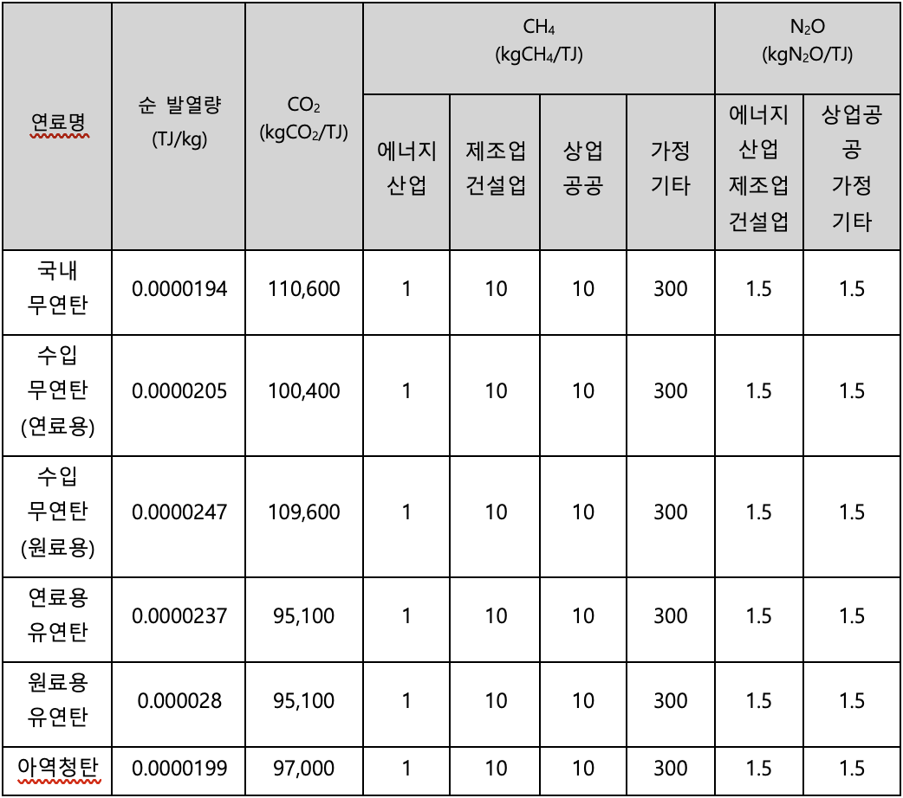
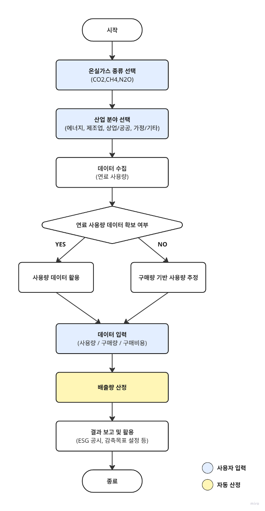

## **고정연소(고체연료) – Fixed Combustion(Solid Fuel)**

WinCL의 정책 (제3자 배출 검증 기관인 한국품질재단(KFQ)에서 검증 완료)

**요약**

기업이 고정연소(고체연료) 부문에서 발생한 온실가스 배출량을 측정 및 보고할 수 있도록, 연료 사용량 데이터를 기록 및 수집하는 방법을 제공합니다.
본 방법론은 기업이 보유한 설비에서 고체연료를 사용하며 이로 인한 온실가스 배출이 발생하는 경우, 해당 연료 사용으로 인한 직접배출량을 산정하기 위한 것입니다.

**적용 범위 (Scope)**

-  Scope 1 (직접배출) : 고체연료 사용
- 해당 배출량은 업체에서 제품 및 서비스 등을 공급받는 기업의 Scope 3 카테고리 1,2에 포함될 수 있으나, Scope 3 배출량 산정을 위해서는 별도의 Scope 3 산정 방법론을 이용해야 합니다.

**사용자 입력 데이터**

- 고체연료 사용량 :
- 국내 무연탄
- 수입 무연탄 (연료용/원료용)
- 유연탄 (연료용/원료용)
- 아역청탄
- 사용량 데이터를 확보하기 어려운 경우에는, 연간 구매수량 데이터를 참고할 수 있습니다.

**적용 열량계수 및 배출계수**

- 국가 고유 발열량 값과 배출계수를 사용해서 배출량을 산정합니다.

**배출량 산정식**

| 
<b><i>Ei,j = Qi × ECi × EFi,j × ƒi × 10-6</i></b>

Ei,j: Greenhouse gas (GHG) emissions (tGHG) from the combustion of fuel (i)

Qi : Fuel (i) consumption (measured value, ton-fuel)

ECi: Calorific value of fuel (i) (fuel net heat value, MJ/kg-fuel)

EFi,j: Greenhouse gas (j) emission factor for fuel (i) (kgGHG/TJ-fuel)

ƒi: Oxidation factor of fuel (i) (CH4, N2O not applicable)
 |
| :---------------------------------------------------------------------------------------------------------------------------------------------------------------------------------------------------------------------------------------------------------------------------------------------------------------------------------------------------------------------------------------------------------------------------------------------------------------------------------------------------- |

## Use case: 일반 기업의 고체연료 고정연소 배출 산정

시나리오 개요

D기업은 제조 공정과 난방용 보일러에서 국내 무연탄과 유연탄을 사용한다. 환경 규제 대응 및 ESG 경영을 위해 매년 Scope 1 직접배출량을 산정해야 한다.

**1) 데이터 수집**

우선순위 1 — 직접 사용량 측정

- 각 사업장별 월별 연료 사용량(톤) 기록
- 연료 종류별로 구분: 국내 무연탄, 수입 무연탄, 유연탄, 아역청탄

우선순위 2 — 구매수량 기반 추정:

- 계측 데이터 미확보 시, 연간 구매수량을 사용량으로 대체

**2) 열량계수·배출계수 적용**

- 국가 고유 발열량 값(ECi)과 배출계수(EFi,j) 적용
- 연료 종류별·온실가스 종류별로 구분 (CO₂, CH₄, N₂O)
- 연료별 산화계수(f) 적용 (CH₄, N₂O는 미적용)

**3) 배출량 산정 절차**

1. 월별 또는 연간 연료 사용량 입력
1. 공식 적용: GHG Emissions = Q × EFj
   1. Qi: 연료 사용량(톤)
   1. ECi: 순 발열량(TJ/kg)
   1. EFi,j: 배출계수(kgGHG/TJ)
   1. ƒi: 산화계수

산정 예시:

- 국내 무연탄 1,000톤 사용
- ECi = 0.0000194 TJ/kg
- CO₂ 배출계수 = 110,600 kgCO₂/TJ
- ƒi = 1
- 배출량(ECO₂): 1,000,000 kg × 0.0000194 × 110,600 × 1 × 10⁻⁶ = 2,144.0 tCO₂

**4) Result Application**

- ESG 보고서 Scope 1에 반영.
- 사업장별 배출량 비교 및 효율화 대책 수립.
- 연료 대체(저탄소 연료 전환) 시나리오 분석 기초 데이터로 활용.

