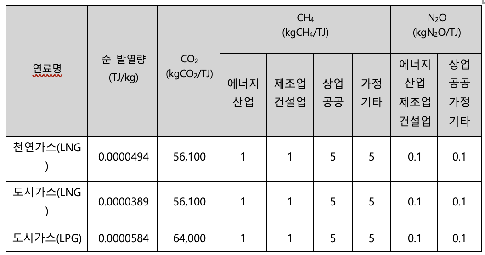

## **고정연소(기체연료) – Fixed Combustion(Gaseous Fuel)**

WinCL의 정책 (제3자 배출 검증 기관인 한국품질재단(KFQ)에서 검증 완료)

**요약**

기업이 고정연소(기체연료) 부문에서 발생한 온실가스 배출량을 측정 및 보고할 수 있도록, 연료 사용량 데이터를 기록 및 수집하는 방법을 제공합니다.
본 방법론은 기업이 보유한 설비에서 기체연료를 사용하며 이로 인한 온실가스 배출이 발생하는 경우, 해당 연료 사용으로 인한 직접배출량을 산정하기 위한 것입니다.

**적용 범위 (Scope)**

-  Scope 1 (직접배출) : 기체연료 사용
- 해당 배출량은 업체에서 제품 및 서비스 등을 공급받는 기업의 Scope 3 카테고리 1,2에 포함될 수 있으나, Scope 3 배출량 산정을 위해서는 별도의 Scope 3 산정 방법론을 이용해야 합니다.

**사용자 입력 데이터**

- 기체연료 사용량:
  - 천연가스(LNG)
  - 도시가스(LNG)
  - 도시가스(LPG)
- 사용량 데이터를 확보하기 어려운 경우에는, 연간 구매수량 데이터를 참고할 수 있습니다.
- 도시가스(LNG)의 경우, 도시가스 공급자(코원에너지서비스, 예스코, 서울도시가스, 귀뚜라미에너지, 대륜E&S, 삼천리 등)으로부터 사용량 정보 조회가 가능합니다.

**적용 열량계수 및 배출계수**

- 국가 고유 발열량 값과 배출계수를 사용해서 배출량을 산정합니다.

**배출량 산정식**

| 
<b><i>Ei,j = Qi × ECi × EFi,j × ƒi × 10-6</i></b>

<i>Ei,j</i>: Greenhouse gas (GHG) emissions (tGHG) from the combustion of fuel (i)

<i>Qi</i>: Fuel (i) consumption (measured value, thousand m3-fuel)

_Eci_: Calorific value of fuel (i) (net calorific value, MJ/m³-fuel)

_EFij_: Greenhouse gas (j) emission factor for fuel (i) (kgGHG/TJ-fuel)

_fi_: Oxidation factor of fuel (i) (CH₄, N₂O not applicable)
 |
| :--------------------------------------------------------------------------------------------------------------------------------------------------------------------------------------------------------------------------------------------------------------------------------------------------------------------------------------------------------------------------------------------------------------------------------------------------------------------------------------------------------------------------------------------------------------- |

## Use Case: 일반 기업의 기체연료 고정연소 배출 산정

시나리오 개요

E기업은 제조 공장과 사무동 난방을 위해 도시가스(LNG)와 LPG를 사용한다.
환경 규제 대응과 ESG 공시 목적으로 매년 Scope 1 직접배출량을 산정해야 한다.

**1) 데이터 수집**

우선순위 1 — 직접 사용량 측정:

- 계량기를 통한 사업장별 월별 연료 사용량(천m³) 기록
- 연료 종류별 구분: 천연가스(LNG), 도시가스(LNG), 도시가스(LPG)

우선순위 2 — 구매수량 기반 추정:

- 사용량 데이터 미확보 시, 연간 구매수량을 사용량으로 간주
- 도시가스(LNG)의 경우 공급사(코원에너지서비스, 예스코, 서울도시가스 등)에서 조회 가능

**2) 열량계수·배출계수 적용**

- 국가 고유 발열량 값(ECi)과 배출계수(EFi,j) 적용
- 연료별·온실가스별(CO₂, CH₄, N₂O) 계수 적용
- 연료별 산화계수(f) 적용 (CH₄, N₂O는 미적용)

**3) 배출량 산정 절차**

1. 기체연료 사용량 또는 구매량/구매비용 입력
1. 공식 적용: Ei,j = Qi × ECi × EFi,j × ƒi × 10⁻⁶
   1. Qi: 연료 사용량(천m³)
   1. ECi: 순 발열량(TJ/m³)
   1. EFi,j: 배출계수(kgGHG/TJ)
   1. ƒi: 산화계수

산정 예시:

- 도시가스(LNG) 2,500천m³ 사용
- ECi = 0.0000389 TJ/kg
- CO₂ 배출계수 = 56,100 kgCO₂/TJ
- ƒi = 1
- 배출량(ECO₂): = 2,500,000 kg × 0.0000389 × 56,100 × 1 × 10⁻⁶ ≈ 5,457.7 tCO₂

**4) 보고 및 활용**

- ESG 보고서 Scope 1 항목에 반영
- 사업장별 에너지 효율 분석 및 개선안 도출
- 연료 절감 목표 및 저탄소 연료 전환 전략 수립KRW

