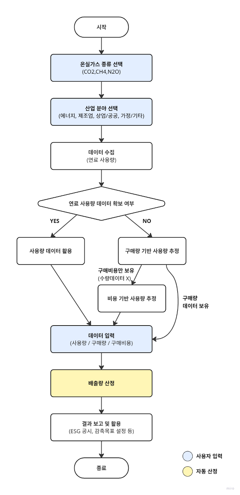

## **고정연소(액체연료) – Fixed Combustion (Liquid Fuel)**

WinCL의 정책 (제3자 배출 검증 기관인 한국품질재단(KFQ)에서 검증 완료)

**요약**

기업이 고정연소(액체연료) 부문에서 발생한 온실가스 배출량을 측정 및 보고할 수 있도록, 연료 사용량 데이터를 기록 및 수집하는 방법을 제공합니다.
본 방법론은 기업이 보유한 설비에서 액체연료를 사용하여 이로 인한 온실가스 배출이 발생하는 경우, 해당 연료 사용으로 인한 직접배출량을 산정하기 위한 것입니다.

**적용 범위 (Scope)**

-  Scope 1 (직접배출) : 액체연료 사용
- 해당 배출량은 업체에서 제품 및 서비스 등을 공급받는 기업의 Scope 3 카테고리 1,2에 포함될 수 있으나, Scope 3 배출량 산정을 위해서는 별도의 Scope 3 산정 방법론을 이용해야 합니다.

**사용자 입력 데이터**

- 액체연료 사용량

  - 휘발유

  - 경유
  - 등유 2호(실내등유)
  - B-A유
  - B-B유
  - B-C유
  - 나프타
  - 용제
  - 항공유
  - 아스팔트
  - 윤활유
  - 석유코크스
  - 부생연료유 1호
  - 부생연료유 2호

- 사용량 데이터를 확보하기 어려운 경우에는, 구매량 데이터를 참고할 수 있습니다.
- 사용량 또는 구매량 데이터를 확보하기 어려운 경우에 한하여, 휘발유, 경유, 등유의 경우 구매비용 데이터를 입력하면 사용량으로 환산할 수 있습니다.

---

### [비용-사용량 환산식]

Q=총 구매비용 / 평균 단가

---

 

**적용 열량계수 및 배출계수**

- 국가 고유 발열량 값과 배출계수를 사용해서 배출량을 산정합니다.

|       **연료**       | **단위** | **총발열량(kcal)** | **순발열량 (MJ)** | **국가탄소배출계수 (tC/TJ)** |
| :------------------: | :------: | :----------------: | :---------------: | :--------------------------: |
|        휘발유        |    𝒍     |       7,750        |       30\.1       |           19\.731            |
|         경유         |    𝒍     |       9,020        |       35\.3       |           20\.090            |
|        B-A유         |    𝒍     |       9,310        |       36\.5       |           20\.440            |
|        B-B유         |    𝒍     |       9,690        |       38\.1       |           20\.900            |
|        B-C유         |    𝒍     |       9,980        |       39\.3       |           21\.249            |
|        나프타        |    𝒍     |       7,700        |       29\.9       |           19\.083            |
|         용제         |    𝒍     |       7,830        |       30\.4       |           19\.128            |
|        항공유        |    𝒍     |       8,720        |       34\.0       |           19\.956            |
|       아스팔트       |    kg    |       9,880        |       39\.0       |           21\.473            |
|        윤활유        |    𝒍     |       9,450        |       37\.0       |           19\.897            |
|      석유코크스      |    kg    |       8,330        |       34\.2       |           26\.192            |
|    부생연료유1호     |    𝒍     |       8,900        |       34\.8       |           20\.165            |
|    부생연료유2호     |    𝒍     |       9,530        |       37\.7       |           21\.877            |
|  등유2호(실내 등유)  |    𝒍     |       8,740        |       34\.1       |           19\.926            |
| 등유2호(보일러 등유) |    𝒍     |       8,740        |       34\.1       |           19\.926            |

---

### **배출량 산정식**

 
<b><i>Ei,j = Qi × ECi × EFi,j × ƒi × 10-6</i></b>

Ei,j : Greenhouse gas (GHG) emissions (tGHG) from the combustion of fuel (i)

Qi : Fuel (i) consumption (measured value, KL-fuel)

ECi : Calorific value of fuel (i) (fuel net calorific value, MJ/L-fuel)

EFi,j : Greenhouse gas (j) emission factor for fuel (i) (kgGHG/TJ-fuel)

ƒi : Oxidation factor of fuel (i) (CH₄, N₂O not applicable)

---

## Use case: 일반 기업의 액체연료 고정연소 배출 산정

시나리오 개요

F기업은 생산설비 가동과 물류차량 운행을 위해 경유, 중유, 등유를 사용한다.
환경 규제 대응 및 ESG 경영 실천을 위해 매년 Scope 1 직접배출량을 산정해야 한다.

**1) 데이터 수집**

우선순위 1 — 직접 사용량 측정

- 계량기를 통해 사업장별 월별 연료 사용량(KL 또는 kg) 확보
- 휘발유, 경유, 등유, 중유, 나프타 등 연료 종류별로 구분

우선순위 2 — 구매수량 기반 추정

- 사용량 계측 불가 시 연간 구매수량을 사용량으로 간주

우선순위 3 — 비용 기반 추정

- 휘발유, 경유, 등유의 경우 구매수량 데이터도 없을 때,
  구매비용과 평균 단가를 활용해 사용량 추정:
- Q = 총 구매비용 / 평균 단가

**2) 열량계수·배출계수 적용**

- 국가 고유 발열량 값(ECi)과 배출계수(EFi,j) 적용
- 연료별·온실가스별(CO₂, CH₄, N₂O) 계수 적용
- 산화계수(f) 적용 (CH₄, N₂O는 미적용)

**3) 배출량 산정**

1. 액체연료 사용량 또는 구매량/구매비용 입력
1. 공식 적용: Ei,j = Qi × ECi × EFi,j × ƒi × 10-6
   1. Qi: 연료 사용량(KL 또는 kg)
   1. ECi: 순 발열량(MJ/L 또는 MJ/kg)
   1. EFi,j: 배출계수(kgGHG/TJ)
   1. ƒi: 산화계수

산정 예시:

- 경유 5,000KL 사용
- ECi = 35.3 MJ/L
- CO₂ 배출계수 = 20.090 tC/TJ → 환산 후 적용
- ƒi = 1
- 배출량(ECO₂) = 5,000 × 35.3 × (20.090 × 44/12) × 10⁻⁶ ≈ 12,920 tCO₂

**4) 보고 및 활용**

- ESG 보고서 Scope 1에 반영
- 사업장별·차량별 연료 소비 효율 관리
- 저탄소 연료 전환 전략 수립 및 비용 절감 방안 마련

