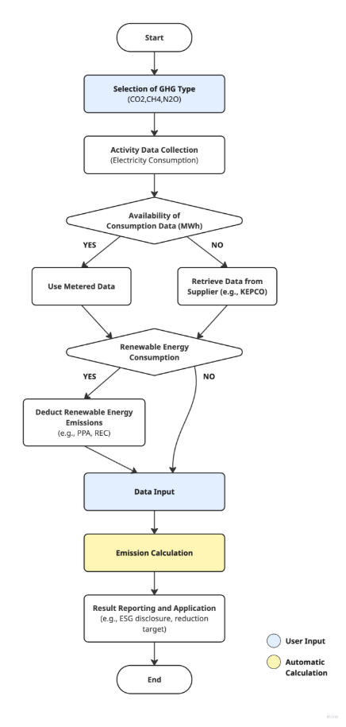

## **Indirect Emission (Electricity) Methodology in Korea**

Policy by WinCL (Verified by the Korean Foundation for Quality, a third-party emission verifier)

**Policy Summary**

This methodology provides guidance on how companies can measure and report greenhouse gas emissions in the Scope 2 indirect emissions category (electricity). It explains how to record and collect electricity usage data.

The methodology applies when a company operates facilities that consume electricity, and the related emissions occur at the electricity supplier. It is designed to calculate the indirect emissions resulting from electricity consumption. Electricity is generally supplied by KEPCO (Korea Electric Power Corporation), though companies may also self-generate renewable energy within their organizational boundary.

Electricity consumption data can be measured using legal metering devices (e.g., electricity meters) or retrieved via KEPCO’s website and mobile app.

**This methodology is applicable for**

- Scope 2 (Indirect emissions): Electricity supplied externally
- The emissions may be included under a supplier’s Scope 3, Category 1 or 2. However, when calculating Scope 3 emissions, a separate Scope 3 methodology should be used.

**User Input**

- Total electricity consumption per site, measured with legal metering devices such as electricity meters.
- If unavailable, electricity consumption data can be obtained from the electricity supplier (e.g., KEPCO) via the following websites:\
  - KEPCO ON <https://online.kepco.co.kr/>\
  - KEPCO Energy Marketplace <https://en-ter.co.kr/main.do>

**Note – Use of Renewable Electricity**

If it is possible to distinguish and provide evidence for electricity generated from renewable energy sources or waste heat facilities, the corresponding greenhouse gas direct emissions may be deducted.

Electricity generated from renewable sources (solar, wind, hydro, ocean, geothermal, and bioenergy only) that is **not subject to Renewable Portfolio Standard obligations** may be excluded from indirect emissions if accompanied by a “Renewable Energy Usage Certificate” obtained through one of the following:

|                      |                                                                                                                                                                     |
| :------------------: | :-----------------------------------------------------------------------------------------------------------------------------------------------------------------: |
|     Indirect PPA     |                                               Contract for power purchase via an electricity sales business operator.                                               |
|      Direct PPA      |                                          Contract for power purchase via a renewable electricity supply business operator.                                          |
|     REC Purchase     | Purchase of Renewable Energy Certificates (REC) under Article 12-7 of the Act on the Promotion of the Development, Use, and Deployment of New and Renewable Energy. |
| Equity Participation |                                             Contract for power purchase and REC acquisition through equity investment.                                              |

---

**Applied Emission Factors**

|                 GHG Type                  | Emission Factor |
| :---------------------------------------: | :-------------: |
| CO2eq. (tCO2eq/MWh) |     0\.4781     |
|   CO2 (tCO2/MWh)    |     0\.4747     |
|   CH4 (kgCH4/MWh)   |     0\.0125     |
|   N2O (kgN2O/MWh)   |     0\.0100     |

---

**Emission Calculation**

 
<b><i>GHG Emissions = Q × EFj</i></b>

GHG Emissions: Greenhouse gas emissions (j) per power consumption (tGHG)

Q= : Power consumption supplied from external sources (MWh)

EFj : Power indirect emission factor (tGHG/MWh)

j : Type of greenhouse gas emitted

## Use case: Calculation of Electricity Emissions for General Companies

**Scenario**

Company C operates a headquarters office building and three manufacturing plants, all of which consume electricity supplied by KEPCO. For ESG disclosure and internal energy efficiency management, the company calculates its Scope 2 indirect emissions annually.

**1) Data Collection**

Priority 1 — Direct Measurement

- Obtain annual electricity consumption (MWh) for each site using legal metering devices.

Priority 2 — Supplier Data

- If meters fail or data is missing, retrieve usage records from KEPCO ON or Energy Marketplace.

**2) Verification of Renewable Electricity Usage**

- Distinguish between electricity generated onsite (solar, wind, etc.) and purchased electricity.
- Deduct renewable electricity (with proof such as REC or PPA contracts) from indirect emissions.

**3) Emission Factor Application**

- Apply national electricity emission factor (e.g., 0.4781 tCO₂eq/MWh)

**4) Emission Calculation Procedure**

1. Calculate monthly or annual electricity consumption (MWh).
1. Apply the formula: GHG Emissions = Q × EFj
   1. Q : Electricity (MWh)
   1. EFj : Emission Factor (tGHG/MWh)

Calculation Example:

- Annual consumption: 15,000MWh
- EF: 0.4781 tCO₂-eq./MWh
- Annual emissions: 15,000 × 0.4781 = 7,171.5 tCO₂eq

**5) Result Application**

- Sustainability reporting / ESG disclosure: Reflect in Scope 2 emissions
- Establish KPIs for energy efficiency improvement
- Track renewable usage ratio and develop expansion strategies

