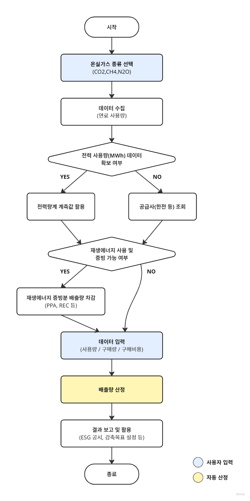

## **간접배출(전력) – Indirect Emission(Electricity)**

WinCL의 정책 (제3자 배출 검증 기관인 한국품질재단(KFQ)에서 검증 완료)

**요약**

기업이 간접배출(전력) 부문에서 발생한 온실가스 배출량을 측정 및 보고할 수 있도록, 전력 사용량 데이터를 기록 및 수집하는 방법을 제공합니다.
본 방법론은 기업이 보유한 설비에서 전력을 사용하며 이로 인한 배출이 전력 공급자로부터 발생하는 경우에, 해당 전력 사용으로 인한 간접배출량을 산정하기 위한 것입니다. 전력은 일반적으로 한국전력에서 공급하나, 기업이 조직경계 내에서 재생에너지를 자가 발전하는 것 또한 가능합니다.
전력 에너지의 사용량 데이터는 전력량계 등 법정계량기로 측정하거나, 한국전력 웹사이트 및 앱 등을 통해 조회 가능합니다.

**적용 범위 (Scope)**

-  Scope 2 (간접배출) : 외부에서 공급받은 전기
- 해당 배출량은 업체에서 제품 및 서비스 등을 공급받는 기업의 Scope 3 카테고리 1,2에 포함될 수 있으나, Scope 3 배출량 산정을 위해서는 별도의 Scope 3 산정 방법론을 이용해야 합니다.

**사용자 입력 데이터**

- 전력량계 등 법정계량기로 측정된 사업장 별 총량 단위의 전력 사용량.
- 전력량계 등으로 사업장 전력 사용량 확인 불가 시, 한국전력 등 전력공급사업자를 통해 전력 사용량 조회 (아래 웹사이트 참조):\
  - 한전 ON <https://online.kepco.co.kr/>\
  - 한국전력 에너지마켓플레이스 <https://en-ter.co.kr/main.do>

**참고사항 – 재생에너지 전력의 이용**

재생에너지원 및 폐열 이용 특례 인정 시설로부터 생산된 전력과 일반 전력에 관한 구분 및 증빙이 가능한 경우에는 온실가스 직접 배출량을 차감할 수 있습니다.

재생에너지원(태양광, 풍력, 수력, 해양, 지열 및 바이오에너지만 해당)에서 생산한 전력 중 신·재생에너지 의무이행에 해당하지 않은 전력에 대해 [간접PPA, 직접PPA, REC구매, 지분참여] 중 하나의 방법을 통해 ‘재생에너지 사용확인서’를 발급 받았을 경우, 당해연도 간접 배출량에서 제외 가능합니다.

|           |                                                                                                      |
| :-------: | :--------------------------------------------------------------------------------------------------: |
| 간접 PPA  |                              전기판매사업자를 통한 전력구매계약의 체결                               |
| 직접 PPA  |                         재생에너지전기공급사업자를 통한 전력구매계약의 체결                          |
| REC 구매  | [신에너지 및 재생에너지 개발·이용·보급 촉진법] 제12조의7에 따른 신·재생에너지 공급인증서(REC)의 구매 |
| 지분 참여 |                지분 참여를 통한 전력 및 신·재생에너지 공급인증서(REC) 구매계약의 체결                |

---

**적용 배출계수**

|                   구분                    | 배출계수 |
| :---------------------------------------: | :------: |
| CO2eq. (tCO2eq/MWh) | 0\.4781  |
|   CO2 (tCO2/MWh)    | 0\.4747  |
|   CH4 (kgCH4/MWh)   | 0\.0125  |
|   N2O (kgN2O/MWh)   | 0\.0100  |

---

**배출량 산정식**

 
<b><i>GHG Emissions = Q × EFj</i></b>

GHG Emissions: Greenhouse gas emissions (j) per power consumption (tGHG)

Q= : Power consumption supplied from external sources (MWh)

EFj : Power indirect emission factor (tGHG/MWh)

j : Type of greenhouse gas emitted

## Use case: 일반 기업의 전력 간접배출 산정

**시나리오 개요**

C기업은 본사 사무동과 3개 제조 공장에서 한국전력에서 공급받은 전기를 사용한다. ESG 공시와 내부 에너지 효율 관리 차원에서 매년 Scope 2 간접배출량을 산정해야 한다.

**1) 데이터 수집**

우선순위 1 — 직접 계측

- 전력량계 등 법정계량기를 통해 각 사업장의 연간 사용량(MWh) 확보

우선순위 2 — 공급사 조회

- 전력량계 고장 또는 데이터 누락 시, 한전ON·에너지마켓플레이스 등을 통해 공급사 청구 내역 조회

**2) 재생에너지 사용분 확인**

- 사업장 내 태양광, 풍력 등에서 생산한 전력과 구매 전력 구분
- REC, PPA 계약 등 증빙 가능한 재생에너지 전력량은 간접배출량에서 차감

**3) 배출계수 적용**

- 국가 공인 전력 배출계수(예: 0.4781 tCO₂eq/MWh) 사용

**4) 배출량 산정 절차**

1. 월별 또는 연간 전력 사용량 산출.
2. 공식 적용: GHG Emissions = Q × EFj

- Q : 전력 사용량(MWh)
- EFj : 전력 배출계수(tGHG/MWh)

산정 예시:

- 연간 사용량: 15,000MWh
- EF: 0.4781 tCO₂-eq./MWh
- 연간 배출량: 15,000 × 0.4781 = 7,171.5 tCO₂eq

**5) 보고 및 활용**

- ESG 보고서 Scope 2에 반영
- 사업장별 전력 효율 개선 KPI 설정
- 재생에너지 사용 비율 관리 및 확대 전략 수립

