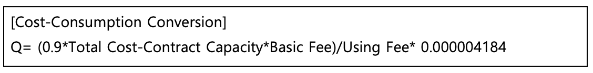
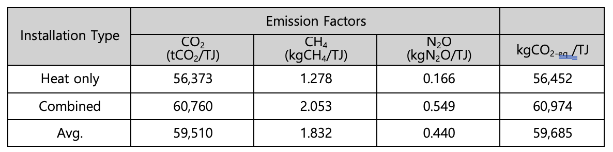
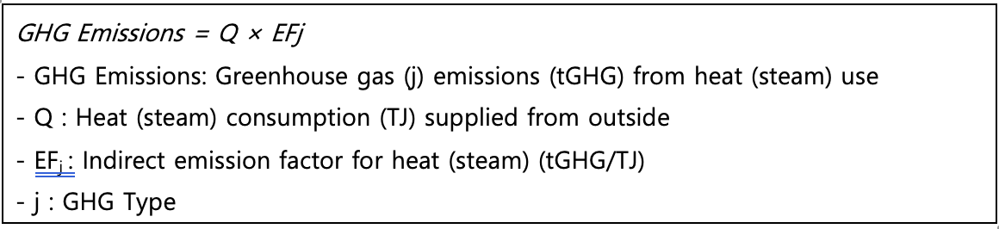
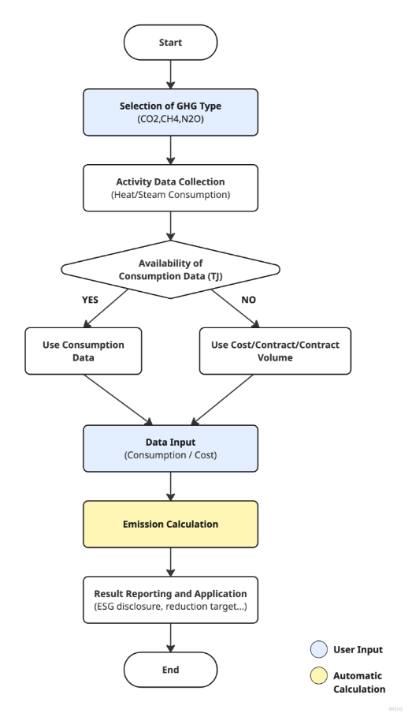

## **Indirect Emission (Heat and Steam) Methodology in Korea**

Policy by WinCL (Verified by the Korean Foundation for Quality, a third-party emission verifier)

**Policy Summary**

This methodology provides guidance on how companies can measure and report greenhouse gas emissions in the Scope 2 indirect emissions category (heat and steam). It covers the recording and collection of heat and steam data.

The methodology applies when a company operates facilities using externally supplied heat (steam), and the related emissions occur at the supplier. The purpose is to calculate the indirect emissions resulting from the use of heat and steam. Heat and steam energy are primarily used for district heating and cooling, which is distinct from city gas (LNG)-based heating and cooling.

Heat and steam energy are generally supplied by Korea District Heating Corporation (KDHC), from which usage data and emission factors can be obtained.

**This methodology is applicable for**

- Scope 2 (Indirect emissions): Heat and steam supplied externally.
- The emissions may be included under a supplier’s Scope 3, Category 1 or 2. However, when calculating Scope 3 emissions, a separate Scope 3 methodology should be used.

**User Input**

- The priority order for input data is as follows:

1. Heat (steam) supply volume or consumption by facility (TJ).
1. If the above data is not available, the following should be entered: usage cost (paid amount), contract type, and contract capacity → consumption is then estimated based on costs.

**Emission Calculation**

- Information such as heat/steam consumption, payment amount, contract type, and contract capacity can be obtained via the KDHC website (requires membership and customer number):

- <https://www.kdhc.co.kr/cyb/heat/post/charg/heatChargeForm.do>

**Applied Emission Factors**

- Emission factors for heat/steam provided by the supplier.
  - If unavailable, emission factors published by the Greenhouse Gas Inventory and Research Center of Korea (GIR) should be used.

<!-- | Installation Type |                 Emission Factors                 |                                                   |                                                   |                          |
| :---------------: | :----------------------------------------------: | :-----------------------------------------------: | :------------------------------------------------ | :----------------------- |
|                   | 
CO2

(tCO2/TJ)
 | 
CH4

(kgCH4/TJ)
 | 
N2O

(kgN2O/TJ)
 | kgCO2-eq../TJ |
|     Heat only     |                      56,373                      |                      1\.278                       | 0\.166                                            | 56,452                   |
|     Combined      |                      60,760                      |                      2\.053                       | 0\.549                                            | 60,974                   |
|       Avg.        |                      59,510                      |                      1\.832                       | 0\.440                                            | 59,685                   | -->

### Emission Calculation

## Use case: Calculation of Heat and Steam Emissions for General Companies

Scenario

Company A operates multiple buildings including offices, production plants, and warehouses, using externally supplied heat and steam for heating and some industrial processes. To comply with ESG management and regulatory reporting obligations (e.g., GHG & Energy Target Management System), the company must calculate Scope 2 indirect emissions annually.

**1) Data Collection**

Priority 1 — Consumption data

- Heat and steam supply volume (TJ)
- Supplier (e.g., KDHC) Customer Portal, monthly bills, or usage meters)

Priority 2 — Estimate based on costs

- If usage data is unavailable, obtain monthly payment, contract type, and contract capacity.
- Apply conversion formula:
- Q = (0.9 × Total cost – Contract Capacity × Basic Fee) / Using Fee × 0.000004184

**2) Emission Factor Application**

- Use annual emission factors provided by the supplier (preferred).
- If not available, use national emission factors provided by GIR.

**3) Emission Calculation Procedure**

1. Calculate monthly or annual heat/steam consumption (TJ).
1. Select the appropriate emission factor (Heat only / Combined / Avg.).
1. Apply formula: GHG Emissions = Q × EFj
   1. Q: Consumption (TJ)
   1. EFj: Emission factor (tGHG/TJ)

Calculation Example:

- Annual consumption: 120 TJ
- EF: 60.974 tCO₂-eq./TJ
- Annual emissions: 120 × 60.974 = 7,316.88 tCO₂-eq.

**4) Result Application**

- Sustainability reporting / ESG disclosure: Reflect in Scope 2 emissions
- Internal management: Monitor emissions by site/department and set reduction target
- Regulatory Compliance: Use for mandatory reporting such as Emissions Trading Scheme.
- Cost Analysis: Manage energy costs and emissions together to establish efficiency strategies.

