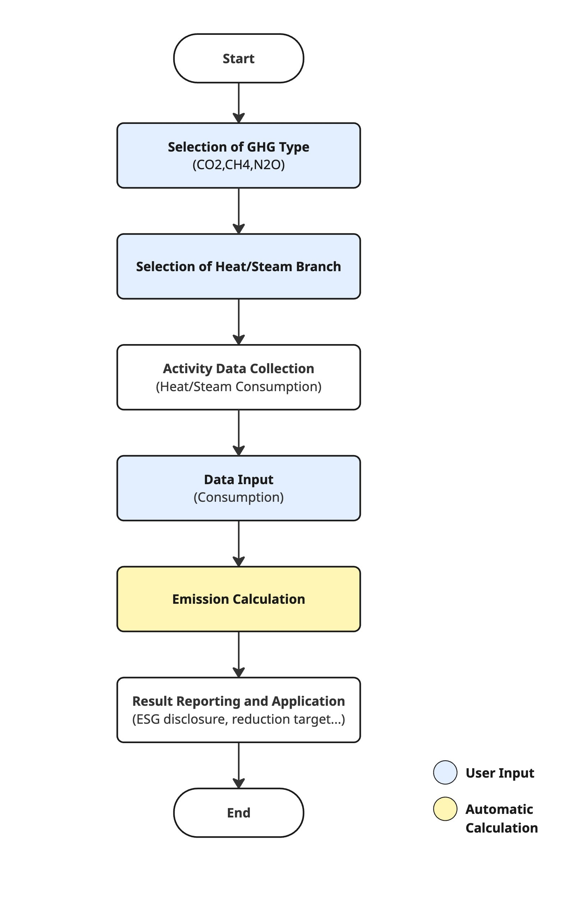

# **Indirect Emission (Heat and Steam) Methodology in Korea**

### **Tool Summary**

This methodology provides guidance on how companies can measure and report greenhouse gas emissions in the Scope 2 indirect emissions category (heat and steam). It covers the recording and collection of heat and steam data.

The methodology applies when a company operates facilities using externally supplied heat (steam), and the related emissions occur at the supplier. The purpose is to calculate the indirect emissions resulting from the use of heat and steam. Heat and steam energy are primarily used for district heating and cooling, which is distinct from city gas (LNG)-based heating and cooling.

Heat and steam energy are generally supplied by Korea District Heating Corporation (KDHC), from which usage data and emission factors can be obtained.

### **This methodology is applicable for**

- Scope 2 (Indirect emissions): Heat and steam supplied externally.
- The emissions may be included under a supplier’s Scope 3, Category 1 or 2. However, when calculating Scope 3 emissions, a separate Scope 3 methodology should be used.

 

### **User Input**

- Branch type
- Applicable reporting year
- Heat/Steam Consumption (amount) (Mcal)
  - Can be obtained via the KDHC website (requires membership and customer number):
  - https://www.kdhc.co.kr/cyb/heat/post/charg/heatChargeForm.do

 

### **Applied Emission Factors**

- Branch-specific emission factors published annually by each site shall be applied to calculate emissions

**2024 GHG Emission Factor for Heat (Steam)**

| **Branch**      | **CO₂ (kgCO₂/TJ)** | **CH₄ (kgCH₄/TJ)** | **N₂O (kgN₂O/TJ)** |
| --------------- | ------------------ | ------------------ | ------------------ |
| Capital\*       | 35,058             | 0.6340             | 0.0640             |
| Pyeongtaek      | 15,717             | 0.3793             | 0.0301             |
| Cheongju        | 56,642             | 1.4574             | 0.2295             |
| Sejong          | 42,672             | 0.7667             | 0.0767             |
| Daegu           | 48,249             | 2.5138             | 0.3705             |
| Yangsan         | 35,444             | 0.6346             | 0.0635             |
| Gimhae          | 35,747             | 0.6372             | 0.0637             |
| Gwangju-Jeonnam | 34,068             | 16.9847            | 2.2506             |

\*Capital Branch: Paju, Samsong, Goyang, Jungang, Gangnam, Pangyo, Yongin, Gwanggyo, Suwon, Hwaseong, Dongtan, Bundang

Source: Korea District Heating Corporation
  

### Emission Calculation

> **GHG Emissions = Q × EFⱼ × 4.184 × 10⁻⁶**

- **GHG Emissions:** Total greenhouse gas (j) emissions (kgGHG) from heat/steam use
- **Q:** Heat/Steam consumption (Mcal)
- **EFⱼ:** Greenhouse gas (j) emission factor (kgGHG/TJ)
  

### Use case: Calculation of Heat and Steam Emissions for General Companies

Scenario

Company A operates multiple buildings including offices, production plants, and warehouses, using externally supplied heat and steam for heating and some industrial processes. To comply with ESG management and both regulatory and voluntary reporting obligations (e.g., GHG & Energy Target Management System), the company must calculate and disclose Scope 2 indirect emissions annually.

**1) Data Collection**

Heat/Steam consumption data

- Heat and steam supply volume (Mcal)
- Supplier (e.g., KDHC) Customer Portal, monthly bills, or usage meters)

**2) Emission Factor Application**

- Use branch specific emission factor in reporting year

**3) Emission Calculation Procedure**

1. Calculate heat/steam consumption (Mcal).
2. Apply the appropriate emission factor by choosing a branch and applicable reporting year.
3. Apply formula: GHG Emissions = Q × EFⱼ × 4.184 × 10⁻⁶
   - Q: Heat/Steam Consumption (Mcal)
   - EFⱼ: Emission factor (kgGHG/TJ)

Calculation Example:

- Branch: Gangnam
- Applicable reporting year: 2024
- Annual consumption: 300,000 Mcal
- EF: 35,058 kgCO₂/TJ
- Annual emissions: 300,000 × 35,058 × 4.184 × 10⁻⁶ = 44,004.80 kgCO₂ ≈ 44 tCO₂.

**4) Result Application**

- Sustainability reporting / ESG disclosure: Reflect in Scope 2 emissions
- Internal management: Monitor emissions by site/department and set reduction target
- Cost Analysis: Manage energy costs and emissions together to establish efficiency strategies.

