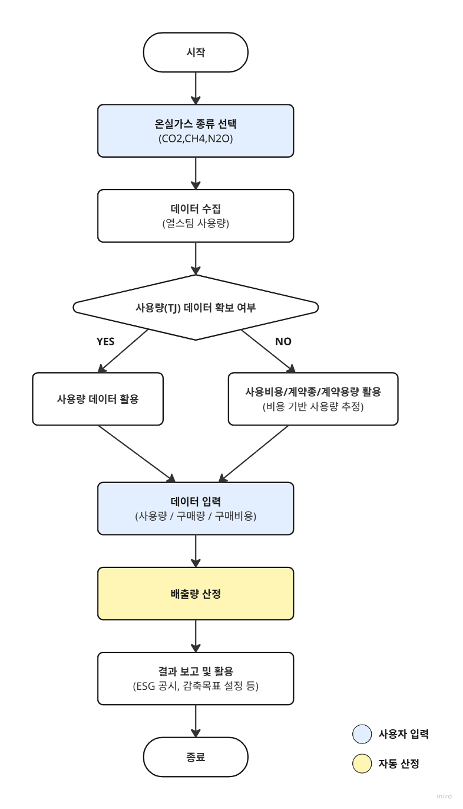

## **간접배출(열, 스팀) – Indirect Emission(Heat, Steam)**

### **요약**

본 방법론은 기업이 Scope 2 간접배출(열·스팀) 범주에서 온실가스 배출량을 산정하고 보고하는 방법을 안내하며, 열 및 스팀 사용량 데이터를 기록하고 수집하는 절차를 포함합니다.

해당 방법론은 기업이 외부에서 공급받은 열(스팀)을 사용하는 시설을 운영하여 해당 사용으로 인해 발생하는 배출이 공급자 측에서 발생하는 경우에 적용됩니다. 열 및 스팀 사용으로부터 발생하는 간접배출량을 산정할 수 있습니다. 열 및 스팀 에너지는 주로 지역난방과 지역냉방에 사용되며, 도시가스(LNG)를 기반으로 한 난방 및 냉방과는 구분됩니다.

열 및 스팀 에너지는 일반적으로 한국지역난방공사(KDHC)를 통해 공급되며, 사용량 데이터와 배출계수 또한 KDHC로부터 확인할 수 있습니다.

### **적용 범위 (Scope)**

- Scope 2 (간접배출) : 외부에서 공급받은 열, 스팀
- 해당 배출량은 업체에서 제품 및 서비스 등을 공급받는 기업의 Scope 3 카테고리 1,2에 포함될 수 있으나, Scope 3 배출량 산정을 위해서는 별도의 Scope 3 산정 방법론을 이용해야 합니다.

 

### **사용자 입력 데이터**

- 난방지사
- 적용 보고연도
- 열, 스팀 에너지의 사용량 (Mcal)
  - 한국지역난방공사(KDHC) 웹사이트를 통해 확인할 수 있음 (회원가입 및 고객번호 필요):
  - <https://www.kdhc.co.kr/cyb/heat/post/charg/heatChargeForm.do>

 

### **적용 배출계수**

- 각 지사에서 매년 공표하는 지사별 배출계수를 적용하여 배출량을 산정한다.

**2024 열(스팀) 온실가스 배출계수**

| **지사**      | **CO₂ (kgCO₂/TJ)** | **CH₄ (kgCH₄/TJ)** | **N₂O (kgN₂O/TJ)** |
| --------------- | ------------------ | ------------------ | ------------------ |
| 수도권\*       | 35,058             | 0.6340             | 0.0640             |
| 평택      | 15,717             | 0.3793             | 0.0301             |
| 청주       | 56,642             | 1.4574             | 0.2295             |
| 세종          | 42,672             | 0.7667             | 0.0767             |
| 대구          | 48,249             | 2.5138             | 0.3705             |
| 양산         | 35,444             | 0.6346             | 0.0635             |
| 김해          | 35,747             | 0.6372             | 0.0637             |
| 광주-전남 | 34,068             | 16.9847            | 2.2506             |

\*수도권 지사: 파주, 삼송, 고양, 중앙, 강남, 판교, 용인, 광교, 수원, 화성, 동탄, 분당

출처: 한국지역난방공사(KDHC)
  

### 배출량 산정식

> **온실가스 배출량 = Q × EFⱼ × 4.184 × 10⁻⁶**

- **온실가스 배출량:** 열/스팀 사용으로부터 발생한 온실가스 j 총배출량 (kgGHG)
- **Q:** 열/스팀 사용량 (Mcal)
- **EFⱼ:** 온실가스 j 배출계수 (kgGHG/TJ)
  

## Use case: 일반 기업의 외부 공급 열·스팀 간접배출량 산정

시나리오 개요

A기업은 사무동, 생산동, 물류창고 등 여러 건물을 운영하며, 난방과 일부 공정 가열을 위해 외부에서 공급받는 열과 스팀을 사용합니다. 기업은 ESG 경영 및 법적 보고 의무(온실가스·에너지 목표관리제 등)를 준수하기 위해 매년 Scope 2 간접배출량을 산정해야 한다.

**1) 데이터 수집**

열(스팀) 소비 데이터
- 열(스팀) 공급량 (Mcal)
- 공급업체 (예: 한국지역난방공사, KDHC) 고객 포털, 월별 청구서, 또는 사용량 계측기를 통해 확인 가능

**2) 배출계수 적용**

- 공급업체에서 제공한 보고연도 배출계수 사용

**3) 배출량 산정 절차**

1. 열·스팀 사용량(Mcal) 산출
2. 해당 공급 지사 및 보고연도에 맞는 배출계수 적용
3. 공식 적용: GHG Emissions = Q × EFj × 4.184 × 10⁻⁶
   1. Q : 사용량(Mcal)
   2. EFj : 배출계수(kgGHG/TJ)

산정 예시:

- 지사: 강남
- 보고연도: 2024
- 연간 사용량: 300,000 Mcal
- EF: 35,058 kgCO₂/TJ
- 연간 배출량: 300,000 × 35,058 × 4.184 × 10⁻⁶ = 44,004.80 kgCO₂ ≈ 44 tCO₂.

**4) 결과 활용**

- 환경보고서·ESG 공시: Scope 2 항목에 반영
- 내부 관리: 사업장별, 부서별 배출량 모니터링 및 절감 목표 설정
- 비용 분석: 에너지 비용과 배출량을 함께 관리하여 효율화 전략 수립

