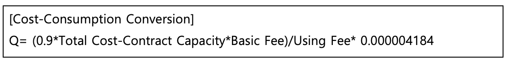
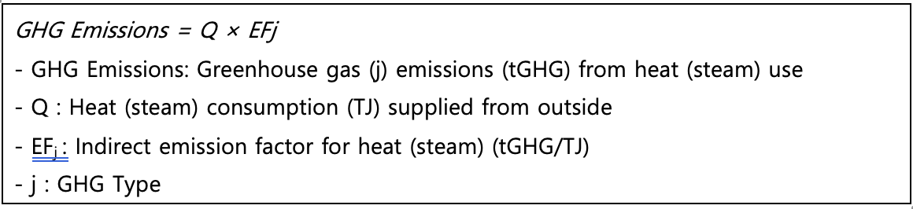

## **간접배출(열, 스팀) – Indirect Emission(Heat, Steam)**

WinCL의 정책 (제3자 배출 검증 기관인 한국품질재단(KFQ)에서 검증 완료)

**요약**

기업이 Scope2 간접배출(열,스팀) 부문에서 발생한 온실가스 배출량을 측정 및 보고할 수 있도록, 열, 스팀 데이터를 기록 및 수집하는 방법을 제공합니다.
본 방법론은 기업이 보유한 설비 가동을 위해 외부에서 공급된 열(스팀)을 사용하며, 이 열(스팀)으로 인한 배출이 공급자로부터 발생하는 경우에, 해당 열(스팀)의 사용으로 인한 간접배출량을 산정하기 위한 것입니다. 열, 스팀 에너지는 주로 지역 냉난방 등에 이용되며, 이는 도시가스(LNG)를 이용한 냉난방과 구별됩니다.
열, 스팀 에너지는 일반적으로 한국지역난방공사에서 제공하며, 한국지역난방공사를 통해 사용 데이터 및 배출계수를 확보할 수 있습니다.

**적용 범위 (Scope)**

- Scope 2 (간접배출) : 외부에서 공급받은 열, 스팀
- 해당 배출량은 업체에서 제품 및 서비스 등을 공급받는 기업의 Scope 3 카테고리 1,2에 포함될 수 있으나, Scope 3 배출량 산정을 위해서는 별도의 Scope 3 산정 방법론을 이용해야 합니다.

**사용자 입력 데이터**

- 입력 데이터의 우선순위는 다음과 같습니다:

1. 배출시설별로 사용된 열(스팀) 공급량 또는 사용량(TJ).
2. 단 1)에서 명시된 데이터를 확보할 수 없을 때에 한하여, 사용비용(납부액) 및 계약종,
   계약용량 입력 → 사용비용을 기반으로 추정된 사용량

- 열, 스팀 에너지의 사용량, 사용비용(납부액), 계약종, 계약용량 등은 한국지역난방공사 웹사이트를 통해 조회 가능합니다. (회원가입 및 고객번호 등 필요)

- <https://www.kdhc.co.kr/cyb/heat/post/charg/heatChargeForm.do>

**적용 배출계수**

- 열(스팀) 공급자가 개발하여 제공한 열,스팀 배출계수.
  - 배출계수 제공받지 못할 경우, 온실가스종합정보센터에서 제공하는 열(스팀) 배출계수 활용

<!-- | Installation Type |                 Emission Factors                 |                                                   |                                                   |                          |
| :---------------: | :----------------------------------------------: | :-----------------------------------------------: | :------------------------------------------------ | :----------------------- |
|                   | 
CO2

(tCO2/TJ)
 | 
CH4

(kgCH4/TJ)
 | 
N2O

(kgN2O/TJ)
 | kgCO2-eq../TJ |
|     Heat only     |                      56,373                      |                      1\.278                       | 0\.166                                            | 56,452                   |
|     Combined      |                      60,760                      |                      2\.053                       | 0\.549                                            | 60,974                   |
|       Avg.        |                      59,510                      |                      1\.832                       | 0\.440                                            | 59,685                   | -->

### 배출량 산정식

## Use case: 일반 기업의 외부 공급 열·스팀 간접배출량 산정

시나리오 개요

A기업은 사무동, 생산동, 물류창고 등 여러 건물을 운영하며, 난방과 일부 공정 가열을 위해 외부에서 공급받는 열과 스팀을 사용합니다. 기업은 ESG 경영 및 법적 보고 의무(온실가스·에너지 목표관리제 등)를 준수하기 위해 매년 Scope 2 간접배출량을 산정해야 한다.

**1) 데이터 수집**

우선순위 1 — 사용량 확보

- 열·스팀 공급량 (TJ 단위)
- 공급업체(예: 지역난방공사) 고객 포털, 월별 고지서 또는 사용량 계측기를 통해 확인

우선순위 2 — 비용 기반 추정

- 사용량 계측 불가 시, 월별 납부액·계약종·계약용량 확인
- 방법론 제공 환산식 적용:
- Q = (0.9 × 총 사용비용 - 계약용량 × 기본요금) / 사용요금 × 0.000004184

**2) 배출계수 적용**

- 공급업체에서 제공한 연도별 배출계수를 1순위로 사용
- 배출계수 미제공 시, 온실가스종합정보센터에서 제공하는 국가 공인 배출계수 사용

**3) 배출량 산정 절차**

1. 월별 또는 연간 열·스팀 사용량(TJ) 산출
2. 해당 공급 형태(Heat only / Combined / Avg.)에 맞는 배출계수 선택
3. 공식 적용: GHG Emissions = Q × EFj
   1. Q : 사용량(TJ)
   2. EFj : 배출계수(tGHG/TJ)

산정 예시:

- 연간 사용량: 120 TJ
- EF: 60.974 tCO₂-eq./TJ
- 연간 배출량: 120 × 60.974 = 7,316.88 tCO₂-eq.

**4) 결과 활용**

- 환경보고서·ESG 공시: Scope 2 항목에 반영
- 내부 관리: 사업장별, 부서별 배출량 모니터링 및 절감 목표 설정
- 규제 대응: 배출권 거래제·목표관리제 등 법정 보고 시 활용 가능
- 비용 분석: 에너지 비용과 배출량을 함께 관리하여 효율화 전략 수립

