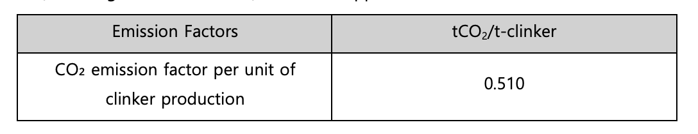
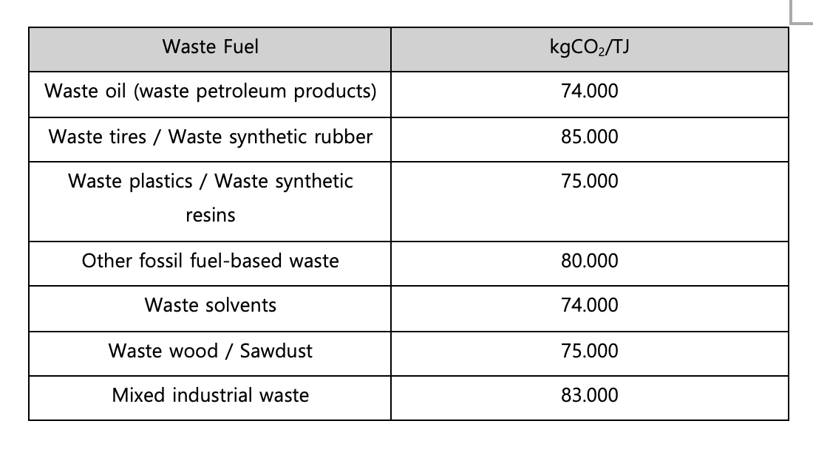

## **Mineral Industry (Cement Production) Methodology in Korea**

Policy by WinCL (Verified by the Korean Foundation for Quality, a third-party emission verifier)

Executive Summary

This methodology provides a way to record and collect data to measure and report greenhouse gas emissions generated when a company produces cement through calcination during the implementation year. It is intended to calculate direct emissions from the cement production process at company facilities. The methodology standardization and transparency, in alignment with national guidelines from the Greenhouse Gas Inventory and Research Center of Korea and is designed to support reporting consistency for verification and compliance purposes.

This Methodology is applicable for

- Scope 1 (Direct Emissions): Mineral Industry (Cement Production)\
  - These emissions may be included in Category 1 and 2 of Scope 3 for companies that purchase products and services from the supplier. However, a separate Scope 3 calculation methodology must be used to account for Scope 3 emissions.

Data Collection

- Clinker production volume

Emission Factors

- The emission factor per unit of clinker production (EFᵢ) uses the default emission factor from the IPCC Guidelines. The calcination rate of cement kiln dust (F_CKD) should be based on on-site measurements if available; if no measurement is available, a value of 1.0 (assuming 100% calcination) should be applied.

- Default emission factor for calculating emissions from waste fuel combustion in stationary (solid fuel) combustion

---

**Emissions calculation**

| 
<b><i>Ei = (EFi + EFtoc) × (Qi + QCKD × FCKD)</i></b>

Ei : CO2 emissions from clinker (i) production (tCO2)

EFi : CO2 emission factor per clinker (i) production (tCO2/t-clinker)

EFtoc: CO2 emission factor attributable to non-carbonate carbon components in input raw materials (carbonates, steel slag, etc.) (default value: 0.010 tCO2/t-clinker)

Qi: Clinker (i) production volume (ton)

QCKD: Amount of cement kiln dust (CKD) discharged from the kiln (ton)

FCKD: Loss rate of cement kiln dust (CKD) lost from the kiln (decimal between 0 and 1)
 |
| :-------------------------------------------------------------------------------------------------------------------------------------------------------------------------------------------------------------------------------------------------------------------------------------------------------------------------------------------------------------------------------------------------------------------------------------------------------------------------------------------------------------------------------------------------------------------------------------------------------------------------------------------------------------------------------------------------------------------------------------------------------------------------------------------------------------------- |

## Use Case: Calculation of Direct Emissions from Cement (Clinker) Production in the Mineral Industry

**Scenario Overview**

Company ‘A’ produces cement through clinker calcination. To comply with annual ESG disclosure and statutory reporting obligations, the company must calculate carbon dioxide (CO₂) emissions generated from the production process as Scope 1 direct emissions.

**1) Data Collection**

- Identify annual clinker production volume and kiln dust emissions
- Where possible, aggregate kiln dust loss rates

**2) Application of Emission Factors**

- Where possible, prioritize the use of company-developed annual clinker emission factors
- If emission factors are not developed, apply officially recognized emission factors provided by the IPCC
- If waste fuel is combusted within the process, apply national CO₂ emission factors for each fuel type separately to combustion emissions

**3) Emission Calculation Procedure**

1. Aggregate monthly or annual clinker production and kiln dust generation volumes
1. Apply clinker emission factors and non-carbonate carbon component emission factors
1. Apply the emission calculation formula for process emissions from cement production\
   <b>Ei = (EFi + EFtoc) × (Qi + QCKD × FCKD)</b>
1. If waste fuel is used in kilns, calculate the emissions separately to avoid double-counting with process emissions

**4) Reporting and Utilization**

- **Sustainability Report and ESG Disclosure:** Reflect as Scope 1 emissions
- **Internal Management:** Compare emission intensity by production line and condition, and improve clinker management
- **Regulatory Compliance:** Utilize as statutory reporting data, such as for the Emissions Trading Scheme
- **Process Optimization:** Derive reduction measures such as adjusting raw material composition (carbonate/slag), improving clinker loss rates, and enhancing heat recovery

