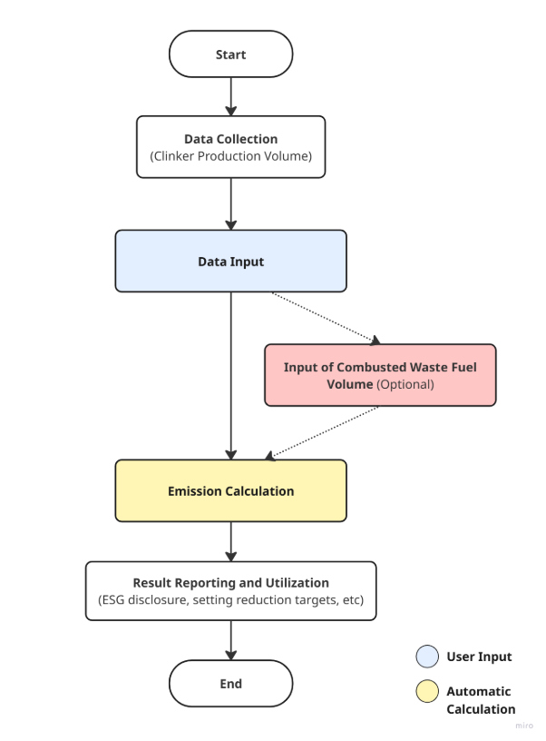

# **Mineral Industry (Cement Production) Methodology in Korea**

### **Tool Summary**

This methodology provides a way to record and collect data to measure and report greenhouse gas emissions generated when a company produces cement through calcination during the implementation year. It is intended to calculate direct emissions from the cement production process at company facilities. The methodology ensures standardization and transparency in accordance with the national guidelines of the Greenhouse Gas Inventory and Research Center of Korea, promoting consistent reporting for verification and compliance.

### **This Methodology is applicable for**

- Scope 1 (Direct Emissions): Mineral Industry (Cement Production)\
  - These emissions may be included in Category 1 and 2 of Scope 3 for companies that purchase products and services from the supplier. However, a separate Scope 3 calculation methodology must be used to account for Scope 3 emissions.

### **User Inputs**

- Inclusion of waste fuels (e.g., waste oil)
- Applicable reporting year
- Mass fraction of CaO in clinker [0~1]
- Mass fraction of non-emissive CaO in clincker [0~1]
- Mass fraction of MgO in clinker [0~1]
- Mass fraction of CaO in non-recycled CKD [0~1]
- Mass fraction of non-emissive CaO in CKD [0~1]
- Mass fraction of MgO in  non-recycled CKD [0~1] 
- Mass fraction of non-emissive MgO in CKD [0~1]
- Clinker produced (ton)
- CKD not recycled (ton)
- Raw material input (ton)

Emission Factors

- The emission factor per unit of clinker production (EFᵢ) are calculated based on the user inputs including mass fraction of CaO and MgO in clinker.
- Default emission factors for calculating emissions from waste fuel combustion in stationary (solid fuel) combustion:

| Waste Fuel                                | kgCO₂/TJ |
|-------------------------------------------|-----------|
| Waste oil (waste petroleum products)      | 74.000    |
| Waste tires / Waste synthetic rubber      | 85.000    |
| Waste plastics / Waste synthetic resins   | 75.000    |
| Other fossil fuel-based waste             | 80.000    |
| Waste solvents                            | 74.000    |
| Waste wood / Sawdust                      | 75.000    |
| Mixed industrial waste                    | 83.000    |

Source: Greenhouse Gas Inventory and Research Center of Korea
  

### **Emissions calculation**

+ *Production Emissions (tCO₂) = (Clinker(t) × Emission factor(tCO₂/t-clinker)) + (Cement kiln dust(CKD)(t) × Emission factor(tCO₂/t-CKD)) + (Raw material × Emission factor(tCO₂/t))*
+ *Waste Fuel Emissions (tCO₂) = Fuel Consumption (t) × Emission factor (kgCO₂/TJ) × NCV (TJ/Gg) × 10⁻⁶*

## Use Case: Calculation of Direct Emissions from Cement (Clinker) Production in the Mineral Industry

**Scenario Overview**

Company ‘A’ produces cement through clinker calcination. To comply with annual ESG disclosure and statutory reporting obligations, the company must calculate carbon dioxide (CO₂) emissions generated from the production process as Scope 1 direct emissions.

**1) Data Collection**

- Identify annual clinker production volume and kiln dust emissions
- Where possible, aggregate kiln dust loss rates

**2) Application of Emission Factors**

- The emission factor per unit of clinker production (EFᵢ) are calculated based on the user inputs including mass fraction of CaO and MgO in clinker.
- If waste fuel is combusted within the process, apply national CO₂ emission factors for each fuel type separately to combustion emissions

**3) Emission Calculation Procedure**

- Aggregate clinker production and kiln dust generation volumes
- Apply the emission calculation formula for process emissions from cement production.

    - *Production Emissions (tCO₂) = (Clinker(t) × Emission factor(tCO₂/t-clinker)) + (Cement kiln dust(CKD)(t) × Emission factor(tCO₂/t-CKD)) + (Raw material × Emission factor(tCO₂/t))*
- If waste fuel is used in kilns, calculate the emissions separately to avoid double-counting with process emissions
    - *Waste Fuel Emissions (tCO₂) = Fuel Consumption (t) × Emission factor (kgCO₂/TJ) × NCV (TJ/Gg) × 10⁻⁶*

**4) Reporting and Utilization**

- **Sustainability Report and ESG Disclosure:** Reflect as Scope 1 emissions
- **Internal Management:** Compare emission intensity by production line and condition, and improve clinker management
- **Process Optimization:** Derive reduction measures such as adjusting raw material composition (carbonate/slag), improving clinker loss rates, and enhancing heat recovery

