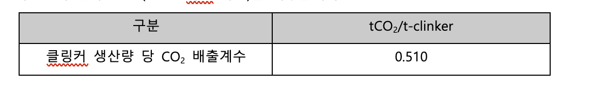
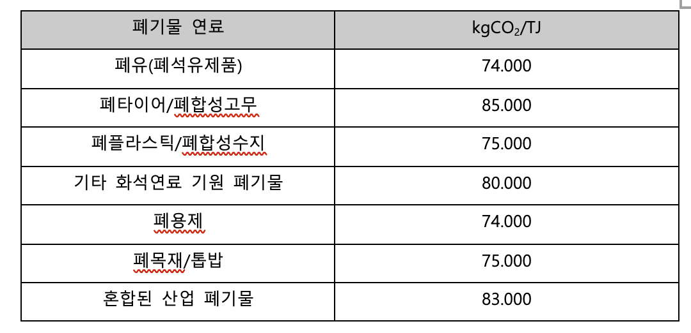

## **광물산업 (시멘트 생산)**

WinCL의 정책 (제3자 배출 검증 기관인 한국품질재단(KFQ)에서 검증 완료)

**요약**

기업이 이행연도에 소성을 통해 시멘트를 생산할 때 발생하는 온실가스 배출량을 측정 및 보고할 수 있도록, 데이터를 기록 및 수집하는 방법을 제공합니다. 본 방법론은 사업장의 시멘트 생산 공정 과정에서 발생하는 직접 배출량을 산정하기 위한 것입니다. 해당 방법론은 대한민국 온실가스종합정보센터의 국가 가이드라인에 따라 투명성을 보장하며, 검증 및 규제 준수를 위한 보고 일관성을 지원하도록 설계되었습니다.

적용 범위 (Scope)

- Scope 1 (직접배출) : 광물산업 (시멘트 생산)
  - 해당 배출량은 업체에서 제품 및 서비스 등을 공급받는 기업의 Scope 3 카테고리 1,2에 포함될 수 있으나, Scope 3 배출량 산정을 위해서는 별도의 Scope 3 산정 방법론을 이용해야 합니다.

사용자 입력 데이터

- 클링커 생산량

적용 배출계수

- 클링커 생산량 당 배출계수(EFi)는 IPCC 가이드라인의 기본 배출계수를 사용합니다. 시멘트 킬른먼지(CKD)의 하소율(FCKD)은 공장 내 측정값이 있다면 측정값을 적용하고, 측정값이 없다면 1.0(100% 하소 가정)을 적용합니다.

-  고정연소(고체연료) 중 폐기물연료 연소에 따른 배출량을 산정을 위한 기본 배출계수

---

**배출량 산정식**

| 
<b><i>Ei = (EFi + EFtoc) × (Qi + QCKD × FCKD)</i></b>

Ei : CO2 emissions from clinker (i) production (tCO2)

EFi : CO2 emission factor per clinker (i) production (tCO2/t-clinker)

EFtoc: CO2 emission factor attributable to non-carbonate carbon components in input raw materials (carbonates, steel slag, etc.) (default value: 0.010 tCO2/t-clinker)

Qi: Clinker (i) production volume (ton)

QCKD: Amount of cement kiln dust (CKD) discharged from the kiln (ton)

FCKD: Loss rate of cement kiln dust (CKD) lost from the kiln (decimal between 0 and 1)
 |
| :-------------------------------------------------------------------------------------------------------------------------------------------------------------------------------------------------------------------------------------------------------------------------------------------------------------------------------------------------------------------------------------------------------------------------------------------------------------------------------------------------------------------------------------------------------------------------------------------------------------------------------------------------------------------------------------------------------------------------------------------------------------------------------------------------------------------- |

## Use Case: 광물 산업 기업의 시멘트(클링커) 생산에 따른 직접 배출량 산정

**시나리오 개요**

A기업은 클링커 소성을 통해 시멘트를 생산하고 있습니다. 기업은 매년 ESG 공시와 법정 보고 의무를 준수하기 위해, 생산 공정에서 발생하는 이산화탄소(CO2) 배출량을 Scope 1 직접배출로 산정해야 합니다.

**1) 데이터 수집**

- 연도별 클링커 생산량, 킬른먼지 배출량 파악
- 가능한 경우, 킬른먼지 손실률 집계

**2) 배출계수 적용**

- 가능한 경우, 기업이 개발한 연도별 클링커 배출계수를 1순위로 사용
- 배출계수 미개발 시, IPCC 에서 제공하는 공인 배출계수 적용
- 공정 내 폐기물 연료를 연소하는 경우, 연료별 이산화탄소(CO2) 국가 배출계수를 별도 연소 산정에 적용

**3) 배출량 산정 절차**

1. 월별 또는 연간 클링커 생산량 및 킬른먼지 발생량 집계
2. 2. 클링커 배출계수 및 비탄산염 탄소 성분 배출게수 적용
3. 시멘트 생산 시 발생하는 공정 배출량 산정 공식 적용
   <b>Ei = (EFi + EFtoc) × (Qi + QCKD × FCKD)</b>
4. 소성로에서 폐기물 연료를 사용한 경우, 공정배출과의 이중계산을 피해 별도 배출량을 산정한다.

**4) 보고 및 활용**

- **지속가능경영 보고서 및 ESG 공시:** Scope 1 배출량에 반영
- **내부 관리:** 생산 라인과 조건별 배출 집약도 비교 및 클링커 관리 개선
- **규제 대응:** 배출권거래제 등 법정 보고 자료로 활용
- **• 공정 최적화:** 원료 조성(탄산염/슬래그), 클링커 손실률, 열회수 개선 등 감축 실행안 도출

