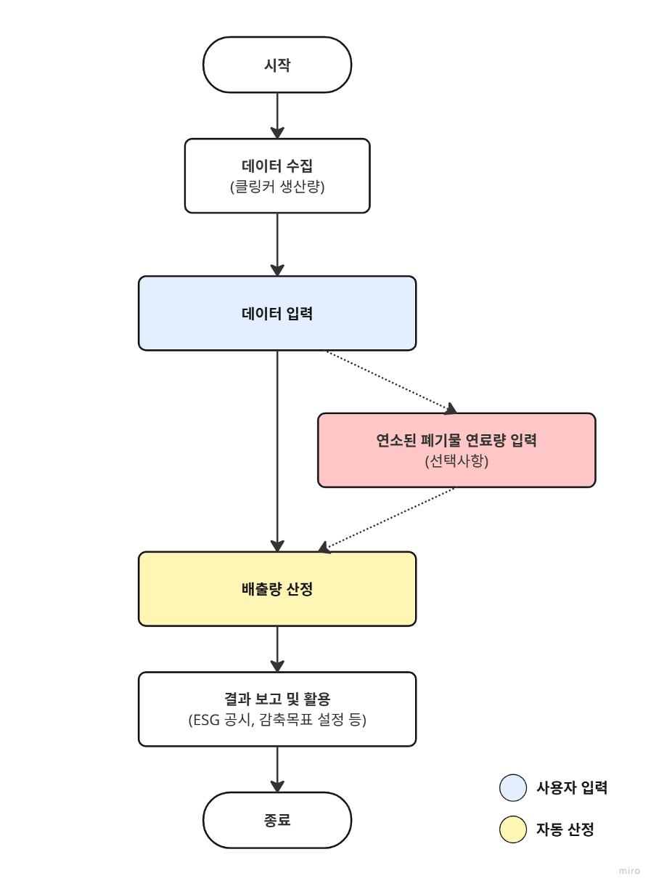

## **광물산업 (시멘트 생산)**

### **요약**

본 방법론은 기업이 시멘트를 생산하는 과정에서 석회석의 열분해로 인해 발생하는 온실가스 배출을 산정하고 보고하기 위해, 해당 연도의 데이터를 기록·수집하는 절차를 제시합니다. 이는 기업 시설에서 이루어지는 시멘트 생산 공정으로부터 발생하는 직접배출량을 계산하는 데 목적이 있습니다.

또한 본 방법론은 온실가스종합정보센터의 국가 지침에 따라 표준화와 투명성을 확보하여, 검증 및 규제 준수를 위한 일관된 보고를 가능하게 한다.

### **적용 범위**

- Scope 1 (직접배출) : 광물산업 (시멘트 생산)
  - 해당 배출량은 업체에서 제품 및 서비스 등을 공급받는 기업의 Scope 3 카테고리 1,2에 포함될 수 있으나, Scope 3 배출량 산정을 위해서는 별도의 Scope 3 산정 방법론을 이용해야 합니다.

사용자 입력 데이터

- 폐기물 연료 포함 여부 (예: 폐유)
- 적용 보고연도
- 클링커 내 CaO 질량분율
- 클링커 내 비배출성 CaO 질랑분율
- 클링커 내 MgO 질량분율
- 비재활용 CKD 내 CaO 질량분율 0~1
- 비재활용 CKD 내 비배출성(non-emissive) CaO 질량분율 0~1
- 비재활용 CKD 내 MgO 질량분율 0~1
- 비재활용 CKD 내 비배출성(non-emissive) MgO 질량분율 0~1
- 클링커 생산량 (ton)
- 비재활용 CKD 배출량 (ton)
- 원료 투입량 (ton)

### 적용 배출계수

- 클링커 생산 단위당 배출계수(EFᵢ)는 클링커 내 CaO 및 MgO 질량분율 등 사용자가 입력한 값을 기반으로 산정된다.
- 고정 연소(고체연료) 과정에서 발생하는 폐기물 연료 연소 배출량을 계산하기 위한 기본 배출계수는 다음과 같다:
### 폐기물 연료 기본 배출계수

| 폐기물 연료 종류                                | kgCO₂/TJ |
|--------------------------------------------------|----------|
| 폐유(폐석유제품)                                 | 74.000   |
| 폐타이어 / 폐합성고무                            | 85.000   |
| 폐플라스틱 / 폐합성수지                          | 75.000   |
| 기타 화석연료 기반 폐기물                        | 80.000   |
| 폐용제                                           | 74.000   |
| 폐목재 / 톱밥                                    | 75.000   |
| 혼합 산업폐기물                                  | 83.000   |

출처: 온실가스종합정보센터

---

### **배출량 산정식**

- 공정 배출량 (tCO₂) = (클링커 생산량(ton) × 배출계수(tCO₂/ton-clinker))+ (시멘트 킬른 더스트(CKD) 배출량(ton) × 배출계수(tCO₂/ton-CKD)) + (원료 투입량(ton) × 배출계수(tCO₂/ton))
- 폐기물 연료 배출량 (tCO₂) = 연료 사용량(ton) × 배출계수(kgCO₂/TJ) × 순발열량(NCV, TJ/Gg) × 10⁻⁶

### Use Case: 광물 산업 기업의 시멘트(클링커) 생산에 따른 직접 배출량 산정

**시나리오 개요**

A기업은 클링커 소성을 통해 시멘트를 생산하고 있습니다. 기업은 매년 ESG 공시와 법정 보고 의무를 준수하기 위해, 생산 공정에서 발생하는 이산화탄소(CO2) 배출량을 Scope 1 직접배출로 산정해야 합니다.

**1) 데이터 수집**

- 연도별 클링커 생산량, 킬른먼지 배출량 파악
- 가능한 경우, 킬른먼지 손실률 집계

**2) 배출계수 적용**

- 클링커 생산 단위당 배출계수(EFᵢ)는 클링커 내 CaO 및 MgO 질량분율 등 사용자가 입력한 값을 기반으로 산정
- 공정 내에서 폐기물 연료가 연소되는 경우, 연소 배출량에 대해 연료 유형별 국가 CO₂ 배출계수를 각각 적용

**3) 배출량 산정 절차**

- 클링커 생산량 및 킬른먼지 발생량 집계
- 시멘트 생산 공정에서 발생하는 공정 배출량 산정을 위해 배출량 계산식 적용
  - 공정 배출량 (tCO₂) = (클링커 생산량(ton) × 배출계수(tCO₂/ton-clinker))+ (시멘트 킬른 더스트(CKD) 배출량(ton) × 배출계수(tCO₂/ton-CKD)) + (원료 투입량(ton) × 배출계수(tCO₂/ton))
- 폐기물 연료를 소성로에서 사용하는 경우, 공정 배출량과의 중복 산정을 방지하기 위해 연소 배출량을 별도로 산정한다.
  - 폐기물 연료 배출량 (tCO₂) = 연료 사용량(ton) × 배출계수(kgCO₂/TJ) × 순발열량(NCV, TJ/Gg) × 10⁻⁶

**4) 보고 및 활용**

- **지속가능경영 보고서 및 ESG 공시:** Scope 1 배출량에 반영
- **내부 관리:** 생산 라인과 조건별 배출 집약도 비교 및 클링커 관리 개선
- **공정 최적화:** 원료 조성(탄산염/슬래그), 클링커 손실률, 열회수 개선 등 감축 실행안 도출

