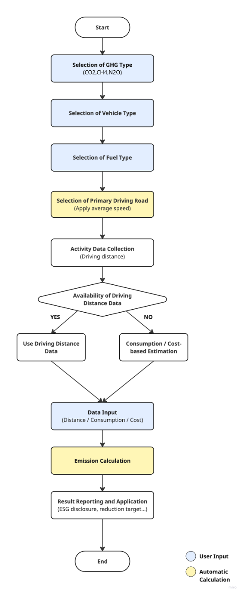

## **이동연소 (도로) - Mobile Combustion (Road)**

### **요약**

기업이 이동연소 부문에서 발생한 온실가스 배출량을 측정 및 보고할 수 있도록, 연료 사용량 데이터를 기록 및 수집하는 방법을 제공합니다. 본 방법론은 기업이 보유한 이동연소(도로) 부문의 차량(승용차, 승합차, 화물차)으로 인한 온실가스 배출이 발생하는 경우, 해당 연료 사용으로 인한 직접 배출량을 산정하기 위한 것입니다. 또한, 기업이 직접 차량을 소유하지 않는 경우에도 이동연소(도로) 부문의 배출량 산정을 보고할 경우 적용될 수 있습니다. 발열량, 배출계수, 차량의 분류 등 모든 매개변수는 대한민국의 국가 기본 계수를 기반으로 합니다.

**적용 범위 (Scope)**

- 승용차, 밴, 트럭 등 운송용 연료를 사용하는 자가 보유 차량(Scope 1)을 운영하는 기업
- 운영상 통제권이 없는 상태에서 운송용 연료를 사용하는 차량을 임차 또는 대여하는 기업 (해당 배출은 Scope 3 Category 8 및 13 에 해당)
- 도로 운송을 주요 제품 및 서비스로 제공하는 운송 기업 (해당 배출은 Scope 3 Category 11에 해당)
- 도로 운송 서비스를 이용하는 기업 (해당 서비스 이용으로 발생하는 배출로 Scope 3 Category 4 및 9 에 해당)

**사용자 입력 데이터**

- 차량 종류
   - 승용차 / 승합차 / 트럭
- 적용 보고연도
- 차량 크기
- 연료 종류
- 주요 주행 도로
   - 도심 / 고속도로
- 활동 자료 단위
   - KRW, L, km
- 연료 비용 (KRW)
   - KRW 단위를 선택한 경우 입력
- 연료 사용량 (L)
   - L 단위를 선택한 경우 입력
- 주행 거리 (km)
   - km 단위를 선택한 경우 입력
   - 가장 선호되는 활동 자료,  가장 정확한 배출량 산정 결과를 제공함

**[단위 환산]**

**예측 주행 거리 (km)**

= (연료 비용 (KRW) / 연료 가격 (KRW/L) x 연비 (km/L))

또는 = (연료 사용량 (L) x 연비 (km/L))
  

---

**적용 차량 유형**

| 종류   | 크기     | 설명                                                                                     | 연료                           |
| ------ | -------- | ---------------------------------------------------------------------------------------- | ------------------------------ |
| 승용차 | 경차     | 배기량 1,000cc 미만,                                                                     | 휘발유, LPG                    |
|        | 소형     | 배기량 1,600cc 미만,                                                                     | 휘발유, 경유, LPG              |
|        | 중형     | 1,600cc ≤ 배기량 < 2,000cc                                                               | 휘발유, LPG, 하이브리드        |
|        | 대형     | 배기량 2,000cc 이상                                                                      | 휘발유, 경유 , LPG, 하이브리드 |
| 승합차 | 소형     | 전장 4.7m, 전폭 1.7m, 전고 2m 이하, 승차정원 15명 이하                                   | 휘발유, LPG                    |
|        | 중형     | 전장, 전폭, 전고 중 소형차 기준 하나라도 초과하고 길이가 9m 미만 or 16 ≤ 승차정원 ≤ 35명 | 휘발유                         |
|        | 전세광역 | 전장, 전폭, 전고 중 소형차 기준 하나라도 초과하고 길이가 9m 이상 or 승차정원 36인 이상   | 휘발유, CNG                    |
|        | 시내     |                                                                                          | CNG                            |
|        | 전체     |                                                                                          | CNG                            |
| Truck  | 소형     | 최대 적재량 1톤 이하 and 총중량 3.5톤 이하                                               | 휘발유                         |
|        | 중형     | 최대 적재량 1톤 초과 5톤 미만 or 총중량 3.5톤 초과 10톤 미만                             |
|        | 대형     | 최대 적재량 5톤 이상 or 총중량 10톤 이상                                                 |

---

**적용 배출계수**

- 차량 유형별 국가 배출계수를 사용하여 배출량을 산정한다.

- y: 배출계수

- x: 평균 차량 속도

- '도심'이 주요 주행 도로로 선택된 경우, 평균 속도 50 km/h 자동 적용

- '고속도로'가 주요 주행 도로로 선택된 경우, 평균 속도 80 km/h 자동 적용

| 차종 | 크기     | 연료       | 주요 주행도로 | CO2 배출계수                 | CH4 배출계수   | N2O 배출계수   |
| ------------ | -------- | ---------- | -------------------- | ------------------------------------ | ---------------------- | ---------------------- |
| 승용차       | 경차     | 휘발유     | 시내                 | y = 1065.1722x^(-0.5889)             | y = -0.0001 + 0.0448/x | y = 0.0001 + 0.0739/x  |
|              |          |            | 고속도로             | y = 0.0225x^2 – 3.3075x + 212.8460   |                        |                        |
|              |          | LPG        | 시내                 | y = 989.9413x^(-0.5937)              | y = 0.0114x^(-0.7073)  | y = -0.0001 + 0.0217/x |
|              |          |            | 고속도로             | y = 0.0172x^2 – 2.3601x + 167.3842   |                        |                        |
|              | 소형     | 휘발유     | 시내                 | y = 1256.0382x^(-0.5914)             | y = -0.0003 + 0.0341/x | y = 0.1596x^(-1.3285)  |
|              |          |            | 고속도로             | y = 0.0252x^2 – 3.7270x + 245.9051   |                        |                        |
|              |          | 경유       | 시내                 | y = 1037.3974x^(-0.5800)             | y = 0.0015 + 0.2136/x  | y = 0.0030 + 0.1311/x  |
|              |          |            | 고속도로             | y = 0.0133x^2 – 1.3612x + 129.4859   |                        |                        |
|              |          | LPG        | 시내                 | y = 1223.8670x^(-0.6046)             | y = -0.0004 + 0.0462/x | y = 0.0189x^(-0.8916)  |
|              |          |            | 고속도로             | y = 0.0188x^2 – 2.7902x + 203.7804   |                        |                        |
|              | 중형     | 휘발유     | 시내                 | y = 1446.3728x^(-0.5793)             | y = 0.1204x^(-1.1138)  | y = 0.0880x^(-1.1179)  |
|              |          |            | 고속도로             | y = 0.0343x^2 – 5.4212x + 339.8479   |                        |                        |
|              | 대형     | 경유       | 시내                 | y = 1153.5685x^(-0.5507)             | y = 0.1644x^(-1.1595)  | y = 0.0007 + 0.1256/x  |
|              |          |            | 고속도로             | y = 0.0226x^2 – 3.0857x + 225.8804   |                        |                        |
|              |          | LPG        | 시내                 | y = 1513.8104x^(-0.6075)             | y = 0.1805x^(-1.3538)  | y = -0.0444x^(-1.1455) |
|              |          |            | 고속도로             | y = 0.0245x^2 – 3.6654x + 257.7428   |                        |                        |
|              |          | 하이브리드 | 시내                 | y = 211.9807x^(-0.1884)              | y = -0.0010 + 0.1519/x | y = -0.0001 + 0.0914/x |
|              |          |            | 고속도로             | y = 0.0205x^2 – 2.8635x + 190.4598   |                        |                        |
|              |          | 휘발유     | 시내                 | y = 2022.6604x^(-0.6183)             | y = -0.0003 + 0.0758/x | y = 0.0001 + 0.0587/x  |
|              |          |            | 고속도로             | y = 0.0374x^2 – 5.9783x + 385.8791   |                        |                        |
|              |          | 경유       | 시내                 | y = 1149.2206x^(-0.5313)             | y = 0.0046 + 0.2333/x  | y = 0.1131x^(-0.7219)  |
|              |          |            | 고속도로             | y = 0.0246x^2 – 3.3168x + 239.5643   |                        |                        |
|              |          | LPG        | 시내                 | y = 1967.2719x^(-0.6616)             | y = 0.0612x^(-1.0387)  | y = 0.0694x^(-1.1011)  |
|              |          |            | 고속도로             | y = 0.0295x^2 – 4.6079x + 301.8248   |                        |                        |
|              |          | Hybrid     | 시내                 | y = 522.2199x^(-0.3855)              | y = 0.0668x^(-1.2132)  | y = 0.1769x^(-1.1254)  |
|              |          |            | 고속도로             | y = 0.0164x^2 – 2.1338x + 176.8101   |                        |                        |
|              | 소형     | 경유       | 시내                 | y = 1656.7736x^(-0.5824)             | y = 0.0455x^(-0.8686)  | y = 0.0028 + 0.1269/x  |
|              |          |            | 고속도로             | y = 0.0137x^2 – 1.3681x + 180.5588   |                        |                        |
|              |          | LPG        | 시내                 | y = 1732.5734x^(-0.5552)             | y = 0.0704x^(-0.8867)  | y = 0.1053x^(-0.9547)  |
|              |          |            | 고속도로             | y = 0.0023x^2 + 0.2596x + 145.7436   |                        |                        |
|              | 중형     | 경유       | 시내                 | y = 264.4900 + 2879.7277/x           | y = 0.6210x^(-0.9389)  | y = 0.0043 + 0.0907/x  |
|              |          |            | 고속도로             | y = 1.3266x + 201.4001               |                        |                        |
|              | 전세광역 | 경유       | 시내                 | y = 4317.2386x^(-0.5049)             | y = 0.4345x^(-0.9658)  | y = 0.0265 + 0.4362/x  |
|              |          |            | 고속도로             | y = 0.1829x^2 – 29.8145x + 1670.8962 |                        |                        |
|              |          | CNG        | 시내                 | y = 5011.6276x^(-0.5579)             | y = 50.5239x^(-0.7111) | y = 10.5990x^(-1.7414) |
|              | 시내     | CNG        | 시내                 | y = 5054.5880x^(-0.4910)             | y = 56.0080x^(-0.7349) | y = 0.2641x^(-0.8324)  |
|              |          |            | 고속도로             | y = 0.1122x^2 – 17.5798x + 1141.5327 |                        |                        |
|              | 전체     | CNG        | 시내                 | y = 5727.0583x^(-0.5552)             | y = 53.0482x^(-0.7242) | y = 1.5910x^(-1.3104)  |
|              |          |            | 고속도로             | y = 0.1122x^2 – 17.5798x + 1141.5327 |                        |                        |
| 화물차       | 소형     | 경유       | 시내                 | y = 1250.4831x^(-0.4630)             | y = -0.0013 + 0.1734/x | y = 0.3417x^(-1.1361)  |
|              |          |            | 고속도로             | y = 0.0292x^2 – 2.9530x + 258.3205   |                        |                        |
|              | 중향     | 경유       | 시내                 | y = 1385.8860x^(-0.4184)             | y = 0.5699x^(-0.8608)  | y = 0.1216x^(-0.7262)  |
|              |          |            | 고속도로             | y = 1.6720x + 141.2224               |                        |                        |
|              | 대향     | 경유       | 시내                 | y = 3351.2892x^(-0.4407)             | y = 0.3408x^(-1.0456)  | y = 0.0346 + 0.8961/x  |
|              |          |            | 고속도로             |                                      |                        |

출처: 온실가스종합정보센터

### **Fuel Efficiency & Cost**

- Based on 2024 January data

<table>
<colgroup>
<col style="width: 17%" />
<col style="width: 16%" />
<col style="width: 21%" />
<col style="width: 22%" />
<col style="width: 23%" />
</colgroup>
<thead>
<tr class="header">
<th><strong>차종</strong></th>
<th><strong>크기</strong></th>
<th><strong>연료</strong></th>
<th>
<strong>연비</strong>

<strong>(km/L)</strong>
</th>
<th>
<strong>연료 가격</strong>

<strong>(KRW/L)</strong>
</th>
</tr>
</thead>
<tbody>
<tr class="odd">
<td rowspan="13">승용차</td>
<td rowspan="2">경차</td>
<td>휘발유</td>
<td>14.3</td>
<td>1643.37</td>
</tr>
<tr class="even">
<td>LPG</td>
<td>11.58</td>
<td>1382</td>
</tr>
<tr class="odd">
<td rowspan="3">소형</td>
<td>휘발유</td>
<td>12.45</td>
<td>1643.37</td>
</tr>
<tr class="even">
<td>경유</td>
<td>15.37</td>
<td>1568.06</td>
</tr>
<tr class="odd">
<td>LPG</td>
<td>10.47</td>
<td>1382</td>
</tr>
<tr class="even">
<td rowspan="4">중형</td>
<td>휘발유</td>
<td>10.61</td>
<td>1643.37</td>
</tr>
<tr class="odd">
<td>경유</td>
<td>13.71</td>
<td>1568.06</td>
</tr>
<tr class="even">
<td>LPG</td>
<td>9.42</td>
<td>1382</td>
</tr>
<tr class="odd">
<td>하이브리드</td>
<td>13.98</td>
<td>1643.37</td>
</tr>
<tr class="even">
<td rowspan="4">대형</td>
<td>휘발유</td>
<td>8.49</td>
<td>1643.37</td>
</tr>
<tr class="odd">
<td>경유</td>
<td>11.80</td>
<td>1568.06</td>
</tr>
<tr class="even">
<td>LPG</td>
<td>7.14</td>
<td>1382</td>
</tr>
<tr class="odd">
<td>하이브리드</td>
<td>9.83</td>
<td>1643.37</td>
</tr>
<tr class="even">
<td rowspan="7">승합차</td>
<td rowspan="2">소형</td>
<td>경유</td>
<td>10.55</td>
<td>1568.06</td>
</tr>
<tr class="odd">
<td>LPG</td>
<td>6.35</td>
<td>1382</td>
</tr>
<tr class="even">
<td>중형</td>
<td>경유</td>
<td>10.55</td>
<td>1568.06</td>
</tr>
<tr class="odd">
<td rowspan="2">전세광역</td>
<td>경유</td>
<td>10.55</td>
<td>1568.06</td>
</tr>
<tr class="even">
<td>CNG</td>
<td>NA</td>
<td>NA</td>
</tr>
<tr class="odd">
<td>도시광역</td>
<td>CNG</td>
<td>NA</td>
<td>NA</td>
</tr>
<tr class="even">
<td>전체</td>
<td>CNG</td>
<td>NA</td>
<td>NA</td>
</tr>
<tr class="odd">
<td rowspan="3">트럭</td>
<td>소형</td>
<td>경유</td>
<td>6.06</td>
<td>1568.06</td>
</tr>
<tr class="even">
<td>중형</td>
<td>경유</td>
<td>3.58</td>
<td>1568.06</td>
</tr>
<tr class="odd">
<td>대형</td>
<td>경유</td>
<td>2.46</td>
<td>1568.06</td>
</tr>
</tbody>
</table>

출처: 오피넷 & 교통통합운영시스템
  

### **배출량 산정식**

<table><tbody><tr><th>
<strong><em>Ei,j = Distancei,k,l,m × EFi,j,k,l × 10-6</em></strong>

<strong><em>Ei,j </em></strong>: 이동연료(i) 연소로 인한 온실가스 배출량 (tGHG)

<strong><em>Distancei,k,l,m</em></strong>: 이동거리 (km)

<strong><em>EFi,j,k,l </em></strong>: 배출계수  (g/km)
<ul><li>i: fuel type</li><li>j:온실가스 종류</li><li>k: 차량의 종류</li><li>l: 차량의 크기</li><li>m: 운전 조건 (평균 속력)</li></ul></th></tr></tbody></table>

  

### **Use case: 일반 기업의 이동연료 이동연소 배출 산정**

**시나리오 개요**

A 기업은 사업 운영을 위해 승용차, 승합차, 화물차를 보유하고 있으며 휘발유, 경유 등 다양한 연료를 사용합니다. 해당 차량들은 서로 다른 주행 조건에서 운행됩니다. 기업은 ESG 경영 및 법적 의무를 준수하기 위해 매년 자사 차량의 Scope 1 직접 배출량을 보고해야 한다.
**1) 데이터 수집 **

우선순위 1 – 활동 데이터 직접 측정

- 보고연도 주행거리(km)를 주행기록계, GPS, 지도 API 등을 통해 파악

우선순위 2 – 비용 기반 추정

- 가능한 경우, 차량 공급업체가 제공한 배출계수를 우선 적용
- 공급업체가 제공한 배출계수가 없을 경우, 국가 온실가스종합정보센터에서 제공한 국가 고유 배출계수 적용

**2) 배출계수 적용**

- 가능한 경우, 차량 공급업체가 제공한 배출계수를 우선 적용
- 공급업체가 제공한 배출계수가 없을 경우, 국가 온실가스종합정보센터에서 제공한 국가 고유 배출계수 적용

**3) 배출량 산정**

1. 차량의 연간 또는 월간 주행거리 (km) 입력
   A. 계기판, GPS, 지도 API 등 활용
2. 차량 및 연료별 적합한 배출계수 적용
3. 공식 적용
   1. _Ei,j = Distancei,k,l,m × EFi,j,k,l × 10\-6_

산정 예시:

- 차종: 승합차

- 차량 크기: 중형

- 연료: 휘발유

- 주요 주행 도로: 도심

- 주행 거리: 15,000 km

- _EF~i,j,k,l ~_= 149.99 CO₂g/km

- Emissions (CO₂) = 15,000 km x 149.99 CO₂g/km*×* 10^-6^ = 2.25 ton CO₂

**4) 보고 및 활용**

- 지속가능성 보고 및 ESG 공시: Scope 1 배출량에 반영
- 사업장 및 부서별 배출 모니터링 및 감축 목표 설정
- 비용 분석을 통한 차량의 연료 효울화 전략 수립

