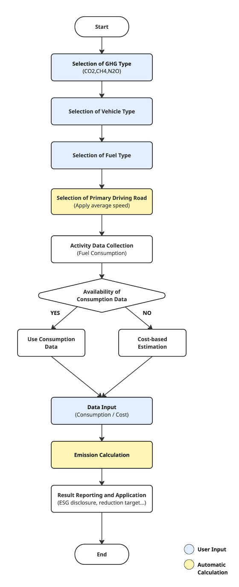

## **Mobile Combustion (Road) Methodology in Korea**

Policy by WinCL (Verified by the Korean Foundation for Quality, a third-party emission verifier)

**Policy Summary**

This methodology provides a standardized framework for reporting organizations in Korea to quantify, report, and verify direct greenhouse gas (GHG) emissions from the combustion of transport fuels. It is applicable to reporting organizations that own equipment (passenger, commercial, freight vehicles, etc.) in the mobile combustion (road) sector and generate greenhouse gas emissions, or to organizations that do not own such equipment but report emissions from the mobile combustion (road) sector. All parameters—such as calorific values, emission factors, and vehicle classification—are based on national default coefficients.

**This methodology is applicable for**

- Any company with owned vehicles (Scope 1) using transport fuels (Passenger Car, Van, and Truck).
- Road transportation companies, with respect to their product emissions (Scope 3 category 11).
- Any company that leases or rent vehicles using transport fuels, with respect to their lease or rent emissions (Scope 3 category 8 and 13).
- Any company that uses road transportation services, with respect to their upstream or downstream emissions (Scope 3 category 4 and 9).

**User Input**

- Vehicle type by size and fuel
- Primary driving road – used to assume the average speed of the vehicle
- Driving distance during the reporting year
- If driving distance data is unavailable, the user can use the total cost of fuel during the reporting year.

---

**Applied Vehicle Types**

| Type       | Size      | Description                                                                                                     | Fuel Type                     |
|------------|-----------|-----------------------------------------------------------------------------------------------------------------|-------------------------------|
| Passenger  | Mini      | Engine displacement below 1,000cc                                                                               | Gasoline, LPG                 |
|            | Small     | Engine displacement below 1,600cc                                                                               | Gasoline, Diesel, LPG         |
|            | Medium    | 1,600cc ≤ Engine displacement < 2,000cc                                                                         | Gasoline, Diesel, LPG, Hybrid |
|            | Large     | Engine displacement 2,000cc or above                                                                            | Gasoline, Diesel, LPG, Hybrid |
| Van        | Small     | Length ≤ 4.7m, Width ≤ 1.7m, Height ≤ 2m, Seating capacity ≤ 15 passengers                                      | Diesel, LPG                   |
|            | Medium    | Exceeds at least one dimension of the small van standards (length, width, or height) AND total length < 9 m OR 16 ≤ passengers ≤ 35 | Diesel                        |
|            | Intercity | Exceeds at least one dimension of the small van standards (length, width, or height) AND total length ≥ 9 m OR Seating capacity ≤ 36 passengers | Diesel, CNG                   |
|            | Urban     |                                                                                                                 | CNG                           |
|            | All Routes|                                                                                                                 | CNG                           |
| Truck      | Small     | Maximum payload ≤ 1 ton AND gross vehicle weight ≤ 3.5 tons                                                     | Diesel                        |
|            | Medium    | 1 ton < Maximum payload < 5 tons OR 3.5 tons < gross vehicle weight < 10 tons                                   | Diesel                        |
|            | Large     | 5 tons ≤ Maximum payload OR 10 tons ≤ Gross vehicle weight                                                      | Diesel                        |

---

**Applied Emission Factors**

- Apply Korean national emission factors by each vehicle type

| Vehicle Type  | Size   | Fuel     | Primary Driving Road | CO2 Emission Factors                          | CH4 Emission Factors              | N2O Emission Factors              |
|---------------|--------|----------|----------------------|-----------------------------------------------|-----------------------------------|-----------------------------------|
| Mini          |        | Gasoline | Urban                | y = 1065.1722x^(-0.5889)                      | y = -0.0001 + 0.0448/x             | y = 0.0001 + 0.0739/x             |
|               |        |          | Highway              | y = 0.0225x^2 – 3.3075x + 212.8460            |                                   |                                   |
|               |        | LPG      | Urban                | y = 989.9413x^(-0.5937)                       | y = 0.0114x^(-0.7073)              | y = -0.0001 + 0.0217/x            |
|               |        |          | Highway              | y = 0.0172x^2 – 2.3601x + 167.3842            |                                   |                                   |
| Passenger Car | Small  | Gasoline | Urban                | y = 1256.0382x^(-0.5914)                      | y = -0.0003 + 0.0341/x             | y = 0.1596x^(-1.3285)             |
|               |        |          | Highway              | y = 0.0252x^2 – 3.7270x + 245.9051            |                                   |                                   |
|               |        | Diesel   | Urban                | y = 1037.3974x^(-0.5800)                      | y = 0.0015 + 0.2136/x              | y = 0.0030 + 0.1311/x             |
|               |        |          | Highway              | y = 0.0133x^2 – 1.3612x + 129.4859            |                                   |                                   |
|               |        | LPG      | Urban                | y = 1223.8670x^(-0.6046)                      | y = -0.0004 + 0.0462/x             | y = 0.0189x^(-0.8916)             |
|               |        |          | Highway              | y = 0.0188x^2 – 2.7902x + 203.7804            |                                   |                                   |
|               | Medium | Gasoline | Urban                | y = 1446.3728x^(-0.5793)                      | y = 0.1204x^(-1.1138)              | y = 0.0880x^(-1.1179)             |
|               |        |          | Highway              | y = 0.0343x^2 – 5.4212x + 339.8479            |                                   |                                   |
|              | Large     | Diesel   | Urban                | y = 1153.5685x^(-0.5507)                      | y = 0.1644x^(-1.1595)             | y = 0.0007 + 0.1256/x             |
|              |           |          | Highway              | y = 0.0226x^2 – 3.0857x + 225.8804            |                                  |                                   |
|              |           | LPG      | Urban                | y = 1513.8104x^(-0.6075)                      | y = 0.1805x^(-1.3538)             | y = -0.0444x^(-1.1455)            |
|              |           |          | Highway              | y = 0.0245x^2 – 3.6654x + 257.7428            |                                  |                                   |
|              |           | Hybrid   | Urban                | y = 211.9807x^(-0.1884)                       | y = -0.0010 + 0.1519/x            | y = -0.0001 + 0.0914/x            |
|              |           |          | Highway              | y = 0.0205x^2 – 2.8635x + 190.4598            |                                  |                                   |
|              |           | Gasoline | Urban                | y = 2022.6604x^(-0.6183)                      | y = -0.0003 + 0.0758/x            | y = 0.0001 + 0.0587/x             |
|              |           |          | Highway              | y = 0.0374x^2 – 5.9783x + 385.8791            |                                  |                                   |
|              |           | Diesel   | Urban                | y = 1149.2206x^(-0.5313)                      | y = 0.0046 + 0.2333/x             | y = 0.1131x^(-0.7219)             |
|              |           |          | Highway              | y = 0.0246x^2 – 3.3168x + 239.5643            |                                  |                                   |
|              |           | LPG      | Urban                | y = 1967.2719x^(-0.6616)                      | y = 0.0612x^(-1.0387)             | y = 0.0694x^(-1.1011)             |
|              |           |          | Highway              | y = 0.0295x^2 – 4.6079x + 301.8248            |                                  |                                   |
|              |           | Hybrid   | Urban                | y = 522.2199x^(-0.3855)                       | y = 0.0668x^(-1.2132)             | y = 0.1769x^(-1.1254)             |
|              |           |          | Highway              | y = 0.0164x^2 – 2.1338x + 176.8101            |                                  |                                   |
|              | Small     | Diesel   | Urban                | y = 1656.7736x^(-0.5824)                      | y = 0.0455x^(-0.8686)             | y = 0.0028 + 0.1269/x             |
|              |           |          | Highway              | y = 0.0137x^2 – 1.3681x + 180.5588            |                                  |                                   |
|              |           | LPG      | Urban                | y = 1732.5734x^(-0.5552)                      | y = 0.0704x^(-0.8867)             | y = 0.1053x^(-0.9547)             |
|              |           |          | Highway              | y = 0.0023x^2 + 0.2596x + 145.7436            |                                  |                                   |
|              | Van Medium| Diesel   | Urban                | y = 264.4900 + 2879.7277/x                    | y = 0.6210x^(-0.9389)             | y = 0.0043 + 0.0907/x             |
|              |           |          | Highway              | y = 1.3266x + 201.4001                        |                                  |                                   |
|              | Intercity | Diesel   | Urban                | y = 4317.2386x^(-0.5049)                      | y = 0.4345x^(-0.9658)             | y = 0.0265 + 0.4362/x             |
|              |           |          | Highway              | y = 0.1829x^2 – 29.8145x + 1670.8962          |                                  |                                   |
|              |           | CNG      | Urban                | y = 5011.6276x^(-0.5579)                      | y = 50.5239x^(-0.7111)            | y = 10.5990x^(-1.7414)            |
|              | Urban     | CNG    | Urban                | y = 5054.5880x^(-0.4910)                      | y = 56.0080x^(-0.7349)            | y = 0.2641x^(-0.8324)             |
|              |           |        | Highway              | y = 0.1122x^2 – 17.5798x + 1141.5327          |                                  |                                   |
|              | All Routes| CNG    | Urban                | y = 5727.0583x^(-0.5552)                      | y = 53.0482x^(-0.7242)            | y = 1.5910x^(-1.3104)             |
|              |           |        | Highway              | y = 0.1122x^2 – 17.5798x + 1141.5327          |                                  |                                   |
| Truck        | Small     | Diesel | Urban                | y = 1250.4831x^(-0.4630)                      | y = -0.0013 + 0.1734/x            | y = 0.3417x^(-1.1361)             |
|              |           |        | Highway              | y = 0.0292x^2 – 2.9530x + 258.3205            |                                  |                                   |
|              | Medium    | Diesel | Urban                | y = 1385.8860x^(-0.4184)                      | y = 0.5699x^(-0.8608)             | y = 0.1216x^(-0.7262)             |
|              |           |        | Highway              | y = 1.6720x + 141.2224                        |                                  |                                   |
|              | Large     | Diesel | Urban                | y = 3351.2892x^(-0.4407)                      | y = 0.3408x^(-1.0456)             | y = 0.0346 + 0.8961/x             |
|              |           |        | Highway              |                                               |                                  |                          
---

**Emission Calculation**

<table><tbody><tr><th>
<strong><em>Ei,j = Distancei,k,l,m × EFi,j,k,l × 10-6</em></strong>

<strong><em>Ei,j </em></strong>: Greenhouse gas (GHG) emissions (tGHG) from the combustion of transport fuel (i)

<strong><em>Distancei,k,l,m</em></strong>: Distance (km)

<strong><em>EFi,j,k,l </em></strong>: Emission factor (g/km)
<ul><li>i: fuel type</li><li>j: GHG type</li><li>k: vehicle type</li><li>l: vehicle size</li><li>m: driving condition (average speed)</li></ul></th></tr></tbody></table>

**Use case: Calculation of Mobile Combustion Emissions for General Companies**

**Scenario**

Company A owns a fleet of vehicles, including passenger cars, vans, and trucks, for business operations. These vehicles run on various fuels such as gasoline, diesel, LPG, and CNG, and operate under different driving conditions. To comply with ESG management and legal obligations (e.g., the GHG & Energy Target Management System), the company annually reports its Scope 1 greenhouse gas emissions from the combustion of transport fuels in its owned vehicles.

**1) Data Collection**

Priority 1 – Direct activity data

- Driving distance (km) for the reporting year, measured from odometer/GPS or retrieved via a mapping service API.

Priority 2 – Cost based proxy

- If driving distance data is unavailable, use total fuel cost for the reporting year from the finance system or receipts
- The average cost of fuel and mileage are applied to estimate driving distance

**2) Emission Factor Application**

- If available, apply the annual emission factors provided by the vehicle suppliers as the priority
- Apply emission factor provided by the GHG Inventory and Research Center

**3) Emission Calculation Procedure**

1. Obtain annual or monthly driving distance (km)
   1. Measured via odometer, GPS, or mapping service API
2. Calculate the appropriate emission factors based on vehicle and fuel type
3. Apply calculation formula
   1. _Ei,j = Distancei,k,l,m × EFi,j,k,l × 10\-6_

**4) Result Application**

- Sustainability reporting / ESG disclosure: Reflect in Scope 1 emissions
- Internal management: Monitor emissions by site and department and set reduction targets for mobile combustion.
- Cost analysis: Manage energy costs and emissions to develop vehicle efficiency strategies

