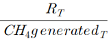
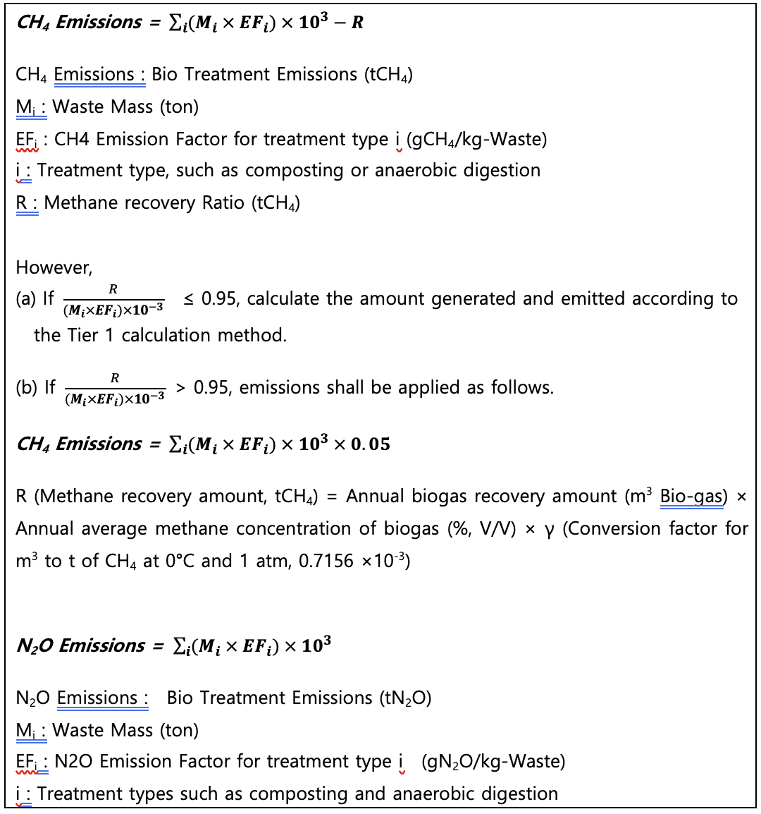

# **Waste Treatment**

**Policy Summary**

This methodology provides guidance on how companies can measure,
calculate, and report greenhouse gas emissions generated from waste
treatment activities. It integrates three major waste treatment methods
-- incineration, landfilling, and biological treatment, enabling
companies to apply the appropriate calculation method based on their
waste management practices.

The methodology follows the national guidelines of the Greenhouse Gas
Inventory and Research Center of Korea (GIR), ensuring transparency,
consistency in reporting, and compliance with verification and
regulatory requirements.

**This methodology is applicable for**

- Scope 1 (Direct emissions): Waste Disposal

\- Emissions from waste treated by third parties (outsourced treatment)
are not included in Scope 1 but must be accounted for under Scope 3
category 5.

**User Inputs**

- Waste disposal type

\- Incineration / Landfilling of solid waste / Biological treatment of
solid waste

## **Waste Incineration**

**User Inputs**

- Applicable reporting year

- Waste type

\- Solid Waste / Liquid Waste / Gaseous Waste

- Waste sub type

\- Only available if either 'Solid Waste' or 'Gaseous Waste' is selected
as a Waste type

- Industrial Waste or Household Waste subtype

\- Only available if 'Solid Waste' is selected as a Waste type

- Waste mass (ton)

<!-- -->

- If waste disposal is reported through the Allbaro system
  (<https://www.allbaro.or.kr/index.jsp>), incineration and treatment
  data can be retrieved directly from the platform.

**Applied Emission Factors**

- CO~2~ Emission Factor

\- Solid Waste

| household waste       |      |      |      |
| --------------------- | ---- | ---- | ---- |
| Waste characteristics | dm   | CF   | FCF  |
| paper                 | 0.9  | 0.46 | 0.01 |
| textiles              | 0.8  | 0.5  | 0.2  |
| food                  | 0.4  | 0.38 | 0    |
| tree                  | 0.85 | 0.5  | 0    |
| garden and park waste | 0.4  | 0.49 | 0    |
| diaper                | 0.4  | 0.7  | 0.1  |
| rubber, leather       | 0.84 | 0.67 | 0.2  |
| plastics              | 1    | 0.75 | 1    |
| metals                | 1    | \-   | \-   |
| glassware             | 1    | \-   | \-   |
| Other household waste | 0.9  | 0.03 | 1    |

Source: Greenhouse Gas Inventory and Research Center of Korea

<table>
<colgroup>
<col style="width: 28%" />
<col style="width: 23%" />
<col style="width: 23%" />
<col style="width: 23%" />
</colgroup>
<thead>
<tr class="header">
<th colspan="4">household waste</th>
</tr>
</thead>
<tbody>
<tr class="odd">
<td>Waste characteristics</td>
<td>dm</td>
<td>CF</td>
<td>FCF</td>
</tr>
<tr class="even">
<td>
Food

(food, beverages, tobacco)
</td>
<td>0.4</td>
<td>0.15</td>
<td>0</td>
</tr>
<tr class="odd">
<td>Waste textiles</td>
<td>0.8</td>
<td>0.4</td>
<td>0.16</td>
</tr>
<tr class="even">
<td>Waste wood</td>
<td>0.85</td>
<td>0.43</td>
<td>0</td>
</tr>
<tr class="odd">
<td>Waste paper</td>
<td>0.9</td>
<td>0.41</td>
<td>0.01</td>
</tr>
<tr class="even">
<td>Petroleum products, solvents, plastics</td>
<td>1</td>
<td>0.8</td>
<td>0.8</td>
</tr>
<tr class="odd">
<td>Waste synthetic rubber</td>
<td>0.84</td>
<td>0.56</td>
<td>0.17</td>
</tr>
<tr class="even">
<td>Construction and demolition debris</td>
<td>1</td>
<td>0.24</td>
<td>0.2</td>
</tr>
<tr class="odd">
<td>Other industrial waste</td>
<td>0.9</td>
<td>0.04</td>
<td>0.03</td>
</tr>
<tr class="even">
<td>sewage sludge(slurry)</td>
<td>0.1</td>
<td>0.45</td>
<td>0</td>
</tr>
<tr class="odd">
<td>Wastewater sludge (slurry)</td>
<td>0.35</td>
<td>0.45</td>
<td>0</td>
</tr>
<tr class="even">
<td>medical waste</td>
<td>0.65</td>
<td>0.4</td>
<td>0.25</td>
</tr>
</tbody>
</table>

Source: Greenhouse Gas Inventory and Research Center of Korea

\- Liquid waste  
The carbon content value (CLi) for liquid waste is 0.8. However, liquid
waste refers to waste legally classified as liquid, such as waste oil
and waste organic solvents.

Source: Greenhouse Gas Inventory and Research Center of Korea

\- Gaseous waste

<table>
<colgroup>
<col style="width: 39%" />
<col style="width: 60%" />
</colgroup>
<thead>
<tr class="header">
<th>Types of gaseous waste</th>
<th>CO2 (tCO2/t-Waste)</th>
</tr>
</thead>
<tbody>
<tr class="odd">
<td>
Exhaust gas

(Refining and petrochemicals)
</td>
<td>2.8512</td>
</tr>
<tr class="even">
<td>Biogas (methane)</td>
<td>.7518</td>
</tr>
</tbody>
</table>

Source: Greenhouse Gas Inventory and Research Center of Korea

- CH~4~ , N~2~O Emission Factor
  - Default CH~4~ emission factors by incineration technology:

| incineration technology |          | CH4 Emission Factors (kgCH4/t-Waste) |
| ----------------------- | -------- | ------------------------------------ |
| continuous              | Fixed    | 0.0002                               |
|                         | Fludised | 0                                    |
| quasi-continuous        | Fixed    | 0.006                                |
|                         | Fludised | 0.188                                |
| Batch type              | Fixed    | 0.06                                 |
|                         | Fludised | 0.237                                |

Source: Greenhouse Gas Inventory and Research Center of Korea

\- Tier1 CH~4~ , N~2~O Emission Factor

| incineration technology | CH4 (kgCH4/t-Waste) | N2O (gCH4/t-Waste) |
| ----------------------- | ------------------- | ------------------ |
| exhaust gas             | 0.1935              | 3.87               |
| Biogas (methane)        | 0.252               | 5.04               |

Source: Greenhouse Gas Inventory and Research Center of Korea

**Emission Calculation**

1\) CO~2~ Emissions

<table>
<colgroup>
<col style="width: 100%" />
</colgroup>
<thead>
<tr class="header">
<th>
<strong>(a) Solid waste</strong>

<em><strong>Emissions = (SWi × dmi ×
CFi × FCFi × OFi) ×
3.664</strong></em>

Emissions: Solid Result (ton CO2)

SWi : Waste Mass (ton) by waste type (i)

dmi: Dry Matter Content by waste type (i) (decimal between
0 and 1)

CFi: Carbon Fraction by waste type (i)

FCFi: Fossil Carbon Fraction by waste type (i) (decimal
between 0 and 1)

OFi: Oxidation factor (incineration efficiency, decimal
between 0 and 1)

3.664: Molecular weight of CO2 (44.010)/Atomic weight of C
(12.011)

<strong>(b) Liquid waste</strong>

<em><strong>Emissions = (ALi × CLi ×
OFi) × 3.664</strong></em>

Emissions: Liquid Result (ton CO2)

ALi : Waste Mass (ton) by waste type (i)

CLi : Liquid Carbon Fraction by waste type (i)

OFi : Liquid Oxidation Factor (incineration efficiency, a
decimal between 0 and 1)

3.664 : Molecular weight of CO2 (44.010)/Atomic weight of
C (12.011)

<strong>(c) Gaseous waste</strong>

<em><strong>Emissions = (GWi × EFi ×
OFi)</strong></em>

Emissions: Gaseous Result (ton CO2)

GWi: Waste Mass (ton) by waste type (i)

EFi: Gaseous CO2 Emission Factor
(tCO2/t-Waste)

OFi: Oxidation factor (incineration efficiency, a decimal
between 0 and 1)
</th>
</tr>
</thead>
<tbody>
</tbody>
</table>

2\) CH~4~, N~2~O Emissions

<table>
<colgroup>
<col style="width: 100%" />
</colgroup>
<thead>
<tr class="header">
<th>
<em><strong>CH4 Emissions = IW × EF ×
10-3</strong></em>

<em><strong>N2O Emissions = IW × EF ×
10-3</strong></em>

CH4 Emissions: CH4 emissions from waste
incineration (tCH4)

N2O Emissions: N2O emissions from waste
incineration (tN2O)

IW: Waste Mass (ton)

EF: Emission factor (g CH4/t-Waste, g
N2O/t-Waste)
</th>
</tr>
</thead>
<tbody>
</tbody>
</table>

## **Use case: Calculation of Waste Incineration Emissions for General Companies**

Scenario

Company A incinerates solid, liquid, and gaseous waste on-site,
including paper, plastics, food waste, wood, rubber/leather, waste oil,
solvents, and biogas. To comply with ESG management and regulatory
obligations, the company must calculate Scope 1 direct emissions
annually from waste incineration.

**1) Data Collection**

Waste activity data collection

- Waste incineration data by type and technology applied

- If using the Allbaro system, retrieve incineration and treatment
  records directly

**2)** Emission Factor Application

- CO₂: Apply dry matter fraction, carbon fraction, fossil carbon
  fraction, oxidation factor by waste type.

- CH₄·N₂O: Apply emission factors by incineration technology.

- Apply national emission factors to each waste type (solid, liquid, and
  gaseous) for calculation.

**3)** Emission Calculation Procedure

1.  Aggregate monthly or annual incineration data by waste type.

2.  Apply formulas by GHG type:

    A. CO~2~ Emissions (solid waste) = (SW~i~ × dm~i~ × CF~i~ × FCF~i~
    × OF~i~) × 3.664

    B. CH~4~ Emissions = IW × EF × 10^-3^

    C. N~2~O Emissions = IW × EF × 10^-3^

**4)** Result Application

- Sustainability reporting / ESG disclosure: Reflect in Scope 1
  emissions.

- Internal Management: Analyze emissions by site and waste type to set
  reduction targets.

- Cost Analysis: Integrate waste treatment costs with emissions data to
  design efficient treatment strategies.

> {width="5.154472878390202in"
> height="9.006356080489939in"}

## **Waste Landfilling**

**User Inputs**

- Applicable reporting year

- Waste type

-Industrial Waste / Household Waste

- Waste sub type

- Type of Landfill Facility

- Type of Landfill Facility Sub-Category

- Waste landfilled in previous year (ton)

\- If waste disposal is reported through the Allbaro system
(<https://www.allbaro.or.kr/index.jsp>), incineration and treatment data
can be retrieved directly from the platform.

- Degradable organic carbon fraction (DOC)

- Methane recovered this year (tCH4)

**Applied Emission Factors**

- DOC (Degradable Organic Carbon ratio) and k (Methane Generation Rate
  Constant)

<table>
<colgroup>
<col style="width: 22%" />
<col style="width: 9%" />
<col style="width: 11%" />
<col style="width: 25%" />
<col style="width: 9%" />
<col style="width: 21%" />
</colgroup>
<tbody>
<tr class="odd">
<td colspan="3">Household waste</td>
<td colspan="3">Industrial waste</td>
</tr>
<tr class="even">
<td>Waste characteristics</td>
<td>DOC</td>
<td>k</td>
<td>Waste characteristics</td>
<td>DOC</td>
<td>k</td>
</tr>
<tr class="odd">
<td>Mixed waste(bulk)1)</td>
<td>0.14</td>
<td>0.09</td>
<td>Mixed waste(bulk)1)</td>
<td>0.15</td>
<td>0.09</td>
</tr>
<tr class="even">
<td>Paper</td>
<td>0.40</td>
<td>0.06</td>
<td>
food

(food, beverage, tobacco)
</td>
<td>0.15</td>
<td>0.185</td>
</tr>
<tr class="odd">
<td>Textile</td>
<td>0.24</td>
<td>0.06</td>
<td>Waste textile</td>
<td>0.24</td>
<td>0.06</td>
</tr>
<tr class="even">
<td>Food</td>
<td>0.15</td>
<td>0.185</td>
<td>Waste wood</td>
<td>0.43</td>
<td>0.03</td>
</tr>
<tr class="odd">
<td>Wood</td>
<td>0.43</td>
<td>0.03</td>
<td>Waste paper</td>
<td>0.40</td>
<td>0.06</td>
</tr>
<tr class="even">
<td>Garden, and park waste</td>
<td>0.20</td>
<td>0.1</td>
<td>Petroleum products, solvents, plastics</td>
<td>0.00</td>
<td>0</td>
</tr>
<tr class="odd">
<td>Diaper</td>
<td>0.24</td>
<td>0.06</td>
<td>Waste synthetic rubber</td>
<td>0.39</td>
<td>0.03</td>
</tr>
<tr class="even">
<td>Rubber,, leather</td>
<td>0.39</td>
<td>0.03</td>
<td>Construction and demolition debris</td>
<td>0.04</td>
<td>0.1</td>
</tr>
<tr class="odd">
<td>Plastic</td>
<td>0.00</td>
<td>0</td>
<td>Other industrial waste 2)</td>
<td>0.01</td>
<td>0.1</td>
</tr>
<tr class="even">
<td>Metal</td>
<td>0.00</td>
<td>0</td>
<td>sewage sludge(slurry)</td>
<td>0.05</td>
<td>0.185</td>
</tr>
<tr class="odd">
<td>Glass</td>
<td>0.00</td>
<td>0</td>
<td>Wastewater sludge (slurry)</td>
<td>0.09</td>
<td>0.185</td>
</tr>
<tr class="even">
<td>Other waste</td>
<td>0.00</td>
<td>0</td>
<td>-</td>
<td>-</td>
<td>-</td>
</tr>
</tbody>
</table>

Source: Greenhouse Gas Inventory and Research Center of Korea

- Mixed waste (bulk) may be applied only in exceptional cases, such as
  when the composition cannot be identified from historical landfill data.
  In general, default values by waste type determined through composition
  analysis should be applied.
- If no data are available for on-site waste, default values for total
  other waste from all manufacturing industries may be applied.

Source: Greenhouse Gas Inventory and Research Center of Korea

- MCF (Methane Correction Factor)

|                                                        |                 |
| ------------------------------------------------------ | --------------- |
| Types of landfill facilities                           | Basic MCF value |
| Controlled landfill - Anaerobic                        | 1.0             |
| Controlled landfill -- semi-aerobic                    | 0.5             |
| Unmanaged landfill -- Landfill height 5 m or more      | 0.8             |
| Uncontrolled landfill -- Landfill height less than 5 m | 0.4             |
| others                                                 | 0.6             |

Source: Greenhouse Gas Inventory and Research Center of Korea

- OX (Oxidation Rate)

|                                                 |     |
| ----------------------------------------------- | --- |
| Types of landfill facilities                    | OX  |
| Landfill sites covered with soil, compost, etc. | 0.1 |
| others                                          | 0   |

Source: Greenhouse Gas Inventory and Research Center of Korea

F (methane volume fraction)  
If actual measurement data on methane content in LFG is available, the
actual measurement value shall be applied first. If no actual
measurement data is available, the default value of 0.5 specified in the
IPCC guidelines shall be applied.

Source: Greenhouse Gas Inventory and Research Center of Korea

Emission Calculation

1\) CH~4~ Emission

<table>
<colgroup>
<col style="width: 100%" />
</colgroup>
<thead>
<tr class="header">
<th>
<em><strong>CH4 EmissionsT = [
CH4 generatedx,T – RT ] ×
(1-OX)</strong></em>

<em><strong>CH4 generatedx,T =
DDOCm,decomp(T) × F × 1.336</strong></em>

<em><strong>DDOCm,decomp(T) = DDOCmaT-1 × (1 –
e-k)</strong></em>

<em><strong>DDOCmaT-1 = DDOCmdT-1 + (
DDOCmaT-2 × e-k )</strong></em>

<em><strong>DDOCmdT-1 = WT-1 × DOC ×
DOCf × MCF</strong></em>

CH4 EmissionsT : Landing of solid waste
emissions (tCH4)

CH4 generatedx,T : Potential
CH4generation this year(tCH4)

RT : Methane recovered this year (tCH4)

OX : Oxidation factor

DDOCm,decomp(T) : Decomposed degradable organic carbon
this year (tC)

F : Methane fraction in landfill gas

1.336 : Molecular weight of CH4 (16.043)/Atomic weight of
C (12.011)

DDOCmaT-1 : Accumulated degradable organic carbon up to
the end of previous year

k : Methane generation rate constant

DDOCmdT-1 : Degradable organic carbon deposited in
landfill in previous year

WT-1 : Waste landfilled in previous year (ton)

DOC : Degradable organic carbon fraction (tC/t-Waste)

DOCf : DOC to methane conversin fraction

MCF : Methane Correction Factor

However,

<blockquote>

(a) If 
≤ 0.75, calculate the amount generated and emitted according to the Tier
1 calculation method.

(b)If 
&gt; 0.75, emissions are applied as follows;

</blockquote>

<em><strong>CH4 generatedx,T = RT ×
(1/0.75)</strong></em>

RT (Methane recovery amount in year T, tCH4) =
Annual biogas recovery amount (m3 Bio-gas) × Annual average
methane concentration of biogas (%, V/V) × γ (Conversion factor for
m3 to t of CH4 at 0°C and 1 atm, 0.7156 ×
10-3),

In this case, CH4 EmissionsT = [CH4
emissions – R (recovery amount)] × (1 – OX)

※ If the methane volume ratio is measured, use the measured
value.
</th>
</tr>
</thead>
<tbody>
</tbody>
</table>

**Use Case: Calculation of Direct Emissions from Landfilling of Solid
waste by a General Company**

**Scenario**

Company 'A' disposes of solid waste generated at its facilities through
its own landfill site. To comply with annual ESG disclosure and
statutory reporting obligations, the company must calculate methane
(CH₄) emissions from landfilling as Scope 1 direct emissions.

**1) Data Collection**

Collection of waste activity data

- Annual volume of landfilled solid waste by type

- Information on the type of landfill facility

- Where possible, aggregation of methane recovery data from the previous
  year

- If using the Ministry of Environment's Allbaro system, landfill
  performance data can be directly verified

**2) Application of Emission Factors**

- CH₄: Apply national default values for DOC, k, MCF, and F by waste
  type

- OX: Apply oxidation rate depending on whether landfill cover is in
  place

**3) Emission Calculation Procedure**

1.  Aggregate monthly or annual landfilled waste volumes by type (deduct
    quantities removed for reprocessing, if applicable)

2.  Set DOC, k, and MCF: Select from standard values based on waste type

    > and facility type

3.  Apply methane generation calculation formula:  
    DDOC~m,decomp(T)~ = DDOCma~T-1~ × (1 -- e^-k^)

4.  Apply methane emission calculation formula reflection recovery rate
    > and oxidant factor:  
    > CH4 EmissionsT = \[ CH4 generatedx,T -- RT \] × (1-OX)

**4) Reporting and Utilization**

- **Sustainability Report and ESG Disclosure:** Reflect as Scope 1

  > emissions

- **Internal Management:** Assess emission intensity by waste type and

  > landfill characteristics to establish reduction strategies such as
  > gas recovery and cover improvement

- **Project Evaluation:** Quantify reduction effects of LFG recovery and
  > power generation facilities, and review investment feasibility

{width="5.7281933508311464in"
height="9.357074584426947in"}

| **Biological Treatment of Solid Waste** |
| --------------------------------------- |

**User Inputs**

- Applicable reporting year

- Disposal Treatment type

-Composting / Anaerobic Digestion

- Disposal Waste Basis

\- Wet Basis / Dry Basis

- Waste Mass (ton)

\- If waste disposal is reported through the Allbaro system
(<https://www.allbaro.or.kr/index.jsp>), incineration and treatment data
can be retrieved directly from the platform.

- Methane Recovery Amount (tCH₄)

**Applied Emission Factors**

|                               |                     |                  |                     |                  |
| ----------------------------- | ------------------- | ---------------- | ------------------- | ---------------- |
| Biological treatment types(i) | CH4 (gCH4/kg-Waste) |                  | N2O (gN2O/kg-Waste) |                  |
|                               | dry weight basis    | wet weight basis | dry weight basis    | wet weight basis |
| composting                    | 10                  | 4                | 0.6                 | 0.3              |
| anaerobic digestion           | 2                   | 1                | 0                   | 0                |

**Emissions calculation**

Use Case: Calculation of Direct Emission from biological treatment of
solid waste

**Scenario Overview**

Company 'A' disposes of organic solid waste generated at its site
through composting or anaerobic digestion. To comply with annual ESG
disclosure and statutory reporting obligations, the company must
calculate greenhouse gas emissions from its production process as Scope
1 direct emissions.

**1) Data Collection**

- Aggregation of annual organic waste volumes by treatment method

- Identification of treatment methods and methane recovery amounts
  (where applicable)

- Data sources: on-site measurement, Allbaro system, etc.

**2) Application of Emission Factors**

- Where possible, prioritize the use of company-developed annual
  emission factors for the biological treatment of solid waste.

- If such emission factors are not developed, apply nationally certified
  emission factors.

**3) Emission Calculation Procedure**

3.  Aggregation of monthly or annual organic waste volumes by treatment
    method

4.  Application of emission factors appropriate for the treatment method
    and standards

5.  Application of the calculation formula for emissions from the
    biological treatment of solid waste

    A. CH~4~ Emissions =
    $\sum_{i}^{}{(M_{i}} \times {EF}_{i}) \times 10^{3} - R$

    B. N~2~O Emissions =
    $\sum_{i}^{}{(M_{i}} \times {EF}_{i}) \times 10^{3}$

**4) Reporting and Utilization**

- **Sustainability Report and ESG Disclosure:** Reflect in Scope 1
  emissions

- **Internal Management:** Analyze emission characteristics by treatment
  method and establish reduction strategies

- **Regulatory Compliance:** Utilize as statutory reporting data, such
  as for the Emissions Trading Scheme

- **Process Optimization:** Develop strategies to shift from
  high-emission treatment methods to lower-emission,
  higher-recovery-efficiency methods

{width="5.100694444444445in"
height="9.511805555555556in"}
