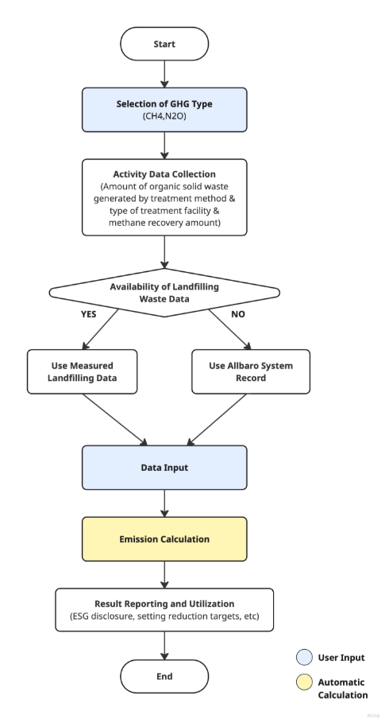

## **Waste Treatment (Biological treatment of solid waste) Methodology in Korea**

Policy by WinCL (Verified by the Korean Foundation for Quality, a third-party emission verifier)

Executive Summary

This methodology provides a way to record and collect data to measure and report greenhouse gas emissions generated when a company biologically treats solid waste during the implementation year. It is intended to calculate direct emissions from waste treated within the company’s own facilities. The scope of waste is limited to solid waste.

This methodology is applicable for

- Scope 1 (Direct Emissions): biological treatment of solid waste\
  - Greenhouse gas emissions generated in the process of outsourcing waste treatment to a third party, instead of treating the waste generated at the site directly, are included in Scope 3.

Data Collection

• Amount of organic waste treated / Amount of methane recovered\
\- Only the volume of pure methane from recovered LFG is used as the recovery amount.

• Activity data such as incinerated waste by type, total incinerated waste, and incinerated gaseous waste

• If waste generation and treatment performance are reported through the Allbaro system (<https://www.allbaro.or.kr/index.jsp>), figures such as waste generation and treatment amounts can be verified within the system.

**Emission Factors**

---

**Emissions calculation**

| 
<b><i>CH4 Emissions =</i></b> i(Mi×EFi)×103-R

CH4 Emissions : Greenhouse gases emitted during the biological treatment of solid waste (tCH4)

Mi : Amount of organic waste treated by biological treatment type i (t-Waste)

EFi : Emission factor for treatment type i (gCH4/kg-Waste)

i : Treatment type, such as composting or anaerobic digestion

R : Methane recovery amount (tCH4)

However,

(a) If R(Mi×EFi)×10-3 ≤ 0.95, calculate the amount generated and emitted according to the Tier 1 calculation method.

(b) If R(Mi×EFi)×10-3 > 0.95, emissions shall be applied as follows.

<b><i>CH4 Emissions =</i></b> i(Mi×EFi)×103×0.05

R (Methane recovery amount, tCH4) = Annual biogas recovery amount (m3 Bio-gas) × Annual average methane concentration of biogas (%, V/V) × γ (Conversion factor for m3 to t of CH4 at 0°C and 1 atm, 0.7156 ×10-3)

<b><i>N2O Emissions =</i></b> i(Mi×EFi)×103

N2O Emissions : Greenhouse gases emitted during the biological treatment of solid waste (tN2O)

Mi : Amount of organic waste treated by biological treatment type i (t-Waste)

EFi : Emission factor for treatment type i (gN2O/kg-Waste)

i : Treatment types such as composting and anaerobic digestion
 |
| :------------------------------------------------------------------------------------------------------------------------------------------------------------------------------------------------------------------------------------------------------------------------------------------------------------------------------------------------------------------------------------------------------------------------------------------------------------------------------------------------------------------------------------------------------------------------------------------------------------------------------------------------------------------------------------------------------------------------------------------------------------------------------------------------------------------------------------------------------------------------------------------------------------------------------------------------------------------------------------------------------------------------------------------------------------------------------------------------------------------------------------------------------------------------------------------------------------------------------------------------------------------------------------------------------------------------------------------------------------------------------------------------------------------------------------------------------------------------------------------------------------------------------------------------------------------------------------------------------------------------------------------------ |

## Use Case: Calculation of Direct Emission from biological treatment of solid waste

**Scenario Overview**

Company ‘A’ disposes of organic solid waste generated at its site through composting or anaerobic digestion. To comply with annual ESG disclosure and statutory reporting obligations, the company must calculate greenhouse gas emissions from its production process as Scope 1 direct emissions.

**1) Data Collection**

- Aggregation of annual organic waste volumes by treatment method
- Identification of treatment methods and methane recovery amounts (where applicable)
- Data sources: on-site measurement, Allbaro system, etc.

**2) Application of Emission Factors**

- Where possible, prioritize the use of company-developed annual emission factors for the biological treatment of solid waste.
- If such emission factors are not developed, apply nationally certified emission factors.

**3) Emission Calculation Procedure**

1. Aggregation of monthly or annual organic waste volumes by treatment method
1. Application of emission factors appropriate for the treatment method and standards
1. Application of the calculation formula for emissions from the biological treatment of solid waste
   1. CH4 Emissions = i(Mi×EFi)×103-R
   1. N2O Emissions = i(Mi×EFi)×103

**4) Reporting and Utilization**

- **Sustainability Report and ESG Disclosure:** Reflect in Scope 1 emissions
- **Internal Management:** Analyze emission characteristics by treatment method and establish reduction strategies
- **Regulatory Compliance:** Utilize as statutory reporting data, such as for the Emissions Trading Scheme
- **Process Optimization:** Develop strategies to shift from high-emission treatment methods to lower-emission, higher-recovery-efficiency methods

