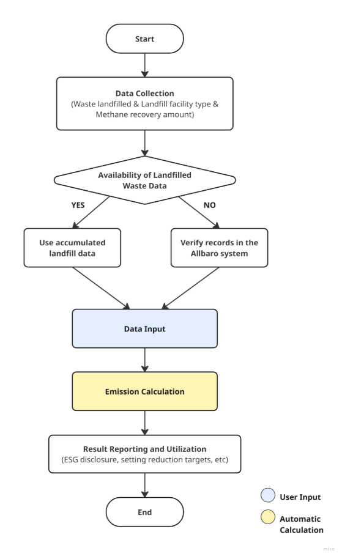

## **Waste Treatment (Landfilling of solid waste) Methodology in Korea**

Policy by WinCL (Verified by the Korean Foundation for Quality, a third-party emission verifier)

Executive Summary

This methodology provides a way to record and collect data to measure and report greenhouse gas emissions generated when a company disposes of solid waste through landfilling during the implementation year. It is intended to calculate direct emissions from waste treated within the company’s own facilities. The methodology follows the national guidelines of the Greenhouse Gas Inventory and Research Center of Korea (GIR) to ensure transparency and is designed to support consistency in reporting for verification and regulatory compliance.

This Methodology is applicable for

- Scope 1 (Direct Emission) : Waste Treatment (Landfilling of solid waste)

  - Greenhouse gas emissions generated from the outsourcing of waste treatment to a third party, rather than being treated directly at the site, are included in Scope 3.

Data Collection

- Amount of solid waste landfilled
- If landfilled waste is excavated and removed, the quantity removed should be deducted from the previously landfilled amount
- Activity data such as incinerated waste by type, total incinerated waste, and incinerated gaseous waste
- If waste generation and treatment performance are reported through the Allbaro system (<https://www.allbaro.or.kr/index.jsp>), figures such as waste generation and treatment amounts can be verified within the system

Calorific Values and Emission Factors

- DOC (Degradable Organic Carbon ratio) and k (Methane Generation Rate Constant)

|        Household waste         | Industrial waste |        |                                             |       |        |
| :----------------------------: | :--------------: | :----- | :------------------------------------------ | :---- | :----- |
|     Waste characteristics      |       DOC        | k      | Waste characteristics                       | DOC   | k      |
| Mixed waste(bulk)1) |      0\.14       | 0\.09  | Mixed waste(bulk)1)              | 0\.15 | 0\.09  |
|             Paper              |      0\.40       | 0\.06  | 
food

(food, beverage, tobacco)
 | 0\.15 | 0\.185 |
|            Textile             |      0\.24       | 0\.06  | Waste textile                               | 0\.24 | 0\.06  |
|              Food              |      0\.15       | 0\.185 | Waste wood                                  | 0\.43 | 0\.03  |
|              Wood              |      0\.43       | 0\.03  | Waste paper                                 | 0\.40 | 0\.06  |
|     Garden, and park waste     |      0\.20       | 0\.1   | Petroleum products, solvents, plastics      | 0\.00 | 0      |
|             Diaper             |      0\.24       | 0\.06  | Waste synthetic rubber                      | 0\.39 | 0\.03  |
|        Rubber,, leather        |      0\.39       | 0\.03  | Construction and demolition debris          | 0\.04 | 0\.1   |
|            Plastic             |      0\.00       | 0      | Other industrial waste 2)        | 0\.01 | 0\.1   |
|             Metal              |      0\.00       | 0      | sewage sludge(slurry)                       | 0\.05 | 0\.185 |
|             Glass              |      0\.00       | 0      | Wastewater sludge (slurry)                  | 0\.09 | 0\.185 |
|          Other waste           |      0\.00       | 0      | -                                           | -     | -      |

\
\- Mixed waste (bulk) may be applied only in exceptional cases, such as when the composition cannot be identified from historical landfill data. In general, default values by waste type determined through composition analysis should be applied.\
\- If no data are available for on-site waste, default values for total other waste from all manufacturing industries may be applied.

- MCF (Methane Correction Factor)

|             Types of landfill facilities              | Basic MCF value |
| :---------------------------------------------------: | :-------------: |
|            Controlled landfill - Anaerobic            |      1\.0       |
|          Controlled landfill – semi-aerobic           |      0\.5       |
|   Unmanaged landfill – Landfill height 5 m or more    |      0\.8       |
| Uncontrolled landfill – Landfill height less than 5 m |      0\.4       |
|                        others                         |      0\.6       |

- OX (Oxidation Rate)

|          Types of landfill facilities           |  OX  |
| :---------------------------------------------: | :--: |
| Landfill sites covered with soil, compost, etc. | 0\.1 |
|                     others                      |  0   |

- F (methane volume fraction)\
  If actual measurement data on methane content in LFG is available, the actual measurement value shall be applied first. If no actual measurement data is available, the default value of 0.5 specified in the IPCC guidelines shall be applied.

Emission Calculation

### 1. CH4 Emission

| 
<b><i>CH4 EmissionsT = [ CH4 generatedx,T – RT ] × (1-OX)</i></b>

<b><i>CH4 generatedx,T = DDOCm,decomp(T) × F × 1.336</i></b>

<b><i>DDOCm,decomp(T) = DDOCmaT-1 × (1 – e-k)</i></b>

<b><i>DDOCmaT-1 = DDOCmdT-1 + ( DDOCmaT-2 × e-k )</i></b>

<b><i>DDOCmdT-1 = WT-1 × DOC × DOCf × MCF</i></b>

CH4 EmissionsT : Methane emissions in year T (tCH4)

CH4 generatedx,T : Maximum methane emissions possible in year T (tCH4)

RT : Methane recovered in year T (tCH4)

OX : Oxidation rate at the landfill surface

DDOCm,decomp(T) : Organic carbon decomposed anaerobically in year T (tC)

F : Methane volume fraction of generated landfill gas

1\.336 : Molecular weight of CH4 (16.043)/Atomic weight of C (12.011)

DDOCmaT-1 : Cumulative organic carbon(tC) accumulated by the end of year T-1

k : Methane generation rate constant

DDOCmdT-1 : Anaerobically degradable organic carbon (tC) landfilled in year T-1

W : Landfill waste quantity (t-Waste)

DOC : Degradable organic carbon ratio (tC/t-Waste)

DOCf : DOC ratio convertible to methane

MCF : Methane correction factor for aerobic decomposition

T : Calculation year

x : Waste characteristics

However,

(a) If  ≤ 0.75, calculate the amount generated and emitted according to the Tier 1 calculation method.

(b)If  > 0.75, emissions are applied as follows;

<b><i>CH4 generatedx,T = RT × (1/0.75)</i></b>

RT (Methane recovery amount in year T, tCH4) = Annual biogas recovery amount (m3 Bio-gas) × Annual average methane concentration of biogas (%, V/V) × γ (Conversion factor for m3 to t of CH4 at 0°C and 1 atm, 0.7156 × 10-3),

In this case, CH4 EmissionsT = [CH4 emissions – R (recovery amount)] × (1 – OX) 

※ If the methane volume ratio is measured, use the measured value.
 |
| ------------------------------------------------------------------------------------------------------------------------------------------------------------------------------------------------------------------------------------------------------------------------------------------------------------------------------------------------------------------------------------------------------------------------------------------------------------------------------------------------------------------------------------------------------------------------------------------------------------------------------------------------------------------------------------------------------------------------------------------------------------------------------------------------------------------------------------------------------------------------------------------------------------------------------------------------------------------------------------------------------------------------------------------------------------------------------------------------------------------------------------------------------------------------------------------------------------------------------------------------------------------------------------------------------------------------------------------------------------------------------------------------------------------------------------------------------------------------------------------------------------------------------------------------------------------------------------------------------------------------------------------------------------------------------------------------------------------------------------------------------------------------------------------------------------------------------------------------------------------------------------------------------------------------------------------------------------------------------------------------------------------------------------------------------------------------------------------------------------------------------------------------------------------------------------------------------------------------------------------------------------------------------------------------------------------------------------------------------------------------------------------------------------------------------------------------------------------------------------------- |

## **Use Case: Calculation of Direct Emissions from Landfilling of Solid waste by a General Company**

**Scenario**

Company ‘A’ disposes of solid waste generated at its facilities through its own landfill site. To comply with annual ESG disclosure and statutory reporting obligations, the company must calculate methane (CH₄) emissions from landfilling as Scope 1 direct emissions.

**1) Data Collection**

Collection of waste activity data

- Annual volume of landfilled solid waste by type
- Information on the type of landfill facility
- Where possible, aggregation of methane recovery data from the previous year
- If using the Ministry of Environment’s Allbaro system, landfill performance data can be directly verified

**2) Application of Emission Factors**

- CH₄: Apply national default values for DOC, k, MCF, and F by waste type
- OX: Apply oxidation rate depending on whether landfill cover is in place

**3) Emission Calculation Procedure**

1. Aggregate monthly or annual landfilled waste volumes by type (deduct quantities removed for reprocessing, if applicable)
1. Set DOC, k, and MCF: Select from standard values based on waste type and facility type
1. Apply methane generation calculation formula:\
   DDOCm,decomp(T) = DDOCmaT-1 × (1 – e-k)
1. Apply methane emission calculation formula reflection recovery rate and oxidant factor:\
   CH4 EmissionsT = [ CH4 generatedx,T – RT ] × (1-OX)

**4) Reporting and Utilization**

- **Sustainability Report and ESG Disclosure:** Reflect as Scope 1 emissions
- **Internal Management:** Assess emission intensity by waste type and landfill characteristics to establish reduction strategies such as gas recovery and cover improvement
- **Regulatory Compliance:** Use as statutory reporting data, such as for the Emissions Trading Scheme
- **Project Evaluation:** Quantify reduction effects of LFG recovery and power generation facilities, and review investment feasibility

[ref1]: [image_8_1.png]
