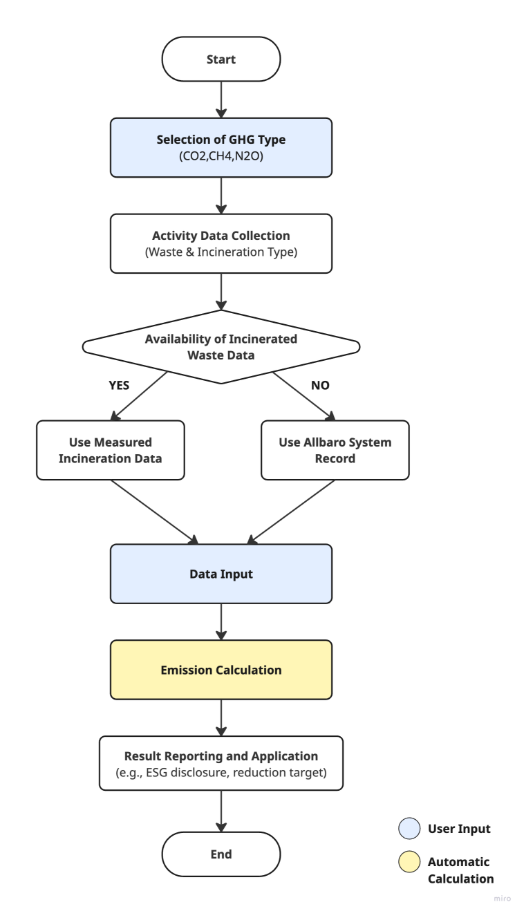
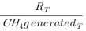
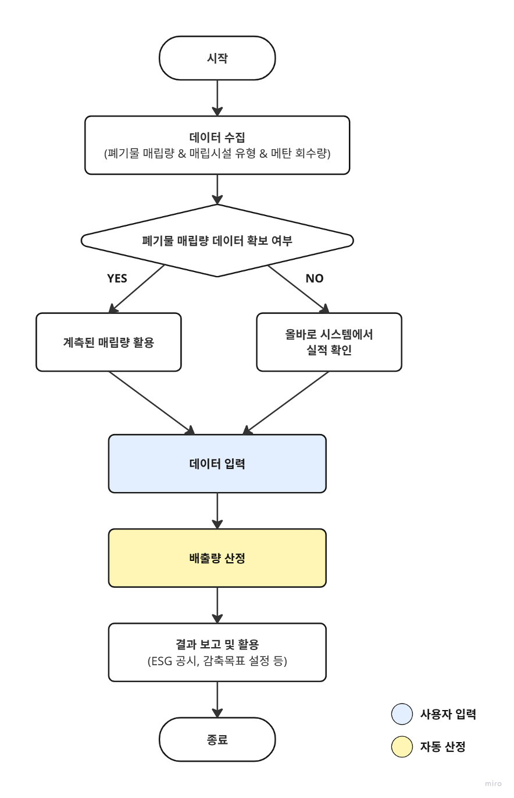
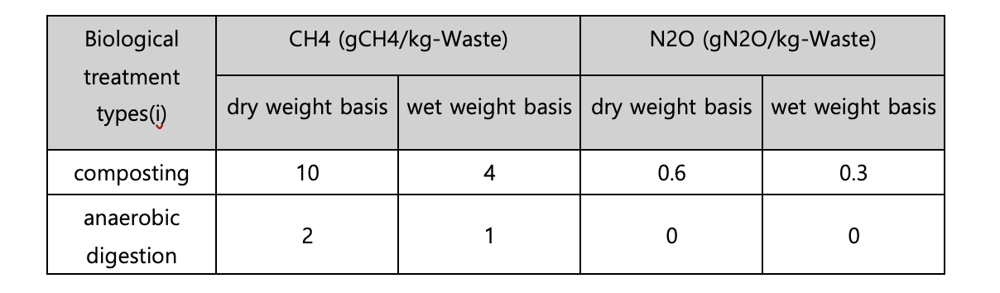
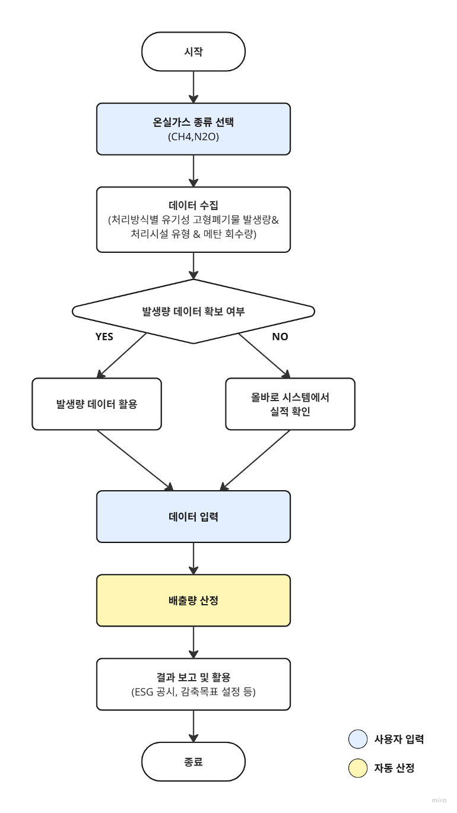

# **폐기물 처리**

### **요약**

기업이 이행연도에 폐기물을 처리할 때 발생하는 온실가스 배출량을 측정 및 보고할 수 있도록, 데이터를 기록 및 수집하는 방법을 제공합니다. 본 방법론은 기업이 사업장 내에서 자체적으로 폐기물을 처리할 때 발생하는 직접 배출량을 산정하기 위한 것입니다. 해당 방법론은 대한민국 온실가스종합정보센터의 국가 가이드라인에 따라 투명성을 보장하며, 검증 및 규제 준수를 위한 보고 일관성을 지원하도록 설계되었습니다. 폐기물의 처리 범위에는 소각, 고형폐기물의 매립, 고형폐기물의 생물학적 처리가 포함됩니다. 

### **적용 범위 (Scope)**

- Scope 1 (직접배출) : 폐기물 처리
  - 사업장에서 발생한 폐기물을 직접 처리하지 않고, 제3자에 의해 위탁 처리하는 과정에서 발생하는 온실가스 배출량은 Scope3에 포함됩니다.

### **사용자 입력 데이터**

- 폐기물 처리 방법

\- 소각 / 고형폐기물의 매립 / 고형폐기물의 생물학적 처리

## **폐기물 소각**

### **사용자 입력 데이터**

- 폐기물 성상별 소각량, 총 폐기물 소각량, 기상 폐기물 소각량 등의 활동 자료
- 올바로(https://www.allbaro.or.kr/index.jsp) 시스템을 통해 폐기물 배출 및 처리 실적을 보고하는 경우에는, 해당 시스템 내에서 폐기물 배출 및 소각량 등의 수치를 확인할 수 있습니다.

**적용 배출계수**

- CO2 배출계수

  - 고상 폐기물

|         일반폐기물       |       |       |       |
| :-------------------: | :---- | :---- | :---- |
| 폐기물 성상              | dm    | CF    | FCF   |
|         종이           | 0\.9  | 0\.46 | 0\.01 |
|       섬유             | 0\.8  | 0\.5  | 0\.2  |
|       음식물쓰레기       | 0\.4  | 0\.38 | 0     |
|         목재           | 0\.85 | 0\.5  | 0     |
| 마당 및 공원 폐기물       | 0\.4  | 0\.49 | 0     |
|        기저귀           | 0\.4  | 0\.7  | 0\.1  |
|    고무, 가죽           | 0\.84 | 0\.67 | 0\.2  |
|       플라스틱          | 1     | 0\.75 | 1     |
|       고철              | 1     | -     | -     |
|       유리              | 1     | -     | -     |
| 기타 생활폐기물            | 0\.9  | 0\.03 | 1     |

|               산업폐기물                        |       |       |       |
| :------------------------------------------: | :---- | :---- | :---- |
|            폐기물 성상                           | dm    | CF    | FCF   |
| 음식물쓰레기 (담배, 식음료 등)                      | 0\.4  | 0\.15 | 0     |
|               폐섬유                           | 0\.8  | 0\.4  | 0\.16 |
|                  폐목재                        | 0\.85 | 0\.43 | 0     |
|               폐종이                           | 0\.9  | 0\.41 | 0\.01 |
|    석유제품, 영제, 플라스틱                        | 1     | 0\.8  | 0\.8  |
|             폐합성고무                          | 0\.84 | 0\.56 | 0\.17 |
|      건축 자재                                 | 1     | 0\.24 | 0\.2  |
|            기타 산업폐기물                       | 0\.9  | 0\.04 | 0\.03 |
|            하수 슬러지                          | 0\.1  | 0\.45 | 0     |
|         폐수 슬러지                             | 0\.35 | 0\.45 | 0     |
|                의료 폐기물                      | 0\.65 | 0\.4  | 0\.25 |

\- 액상 폐기물\
액상 폐기물의 탄소 함량 값(CLᵢ)은 0.8입니다. 다만, 액상 폐기물이란 폐유나 폐유기용제 등과 같이 법적으로 액상으로 분류된 폐기물을 의미합니다.

\
\- 기상 폐기물

|                 기상 폐기물 종류                           | CO2 (tCO2/t-폐기물)  |
| :----------------------------------------------------: | :----------------: |
| 
Exhaust gas

(Refining and petrochemicals)
 |      2\.8512       |
|                    Biogas (methane)                    |       .7518        |

- CH4 , N2O 배출계수\
  - 폐기물 소각 분야 기본 CH4 배출계수:

| incineration technology | CH4 Emission Factors (kgCH4/t-Waste) |         |
| :---------------------- | :----------------------------------- | :------ |
| continuous              | Fixed                                | 0\.0002 |
|                         | Fludised                             | 0       |
| quasi-continuous        | Fixed                                | 0\.006  |
|                         | Fludised                             | 0\.188  |
| Batch type              | Fixed                                | 0\.06   |
|                         | Fludised                             | 0\.237  |

\- 폐기물 소각 분야 CH4 , N2O 배출계수:

| incineration technology | CH4 (kgCH4/t-Waste) | N2O (gCH4/t-Waste) |
| :---------------------- | :------------------ | :----------------- |
| exhaust gas             | 0\.1935             | 3\.87              |
| Biogas (methane)        | 0\.252              | 5\.04              |

**배출량 산정식**

### **1.** CO2 배출량

---

**(a) 고상폐기물**

<b><i>CO2 Emissions = (SWi × dmi × CFi × FCFi × OFi) × 3.664</i></b>

CO2 Emissions : Amount of greenhouse gases generated from waste incineration (tCO2)

SWi : Incineration amount (t-Waste) by waste type (i)

dmi: Mass fraction of rjs material by waste type (i) (decimal between 0 and 1)

CFi: Carbon content by waste type (i) (tC/t-waste)

FCFi: Fossil carbon mass fraction (decimal between 0 and 1)

OFi: Oxidation factor (incineration efficiency, decimal between 0 and 1)

3\.664: Molecular weight of CO2 (44.010)/Atomic weight of C (12.011)

**(b) 액상 폐기물**

<b><i>CO2 Emissions = (ALi × CLi × OFi) × 3.664</i></b>

CO2 Emissions: Amount of greenhouse gases emitted from waste incineration (tCO2)

ALi : Incineration quantity of liquid waste (i) (t-Waste)

CLi : Carbon content of waste (i) (tC/t-Waste)

OFi : Oxidation coefficient (incineration efficiency, a decimal between 0 and 1)

3\.664 : Molecular weight of CO2 (44.010)/Atomic weight of C (12.011)

**(c) 기상 폐기물**

<b><i>CO2 Emissions = (GWi × EFi × OFi)</i></b>

CO2 Emissions: Amount of greenhouse gases emitted from waste incineration (tCO2)

GWi: Amount of atmospheric waste incinerated (t-Waste)

EFi: Emission factor for atmospheric waste (i) (tC/t-Waste)

OFi: Oxidation factor (incineration efficiency, a decimal between 0 and 1)

### **2)** CH4, N2O 배출량

---

<b><i>CH4 Emissions = IW × EF × 10-3</i></b>

<b><i>N2O Emissions = IW × EF × 10-3</i></b>

CH4 Emissions: CH4 emissions from waste incineration (tCH4)

N2O Emissions: N2O emissions from waste incineration (tN2O)

IW: Total incinerated waste volume (ton)

EF: Emission factor (kg CH4/t-Waste, kg N2O/t-Waste)

## Use case: 일반 기업의 폐기물 소각에 따른 직접 배출량 산정

시나리오 개요

A기업은 사업장에서 발생한 고상·액상·기상 폐기물을 자체 소각로에서 처리하고 있습니다. 폐기물은 종이, 플라스틱, 음식물, 폐목재, 고무·가죽, 폐유, 폐용제, 바이오가스 등 다양한 성상을 포함합니다. 기업은 ESG 경영과 법정 보고 의무를 준수하기 위해, 매년 사업장에서 발생하는 폐기물 소각에 따른 Scope 1 직접 배출량을 산정해야 합니다. 

**1) 데이터 수집**

폐기물 활동자료 수집 

- 폐기물 성상별 소각량과 소각 기술 유형 파악
- 환경부 올바로 시스템을 활용하는 경우, 배출 및 소각 실적 데이터를 직접 확인 가능

**2) 배출계수 적용**

- CO₂: 폐기물 성상별 건조물 함량(dm), 탄소 함량(CF), 화석 탄소 함량(FCF), 산화율(OFi) 적용
- CH₄·N₂O: 소각 기술 유형별 배출계수(kg/t-Waste) 적용
- 	고상·액상·기상 폐기물 각각에 대해 국가 배출계수를 적용하여 산정

**3) 배출량 산정 절차**

1. 월별 또는 연간 폐기물 성상별 소각량 집계
2. 온실가스 종류에 따른 공식 적용:
   1. CO2 배출량 (고상 폐기물) = (SWi × dmi × CFi × FCFi × OFi) × 3.664
   1. CH4 배출량 = IW × EF × 10-3
   1. N2O 배출량 = IW × EF × 10-3

**4) 보고 및 활용**

- 지속가능경영 보고서 및 ESG 공시: Scope 1 배출량에 반영
- 내부 관리: 사업장별, 폐기물 성상별 배출 특성을 분석하여 감축 목표 설정
- 규제 대응: 배출권거래제 등 법정 보고 자료로 활용
- 비용 분석: 폐기물 처리 비용과 배출량을 함께 분석하여 효율적 처리 전략 수립

  

## **고형폐기물의 매립**

### **사용자 입력 데이터**
- 매립된 고형 폐기물양
- 매립된 폐기물을 굴착하여 반출하는 경우, 기 매립량에서 반출량을 제외합니다.
- 폐기물 성상별 소각량, 총 폐기물 소각량, 기상 폐기물 소각량 등의 활동 자료
- 올바로 (<https://www.allbaro.or.kr/index.jsp>), 시스템을 통해 폐기물 배출 및 처리 실적을 보고하는 경우에는, 해당 시스템 내에서 폐기물 배출 및 처리량 등의 수치를 확인할 수 있습니다.

**적용 열량계수 및 배출계수**

- DOC(분해가능한 유기탄소 비율) 및 K(케탄 발생 속도상수)양

|        Household waste         | Industrial waste |        |                                             |       |        |
| :----------------------------: | :--------------: | :----- | :------------------------------------------ | :---- | :----- |
|     Waste characteristics      |       DOC        | k      | Waste characteristics                       | DOC   | k      |
| Mixed waste(bulk)1) |      0\.14       | 0\.09  | Mixed waste(bulk)1)              | 0\.15 | 0\.09  |
|             Paper              |      0\.40       | 0\.06  | 
food

(food, beverage, tobacco)
 | 0\.15 | 0\.185 |
|            Textile             |      0\.24       | 0\.06  | Waste textile                               | 0\.24 | 0\.06  |
|              Food              |      0\.15       | 0\.185 | Waste wood                                  | 0\.43 | 0\.03  |
|              Wood              |      0\.43       | 0\.03  | Waste paper                                 | 0\.40 | 0\.06  |
|     Garden, and park waste     |      0\.20       | 0\.1   | Petroleum products, solvents, plastics      | 0\.00 | 0      |
|             Diaper             |      0\.24       | 0\.06  | Waste synthetic rubber                      | 0\.39 | 0\.03  |
|        Rubber,, leather        |      0\.39       | 0\.03  | Construction and demolition debris          | 0\.04 | 0\.1   |
|            Plastic             |      0\.00       | 0      | Other industrial waste 2)        | 0\.01 | 0\.1   |
|             Metal              |      0\.00       | 0      | sewage sludge(slurry)                       | 0\.05 | 0\.185 |
|             Glass              |      0\.00       | 0      | Wastewater sludge (slurry)                  | 0\.09 | 0\.185 |
|          Other waste           |      0\.00       | 0      | -                                           | -     | -      |

\
\- Mixed waste(bulk)는 과거 매립량 자료를 통해 성상 확인이 불가능한 경우 등 특수한 경우에만 적용할 수 있으며, 일반적으로는 성상 분석을 통한 폐기물 성상별 기본값을 적용하여야 합니다.
\
\- 사업장 폐기물에 대한 자료가 없는 경우, 모든 제조업의 총 기타 폐기물에 대한 기본값을 적용할 수 있습니다.

- MCF (메탄 보정 계수)

|             Types of landfill facilities              | Basic MCF value |
| :---------------------------------------------------: | :-------------: |
|            Controlled landfill - Anaerobic            |      1\.0       |
|          Controlled landfill – semi-aerobic           |      0\.5       |
|   Unmanaged landfill – Landfill height 5 m or more    |      0\.8       |
| Uncontrolled landfill – Landfill height less than 5 m |      0\.4       |
|                        others                         |      0\.6       |

- OX(산화율)

|          Types of landfill facilities           |  OX  |
| :---------------------------------------------: | :--: |
| Landfill sites covered with soil, compost, etc. | 0\.1 |
|                     others                      |  0   |

- F (메탄 부피 분율)
  LFG(매립가스)의 메탄 함량에 대한 실제 측정 데이터가 있는 경우, 해당 실측값을 우선 적용해야 합니다.
  실제 측정 데이터가 없는 경우에는 IPCC 가이드라인에서 제시한 기본값 0.5를 적용합니다.

배출량 산정식

### 1. CH4 배출량

| 
<b><i>CH4 EmissionsT = [ CH4 generatedx,T – RT ] × (1-OX)</i></b>

<b><i>CH4 generatedx,T = DDOCm,decomp(T) × F × 1.336</i></b>

<b><i>DDOCm,decomp(T) = DDOCmaT-1 × (1 – e-k)</i></b>

<b><i>DDOCmaT-1 = DDOCmdT-1 + ( DDOCmaT-2 × e-k )</i></b>

<b><i>DDOCmdT-1 = WT-1 × DOC × DOCf × MCF</i></b>

CH4 EmissionsT : Methane emissions in year T (tCH4)

CH4 generatedx,T : Maximum methane emissions possible in year T (tCH4)

RT : Methane recovered in year T (tCH4)

OX : Oxidation rate at the landfill surface

DDOCm,decomp(T) : Organic carbon decomposed anaerobically in year T (tC)

F : Methane volume fraction of generated landfill gas

1\.336 : Molecular weight of CH4 (16.043)/Atomic weight of C (12.011)

DDOCmaT-1 : Cumulative organic carbon(tC) accumulated by the end of year T-1

k : Methane generation rate constant

DDOCmdT-1 : Anaerobically degradable organic carbon (tC) landfilled in year T-1

W : Landfill waste quantity (t-Waste)

DOC : Degradable organic carbon ratio (tC/t-Waste)

DOCf : DOC ratio convertible to methane

MCF : Methane correction factor for aerobic decomposition

T : Calculation year

x : Waste characteristics

However,

(a) If  ≤ 0.75, calculate the amount generated and emitted according to the Tier 1 calculation method.

(b)If  > 0.75, emissions are applied as follows;

<b><i>CH4 generatedx,T = RT × (1/0.75)</i></b>

RT (Methane recovery amount in year T, tCH4) = Annual biogas recovery amount (m3 Bio-gas) × Annual average methane concentration of biogas (%, V/V) × γ (Conversion factor for m3 to t of CH4 at 0°C and 1 atm, 0.7156 × 10-3),

In this case, CH4 EmissionsT = [CH4 emissions – R (recovery amount)] × (1 – OX) 

※ If the methane volume ratio is measured, use the measured value.
 |
| ------------------------------------------------------------------------------------------------------------------------------------------------------------------------------------------------------------------------------------------------------------------------------------------------------------------------------------------------------------------------------------------------------------------------------------------------------------------------------------------------------------------------------------------------------------------------------------------------------------------------------------------------------------------------------------------------------------------------------------------------------------------------------------------------------------------------------------------------------------------------------------------------------------------------------------------------------------------------------------------------------------------------------------------------------------------------------------------------------------------------------------------------------------------------------------------------------------------------------------------------------------------------------------------------------------------------------------------------------------------------------------------------------------------------------------------------------------------------------------------------------------------------------------------------------------------------------------------------------------------------------------------------------------------------------------------------------------------------------------------------------------------------------------------------------------------------------------------------------------------------------------------------------------------------------------------------------------------------------------------------------------------------------------------------------------------------------------------------------------------------------------------------------------------------------------------------------------------------------------------------------------------------------------------------------------------------------------------------------------------------------------------------------------------------------------------------------------------------------------------- |

## **Use Case:일반 기업의 고형폐기물 매립에 따른 직접 배출량 산정**

**시나리오 개요**

A기업은 사업장에서 발생한 고형 폐기물을 자체 매립시설을 통해 처리하고 있습니다. 기업은 매년 ESG 공시와 법정 보고 의무를 준수하기 위해, 매립으로부터 발생하는 메탄(CH₄) 배출량을 Scope 1 직접배출로 산정해야 합니다.

**1) 데이터 수집**

폐기물 활동자료 수집

- 연도별 매립된 성상별 고형 폐기물량
- 매립시설 유형의 정보
- 가능한 경우, 전년도 메탄 회수 자료 집계
- 환경부 올바로 시스템을 활용하는 경우, 매립 실적 데이터를 직접 확인 가능

**2) 배출계수 적용**

- CH₄: 폐기물 성상별 DOC, k, MCF, F 등 국가 기본값 적용
- OX: 매립지 덮개 여부에 따른 산화율 적용

**3) 배출량 산정 절차**

1. 월별 또는 연간 폐기물 성상별 매립량 집계 (반출 재처리분이 있는 경우, 해당 연도 매립량에서 차감)
2. DOC, k, MCF 설정: 표준값에서 성상 및 시설유형별로 선택
3. 메탄 발생량 산정 공식 적용
   A. DDOCm,decomp(T) = DDOCmaT-1 × (1 – e-k)
4. 회수율 및 산화계수 반영한 메탄 배출량 산정 공식 적용
   A. CH4 EmissionsT = [ CH4 generatedx,T – RT ] × (1-OX)

**4) 보고 및 활용**

- **지속가능경영 보고서 및 ESG 공시:** Scope 1 배출량에 반영
- **내부 관리:** 폐기물 성상 및 매립지 특성별 배출 집약도를 파악해 가스 회수, 덮개 개선 등 감축 전략 수립
- **규제 대응:** 배출권거래제 등 법정 보고 자료로 활용
- **프로젝트 평가:** LFG 회수, 발전 설비의 감축효과 정량화, 투자 타당성 검토 등

  

## **고형폐기물의 생물학적 처리**

### **사용자 입력 데이터**

• 처리된 유기 폐기물량 / 메탄 회수량
\- 회수된 LFG 중 순수 메탄만을 회수량으로 활용합니다.

• 폐기물 성상별 소각량, 총 폐기물 소각량, 기상 폐기물 소각량 등의 활동 자료

• 올바로(<https://www.allbaro.or.kr/index.jsp>) 시스템을 통해 폐기물 배출 및 처리 실적을 보고하는 경우에는, 해당 시스템 내에서 폐기물 배출 및 처리량 등의 수치를 확인할 수 있습니다.

**적용 배출계수**

---

**배출량 산정식**

| 
<b><i>CH4 Emissions =</i></b> i(Mi×EFi)×103-R

CH4 Emissions : Greenhouse gases emitted during the biological treatment of solid waste (tCH4)

Mi : Amount of organic waste treated by biological treatment type i (t-Waste)

EFi : Emission factor for treatment type i (gCH4/kg-Waste)

i : Treatment type, such as composting or anaerobic digestion

R : Methane recovery amount (tCH4)

However,

(a) If R(Mi×EFi)×10-3 ≤ 0.95, calculate the amount generated and emitted according to the Tier 1 calculation method.

(b) If R(Mi×EFi)×10-3 > 0.95, emissions shall be applied as follows.

<b><i>CH4 Emissions =</i></b> i(Mi×EFi)×103×0.05

R (Methane recovery amount, tCH4) = Annual biogas recovery amount (m3 Bio-gas) × Annual average methane concentration of biogas (%, V/V) × γ (Conversion factor for m3 to t of CH4 at 0°C and 1 atm, 0.7156 ×10-3)

<b><i>N2O Emissions =</i></b> i(Mi×EFi)×103

N2O Emissions : Greenhouse gases emitted during the biological treatment of solid waste (tN2O)

Mi : Amount of organic waste treated by biological treatment type i (t-Waste)

EFi : Emission factor for treatment type i (gN2O/kg-Waste)

i : Treatment types such as composting and anaerobic digestion
 |
| :------------------------------------------------------------------------------------------------------------------------------------------------------------------------------------------------------------------------------------------------------------------------------------------------------------------------------------------------------------------------------------------------------------------------------------------------------------------------------------------------------------------------------------------------------------------------------------------------------------------------------------------------------------------------------------------------------------------------------------------------------------------------------------------------------------------------------------------------------------------------------------------------------------------------------------------------------------------------------------------------------------------------------------------------------------------------------------------------------------------------------------------------------------------------------------------------------------------------------------------------------------------------------------------------------------------------------------------------------------------------------------------------------------------------------------------------------------------------------------------------------------------------------------------------------------------------------------------------------------------------------------------------ |

## Use Case: 고형 폐기물의 생물학적 처리에 따른 직접 배출량 산정

**시나리오 개요**

A기업은 사업장에서 발생한 유기성 고형폐기물을 퇴비화 또는 혐기성 소화 방식으로 자체 처리하고 있습니다. 기업은 매년 ESG 공시와 법정 보고 의무를 준수하기 위해, 생산 공정에서 발생하는 온실가스 배출량을 Scope 1 직접배출로 산정해야 합니다.

**1) 데이터 수집**

- 연도별 처리 방식별 유기 폐기물량 집계
- 폐기물 처리 방식과 메탄 회수량 파악(가능한 경우)
- 수집 경로: 현장 계측, 올바로 시스템 등

**2) 배출계수 적용**

- 가능한 경우, 기업이 개발한 연도별 고형폐기물의 생물학적 처리 배출계수를 1순위로 사용.
- 배출계수 미개발 시, 국가 공인 배출계수 적용

**3) 배출량 산정 절차**

1. 월별 또는 연간 처리 방식별 유기 폐기물량 집계
2. 해당 처리 방식과 기준에 맞는 배출게수 적용
3. 고형 폐기물의 생물학적 처리 배출량 산정 공식 적용
   1. CH4 Emissions = i(Mi×EFi)×103-R
   1. N2O Emissions = i(Mi×EFi)×103

**4) 보고 및 활용**

- **지속가능경영 보고서 및 ESG 공시:** Scope 1 배출량에 반영
- **내부 관리:** 처리 방식별 배출 특성 분석, 감축 전략 수립
- **규제 대응:** 배출권거래제 등 법정 보고 자료로 활용
- **공정 최적화:** 고배출 처리 방식에서 저배출, 회수 효율 높은 방식으로 전환 전략 수립

