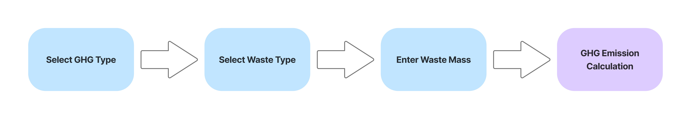
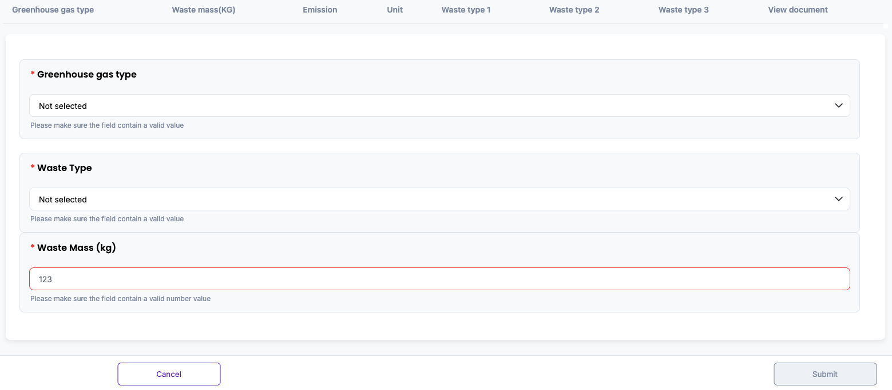
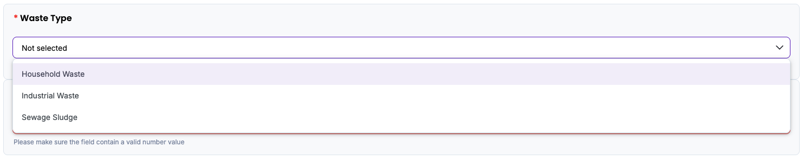
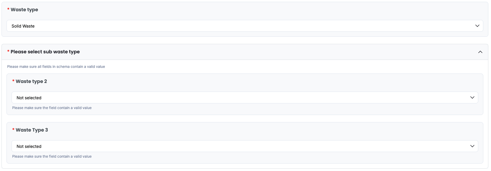
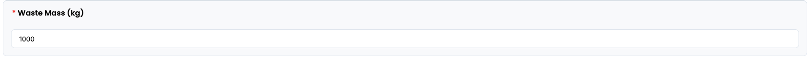
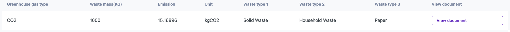
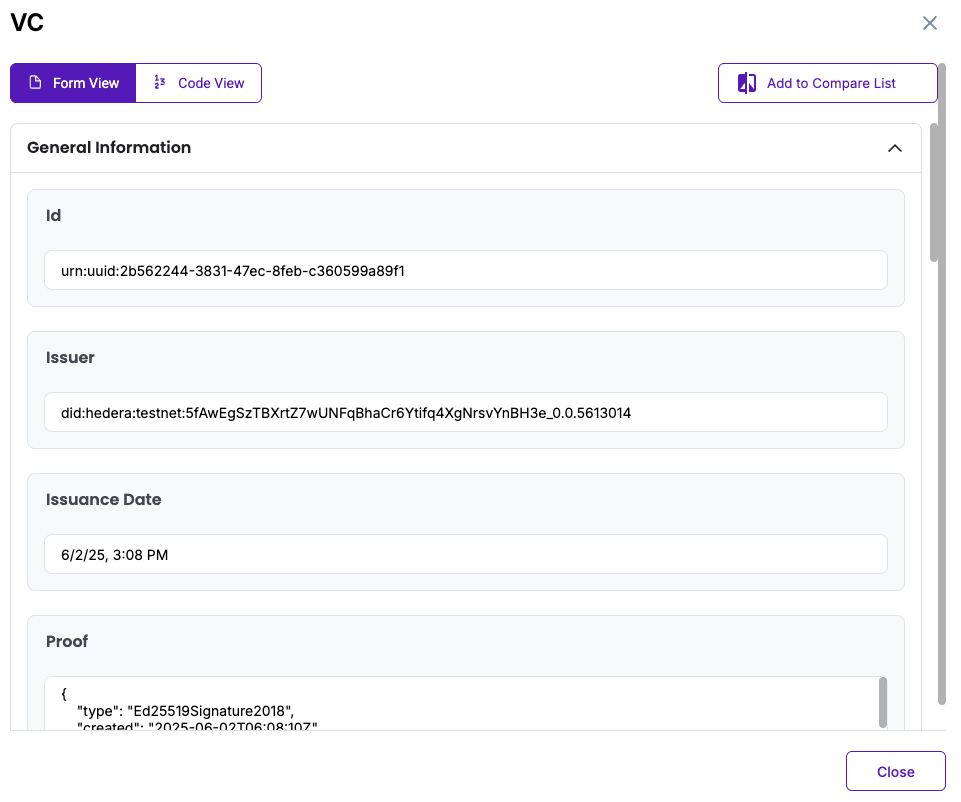

# Waste Disposal (Incineration) Methodology in Korea

Policy by WinCL

## Policy Description

This methodology provides a standardized framework for reporting organizations in Korea to quantify, report, and verify direct greenhouse gas (GHG) emissions from waste incineration. It is applicable to Scope 1 emissions when waste materials—solid, liquid, or gaseous—are thermally treated for disposal within facilities owned or operated by the organization. The methodology defines key parameters—including dry matter content, carbon fraction, fossil carbon fraction, and oxidation factor—based on national default coefficients. 

## Workflow Description

The emission calculation workflow for waste incineration begins with selecting the greenhouse gas type (CO₂, CH₄, or N₂O) and corresponding waste type. 

The user then inputs the total mass of waste incinerated during the reporting year, measured in kilograms (kg). Upon data entry, the system automatically applies one of the following fomulas depending on the selected GHG and the waste type.

+ *CO2 Emissions (Solid waste incineration) (kg) = Waste mass (kg) × Dry matter content × Carbon fraction (kgC/kg-waste) × Fossil carbon fraction × Oxidation Factor × 3.664*
+ *CO2 Emissions (Liquid waste incineration) (kg) = Waste mass (kg) × Carbon fraction (kgC/kg-waste) × Oxidation Factor × 3.664*
+ *CO2 Emissions (Gaseous waste incineration) (kg) = Waste mass (kg) × Emission factor (kgCO2/kg-waste) × Oxidation Factor*
+ *N2O Emissions (kg) = Waste mass (kg) × Emission factor (kgN2O/kg-waste) × 10⁻³*
+ *CH4 Emissions (kg) = Waste mass (kg) × Emission factor (kgCH4/kg-waste) × 10⁻³*

This digital workflow ensures standardization and transparency, in alignment with national guidelines from the Greenhouse Gas Inventory and Research Center of Korea, and is designed to support reporting consistency for verification and compliance purposes.

The diagram below outlines the policy workflow as follows: User-provided input (Blue), Automated calculation (Purple)

## Policy Guide

To begin, navigate to the policy interface where the user will input data related to waste incineration. 

Start by selecting the greenhouse gas type from the dropdown menu. The user can choose between CO2, CH4, or N2O depending on the reporting scope.

If CH₄ or N₂O is selected, the user only needs to select the single waste incinerated during the reporting year (Household Waste, Industrial Waste, and Sewage Sludge).

When CO₂ is selected, additional waste categorization is required depending on the waste phase:
+ If Solid Waste is selected, the user must specify two additional sub types incinerated during the reporting year. 
+ If Liquid Waste is selected, no additional waste type selection is required.
+ If Gaseous Waste is selected, the user must select one additional waste type incinerated during the reporting year. 

These selections are necessary for retrieving the appropriate parameters including dry matter content, carbon fraction, fossil carbon fraction, emission factor, and oxidation dactor. After selecting the waste type, enter the total mass incinerated during the reporting year in kilograms (kg). 

Once all fields are completed, the system will calculate the GHG emissions using the predefined coefficients. The result will appear on screen in kilograms (kg) of the selected greenhouse gas.

The result will be displayed on-screen and stored in the database. The “View document” button opens a Verifiable Credential (VC) issued for the calculated data. The VC includes a unique identifier (UUID), issuer DID on Hedera Testnet, issuance timestamp, input values (GHG type, waste type, waste mass), and the final emission result.  The user can view the VC either in Form View for readability or Code View for raw JSON. All VC data is cryptographically signed and stored in accordance with Guardian protocol standards.

