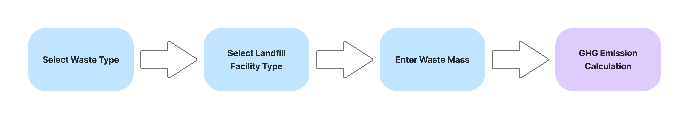
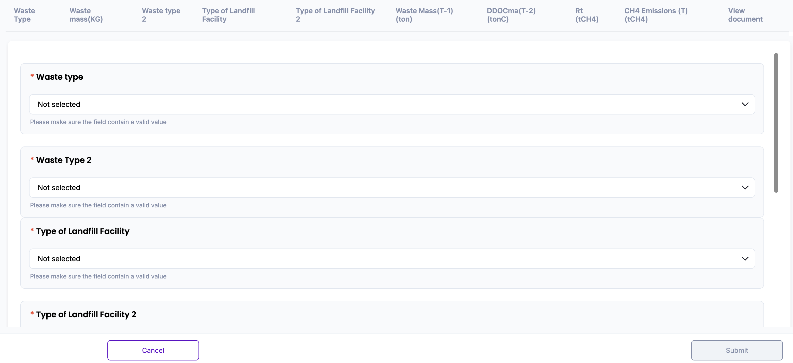
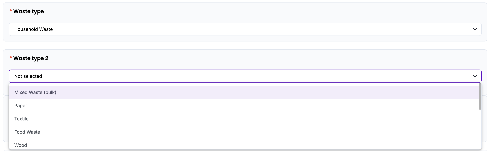
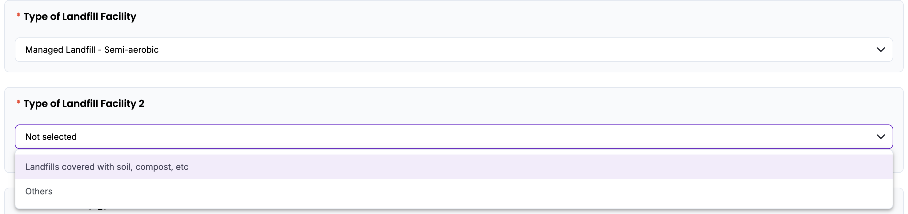
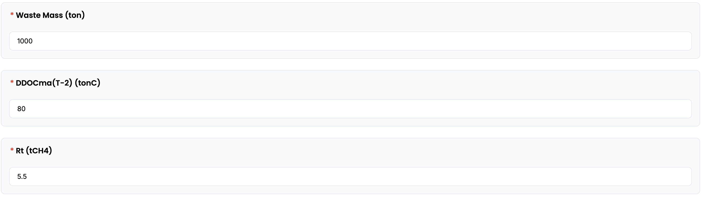
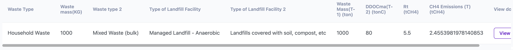
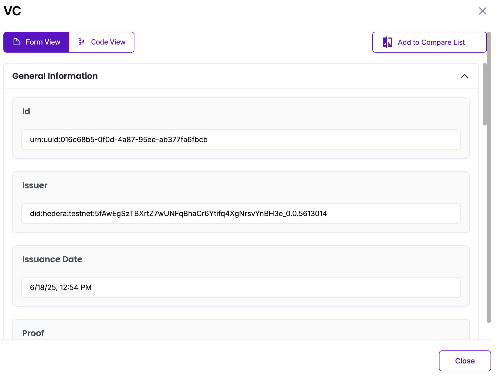

# Waste Disposal (Landfilling of solid waste) Methodology in Korea

Policy by WinCL

## Policy Description

This methodology provides a standardized framework for reporting organizations in Korea to quantify, report, and verify direct greenhouse gas (GHG) emissions from solid waste landfilling. It is applicable to methane (CH₄) emissions under Scope 1, where waste is disposed of at landfills operated by or under the control of the reporting entity. The methodology defines key parameters—including degradable organic carbon (DOC), decay rate constants (k), methane correction factors (MCF), and oxidation factors—based on national default coefficients.

## Workflow Description

The emission calculation workflow for solid waste landfilling begins with selecting the waste type and the landfill facility type.

The user then inputs the total mass of waste treated by landfill during the reporting year, measured in tons (ton). Upon data entry, the system automatically applies the system automatically calculates and applies the selected parameters and calculates final emissions using the following formula:

+ *CH₄ Emissions (t) = Maximum methane emissions possible (t) - Methane recovered (t)*
+ *Maximum methane emissions possible (t) = Organic carbon decomposed anaerobically (t) × Methane fraction × 1.336*
+ *Organic carbon decomposed anaerobically (t) = Cumulative organix carbon in previous year × (1-$e^{-k}$
)

This digital workflow ensures standardization and transparency, in alignment with national guidelines from the Greenhouse Gas Inventory and Research Center of Korea, and is designed to support reporting consistency for verification and compliance purposes.

The diagram below outlines the policy workflow as follows: User-provided input (Blue), Automated calculation (Purple)

## Policy Guide

To begin, navigate to the policy interface where the user will input data related to waste landfill. 

Start by selecting the waste type from the dropdown menu. After selecting the primary waste type (e.g., Household Waste or Industrial Waste), users are prompted to select a more specific waste category (such as paper, textile, food waste, etc.) to ensure accurate emission factor application.

Next, users must specify the type of landfill facility used. This involves a two-step selection:
+ First, choose the primary landfill facility type (Managed Landfill – Anaerobic, Semi-aerobic, Unmanaged Landfill by depth, or Others)
+ Then, select an additional classification (e.g., landfills covered with soil, compost, or others) to reflect the cover condition of the site.
These inputs determine the appropriate Organic carbon decomposed anaerobically (t) and maximum methane emissions (t) possible for final emissions calculation.

After selecting the waste type and landfill facility type,users must enter three key values required for the final methane emissions calculation:
+ Waste Mass (ton): The total amount of waste landfilled during the reporting year, measured in kilograms.
+ DDOCma(T-2) (tonC): The amount of degradable organic carbon that was deposited and subject to anaerobic decomposition two years prior. This historical data is used to calculate the accumulated methane generation potential.
+ Methane Recovery (Rt): The total amount of methane recovered through gas capture or flaring systems during the reporting year.

These inputs are essential for estimating methane emissions based on both the theoretical potential and actual recovery performance.

Once all fields are completed, the system will calculate the GHG emissions using the predefined coefficients. The result will appear on screen in tons (tCH₄).

The result will be displayed on-screen and stored in the database. The “View document” button opens a Verifiable Credential (VC) issued for the calculated data. The VC includes a unique identifier (UUID), issuer DID on Hedera Testnet, issuance timestamp, input values (waste type, landfill facility, waste mass), and the final emission result.  The user can view the VC either in Form View for readability or Code View for raw JSON. All VC data is cryptographically signed and stored in accordance with Guardian protocol standards.

