# Food Loss & Waste (International) 1.0 Policy
Food Loss & Waste 1.0 -International (FLWI01) is an initiative to reduce GHG emissions by reducing the amount of food discarded, and therefore increases food available for human consumption which in turn helps in downstream GHG emission reductions.

## Table of Contents

- [Problem Statement & Facts](#problem-statement--facts)
- [Policy Objectives and Scope](#policy-objectives-and-scope)
- [Project Climate Relevance and Significance for Sustainability/ESG Assets](#project-climate-relevance-and-significance-for-sustainabilityesg-assets)
- [Unique User Roles](#unique-user-roles-and-climate-financing-approach)
- [How Climate Financing/Tokens work?](#how-climate-financingtokens-work)
- [Demo Video](#demo-video)
- [Policy Workflow](#policy-workflow)
- [Available Roles and Responsibilities](#available-roles-and-responsibilities)
- [Policy Step-by-Step flow](#policy-step-by-step-flow)
- [TODO](#todo)

## Problem Statement & Facts
- As per Food and Agriculture Organization (FAO) approximately one-third of all food produced for human consumption is lost or wasted annually.
- Food loss and waste (FLW) also account for 8-10 percent of global greenhouse gas emissions (GHGs).
- FAO estimates that if food waste were a country, it would be the third-largest emitter of greenhouse gases after the United States and China.
- It occurs at different stages in the food chain (farm level, during transport, in storage, at food processing, retail outlet, in households).

Tragically, while millions of people suffer from hunger and malnutrition worldwide, GHG emissions and climate change from food loss and waste exacerbate the situation, creating a vicious cycle of environmental degradation and human suffering.

## Policy Objectives and Scope
Food Loss & Waste 1.0 -International (FLWI01) is a hedera/guardian based workflow that has following objectives:

**Greenhouse Gas Emission Reduction**: The policy aims to mitigate greenhouse gas emissions associated with food loss and waste, which contribute significantly to global emissions.

**Multi-Stakeholders, Collaborative & Rewards**: The policy emphasises collaboration among stakeholders across the food supply chain, including farmers, processors, retailers, consumers, and government agencies. It rewards tokens to different stakeholders for change.

**Entire Supply Chain Integration**: The policy encompasses all stages of the food chain, from farm production to consumption, recognizing that food loss and waste are interconnected phenomena with multifaceted causes and effects. 

**Monitoring and Evaluation**: The policy emphasises the importance of monitoring and evaluating the effectiveness of interventions in reducing food loss and waste and mitigating greenhouse gas emissions using independent validation & verification bodies.

**Micro-scale Approach**: This policy is built upon micro-scale-first approach where a small as a single food loss and waste source to destination can participate and help bring accountability, in turn leading to thousands of such sources & destinations clustered together.

## Project Climate Relevance and Significance for Sustainability/ESG Assets
- Mitigation of GHG Emissions by preventing food loss and waste throughout the supply chain. 
- Open & traceable climate financing to reward stakeholders for their efforts in food loss and waste reduction and GHG emissions.
- Resource efficiency as it promotes efficient use of resources such as water, land, and energy.
- Transparency and accountability in GHG reduction mechanism to enhance trust among stakeholders and facilitate informed decision-making.
- Long-term environmental and social impact by addressing the root causes of food loss and waste, hence contributing to the overall well-being of both ecosystems and human populations.
- Social equity and food security by increasing the availability of food for human consumption.
Community empowerment and resilience as it helps take action at the local level and contribute to broader sustainability goals like SDG or Paris 2°C.

## Unique User Roles and Climate Financing Approach
Food Loss & Waste 1.0 -International (FLWI01) is a workflow that helps initiate food loss and waste reduction projects, monitor progress and allocate tokens to different stakeholders.

**Climate Authority**: It is the admin/owner of the policy workflow

**VVB**: It verifies and validates monitoring reports from _Project Proponent_.

**Project Proponent**: It is the project proposer and executor of projects and submits monitoring reports to _VVB_ & _Climate Authority_ of the policy workflow. It also accepts _Project Participating Entities_ to its projects and receives micro-scale reports from such _Project Participating Entities_.

**Project Participating Entities**: These are the ground entities like farmers, transporters, food processing units, hospitality managers, households, etc who takes actions to reduce food loss and waste and submits entity level reports to _Project Proponent_ itself (not to _VVBs_ or _Climate Authority_)

### How Climate Financing/Tokens work?
- **FoodGHGEntityToken (FGET)**: It is minted by _Project Proponent_ to _Project Participating Entities_ who submits micro-scale activities monitoring report. For example, if a food storage entity in an area has submitted a report that they've reduced X amount of GHG emissions, _Project Proponent_ can validate their entity report and mint token to reward them.
- **FLWGHGEmissionToken (FLW-GET)**: It is minted by _Climate Authority_ to _Project Proponent_ who submits main monitoring activities report, which are validated and verified by _VVB_.

This ensures a distributed financing model, where _Project Proponent_ works throughout the year with _Project Participating Entities_ and rewards them small value _FoodGHGEntityToken (FGET)_ tokens as per their efforts at micro-scale (monthly/seasonally/half-yearly). And then _Project Proponent_ combines these together and submits a main report (years/half-yearly) and receives large value _FLWGHGEmissionToken (FLW-GET)_ tokens.

This also helps take care of variability factors like large food supply chain involving multiple entities, production variations due to weather change and so on. For example, in a year bumper Rice production happens, and ground entities handling storage becomes very important, OR for bumper production of small time scale items like fruits/vegetables etc frequent transport becomes important, and hence rewarded accordingly.

## Demo Video
https://www.youtube.com/watch?v=yycgJHYl8I4

## Policy Workflow

## Available Roles and Responsibilities
**Climate Authority (Registry/Owner)** - As registry/owner Climate Authority, it undertake tasks involving the approval of projects, overseeing their progress, and conducting thorough assessments of project descriptions and monitoring reports. This meticulous procedure guarantees that initiatives aimed at reducing food loss, and reducing GHG emissions adhere to stringent standards before issuing tokens.

**VVB - Verification and Validation Body** - The VVB plays a critical role in independently verifying and validating the project data submitted by the project proponent. They thoroughly assess the project's food waste reduction potential, methodologies, and adherence to the policy guidelines. Based on their evaluation, the VVB either approves or rejects the project for registration, including verification of monitoring reports submitted.

**Project Proponent** - The project proponent is responsible for executing the food loss and waste reduction project. The project proponent must adhere to the requirements outlined by Climate Authority and provide evidence of the food loss and waste reduction achieved. Upon successful verification, the project proponent receives _FLWGHGEmissionToken (FLW-GET)_ tokens as an incentive for their GHG reduction efforts. Project Proponent is also responsible for verifying ground entities reports and issuing _FoodGHGEntityToken (FGET)_ tokens to such _Project Participating Entities_.

**Project Participating Entities** - The project participating entities is responsible for executing the micro-scale food loss and waste reduction activities. They submit micro-scale reports and provide evidence of the food loss and waste reduction achieved. Upon successful verification, the project participating entity receives _FoodGHGEntityToken (FGET)_ tokens as an incentive for their GHG reduction efforts.

## Policy Step-by-Step flow
1. Create new users and assign role like Project Proponent, VVBs, Project Participating Entities
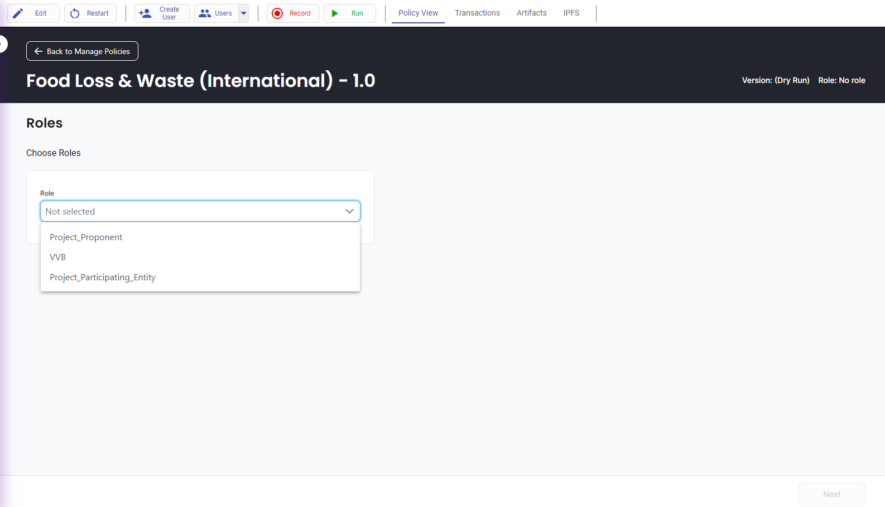

2. Add relevant user details like name of Project Participating Entities (PPE)

3. Wait for approval from relevant level
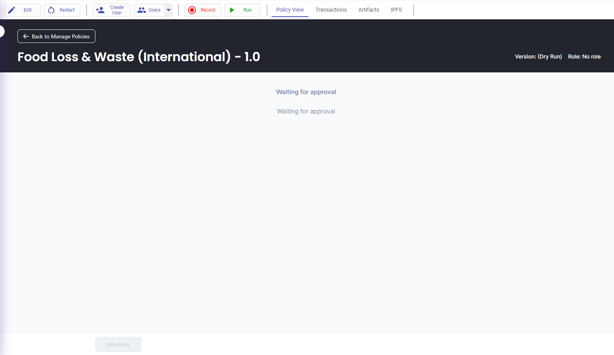

4. Approve Project Participating Entities (PPE) Users from Project Proponent dashboard

5. Project Proponent user adds project design document details 

6. Climate Authority/Registry approves the project

7. Climate Authority/Registry approves the VVBs
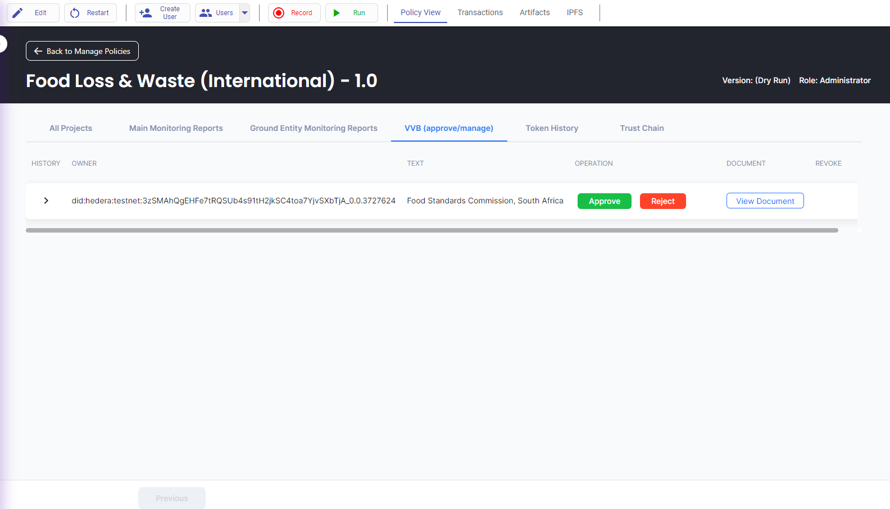

8. Project Proponent user assigns VVB to its project

9. VVB reviews and approves the project design document
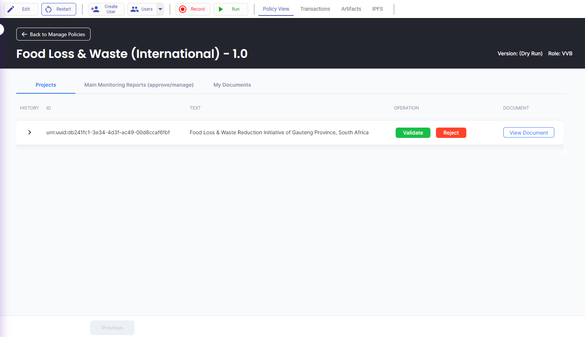

10. Project Participating Entities (PPE) user see list of projects and Ground Entity Monitoring reports in it's dashboard

11. Project Participating Entities (PPE) user can submit an Ground Entity Monitoring report to the project

12. Project Proponent reviews and verifies micro-scale reports from Project Participating Entities (PPE)
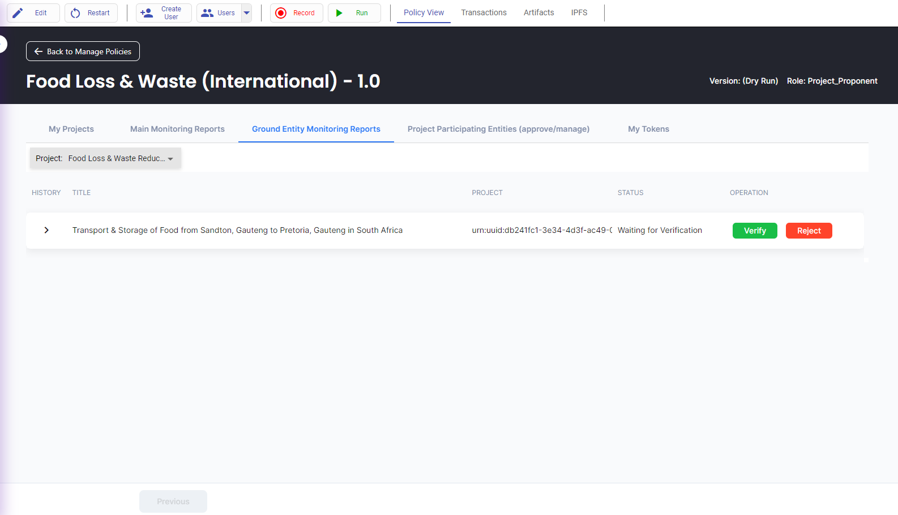

13. On verification, _FoodGHGEntityToken (FGET)_ token is minted to respective Project Participating Entities (PPE)
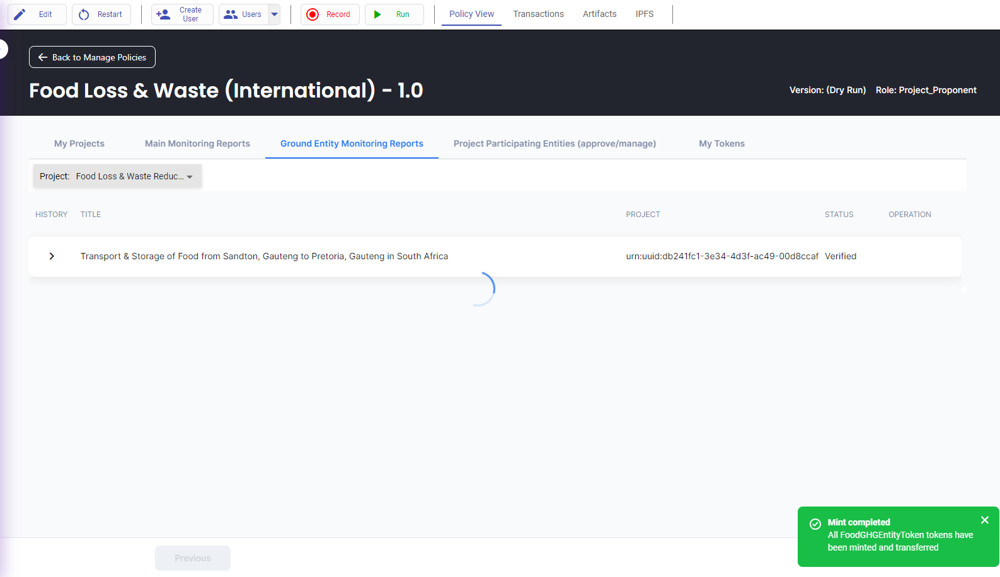

14. Project Participating Entities (PPE) user can see list of token received
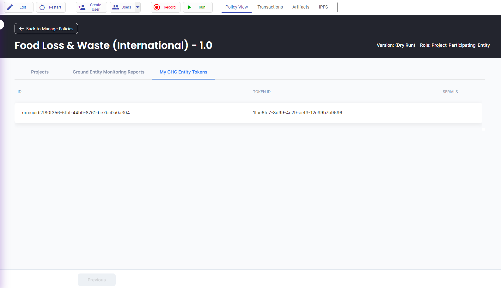

15. Project Proponent user dashboard shows list of projects, main reports, ground entity monitoring reports, tokens

16. Project Proponent user can submit a Main Monitoring report to VVBs & Climate Authority/Registry
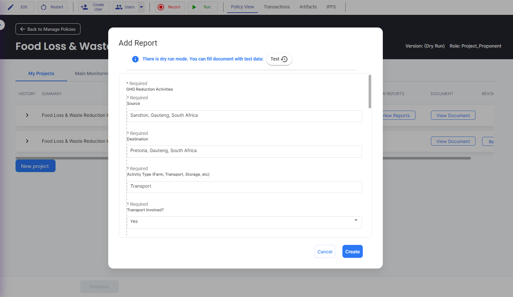

17. VVBs reviews and verifies main monitoring reports from Project Proponents
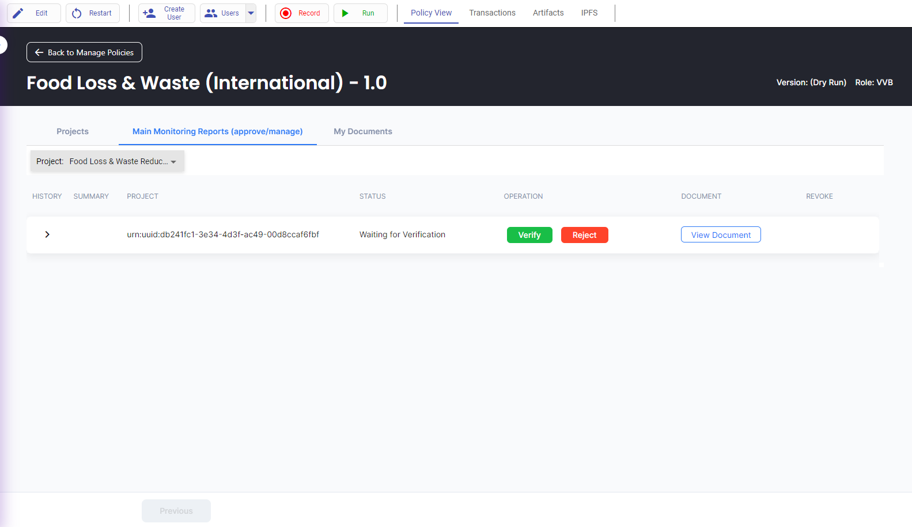

18. Climate Authority/Registry reviews and mints _FLWGHGEmissionToken (FLW-GET)_ tokens
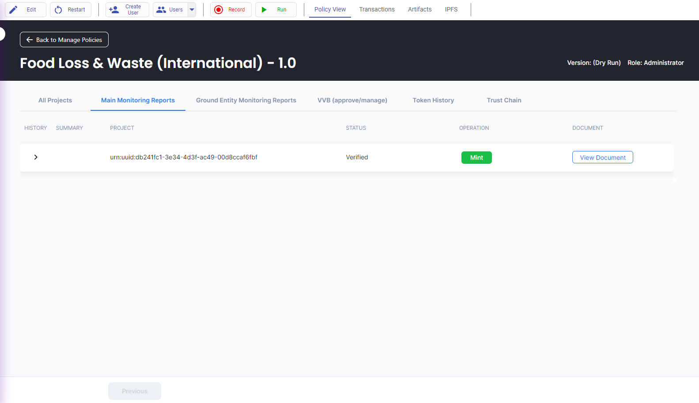
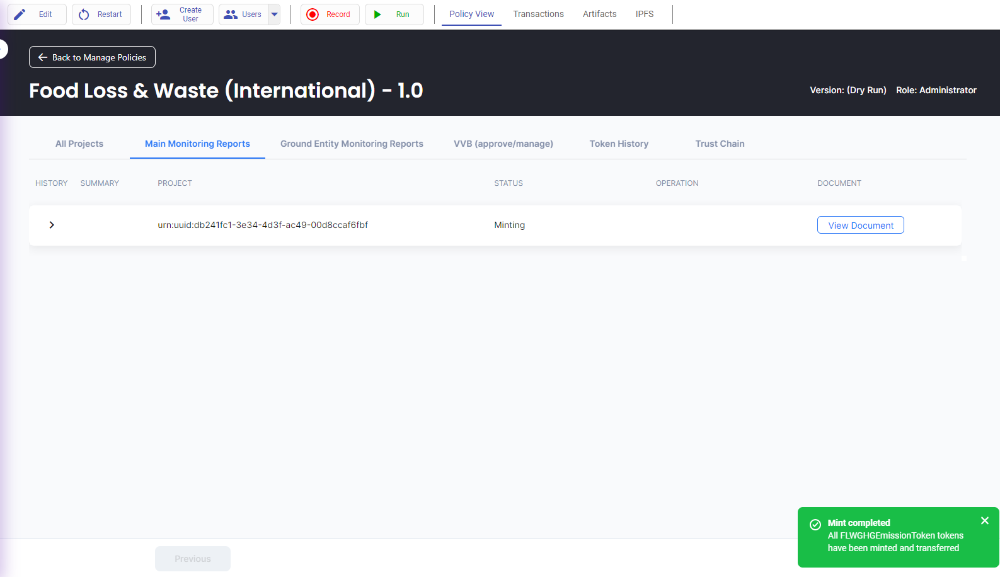

19. Token history (one for each tCO2e)

## TODO
- automatically generate main monitoring reports for _project proponents_ using available micro-scale reports from _project participating entities_ for a given timeframe.

## Supporting Resources
This policy was designed by taking learings and references from following sources: [UNEP reports](https://www.unep.org/resources/report/unep-food-waste-index-report-2021), [FAO article](https://www.fao.org/newsroom/detail/FAO-UNEP-agriculture-environment-food-loss-waste-day-2022/en), [UN SDG goals](https://www.un.org/sustainabledevelopment/sustainable-consumption-production/), [Verra VM0046](https://verra.org/wp-content/uploads/2023/07/VM0046_FLW_v1.0.pdf) and, etc.

## How to use?
Start a hedera/guardian instance and import _.policy_ file.