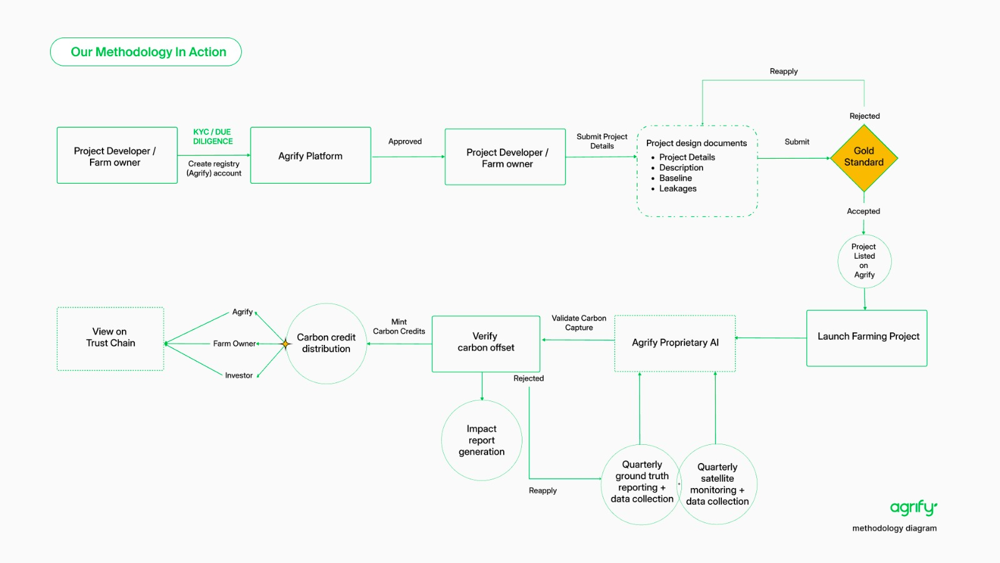

# Agrify Carbon Credit Methodology

## Policy Description

Agrify integrates cutting-edge AI and satellite imagery to revolutionize the validation and issuance of carbon credits from regenerative agriculture. Ensuring adherence to globally recognized standards such as the Gold Standard, the policy mandates rigorous KYC and due diligence for all project developers, thereby fostering trust in the carbon credits issued. Our platform empowers farmers worldwide, particularly those impacted by climate change, by unlocking access to climate capital through verified carbon offsetting.

## Workflow Description

1.⁠ ⁠*Project Developer / Farm Owner Onboarding*:

- Registration involves rigorous KYC and due diligence to set up a verified account on the Agrify platform.

  2.⁠ ⁠*Project Submission and Approval*:

- After approval, project developers submit detailed project plans including objectives, expected carbon sequestration metrics, and strategies for minimizing leakages.

  3.⁠ ⁠*Gold Standard Compliance*:

- Projects undergo a strict compliance process with the Gold Standard to ensure that only projects with real, measurable, and long-term benefits are accepted and listed on Agrify.

  4.⁠ ⁠*Satellite Imagery and AI Integration*:

- _Carbon Credit Generation_: Utilizing satellite imagery and proprietary AI algorithms, Agrify accurately quantifies the carbon sequestration on farms.
- _Carbon Credit Distribution_: Transparent and traceable carbon credits are distributed to investors via the blockchain-based Trust Chain.

  5.⁠ ⁠*Validation and Monitoring*:

- _Satellite Monitoring & AI Analysis_: Continuous monitoring through satellite imagery coupled with AI analysis validates the carbon sequestration efforts of the farms on a quarterly basis.
- _Ground Truth and Data Verification_: Ground truth reporting complements satellite data, providing a robust mechanism for validating the carbon capture and ensuring the accuracy of credit issuance.

  6.⁠ ⁠*Launch and Impact Assessment*:

- _Project Launch_: Approved farming projects launch and begin their contribution to carbon sequestration.
- _Impact Reporting_: For projects that fail validation, impact reports are generated, offering insights for improvements and reapplication.

This policy and workflow description articulates Agrify's dedication to leveraging advanced technology for robust and transparent carbon credit generation, affirming our commitment to a sustainable and equitable approach to agricultural carbon finance.

## Workflow Diagram

