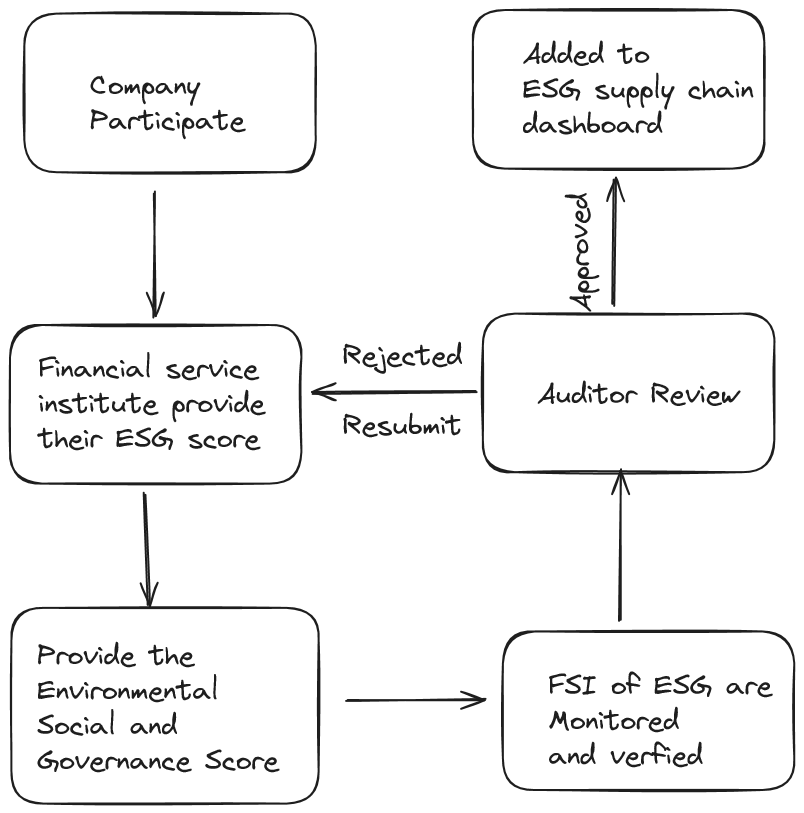

# Overview 
The overall aim of this policy is to furnish verifiable ESG scores for financial institutions. Through seamless integration, it unlocks boundless opportunities. These ESG scores are sourced from registrars, specifically FSIs, and subsequently authenticated by ADMIN.

Once validated, these ESG scores empower governments, investors, and consumers alike with heightened confidence in their decision-making processes.
The overall objective of this policy is to monitor Greenhouse Gas (GHG) emissions during the production life cycle stage for products within the atma.io digital product cloud. The calculation and tracking of emission data is based on the energy consumption during the production of a single item or batch of items.

The calculated GHG emissions are then published to a dedicated topic for easier display outside of the policy. At the end of each month the total emissions are aggregated and a emission token is minted. 

The policy was written and tested with version 2.6.3 of Guardian.   

## Roles

This policy revolves around a singular role, beyond the standard registry, which pertains to the organization or company accountable for their ESG scores.

In the foreseeable future, multiple roles may be introduced as various organizations may partake in the verification of ESG scores

## Setup

Before the policy can be leveraged to integrate ESG scores, it necessitates the storage of the following information:

- **Registrar**: The FSI organization seeking to authenticate the ESG Scores.
- **Admin**:  The designated entities within the organization tasked with verifying the ESG score
- **ESG**: Environmental, Social, and Governance Score.

## Usage

Following the completion of the initial setup, the registrar can furnish the ESG scores for verification by admins. Once authenticated by admins, these scores can be utilized by institutions, governments, and customers, instilling heightened confidence in their decision-making processes.

