# Sector-Specific Food Loss & Waste GHG Reduction Policy - 1.0
Sector-Specific Food Loss & Waste GHG Reduction Policy - 1.0 (SSFLWGRP001) is an initiative to reduce GHG emissions by reducing the amount of food discarded through government interventions by focusing on specific segments of food supply chain, therefore also addressing country specific issues and compliance to national regulations.

## Table of Contents

- [Problem Statement & Country Specific Issues](#problem-statement--country-specific-issues)
- [Policy Objectives and Scope (for poor and developing countries)](#policy-objectives-and-scope-for-poor-and-developing-countries)
- [Project Climate Relevance and Significance for Sustainability/ESG Assets (for poor and developing countries)](#project-climate-relevance-and-significance-for-sustainabilityesg-assets-for-poor-and-developing-countries)
- [Available Roles](#available-roles)
- [How Climate Financing/Tokens work at country level?](#how-climate-financingtokens-work-at-country-level)
- [Demo Video](#demo-video)
- [Policy Workflow](#policy-workflow)
- [Policy Step-by-Step flow](#policy-step-by-step-flow)
- [TODO](#todo)

## Problem Statement & Country Specific Issues
We know that approximately one-third of all food produced for human consumption is lost or wasted annually (as per FAO estimates) and this lost or wasted food causes 8-10 percent of global greenhouse gas emissions (GHGs).

Although, various methodologies and approaches are available to design a project for the above problem space.

However, combine it with 3 additional challenges occurring in developing and poor countries:
- lack of investment available to improve the entire life cycle of food supply chain.
- conflict with country-specific regulations, laws, food safety standards including role and red-tapism of governing bodies.
- social and cultural barriers to international standards.

Think of this, if a country is not available to join an international standards based methodology, why should it not have an option to customize and execute projects specific to its needs?

This policy aims to cater to country-specific needs, bring government bodies in picture, focus on specific sectors to channel investments where its most productive. Eventually, this will lead to reduction of hunger and malnutrition, GHG emissions and tackle climate change.

## Policy Objectives and Scope (for poor and developing countries)
Sector-Specific Food Loss & Waste GHG Reduction Policy - 1.0 (SSFLWGRP001) is a hedera/guardian based workflow that has following objectives:

**Greenhouse Gas Emission Reduction**: The policy aims to mitigate greenhouse gas emissions associated with food loss and waste, which contribute significantly to global emissions.

**Government Bodies Participation**: Govt bodies like food safety organisations, central govt departments, etc becomes the policy owner and registry. They can streamline rules and regulations compliance, channel investment to productive segments.

**Sector Specific Targets**: In poor countries, due to paucity of investments, only limited funding is available. So govt bodies can channel those investments to specific sectors. For example, if a country produces perishable commodities like fruits/vegetables, more focus should be on cold storage to avoid food wastage. Or, if a country has poor food processing technology, more focus should be to reward food processing entities to avoid food wastage.

**Multi-Stakeholders, Collaborative & Rewards**: The policy emphasizes collaboration among stakeholders across the food supply chain, including farmers, processors, retailers, consumers, and government agencies. It rewards different tokens to different stakeholders.

**Monitoring and Evaluation**: The policy emphasizes the importance of monitoring and evaluating the effectiveness of interventions in reducing food loss and waste and mitigating greenhouse gas emissions using independent validation & verification bodies, which can be govt's own departments or officials.

## Project Climate Relevance and Significance for Sustainability/ESG Assets (for poor and developing countries)
- Reduction of GHG Emissions by preventing food loss and waste throughout the supply chain.
- Nurture and reward specific segments in food supply chain based on country specific local conditions.
- Open & traceable climate financing to reward stakeholders for their efforts in food loss and waste reduction and GHG emissions.
- Efficient resource allocations, better utilization of climate funds received from international bodies
- Resource efficiency as it promotes efficient use of resources such as water, land, and energy.
- Transparency and accountability in GHG reduction mechanism to enhance trust among stakeholders and facilitate informed decision-making.
- Long-term environmental and social impact by addressing the root causes of food loss and waste, hence contributing to the overall well-being of both ecosystems and human populations.
- Social equity and food security by increasing the availability of food for human consumption.
Community empowerment and resilience as it helps take action at the local level and contribute to broader sustainability goals like SDG or Paris 2°C.

## Available Roles

**Government Authority (Registry/Owner)**: It is the admin/owner of the policy workflow. Govt organization itself undertakes tasks involving the approval of projects, overseeing their progress, and conducting thorough assessments of project descriptions and monitoring reports.

**VVB (Verification Authority)**: It verifies and validates monitoring reports from _Project Implementing Agency_. The VVB plays a critical role in independently verifying and validating the project data submitted by the project implementing agencies. They thoroughly assess the project's food waste reduction potential, methodologies, and adherence to the policy guidelines. Based on their evaluation, the VVB either approves or rejects the project for registration, including verification of monitoring reports submitted.

**Project Implementing Agency**: It is the project proposer and executor of project activities on ground and submits monitoring reports to _VVB_ & _Government Authority/Registry_ of the policy workflow. It is responsible for executing the food loss and waste reduction project for specific sectors. Upon successful verification, the project implementing agency receives sector specific tokens like _Storage GHG Emission Token (S-GET)_ or _Transport GHG Emission Token (T-GET)_ as an incentive for their GHG reduction efforts.

### How Climate Financing/Tokens work at country level?
Since, poor and developing countries can't adhere to entire food supply chain, they can allocate tokens/funds specific to sectors. Some token examples are:

- **Farm Production GHG Emission Token (FP-GET)**: for activities in food production, farms, agricultural practices

- **Transport GHG Emission Token (T-GET)**: for transport of food across supply chain

- **Storage GHG Emission Token (S-GET)**: for storage, cold storage efforts

- **Processing GHG Emission Token (P-GET)**: for processing food and increasing shelf-life

- **Consumption GHG Emission Token (C-GET)**: for improving distribution and consumption of food by citizens

Such mechanism helps allocate, channel and distribute limited finances available to poor and developing countries for productive utilization and hence effectively reduce GHG emissions.

## Demo Video
https://www.youtube.com/watch?v=T2lMHkTAerM

## Policy Workflow
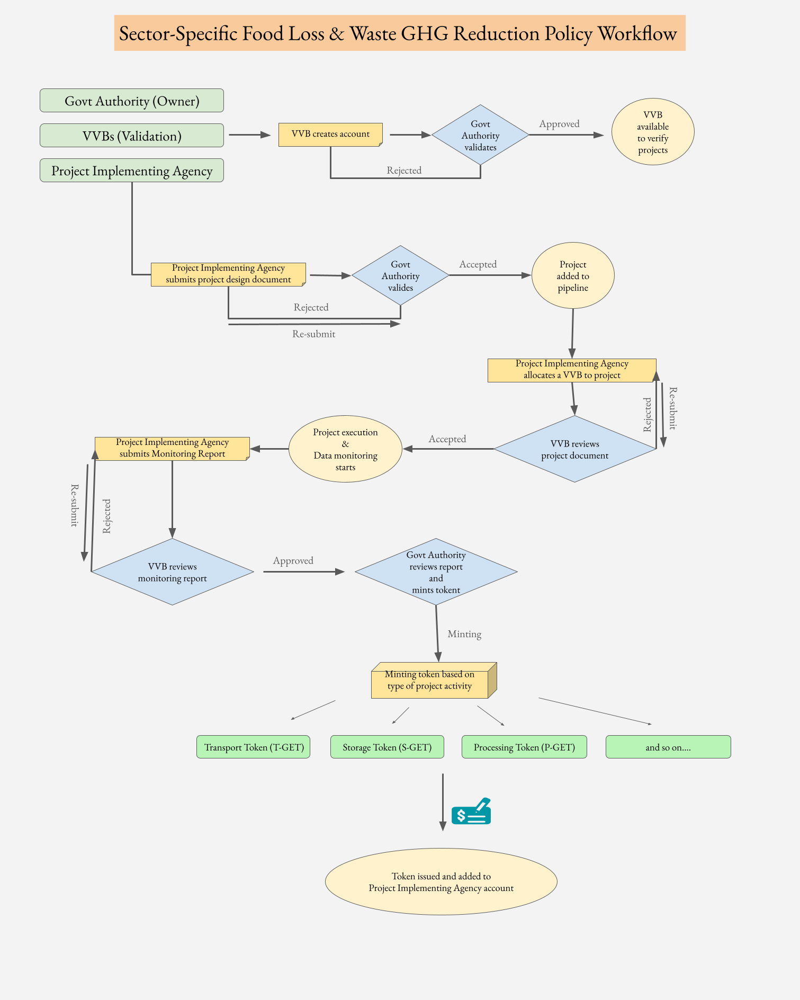

## Policy Step-by-Step flow
1. Create new users and assign role like Project Implementing Agency, VVBs (Verification Authority)
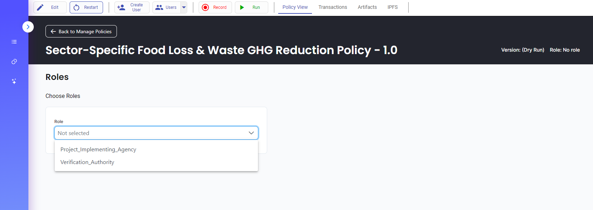

2. Add relevant user details like details of VVBs (Verification Authority)
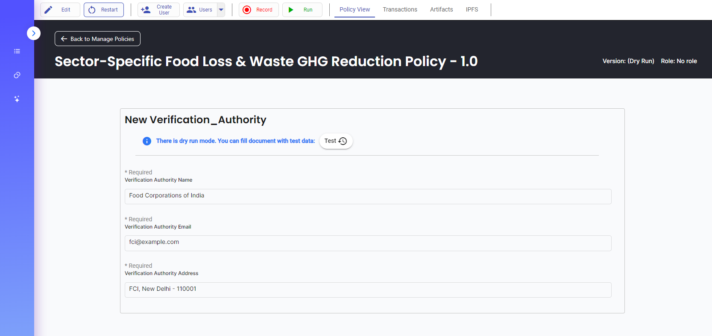

3. Wait for approval from Govt Authority (Owner/Registry)
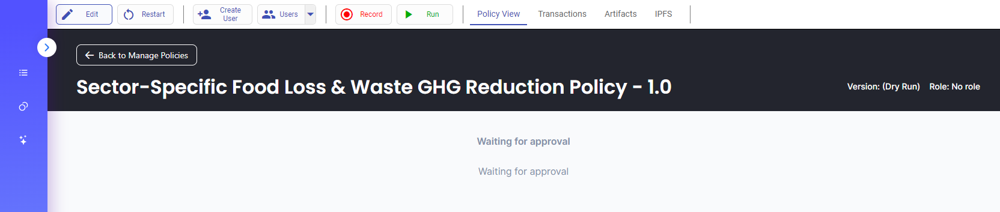

4. Govt Authority (Owner/Registry) approves the VVBs (Verification Authority)
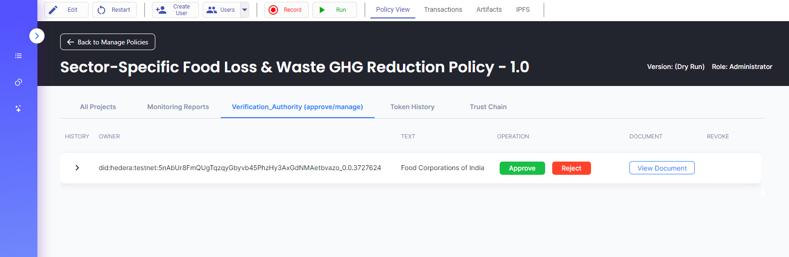

5. Project Implementing Agency submits project design documents 
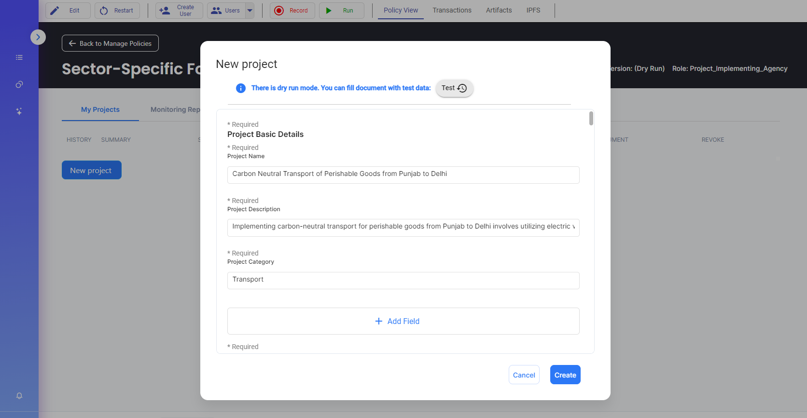

6. Govt Authority (Owner/Registry) approves the project

7. Project Implementing Agency assigns VVB (Verification Authority) to its project
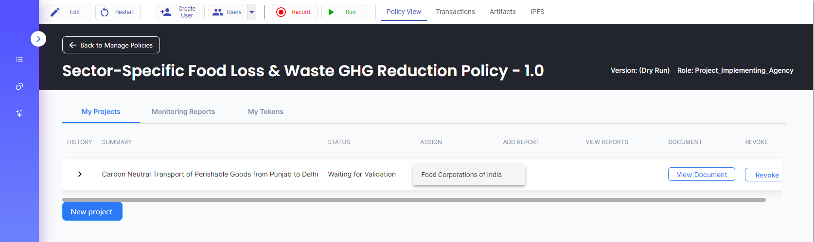

8. VVB (Verification Authority) reviews and validates the project design document
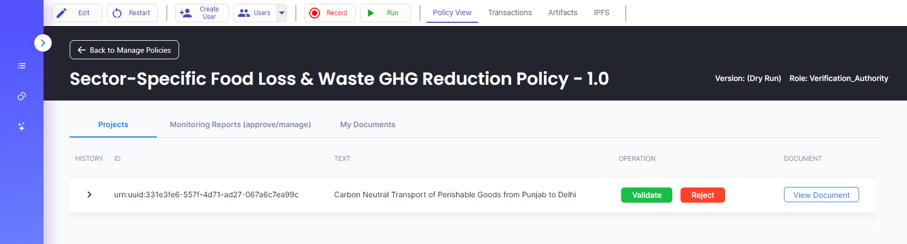

9. Project Implementing Agency dashboard shows list of projects, monitoring reports, tokens
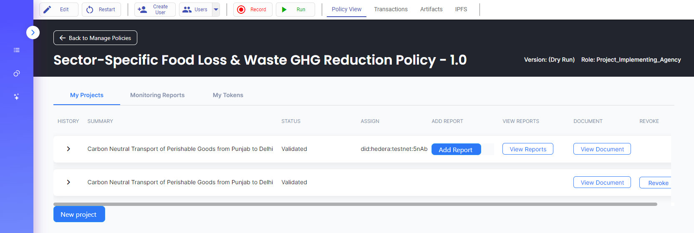

10. Project Implementing Agency submits a monitoring report to VVBs (Verification Authority) & Govt Authority (Owner/Registry)
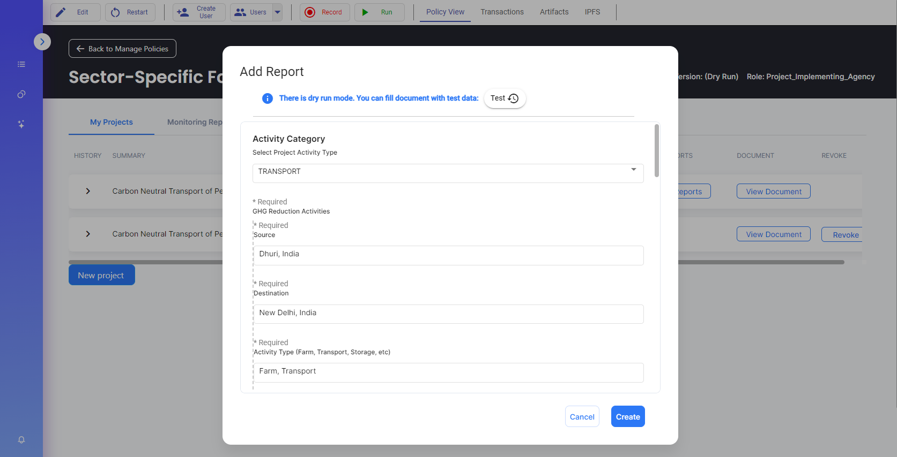

11. VVBs (Verification Authority) reviews and verifies monitoring reports from Project Implementing Agency
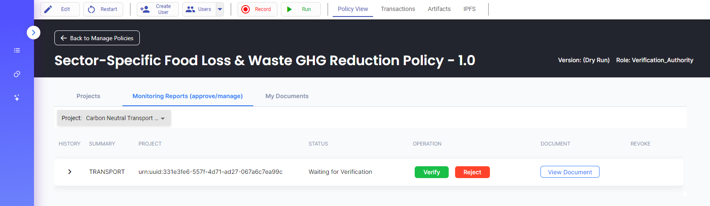

12. Govt Authority (Owner/Registry) reviews and mints activity specific tokens like _Transport GHG Emission Token (T-GET)_ or _Storage GHG Emission Token (S-GET)_
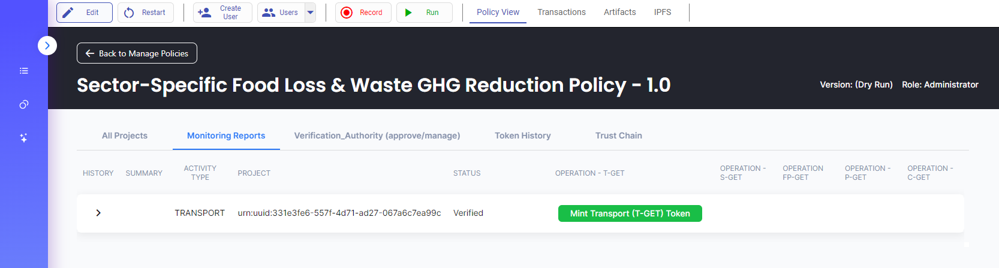
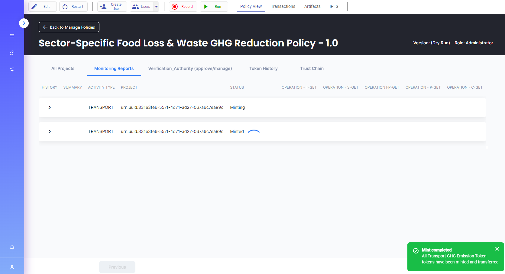

13. Token history
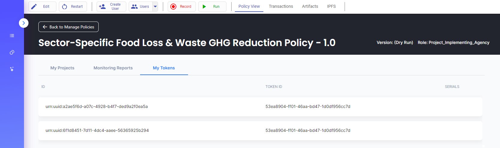

14. Project Implementing Agency can see list of token received
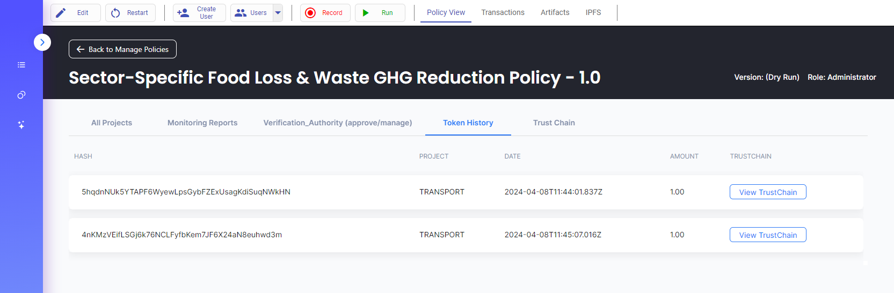

## TODO
Connect tokens with banking system i.e. project implementing agencies receive equivalent money based on tokens available in their account

## Supporting Resources
This policy was designed by taking learings and reference from following sources: [investment in sustainable rice](https://sustainablerice.org/wp-content/uploads/2023/09/SRLI-Scaling-private-sector-investment-in-sustainable-rice-Needs-and-opportunities_Nov22.pdf), [Sustainable Rice Platform](https://sustainablerice.org/),  [FCI India](https://pib.gov.in/newsite/PrintRelease.aspx?relid=114860), [FAO article](https://www.fao.org/newsroom/detail/FAO-UNEP-agriculture-environment-food-loss-waste-day-2022/en), [Verra VM0046](https://verra.org/wp-content/uploads/2023/07/VM0046_FLW_v1.0.pdf), [UNFCCC](https://cdm.unfccc.int/UserManagement/FileStorage/5IP163JN4RKG2D0XOQZS9T7W8MEYAC)

## How to start?
Download and import _.policy_ file into hedera/guardian instance