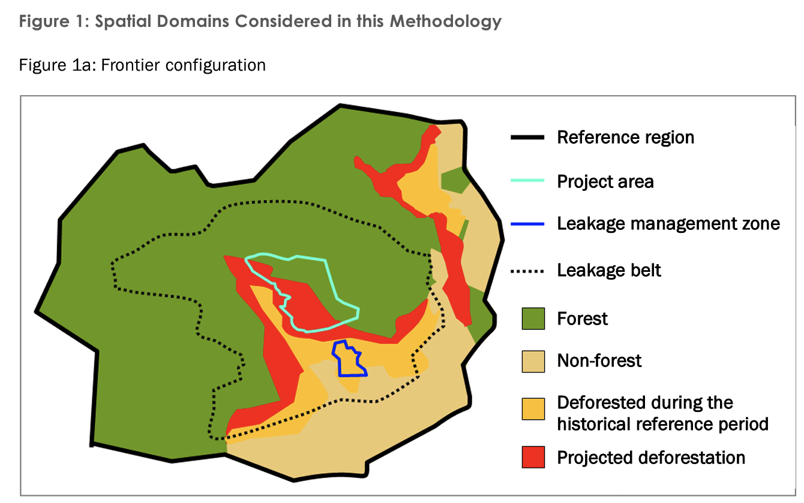
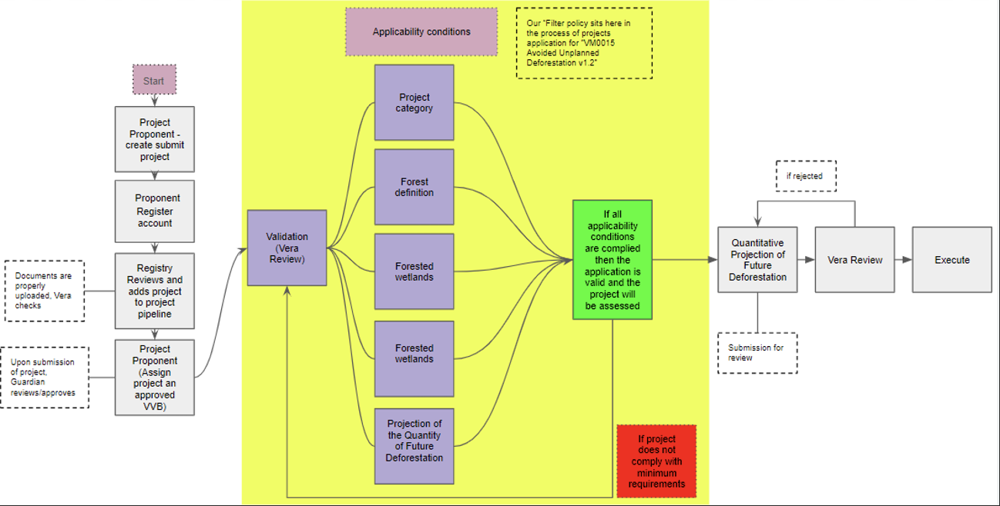
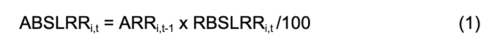
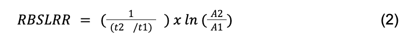

For VM0015 Avoided Unplanned Deforestation v1.2

## Table of Contents
<!-- TOC -->
- Summary
- Introduction
- Significance of VM0015 Policy
- Policy description
- Workflow description
- How does it work?
- Conclusion
<!-- /TOC -->

## Summary

Our project is focused on validating projects that claim to avoid unplanned deforestation, based on the VCS methodology  VM0015 Avoided Unplanned Deforestation v1.2. 
Our policy will allow Verra to efficiently scope in/out projects depending on compliance with the minimum requirements for the project to be assessed.

## Introduction
Deforestation remains a critical environmental issue, contributing significantly to carbon emissions and biodiversity loss worldwide. VM0015's focus on avoided unplanned deforestation is highly relevant in the context of climate action. By preventing deforestation, we can conserve carbon sinks, preserve biodiversity, and mitigate greenhouse gas emissions.

## Significance of VM0015 Policy
The insights generated from VM0015 have profound policy implications. They empower decision-makers and policymakers with data-driven evidence to formulate effective strategies for combating deforestation and promoting sustainable land use practices.

In a broader context, VM0015's calculations contribute to global initiatives on climate change mitigation and adaptation. They align with international agreements like the Paris Agreement and contribute to achieving Sustainable Development Goals related to climate action and biodiversity conservation.

The paper's applicability extends to climate finance as well. The verified carbon credits generated from avoided deforestation projects can attract investments and support the scaling up of climate mitigation efforts.

## Policy description

This policy is to scope projects that avoid deforestation in areas that would be deforested if no action is taken. Projects within the scope will prevent a decrease in carbon stock due to other activities, such as charcoal production. 

The “Projects Filter” policy will allow Verra to efficiently filter projects that comply with the minimum requirements to pass the following assessment stage and reduce time and labour waste.

Projects claiming to avoid deforestation must demonstrate that the forest area will be reduced without their project. This demonstration is done by comparing the forest area (green) with the projected deforestation area (red) within the Reference Region and then estimating how many hectares/year of forest will be lost because of, e.g. charcoal production, agriculture or grazing activities, as long as the category is Avoiding Unplanned Deforestation according to the most recent VCS Standard.

Figure 1: Spatial domains [source](https://verra.org/wp-content/uploads/2023/12/VM0015-Avoided-Unplanned-Deforestation-v1.2.pdf)

## Workflow description

## How does it work?
Our policy filter project is based on the main characteristics that projects must have to be considered:
1. The workflow begins with the Project Proponent registering with Vera by creating a project design document (VM0015). They must then fill out the project details. This includes a summary of the project description, project scope, forest formation and project start date.

2. The clue questions in the online form to scope in a project are:
	
	a) Project category: we only allow options that are within the scope of the policy as per Table 1, represented by letters A to H (Vera 2013)

	b) Forest definition: We adapted the forest definition in p.8 footnote 5 (Vera 2013) by asking these questions: 
	- Is the proposed forest area more extensive than 0.05 - 1 ha?
	- Is the Forest land area in the Project area more extensive than 30%?
	- Do trees in the forest area of land in the Project area can reach a minimum height of 2 - 5m at maturity in situ?
	- Is the Forest area of land in the Project area older than 10 years before the project start date?

	c) Forested wetlands: We include specific questions relating to the forested wetlands as per page 12 (Vera 2013), where it is allowed to specify if this type of land is in the Project area. However, the project will be rejected if it does grow on peat.

	d) Baseline scenario: We allow the applicant to provide the start and end date of the historical reference period and the historical annual average baseline rate in tCO2e/ha (tonnes CO2 emitted per hectare)

	e) Projection of the Quantity of Future Deforestation: We automate the calculation of the annual area of baseline deforestation by stratum, allowing Vera to confirm that the proposed project will avoid that deforestation trend. We based this automatisation on section 8.1.3.1 (Vera 2013). 
	- The aim was to obtain the Annual area of baseline deforestation per stratum per annum (ABSLRR). To get this number, we used formula 3 

	

	- We automated the deforestation rate (RBSLRRi,t ) calculation based on Puyravaud (2003) (as per footnote 21 in Vera 2013). 
Puyravaud derived the deforestation rate (r) calculation from the standard formula of the Compound Interest Law:

	

Where A2 is the forest area at time 2 (t2) and A1 is the forest area at stating time 1 (t1)
	- Area with forest cover in stratum i in the reference region at year t1 (ha) (ARR) multiplied by the deforestation rate divided by 100 to obtain Annual area of baseline deforestation per stratum per annum. If the result is negative, there will be a reduction of forest area without the project. If the number is positive, no reduction of the forest is expected, and the project will be rejected automatically.

3. The Validation and Verification Body (VVB) then reviews this document in addition to Verra. 

4. Upon approval, Verra issues minted Carbon Reduction Credits (CRC). The project is then added to the registry, and the project activities are monitored as per the VM0015 guidelines. The monitored parameters are documented in a monitoring report, which is again reviewed by the VVB before proceeding further.

## Conclusion
Our policy allows scoping in/our project having the minimum requirements to be assessed, reducing the manual labour from Vera and thereby saving time and costs on Vera. The form is simple but very effective due to our adaptation of M0015 Avoided Unplanned Deforestation v1.2 requirements to the platform. Adaption to other similar policies, such as VM0047 Afforestation, Reforestation and Revegetation can be made as well.
References
Puyravaud, JP (2003) Standardizing the calculation of the annual rate of deforestation, First Ecology and Management Volume 177, Issues 1–3, Pages 593-596,ISSN 0378-1127,
https://doi.org/10.1016/S0378-1127(02)00335-3.

Verra (2013) VM0015 Avoided Unplanned Deforestation v1.2
