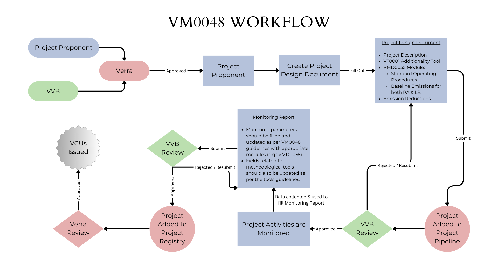

## Table of Contents
<!-- TOC -->
- Policy Description
- Workflow Description
- Demo Video
- Policy Guide
- Token (VCU)
- Comparative Analysis
<!-- End of TOC -->

## Policy Description
Verra's VM0048 methodology, formally known as "Reducing Emissions from Deforestation and Forest Degradation (REDD)", represents a significant advancement in the approach to forest conservation projects within the Verified Carbon Standard (VCS) Program. Launched on 27 November 2023, it encompasses activities aimed at preventing illegal logging and providing alternative livelihood sources to support local communities and biodiversity preservation. This initiative aligns with the global effort to mitigate climate change by addressing the 12 to 20 percent of global greenhouse gas (GHG) emissions attributed to deforestation.

VM0048 aims to ensure the integrity of greenhouse gas accounting across projects within a jurisdiction, leveraging the latest science, data, and technologies. This methodology requires the use of modules for specific activity types, including a module for Avoiding Unplanned Deforestation (VMD0055), with modules for forest degradation and planned deforestation under development. Its approval marks a critical step towards standardized, accurate emission reductions calculations for projects combating deforestation.

One of the transformative aspects of VM0048 is its focus on improving the integrity of carbon credit valuation within the Voluntary Carbon Market. The previous system allowed project developers and their technical consultants to choose methodologies and set project baselines, which led to the issuance of credits that might not reflect the true value of the emission reductions. This practice resulted in over-valuation and over-crediting in some cases. VM0048 addresses these challenges by centralizing the sourcing of deforestation data for baseline setting, requiring the use of data from vetted Data Service Providers (DSPs). This ensures a uniform data basis for all project developers within the same jurisdiction, provided by Verra, thereby enhancing the process's integrity from the outset.

The methodology introduces a jurisdictional approach to carbon accounting, which is essential for large-scale, enduring forest protection. By aligning both private and public finance and leveraging government authority to regulate land use, this approach targets the root causes of deforestation more effectively. Moreover, the establishment of a single deforestation dataset for a given jurisdiction and the allocation of baseline data based on deforestation risk assessments aim to ensure that emission reductions are calculated more accurately and transparently.

The introduction of VM0048 and its module for Avoiding Unplanned Deforestation (VMD0055) strengthens the VCS Program for issuing carbon credits to projects aimed at reducing emissions from deforestation. It represents a step forward in establishing high-integrity, scalable methodologies for forest conservation, potentially leading to a significant impact on the value and authenticity of REDD+ carbon credits globally.

## Workflow Description

1. **Project Proponent Submission**: The project proponent begins by submitting the Project Description to Verra. This document includes ex-ante estimates of monitoring parameters and detailed project information demonstrating compliance with VCS program requirements.

2. **Module Selection and Data Analysis**: After the initial submission, the Project Proponent selects appropriate modules (e.g., VMD0055 for avoiding unplanned deforestation) and collects data for baseline establishment and analysis as guided by VM0048 and the chosen modules.

3. **Validation Process**:
    - **Verra's Initial Review**: Verra reviews the submitted Project Design and adds the project to the Project Pipeline.
    - **Validation by VVB**: A Validation and Verification Body (VVB) assesses the PD, focusing on the alignment with VCS requirements, and provides a Validation Report.

4. **Monitoring and Reporting**:
    - **Ex-post Monitoring and Reporting**: The Project Proponent conducts monitoring activities as per the project plan and develops a Monitoring Report. This replaces the ex-ante estimates with ex-post Monitoring, Reporting, and Verification (MRV) data.
    - **Submission to VVB**: The Monitoring Report is submitted to the VVB for verification. 

5. **Verification and Issuance**:
    - **VVB's Verification**: The VVB verifies the Monitoring Report and issues a Verification Report, Verification Representation, and Verification Statement.
    - **Issuance Request Review and VCUs Issuance**: Verra reviews the issuance request. Upon approval, Verified Carbon Units (VCUs) are issued to the Project Proponent's account in the registry.

6. **Project Implementation and Continuous Monitoring**:
    - Implement the project activities as planned, applying the VM0048 framework and the relevant modules (e.g., VMD0055) for specific activity types like avoiding unplanned deforestation.
    - Continuously monitor the project's impact according to the established methodology and guidelines, updating the project documentation and reporting to Verra as required.

7. **Ongoing Validation and Verification**:
    - Engage with a VVB for periodic validation and verification as per Verra’s requirements and the project's monitoring plan to ensure ongoing compliance and to validate the emission reductions achieved over time.

This comprehensive workflow integrates detailed procedural steps for project submission, validation, monitoring, verification, and the issuance of carbon credits under the VM0048 and VMD0055.

## Demo Video
[Demo Video of Guardian Policy and Schemas](https://www.youtube.com/watch?v=80XNErfW2A4)

## Policy Guide
This policy can be imported via Github (.policy file) or IPFS timestamp.

### Available Roles
- Project Proponent - The project proponent is responsible for executing the emission reduction project. The project proponent must adhere to the requirements outlined by Verra’s VCS program and provide evidence of the emission reductions achieved. Upon successful verification, the project proponent receives Verified Carbon Units (VCU) as an incentive sfor their emission reductions.
  
- Verification and Validation Body (VVB) - The VVB plays a critical role in independently verifying and validating the project data submitted by the project proponent. They thoroughly assess the project's emission reduction potential, methodologies, and adherence to the policy guidelines. Based on their evaluation, the VVB either approves or rejects the project for registration.
    
- Standard Registry (Verra) – With Verra as the registry they take on responsibilities that encompass project intake, pipeline management, and final review of project descriptions and monitoring reports. This process ensures that emission reduction projects meet the highest standards before tokens are issued.

### Important Documents & Schemas

- **VM0048** - [Link to Methodology on Verra](https://verra.org/methodologies/vm0048-reducing-emissions-from-deforestation-and-forest-degradation-v1-0/) - VM0048 is a methodology under Verra's Verified Carbon Standard that provides a framework for projects aiming to reduce emissions from deforestation and forest degradation. 
- **VM0055** - [Link to Module on Verra](https://verra.org/methodologies/vmd0055-estimation-of-emission-reductions-from-avoiding-unplanned-deforestation-v1-0/) - VMD0055 is a module that complements the VM0048 methodology, focusing specifically on avoiding unplanned deforestation.
- **VT0001** - [Link to Additionality Tool on Verra](https://verra.org/methodologies/vt0001-tool-for-the-demonstration-and-assessment-of-additionality-in-vcs-agriculture-forestry-and-other-land-use-afolu-project-activities-v3-0/) - This tool helps project developers demonstrate the additionality of their projects, a critical component in the carbon crediting process. Additionality refers to the requirement that carbon credits should only be issued for emissions reductions or removals that would not have occurred in the absence of the project. VT0001 guides users through the process of proving that their project's impacts are additional, ensuring that projects contribute genuine, measurable environmental benefits beyond a business-as-usual scenario.

- **Project Description** - Project Participant information, standard project information, methodology information like baseline emissions, project emissions, etc.

- **Monitoring Report** – The monitoring report is to be filled out based on the monitoring plan mentioned within the methodology.

## Token (Verified Carbon Units)
Verified Carbon Unit (VCU) credits, each equivalent to one tonne of CO2.

## Comparative Analysis to VM0006, VM0007 & VM0015

### VM0048: Reducing Emissions from Deforestation and Forest Degradation
VM0006, VM0007 and VM0015 are set to be superseded by VM0048, signaling a transition to newer methodologies for REDD projects. VM0048 represents a modern approach, integrating the latest science, data, and technologies to ensure greenhouse gas accounting integrity for projects aimed at reducing emissions from deforestation and forest degradation. It requires the use of specific modules for activity types, such as the VMD0055 for Avoiding Unplanned Deforestation, and is designed to align with jurisdictional and nested REDD+ frameworks. This methodology marks a shift towards a more centralized and standardized approach to setting project baselines and calculating emission reductions, utilizing high-quality data sources and advanced technologies like satellite and remote sensing.

### VM0006: Carbon Accounting for Mosaic and Landscape-scale REDD Projects
VM0006 is focused on quantifying GHG emission reductions and removals at a landscape scale, integrating various land uses and management practices, including afforestation, reforestation, and improved forest management, as well as initiatives like clean cookstoves. It advocates for a holistic approach that combines efforts to protect forests with programs to improve rural livelihood. 

### VM0007: REDD+ Methodology Framework
VM0007 serves as a comprehensive framework for REDD+ projects, covering not just deforestation and forest degradation but also conservation, sustainable management of forests, and enhancement of forest carbon stocks. It provides a broad and flexible approach for project development within the REDD+ context.

### VM0015: Methodology for Avoided Unplanned Deforestation
Focused specifically on avoiding unplanned deforestation, VM0015 targets projects designed to prevent such deforestation events before they occur. It is one of the methodologies directly replaced by the new approach under VM0048.

### Key Differences and Considerations
- **Scope and Integration:** VM0048 is more encompassing, offering a unified framework that will potentially cover all aspects of REDD, including unplanned deforestation, forest degradation, and conservation, with the use of additional modules like VMD0055. In contrast, VM0006, VM0007, and VM0015 each cover specific aspects or scales of REDD projects.
- **Methodological Approach:** VM0048 emphasizes the use of the most current data and technologies for baseline setting and emission reduction estimations. This modern approach aims to enhance the accuracy and integrity of REDD project outcomes. VM0006 and VM0007, while comprehensive, are structured around the methodologies and tools available at their time of development and may not incorporate the latest technological advancements to the same extent.
- **Transition and Supersession:** With the introduction of VM0048, VM0006, VM0007, and VM0015 are being updated or inactivated, indicating a strategic shift towards more centralized, accurate, and technologically advanced methodologies for REDD projects.
