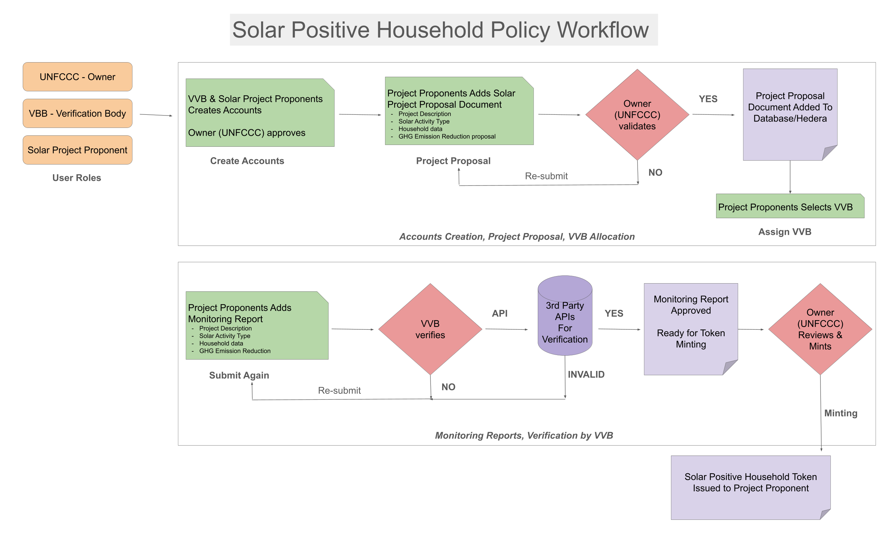
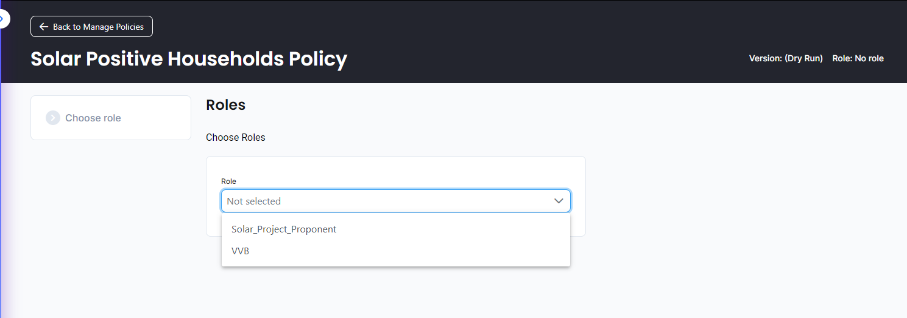
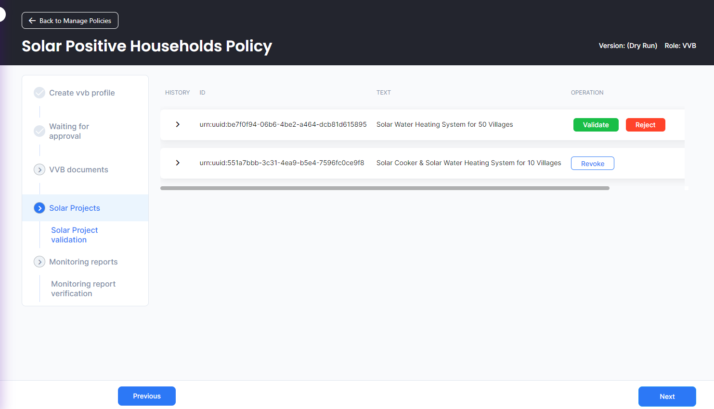
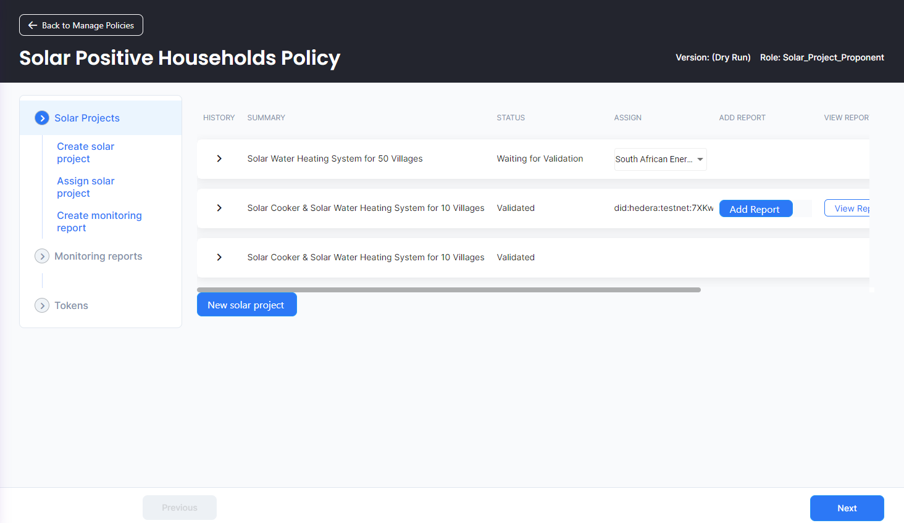
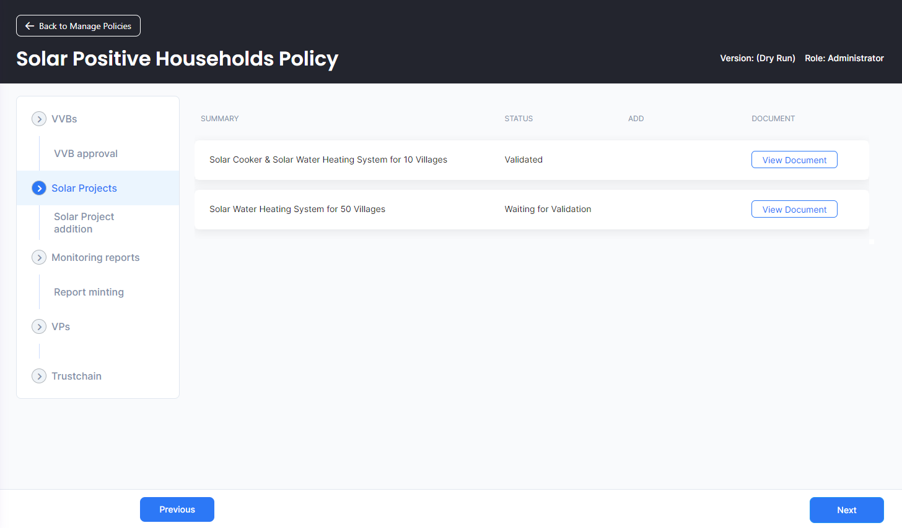
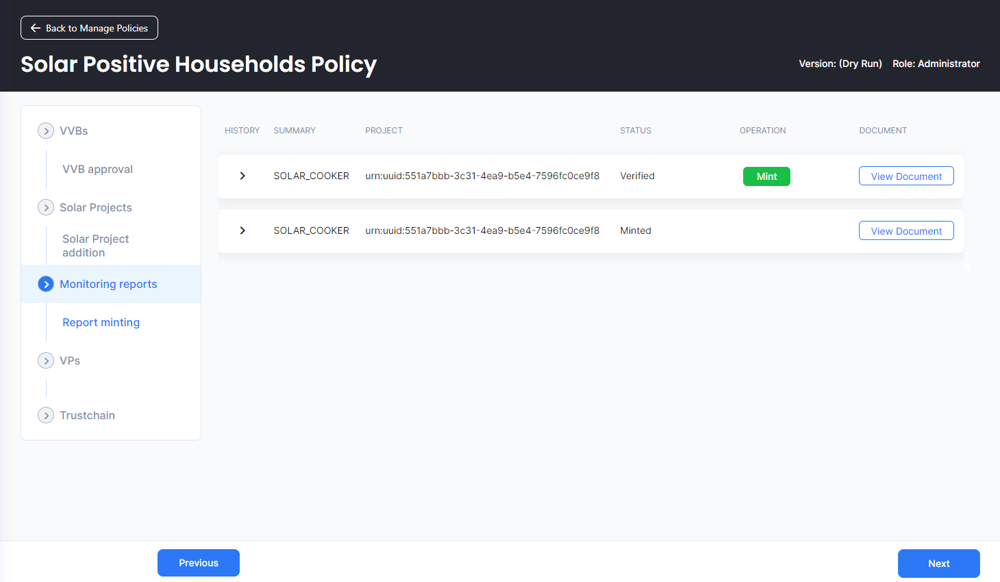

# Solar Positive Household Methodology

Solar Positive Household Methodology (SPH001) is an initiative to reduce GHG emissions by focusing on 3 factors at household level: 1. Cooking 2. Water Heating 3. Energy Generation

Do you know large population in developing countries still rely on wood burning, fossil fuels like kerosene/LPG, or non-renewable biomass, including electricity generated from non-renewable sources for their most basic needs like cooking or hot water? Climate organizations like UNFCCC and green funding organizations across globe have stressed on reducing GHG emissions by introducing change at household level to achieve global goal of keeping temperature well below 2°C above pre-industrial levels. 

Solar Positive Household Methodology (SPH001) is hedera/guardian based workflow that helps initiate solar positive projects, monitor progress and allocate tokens to participating projects.

### Objectives and Scope
**Promote Clean Cooking Technologies:** The project aims to encourage the adoption of clean cooking technologies in households across developing countries, reducing emissions linked to traditional methods like wood burning and fossil fuels.

**Facilitate Renewable Water Heating Solutions:** By promoting renewable water heating solutions such as solar water heaters, the project seeks to mitigate GHG emissions associated with conventional heating methods while providing sustainable hot water options.

**Enable Renewable Energy Generation:** Through the installation of solar photovoltaic systems, the project enables households to generate their own renewable electricity, reducing reliance on non-renewable sources and contributing to global emission reduction goals.

### Climate Action Relevance
**Sustainable Energy Adoption:** Through solar technology implementation, the project encourages sustainable energy practices at the household level. By utilizing renewable solar power instead of finite resources like wood or kerosene, households reduce their carbon footprint and contribute to a more sustainable energy landscape.

**Greenhouse Gas Emissions Reduction:** The Solar Positive Household Project tackles emissions by replacing fossil fuel-dependent cooking, water heating, and energy generation with solar solutions. This shift directly aligns with global climate goals, aiming to keep temperature increases below 2°C above pre-industrial levels, as outlined in agreements like the Paris Agreement.

### Demo Video
https://www.youtube.com/watch?v=yjlZvE8Aa-w

### Policy Workflow

### Available Roles and Responsibilities
**Owner (Registry like UNFCCC)** – As the registry owner which can be entities like UNFCCC, this role encompasses pivotal responsibilities including project intake, pipeline management, and meticulous review of project descriptions and monitoring reports. This rigorous process guarantees that GHG emission/mitigation projects adhere to stringent standards prior to token issuance.

**Solar Project Proponent** - The proponent of the solar project is tasked with implementing the solar positive initiative which leads to reduction of GHG emissions. It is imperative for the project proponent to comply with the specifications stipulated by UNFCCC's GHG Emission Reduction Standards and furnish substantiation of the GHG emission reductions attained. Following thorough verification, the project proponent is rewarded with _Solar Positive Household Tokens_ as a reward for their efforts.

**VVB - Verification and Validation Body** - The Verified Validation Body (VVB) assumes a pivotal role in autonomously verifying and validating the project data provided by the project proponent. They conduct a comprehensive evaluation of the project's GHG emission reduction potential, methodologies employed, and adherence to policy guidelines. Subsequent to their assessment, the VVB either grants approval or denies registration for the project based on their findings, including monitoring and verifying usual reports. VVB can use integrated 3rd party APIs to automate their verification process (work in progress)

### Policy Step-by-Step flow (Screenshots)
Create users

VVB dashboard - can approve projects, reports

Solar Project Proponent dashboard - can add projects, assign VVBs, add reports, view tokens

Registry/Owner dashboard - can approve projects, approve VVBs, mint tokens, view pipeline

### TODO
- ability to fetch external 3rd party data and cross check against monitoring reports submitted (like IOT device monitoring solar cooker uses, or govt electricity usage reduction billing claims through APIs)
- Ability to auto-generate household/cluster level reports using 3rd party APIs, so that workflow becomes automatic.

### Supporting Documents
[source 1](https://www.solarcookers.org/resources/download), [source 2](https://www.energy.gov/energysaver/estimating-cost-and-energy-efficiency-solar-water-heater), [source 3](https://cdm.unfccc.int/UserManagement/FileStorage/LHFQNWY49I0KASVGZ6EXM5JD7OU213), [source 4](https://cdm.unfccc.int/UserManagement/FileStorage/CDM_AMSUXC8OMRANCYKPO9BB6N14OGUCRO50A)
