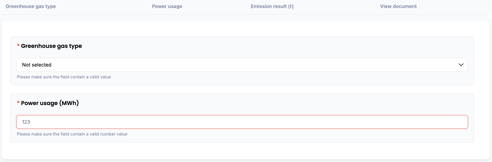
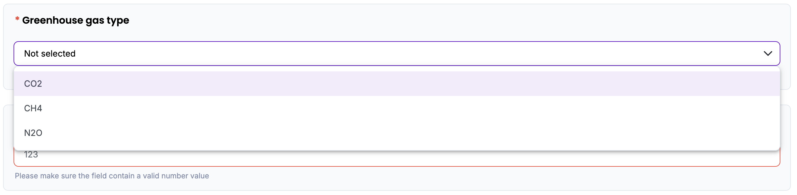
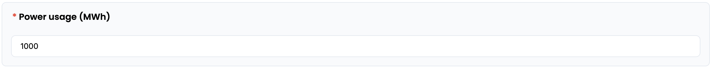
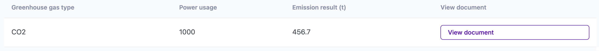
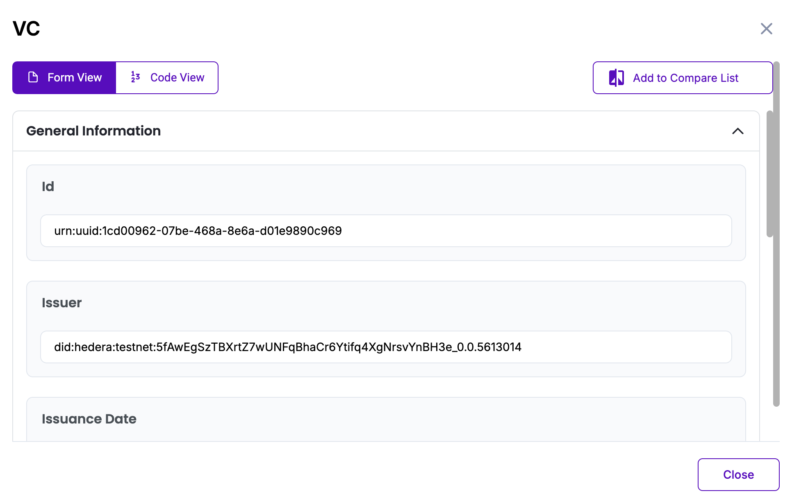

# Electricity Indirect Emission Methodology in Korea

Policy by WinCL

## Policy Description

This methodology provides a standardized framework for reporting organizations in Korea to quantify, report, and verify indirect greenhouse gas (GHG) emissions associated with the use of externally supplied electricity. It is applicable to Scope 2 emissions where electricity is generated offsite and consumed onsite during the reporting year. The methodology defines calculation parameters, data requirements, and emission factors to ensure accurate and conservative emission reporting.

## Workflow Description

The emission calculation workflow for indirect greenhouse gas (GHG) emissions from electricity is initiated by selecting the relevant GHG type (e.g., CO₂, CH₄, or N₂O). Once the user enters the total amount of electricity consumed measured in megawatt-hours (MWh) during the year, the system automatically applies the corresponding emission factor (kg/TJ) based on the selected parameters. Emissions are then calculated using the formula:

*Emissions (t) = Electricity Consumption (MWh) × Emission Factor (t/MWh)*

This digital workflow ensures standardization and transparency, in alignment with national guidelines from the Greenhouse Gas Inventory and Research Center of Korea (2018), and is designed to support reporting consistency for verification and compliance purposes.

The diagram below outlines the policy workflow as follows: User-provided input (Blue), Automated calculation (Purple)

## Policy Guide

To begin, navigate to the policy interface where the user will input data related to electricity consumption. 

Start by selecting the greenhouse gas type from the dropdown menu. You can choose between CO₂, CH₄, N₂O, or CO₂ equivalent, depending on the reporting scope. This selection determines which emission factor will be applied in the final calculation.

Once the GHG type is selected, proceed to the next field: electricity usage. Enter the total amount of externally supplied electricity consumed during the reporting year, in megawatt-hours (MWh). This value must be entered as a numeric figure. If a non-numeric or invalid value is entered, the system will display an error and prevent submission until corrected.

After completing both input fields, the system will automatically calculate the total GHG emissions by multiplying the entered power usage by the emission factor associated with the selected GHG. 

The result will be displayed on-screen and stored in the database. The “View document” button opens the Verifiable Credential (VC) issued for the calculated data. The VC contains a unique identifier (UUID), Issuer DID on Hedera Testnet, Issuance time stamp, Digital proof of integrity, Input values (GHG type, production type, total consumption), and the final emission result. The user can view the VC either in Form View for readability or Code View for raw JSON. All VC data is cryptographically signed and stored in accordance with Guardian protocol standards.

