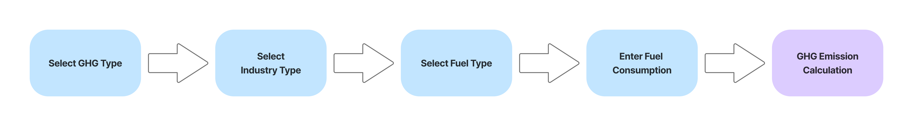
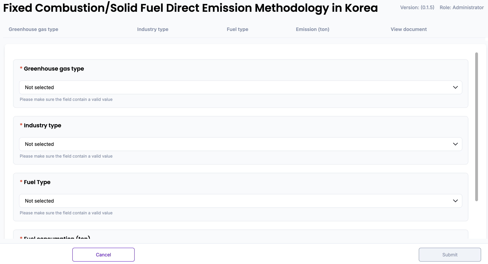
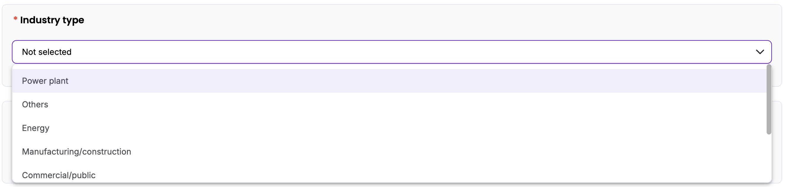
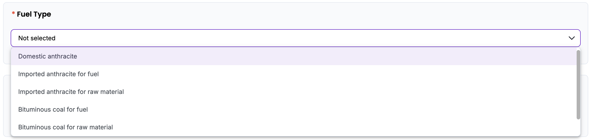
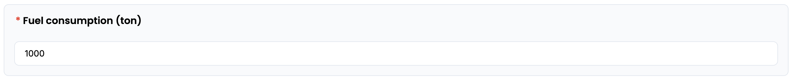
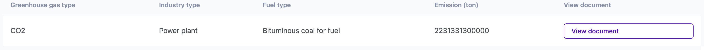
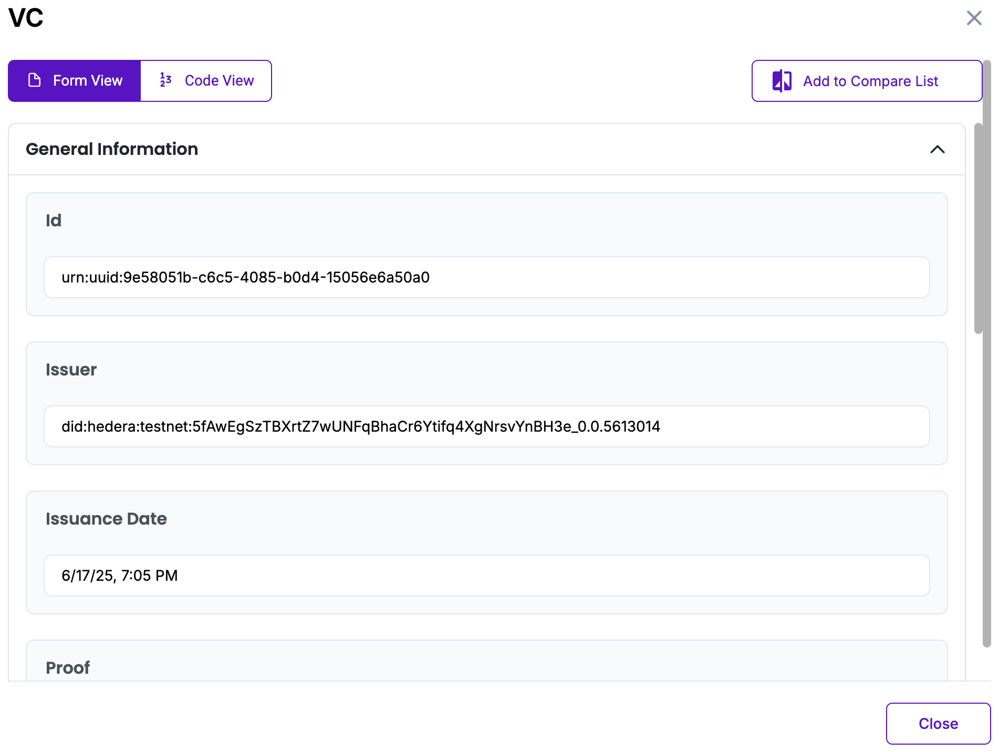

# Fixed Combustion of Solid Fuels Emission Methodology in Korea

Policy by WinCL

## Policy Description

This methodology provides a standardized framework for organizations in Korea to quantify, report, and verify direct greenhouse gas (GHG) emissions associated with the fixed combustion of solid fuels. It is applicable to Scope 1 emissions, where fuels such as coal are combusted onsite in stationary facilities owned or operated by the organization. The methodology defines calculation parameters, emission factors, calorific values, and oxidation factors that vary depending on the selected fuel type, industry type, and GHG type, ensuring consistent and conservative emissions reporting in line with national guidelines.

## Workflow Description

The emission calculation workflow for direct greenhouse gas (GHG) emissions from fixed combustion of solid fuels requires to select the greenhouse gas type (CO₂, CH₄, N₂O), industry type, and fuel type. These selections determine the appropriate parameters including calorific value, emission factor, and oxidation factor. 

The user then inputs the total amount of solid fuel consumed during the reporting year, measured in metric tons (ton). Upon submission, the system automatically retrieves the relevant default values and applies the following calculation formula:

*Emissions (t) = Fuel Consumption (t) × Calorific Value (TJ/kg) × Emission Factor (kg/TJ) × Oxidation Factor × 10⁻³*

This digital workflow ensures standardization and transparency, in alignment with national guidelines from the Greenhouse Gas Inventory and Research Center of Korea, and is designed to support reporting consistency for verification and compliance purposes.

The diagram below outlines the policy workflow as follows: User-provided input (Blue), Automated calculation (Purple)

## Policy Guide

To begin, navigate to the policy interface where the user will input data related to fixed combustion of solid fuels. 

Start by selecting the greenhouse gas type from the dropdown menu. The user can choose between CO2, CH4, or N2O depending on the reporting scope. This selection will determine which emission factor and oxidation coefficient the system applies in the calculation.

Next, select the applicable industry type from the dropdown list. The user may choose from categories such as power plant, energy, manufacturing/construction, commercial/public, or residential sectors. This selection is used to retrieve the correct sector-specific coefficients.

After selecting the industry, proceed to choose the solid fuel type consumed during the reporting period. Fuel types include domestic anthracite, imported bituminous coal (for fuel or raw material), bituminous coal (for fuel or raw material), and sub-bituminous coal. Each fuel type is linked to a specific set of calorific values and emission factors defined by national guidelines.

Once all categories are selected, enter the total amount of solid fuel consumed, measured in metric tons. This field accepts numeric values only. If left blank or entered incorrectly, the system will prompt the user to correct the input before proceeding.

After completing the form, the system will automatically calculate the direct GHG emissions using the selected parameters. The final emission result, expressed in metric tons (t), will appear on screen.

The result will be displayed on-screen and stored in the database. The “View document” button opens the Verifiable Credential (VC) issued for the calculated data. The VC contains a unique identifier (UUID), Issuer DID on Hedera Testnet, Issuance time stamp, Digital proof of integrity, Input values (GHG type, production type, total consumption), and the final emission result. The user can view the VC either in Form View for readability or Code View for raw JSON. All VC data is cryptographically signed and stored in accordance with Guardian protocol standards.

