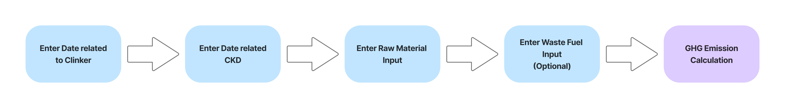
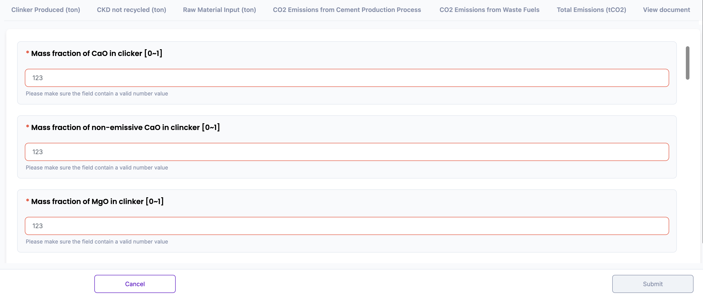
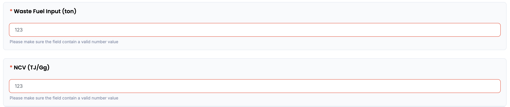
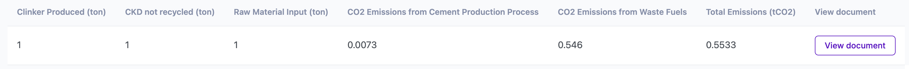
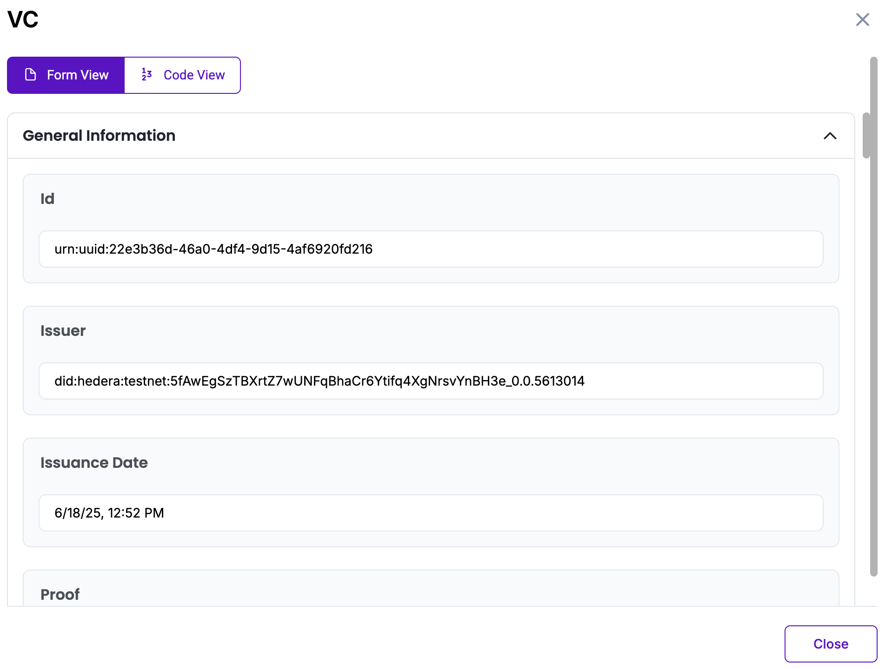

# Mineral Industry: Cement Production Methodology in Korea

Policy by WinCL

## Policy Description

This methodology provides a standardized framework for reporting organizations in Korea to quantify, report, and verify direct greenhouse gas (GHG) emissions from cement production in Korea. It covers emissions from three primary sources: (1) calcination of clinker, (2) non-recycled cement kiln dust (CKD), and (3) raw material input. Additionally, emissions from fossil-based waste fuels can be optionally included. All emission factors are derived from the mass fractions of CaO and MgO in input materials, and calculations are based on default coefficients defined in national guidelines.

## Workflow Description

The emission calculation process begins by entering the necessary chemical composition data for clinker and non-recycled CKD, including the mass fractions of CaO and MgO and their non-emissive portions. These values are used to compute emission factors for each material stream using predefined formulas. Next, the user inputs the quantities of clinker produced, CKD not recycled, and raw materials used. The system then calculates the total CO₂ emissions from the cement production process using the formula:

+ *Production Emissions (tCO₂) = (Clinker(t) × Emission factor(tCO₂/t-clinker)) + (Cement kiln dust(CKD)(t) × Emission factor(tCO₂/t-CKD)) + (Raw material × Emission factor(tCO₂/t))*
+ *Waste Fuel Emissions (tCO₂) = Fuel Consumption (t) × Emission factor (kgCO₂/TJ) × NCV (TJ/Gg) × 10⁻⁶*

This digital workflow ensures standardization and transparency, in alignment with national guidelines from the Greenhouse Gas Inventory and Research Center of Korea, and is designed to support reporting consistency for verification and compliance purposes.

The diagram below outlines the policy workflow as follows: User-provided input (Blue), Automated calculation (Purple)

## Policy Guide

To begin, navigate to the policy interface where the user will input data related to cement production in mineral industry. Proceed to enter the production quantities: total clinker produced (ton), CKD not recycled (ton), and total raw material input (ton). These fields are required and must contain valid numerical values.

Once all input data is entered, the system will compute emission factors for clinker and CKD using national equations. These values are then applied to calculate total CO₂ emissions from the process.

If the user also opt to include emissions from fossil-based waste fuels, select “True” for each relevant fuel type. New input fields will appear, where you must enter:
+ The amount of each waste fuel consumed (ton)
+ The net calorific value (NCV) of the fuel (TJ/Gg)
The system will apply the appropriate emission factors and calculate fuel-related emissions.

Once all fields are completed, the total emissions will be displayed as the sum of process-related and waste fuel-related emissions, in metric tons (tCO₂).

The result will be displayed on-screen and stored in the database. The “View document” button opens a Verifiable Credential (VC) issued for the calculated data. The VC includes a unique identifier (UUID), issuer DID on Hedera Testnet, issuance timestamp, input values and the final emission result.  The user can view the VC either in Form View for readability or Code View for raw JSON. All VC data is cryptographically signed and stored in accordance with Guardian protocol standards.

