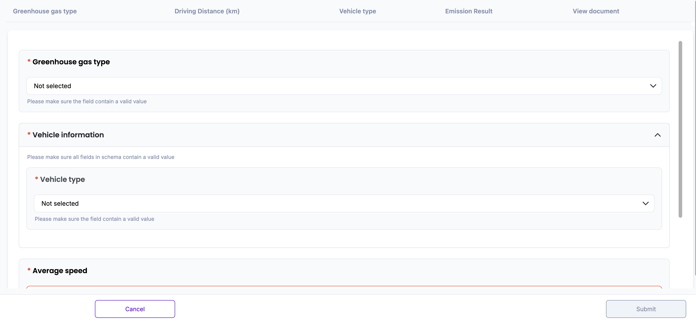
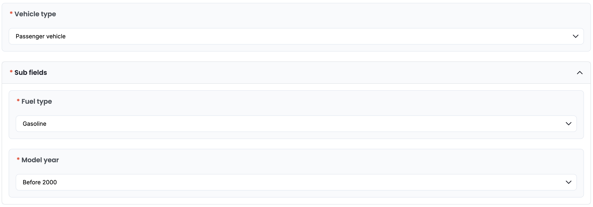
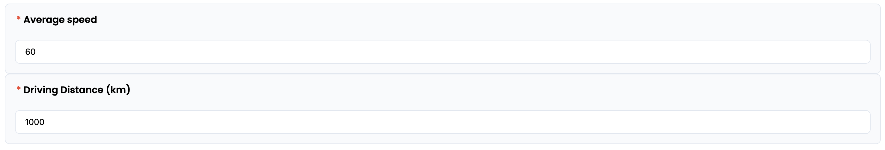
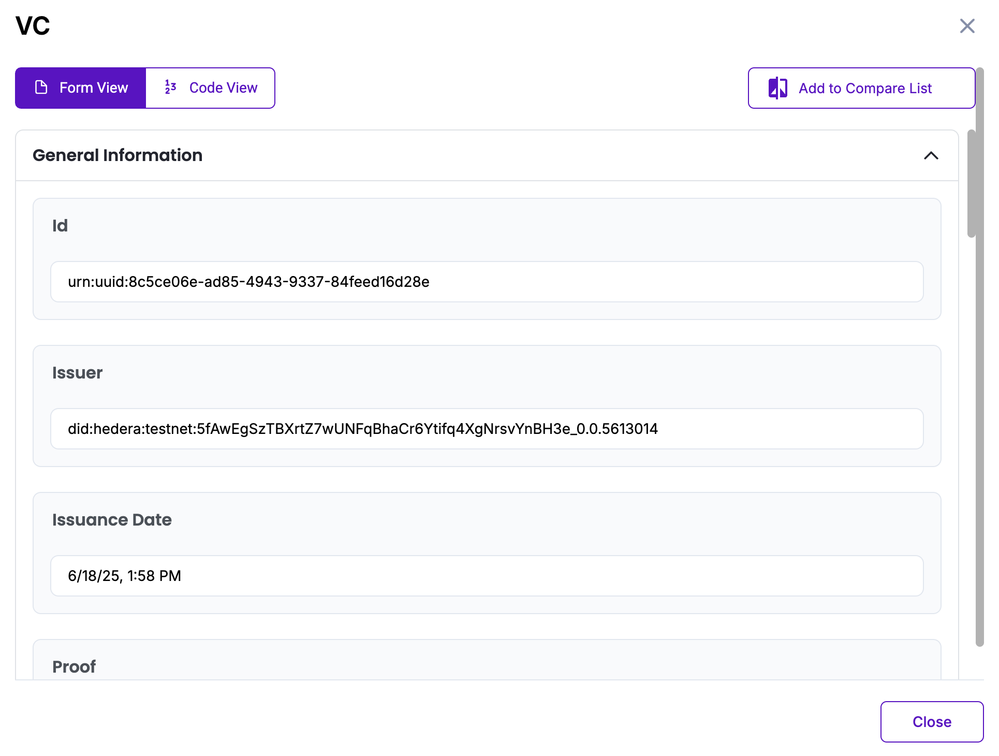

# Mobile Combustion (Road) Methodology in Korea

Policy by WinCL

## Policy Description

This methodology provides a standardized framework for reporting organizations in Korea to quantify, report, and verify direct greenhouse gas (GHG) emissions from the combustion of transport fuels. It is applicable to reporting organizations that own equipment (passenger, commercial, freight vehicles, etc.) in the mobile combustion (road) sector and generate greenhouse gas emissions, or to organizations that do not own such equipment but report emissions from the mobile combustion (road) sector. All parameters—such as calorific values, emission factors, and vehicle classification—are based on national default coefficients.

## Workflow Description

The emission calculation workflow begins by selecting the GHG type (CO₂, CH₄, or N₂O). For CO₂ emissions, the user inputs the fuel type and the amount of fuel consumed. The system automatically applies the appropriate calorific value and emission factor to compute CO₂ emissions using the following equation:

*Emission(tCO₂) = Fuel consumption(kL) × Emission factor(kgGHG/TJ) × NCV(MJ/L) × 10⁻⁶*

For CH₄ and N₂O emissions, the user is prompted to select vehicle type, fuel type, and vehicle production year. The user then enters driving distance and average speed. Based on these inputs, the system calculates a speed-dependent emission factor using a predefined formula. The system calculates the final emissions using: 

*Emission(gCH₄,gN₂O) = Driving distance(km) × Emission factor(gGHG/km) × 10⁻⁶*

This digital workflow ensures standardization and transparency, in alignment with national guidelines from the Greenhouse Gas Inventory and Research Center of Korea, and is designed to support reporting consistency for verification and compliance purposes.

The diagram below outlines the policy workflow as follows: User-provided input (Blue), Automated calculation (Purple)

## Policy Guide

To begin, navigate to the policy interface where the user will input data related to mobile combustion. 

First, select the target greenhouse gas—CO₂, CH₄, or N₂O.
If the user selects CO₂, proceed to choose the fuel type and enter the total fuel consumption (in kiloliters). The total fuel consumption must be entered as a numeric figure. If a non-numeric or invalid value is entered, the system will display an error and prevent submission until corrected. Then, the system will automatically apply the relevant calorific value and CO₂ emission factor according to Korean national defaults.

If the user selects CH₄ or N₂O, the interface will prompt additional questions asking vehicle type, fuel type, and vehicle model year.

Once the fields are selected, proceed to the next field: average speed(km/h) and driving distance(km). These values must be entered as a numeric figure. If a non-numeric or invalid value is entered, the system will display an error and prevent submission until corrected. Based on the selections and input, the system retrieves the proper CH₄ or N₂O emission factor formula for the particular vehicle. 

After completing both input fields, the system will automatically calculate the total GHG emissions by using the predefined coefficients. The result will appear on screen in tons of the selected greenhouse gas.

The result will be displayed on-screen and stored in the database. The “View document” button opens the Verifiable Credential (VC) issued for the calculated data. The VC contains a unique identifier (UUID), Issuer DID on Hedera Testnet, Issuance time stamp, Digital proof of integrity, Input values, and the final emission result. The user can view the VC either in Form View for readability or Code View for raw JSON. All VC data is cryptographically signed and stored in accordance with Guardian protocol standards.

