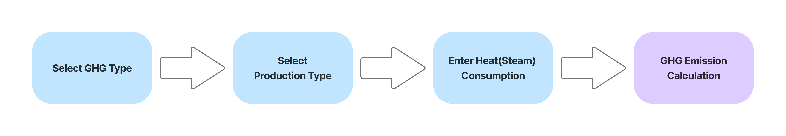
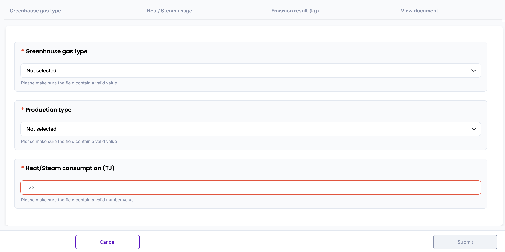
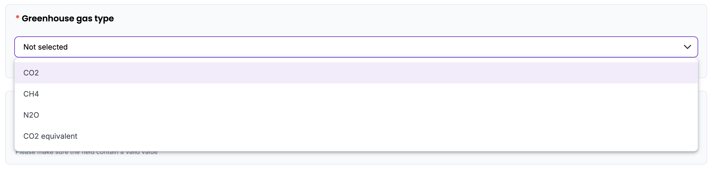
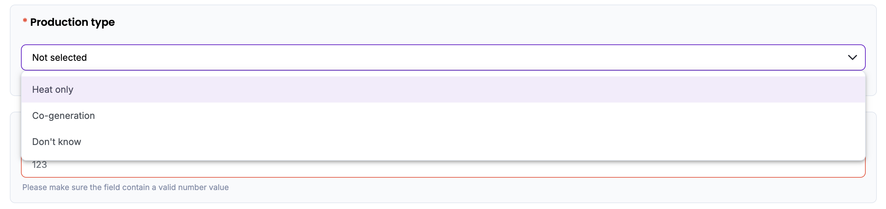
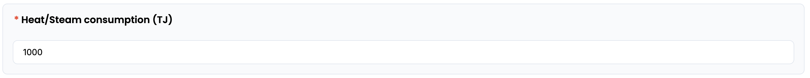
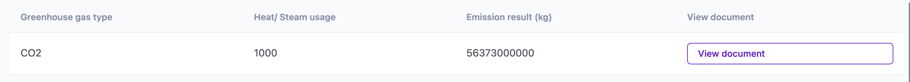
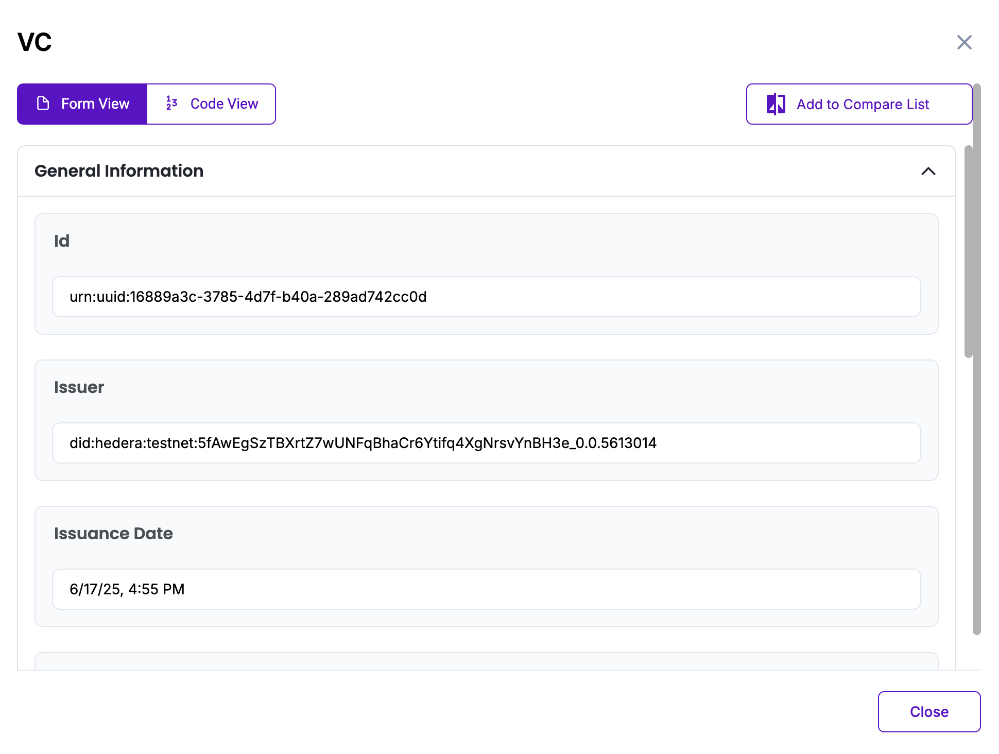

# Heat (steam) Indirect Emission Methodology in Korea

Policy by WinCL

## Policy Description

This methodology provides a standardized framework for reporting organizations in Korea to quantify, report, and verify indirect greenhouse gas (GHG) emissions associated with the use of externally supplied heat or steam. It is applicable to emissions reported under Scope 2, where heat (steam) is produced offsite and consumed onsite during the reporting year. The methodology defines calculation parameters, data requirements, and emission factors to ensure accurate and conservative emission reporting.

## Workflow Description

The emission calculation workflow for indirect greenhouse gas (GHG) emissions from externally supplied heat or steam is initiated by selecting the relevant GHG type (e.g., CO₂, CH₄, N₂O, or CO₂-eq) and identifying the production type of the heat source (e.g., heat only, co-generation, or unknown). 

Once the user enters the total consumption (TJ) of heat(steam), the system automatically applies the corresponding emission factor (kg/TJ), based on the selected parameters. Emissions are then calculated using the formula:

*Emissions (kg) = Heat(steam) consumption (TJ) × Emission Factor (kg/TJ)*

If the production method is unknown, default average emission factors are used to ensure conservative estimates. The calculated emissions are displayed to the user and stored for integration with organizational GHG inventories. This digital workflow ensures standardization and transparency, in alignment with national guidelines from the Greenhouse Gas Inventory and Research Center of Korea (2013), and is designed to support reporting consistency for verification and compliance purposes.

The diagram below outlines the policy workflow as follows: User-provided input (Blue), Automated calculation (Purple)

## Policy Guide

To begin, navigate to the policy interface where the user will input data related to heat or steam consumption. 

Start by selecting the greenhouse gas type from the dropdown menu. The user can choose between CO2, CH4, N2O, or CO2 equivalent, depending on the reporting scope. This selection determines which emission factor will be applied in the final calculation.

Once the GHG type is selected, proceed to the next field: Production Type. The user will be asked to indicate how the heat or steam was produced. Select from the following options:
* Heat only if the heat was produced through a dedicated heating facility
* Co-generation if the heat was produced alongside electricity (combined heat and power system)
* Don’t know if the production method is unclear — the system will automatically apply the average emission factor in this case to maintain conservative calculations

After selecting the production type, enter the total consumption of the heat or steam used during the reporting period, measured in terajoules (TJ). This value should reflect actual consumption and must be entered as a numeric value.

If a non-numeric or invalid value is entered, the system will flag the input field and display an error message, prompting correction before proceeding.

Once all three inputs (GHG type, production type, total consumption) are provided, the system automatically calculates total GHG emissions. If the heat or steam used was generated and consumed on-site, such as from incineration facilities, note that the amount should still be reported, but the associated emissions will not be counted toward indirect totals.

The result will be displayed on-screen and stored in the database. The “View document” button opens the Verifiable Credential (VC) issued for the calculated data. The VC contains a unique identifier (UUID), Issuer DID on Hedera Testnet, Issuance time stamp, Digital proof of integrity, Input values (GHG type, production type, total consumption), and the final emission result. The user can view the VC either in Form View for readability or Code View for raw JSON. All VC data is cryptographically signed and stored in accordance with Guardian protocol standards.

