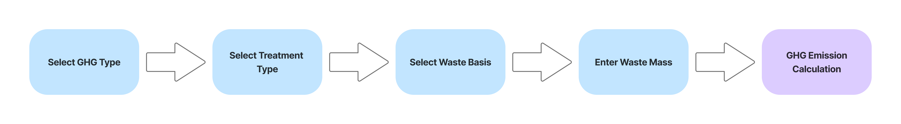
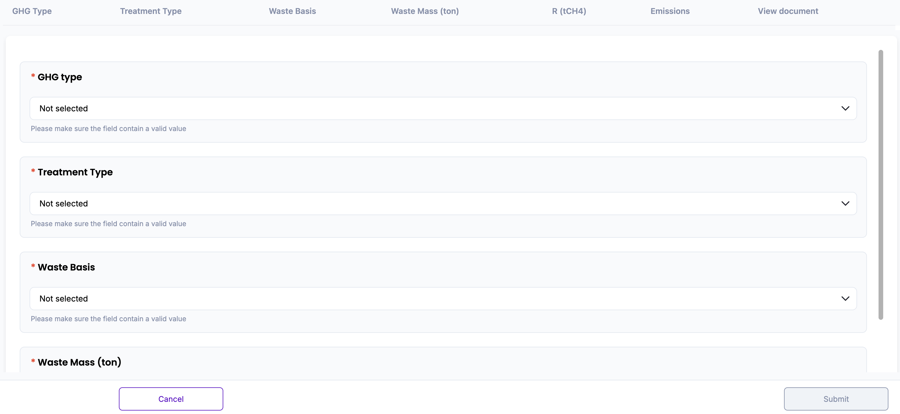
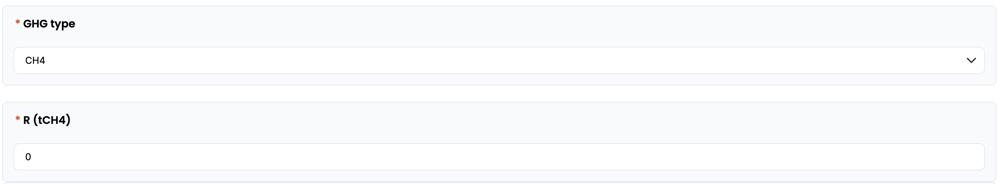
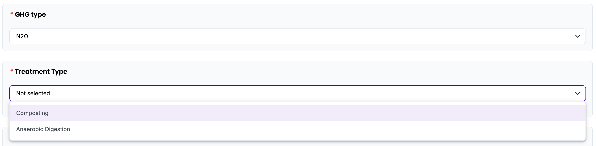
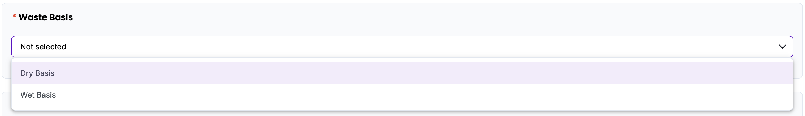
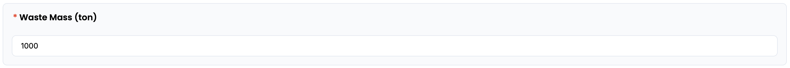
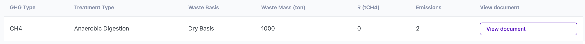
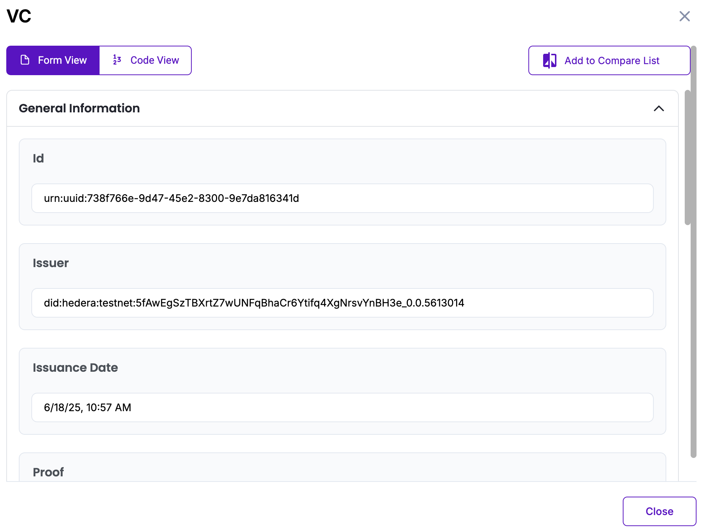

# Waste Disposal (Biological treatment of solid waste) Methodology in Korea

Policy by WinCL

## Policy Description

This methodology provides a standardized framework for reporting organizations in Korea to quantify, report, and verify direct greenhouse gas (GHG) emissions from biological treatment of solid waste. It applies to Scope 1 emissions from methane (CH₄) and nitrous oxide (N₂O) released during treatment processes operated by or under the control of the reporting entity. The methodology uses predefined emission factors based on national default coefficients.

## Workflow Description

The emission calculation workflow for biological treatment of solid waste begins with selecting the greenhouse gas type (CH₄ or N₂O), followed by the treatment type (composting or anaerobic digestion) and the waste basis (dry or wet). The user then inputs the total mass of waste treated by landfill during the reporting year, measured in tons (ton). For CH₄ emissions calculation, the user must also enter the recovered methane amount in tons. Upon data entry, the system automatically applies the system automatically applies the selected parameters and calculates final emissions using the following formulas:

+ *CH₄ Emissions (t) = Waste Mass (t) × Emission factor (gCH₄/kg-Waste) × 10⁻³ - Methane recovery (t)*
+ *N₂O Emissions (t) = Waste Mass (t) × Emission factor (gN₂O/kg-Waste) × 10⁻³*

This digital workflow ensures standardization and transparency, in alignment with national guidelines from the Greenhouse Gas Inventory and Research Center of Korea, and is designed to support reporting consistency for verification and compliance purposes.

The diagram below outlines the policy workflow as follows: User-provided input (Blue), Automated calculation (Purple)

## Policy Guide

To begin, navigate to the policy interface where the user will input data related to biological treatment of solid waste. 

Start by selecting the greenhouse gas (GHG) type—either CH₄ (methane) or N₂O (nitrous oxide)—based on your reporting scope. If CH₄ is the selected GHG, an additional input field will appear for the methane recovery amount (R), measured in tons of CH₄. This represents the quantity of methane recovered and not emitted into the atmosphere.

Next, choose the applicable treatment type from the dropdown menu. Available options include Composting and Anaerobic Digestion, both of which are recognized biological treatment processes that release GHGs depending on their operational conditions.

The user will be prompted to specify the waste basis—either Dry Basis or Wet Basis. The moisture basis significantly affects the emission factor applied, as the organic content and gas generation potential vary with moisture level.

Then, enter the total waste mass treated during the reporting year, measured in metric tons (ton). This field only accepts numeric inputs, and any invalid value will be flagged by the system to prevent submission.

Once all fields are completed, the system will calculate the GHG emissions using the predefined coefficients. The result will appear on screen in tons of the selected greenhouse gas.

The result will be displayed on-screen and stored in the database. The “View document” button opens a Verifiable Credential (VC) issued for the calculated data. The VC includes a unique identifier (UUID), issuer DID on Hedera Testnet, issuance timestamp, input values (GHG type, treatment type, waste basis, waste mass, recovery amount if applicable), and the final emission result.  The user can view the VC either in Form View for readability or Code View for raw JSON. All VC data is cryptographically signed and stored in accordance with Guardian protocol standards.

