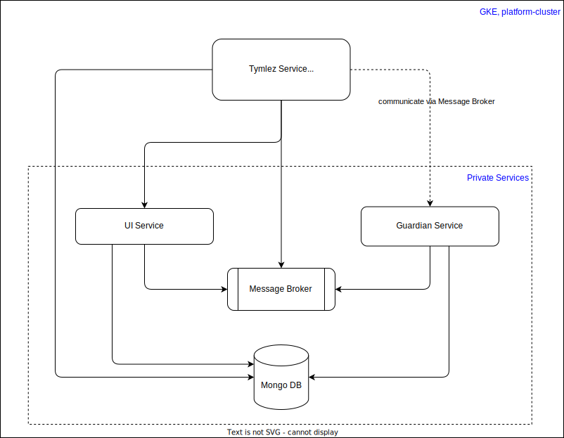
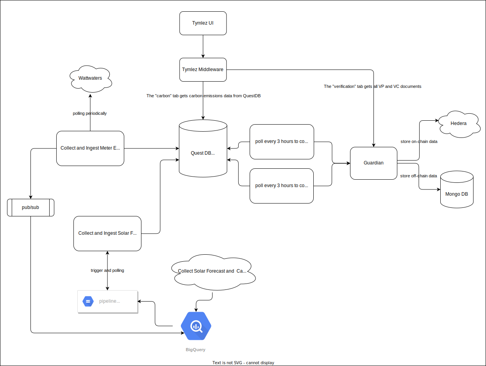

# For local development

## Set up WEB_STORAGE_TOKEN

- Go to https://web3.storage/ and login/signup

- Follow instructions to create a new API token and copy to the clipboard

### locally

- add following line to your ~/.zshrc

```sh
export WEB3_STORAGE_TOKEN=<your-copy-paste-api-token-here>
```
- start a new terminal and go on.
### AWS 

? 

## Bootstrap (run once only)

- Add `export ENV=local` to your shell configuration file, e.g., `~/.zshrc` or `~/.bashrc`, etc.
- Register a developer Testnet account and get its `accountId` and `privateKey`
- Add `export GUARDIAN_OPERATOR_ID=<accountId>` to your shell configuration file
- Add `export GUARDIAN_OPERATOR_KEY=<privateKey>` to your shell configuration file

```sh
# Use node version in .nvmrc
nvm use

# Run this once the first time (slow)
npm i

# Prevent race condition when trying to install `concurrently`
npx -y concurrently --help

# Create logs folder
mkdir -p .tmp/logs

# Run build once to prevent initial errors from `npm run dev:watch`
npm run build
```

## Get Started

```sh
# 1. Use node version in .nvmrc
nvm use

# 2. Run this afterward instead of `npm install` (faster)
npm run bootstrap

# 3a. Start dev servers without docker, watch for file changes
CLIENT_NAME=cohort npm run dev:watch 2>&1 | tee .tmp/logs/$(date "+%Y-%m-%dT%H-%M-%S").out

# 3b. Start dev servers with docker, does not watch for file changes
CLIENT_NAME=cohort npm run dev:docker

# 4. Initialize root config, installers, tokens, schemas and policies
CLIENT_NAME=cohort npm run tools init
```

# Top Level Design



1. The goal of this design is to minimize the change to the `hashgraph/guardian` code, which is the base repo of this `tymlez/guardian` repo, allow us to merge with `hashgraph/guardian` regularly with least amount of merge conflicts.
2. All services are deployed to GKE cluster using Kubernetes Helm, see below. All services (including the Mongo DB) except `tymlez-service` are only accessible via the ClusterIP, i.e., they are only accessible within the GKE cluster.
3. `tymlez-service` is the Tymlez specific code added as proxy to the `hashgraph/guardian`, it is deployed to the same GKE cluster, allowing it to communicate with other Guardian services. And it has exposed public IP allowing Tymlez Middlewares to call its API.

# Deployment

1. Deployment is done with Kubernetes Helm, refer to [tools/lib/deploy/charts](tools/lib/deploy/charts/guardian-root/Chart.yaml)
2. It is automatically deployed via CI, refer to [.github/workflows/tymlez-ci.yml](.github/workflows/tymlez-ci.yml)

# Tymlez Policies, Installers and Devices

1. Please refer to [How to create policy](tools/lib/init/README.md)
2. Initialize root config, installers, tokens, schemas, policies and devices
   ```sh
   CLIENT_NAME=cohort npm run tools init
   ```
3. Currently, there are 3 Tymlez specific policies created at [tools/lib/init/policies](tools/lib/init/policies), all of them are the similar to the Demo policy (removed the approval step and added the aggregation step)

# Track and Trace



1. `npm run tools init` will initialized the policies and devices, then it will store the device config in Mongo DB > `tymlez_db`
2. There are 2 serverless functions between the QuestDB and the Guardian, they poll periodically from QuestDB and send MRV data to Guardian with device ID and data, the policies are configured to aggregate all MRV data until 1 Metric Ton of carbon has reached.
